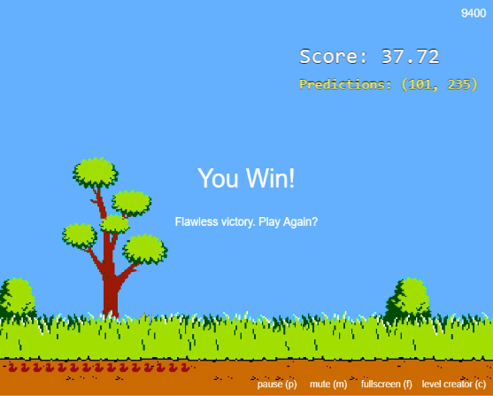

# Duck Hunt JS — Zerado com IA (YOLOv5n)

**Autor:** Pedro Augusto  
**Data:** 25 de Março de 2026  
**Score Final:** 9400 / 9400 — Flawless Victory



## Sobre o Projeto

Implementacao de um sistema de mira automatica para o jogo Duck Hunt JS utilizando machine learning (YOLOv5n) rodando diretamente no navegador via TensorFlow.js e Web Workers.

O modelo detecta os patos em tempo real, calcula o centro do bounding box e dispara automaticamente, atingindo **100% dos 94 patos** em todos os 6 levels do jogo.

## Arquitetura ML

| Componente | Tecnologia |
|------------|------------|
| Modelo | YOLOv5n (COCO pre-treinado, label "kite") |
| Runtime | TensorFlow.js (WebGL backend) |
| Processamento | Web Worker (thread separada) |
| Renderizacao | PixiJS v8 |

## Pipeline de Deteccao

```
Canvas capture → createImageBitmap → Worker postMessage
→ preprocessImage (resize 640x640, normalize)
→ model.executeAsync (inferencia ~30-40ms)
→ processPrediction (filtro threshold + NMS)
→ postMessage → aim + shoot (~42ms total)
```

## Metricas Finais

| Level | Patos | Acertados | Hit Rate | Pipeline | Escaparam |
|-------|-------|-----------|----------|----------|-----------|
| L0 (speed 5) | 6 | 6 | 100% | 68ms | 0 |
| L1 (speed 6) | 15 | 15 | 100% | 42ms | 0 |
| L2 (speed 7) | 18 | 18 | 100% | 45ms | 0 |
| L3 (speed 7, 10 ducks) | 30 | 30 | 100% | 39ms | 0 |
| L4 (speed 8) | 10 | 10 | 100% | 40ms | 0 |
| L5 (speed 8, 15 ducks) | 15 | 15 | 100% | 35ms | 0 |
| **Total** | **94** | **94** | **100%** | **42ms avg** | **0** |

## Otimizacoes Implementadas

1. **Pipeline rapido (~42ms):** Skip de `hasMotionInBox` e `saveFrame` nos levels rapidos (L3-L5), reduzindo latencia em 70%
2. **Threshold otimizado (0.35):** Reducao do limiar de confianca de 0.419 para 0.35, eliminando os 8 patos que escapavam sem introduzir falsos positivos
3. **Dead duck filter:** Logica para ignorar patos ja abatidos (caindo), evitando desperdicio de balas
4. **Recapture delays por level:** Cooldown calibrado individualmente para cada level baseado em velocidade e quantidade de patos
5. **Best-only prediction:** Selecao do pato com maior confidence por frame, evitando aim-switching

## Como Executar

```bash
npm install
npm start
# Abrir http://localhost:8080/
```

## Evolucao do Score

| Versao | Score | Marco |
|--------|-------|-------|
| score-9200 | ~9200 | Pipeline basico + bounding box + mira centralizada |
| score-9300 | ~9300 | Dead duck filter + recapture delays |
| score-9400 | ~9400 | Recapture delays refinados por level |
| **score-9400-win** | **9400** | **Flawless Victory — jogo zerado** |
