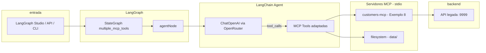

# Atividade: MCP com LangChain / LangGraph

Este diretório é o **Módulo 3 — Exemplo 9** (`modulo-3-exemplo-9-mcp-langchain`) — agente **LangGraph** que combina múltiplas tools MCP, conectando o pacote publicado do **Exemplo 8** (`@gorgan/customers-mcp`) com o filesystem MCP oficial.

Referência UNIPDS: [01-multiple-mcp-tools-z](https://github.com/unipds-engenharia-de-ia-aplicada/engenharia-de-software-com-ia-aplicada/tree/main/modulo03-mcp-na-pratica/09-using-mcp-with-langchain/01-multiple-mcp-tools-z)

## Objetivo

Demonstrar como integrar servidores **MCP** (Model Context Protocol) a um agente **LangChain/LangGraph**, de forma que o LLM decida quando chamar tools externas (CRUD de clientes, leitura/escrita de arquivos) em vez de inventar dados.

## Integração LangChain + MCP

### Visão geral

O MCP expõe **tools** padronizadas (nome, schema, handler). O LangChain não fala MCP nativamente — o pacote **`@langchain/mcp-adapters`** faz a ponte:

1. Sobe um ou mais servidores MCP como processos filho (transporte **stdio**)
2. Converte cada tool MCP em uma **LangChain Tool** (`StructuredTool`)
3. O agente LangChain invoca essas tools quando o LLM gera `tool_calls`



### Camadas do projeto

| Camada | Arquivo | Responsabilidade |
|--------|---------|------------------|
| **Config MCP customers** | `src/tools/customersTool.ts` | Define como subir o launcher do exemplo 8 via `stdio` |
| **Config MCP filesystem** | `src/tools/fsTool.ts` | Sobe `@modelcontextprotocol/server-filesystem` em `data/` |
| **Cliente MCP** | `src/services/mcpService.ts` | `MultiServerMCPClient` — conecta os dois servidores e retorna tools |
| **LLM + agente** | `src/services/openRouterService.ts` | `createAgent()` do LangChain com tools MCP + OpenRouter |
| **Grafo** | `src/graph/` | `StateGraph` com nó `agent` — orquestra entrada/saída |
| **Studio** | `langgraph.json` | Expõe o graph `multiple_mcp_tools` para o LangGraph CLI |

### Como o MCP do Exemplo 8 é conectado

O exemplo 9 **não** instala o pacote npm globalmente. Ele **spawna** o script local do repositório:

```
modulo-3-exemplo-8-publish-mcp/scripts/start-public-mcp.mjs
```

Esse launcher:

1. Obtém `SERVICE_TOKEN` da API legada (`http://127.0.0.1:9999/v1/auth/service-token`)
2. Sobe o servidor MCP customers em **stdio** (mesmo padrão do Cursor/VS Code)
3. Expõe as tools: `list_customers`, `get_customer`, `create_customer`, `update_customer`, `delete_customer`

Configuração em `customersTool.ts`:

```typescript
'customers-mcp': {
  transport: 'stdio',
  command: process.execPath,
  args: [customersLauncher],
  env: { NODE_OPTIONS: '--use-system-ca', ... },
}
```

### Como as tools chegam ao LLM

Em `mcpService.ts`, o `MultiServerMCPClient` registra todos os servidores:

```typescript
mcpClient = new MultiServerMCPClient({
  mcpServers: {
    ...getCustomersTool(),
    ...getFSTool(),
  },
});
return mcpClient.getTools(); // → LangChain StructuredTool[]
```

Em `openRouterService.ts`, o agente LangChain usa essas tools:

```typescript
const agent = createAgent({
  tools: await getMCPTools(),
  model: llmClient, // OpenRouter via ChatOpenAI
});
await agent.invoke({ messages }, { recursionLimit: 100 });
```

O LLM recebe a lista de tools com schemas JSON. Em cada turno pode responder em texto ou solicitar uma ou mais tool calls; o runtime executa no MCP e devolve o resultado até concluir a tarefa.

### Fluxo de uma requisição (ex.: criar 10 clientes)

1. Usuário envia prompt no **Chat** do LangGraph Studio (ou via API/CLI)
2. `agentNode` extrai o texto da última mensagem humana (`messageUtils.ts`)
3. `OpenRouterService.generateWithTools()` cria o agente com ~19 tools MCP
4. O LLM chama `create_customer` repetidamente (10×)
5. Cada call vai ao processo MCP customers → API legada → MongoDB
6. O LLM chama `list_customers` e monta a resposta final
7. O grafo retorna `AIMessage` com o JSON dos clientes

### Servidores MCP conectados

| Servidor MCP | Origem | Transporte | Tools principais |
|--------------|--------|------------|------------------|
| `customers-mcp` | Exemplo 8 — `start-public-mcp.mjs` | stdio | CRUD de clientes |
| `filesystem` | `@modelcontextprotocol/server-filesystem` | stdio | leitura/escrita em `data/` |

## Pré-requisitos

| Recurso | Uso |
|---------|-----|
| **Node.js 22+** | Runtime |
| **API legada** (ex. 7) | Porta `9999` — token obtido pelo launcher do ex. 8 |
| **OpenRouter** | `OPENROUTER_API_KEY` (créditos para modelos pagos) |
| **LangSmith** | `LANGSMITH_API_KEY` + tracing (opcional) |
| **`.env`** | Copiar de `.env.example` |

## Configuração

```bash
cd modulo-3-exemplo-9-mcp-langchain
cp .env.example .env
# Edite .env com OPENROUTER_API_KEY e LANGSMITH_API_KEY
npm install
```

### Variáveis `.env`

```env
LANGSMITH_API_KEY=...          # https://smith.langchain.com/settings
LANGCHAIN_TRACING_V2=true
LANGCHAIN_PROJECT=modulo-3-exemplo-9-mcp-langchain
OPENROUTER_API_KEY=...         # https://openrouter.ai/settings/keys
NODE_OPTIONS=--use-system-ca   # necessário no Windows (TLS OpenRouter/LangSmith)
LANGGRAPH_HOST=localhost       # use localhost (não 127.0.0.1) no Windows
LANGGRAPH_PORT=2024
```

- `SERVICE_TOKEN` é **opcional** — o launcher do exemplo 8 obtém automaticamente de `http://127.0.0.1:9999`.
- Modelos configurados em `src/config.ts` (OpenRouter, com fallback de até 3 modelos).

## Passo a passo

### 1. Subir API legada (exemplo 7)

```bash
cd ../modulo-3-exemplo-7-security-auth-mcp/legacy-api
start-docker.cmd
```

### 2. Validar conexão MCP (sem LLM)

```bash
cd modulo-3-exemplo-9-mcp-langchain
npm run validate:mcp-tools
```

Esperado: `OK: 19 MCP tools loaded` e 5 customer tools.

### 3. Validar agente completo (LangGraph + MCP + LLM)

```bash
npm run validate:langgraph
```

### 4. LangGraph Studio

```bash
npm run langgraph:serve
```

Abra: `https://smith.langchain.com/studio?baseUrl=http://localhost:2024`

- Selecione o graph **`multiple_mcp_tools`**
- Use a aba **Chat** (não Graph)
- Envie:

> Crie 10 clientes de teste usando as tools de customer (nomes e telefones únicos). Depois liste todos com list_customers e mostre o resultado.

### 5. API HTTP local

```bash
npm start
# POST http://127.0.0.1:3009/chat  { "question": "..." }
```

## Scripts

| Script | Descrição |
|--------|-----------|
| `npm run validate:mcp-tools` | Conecta aos MCPs e lista tools (sem LLM) |
| `npm run validate:langgraph` | Executa o graph localmente com prompt de teste |
| `npm run validate:langgraph:api` | Mesmo teste via HTTP API do LangGraph dev server |
| `npm run langgraph:serve` | Sobe LangGraph dev server com `.env` e `--use-system-ca` |
| `npm start` | API Fastify na porta 3009 |

## Estrutura de arquivos

```
modulo-3-exemplo-9-mcp-langchain/
├── langgraph.json              # graph multiple_mcp_tools + env .env
├── scripts/
│   ├── start-langgraph.mjs     # wrapper do langgraph dev (TLS + .env)
│   ├── validate-mcp-tools.mjs
│   ├── validate-langgraph.mjs
│   └── validate-langgraph-api.mjs
├── src/
│   ├── config.ts               # modelos OpenRouter
│   ├── tools/
│   │   ├── customersTool.ts    # config MCP exemplo 8
│   │   └── fsTool.ts           # config MCP filesystem
│   ├── services/
│   │   ├── mcpService.ts       # MultiServerMCPClient
│   │   └── openRouterService.ts # createAgent + tools
│   └── graph/
│       ├── factory.ts          # export para LangGraph Studio
│       ├── graph.ts            # StateGraph
│       ├── messageUtils.ts     # extração de texto (Studio/CLI)
│       └── nodes/agentNode.ts
└── data/                       # diretório permitido do filesystem MCP
```

## Critérios de sucesso

- [ ] `validate:mcp-tools` lista 5+ customer tools
- [ ] `validate:langgraph` cria 10 clientes e lista com `list_customers`
- [ ] LangGraph Studio (aba Chat) executa o mesmo prompt sem erro
- [ ] Traces visíveis no LangSmith (`LANGCHAIN_PROJECT`)

## Troubleshooting

| Sintoma | Causa provável | Solução |
|---------|----------------|---------|
| `Failed to get SERVICE_TOKEN` | API legada offline | Subir exemplo 7 na porta 9999 |
| `Connection error` / certificado TLS | Workers sem `--use-system-ca` | Usar `npm run langgraph:serve` (não `npx langgraphjs dev` direto) |
| `429 free-models-per-day` | Limite de modelos `:free` | Adicionar créditos no OpenRouter e usar modelos pagos em `config.ts` |
| `Sorry, an error occurred` no Studio | Erro genérico no `agentNode` | Ver logs do terminal do `langgraph:serve` |
| `Cannot read properties of undefined (reading 'text')` | Mensagem do Studio em formato `{ content }` | Corrigido em `messageUtils.ts` — reinicie o servidor |
| MCP conecta mas LLM falha | OpenRouter, não MCP | Verifique créditos e `OPENROUTER_API_KEY` |

## Relação com outros exemplos

| Exemplo | Relação |
|---------|---------|
| **8** | Pacote `@gorgan/customers-mcp` — servidor MCP publicado, conectado via `start-public-mcp.mjs` |
| **7** | API legada com auth (`SERVICE_TOKEN`) consumida pelo MCP customers |
| **1** | Primeiro uso de LangGraph + MCP no módulo (padrão similar de graph) |
