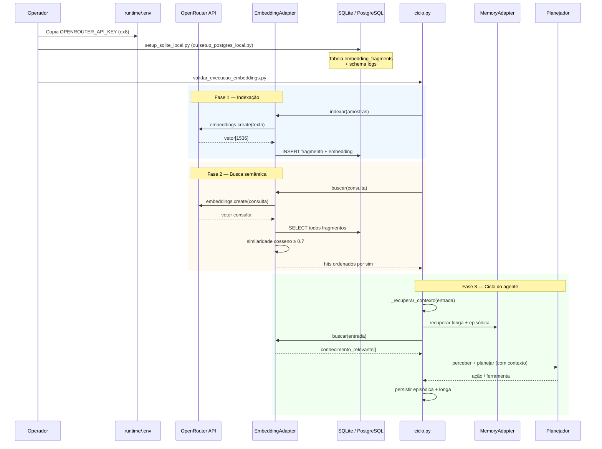
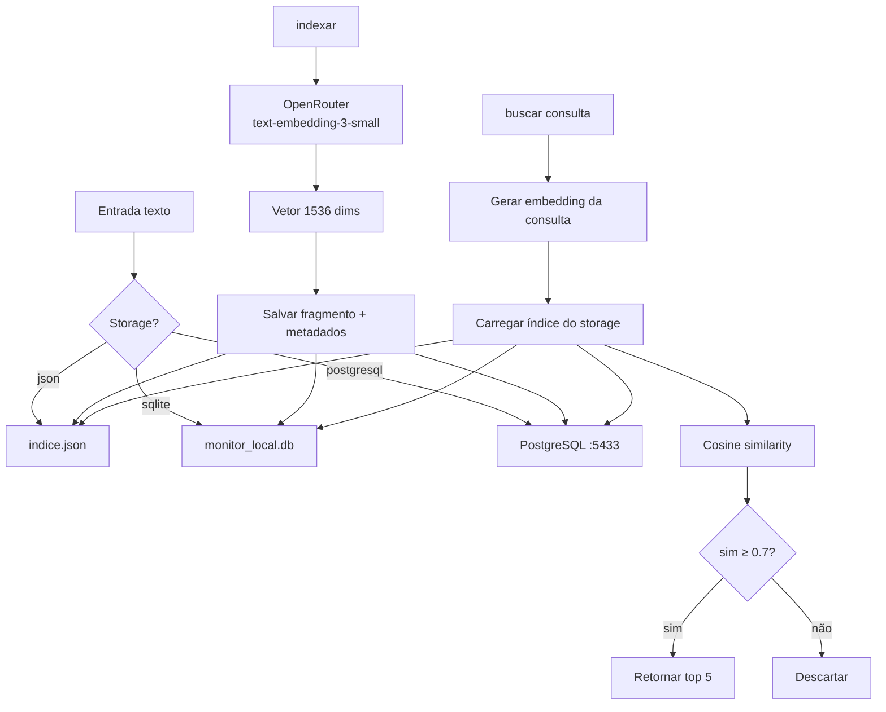
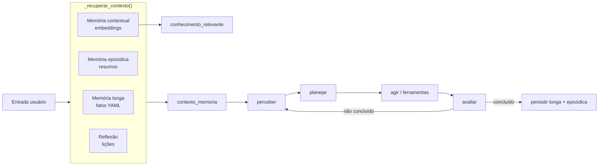

# Diagrama de fluxo — Embeddings + armazenamento local

## Visão geral (setup → consulta → agente)

```mermaid
sequenceDiagram
    participant U as Operador
    participant ENV as runtime/.env
    participant OR as OpenRouter API
    participant EA as EmbeddingAdapter
    participant DB as SQLite / PostgreSQL
    participant C as ciclo.py
    participant MA as MemoryAdapter
    participant P as Planejador

    U->>ENV: Copia OPENROUTER_API_KEY (ex8)
  U->>DB: setup_sqlite_local.py (ou setup_postgres_local.py)
    Note over DB: Tabela embedding_fragments<br/>+ schema logs

    U->>C: validar_execucao_embeddings.py

    rect rgb(240, 248, 255)
        Note over EA,OR: Fase 1 — Indexação
        C->>EA: indexar(amostras)
        EA->>OR: embeddings.create(texto)
        OR-->>EA: vetor[1536]
        EA->>DB: INSERT fragmento + embedding
    end

    rect rgb(255, 250, 240)
        Note over EA,OR: Fase 2 — Busca semântica
        C->>EA: buscar(consulta)
        EA->>OR: embeddings.create(consulta)
        OR-->>EA: vetor consulta
        EA->>DB: SELECT todos fragmentos
        EA->>EA: similaridade cosseno ≥ 0.7
        EA-->>C: hits ordenados por sim
    end

    rect rgb(240, 255, 240)
        Note over C,P: Fase 3 — Ciclo do agente
        C->>C: _recuperar_contexto(entrada)
        C->>MA: recuperar longa + episódica
        C->>EA: buscar(entrada)
        EA-->>C: conhecimento_relevante[]
        C->>P: perceber + planejar (com contexto)
        P-->>C: ação / ferramenta
        C->>C: persistir episódica + longa
    end
```

## Fluxo interno do EmbeddingAdapter

```mermaid
flowchart TD
    A[Entrada texto] --> B{Storage?}
    B -->|json| C[indice.json]
    B -->|sqlite| D[monitor_local.db]
    B -->|postgresql| E[PostgreSQL :5433]

    F[indexar] --> G[OpenRouter<br/>text-embedding-3-small]
    G --> H[Vetor 1536 dims]
    H --> I[Salvar fragmento + metadados]

    J[buscar consulta] --> K[Gerar embedding da consulta]
    K --> L[Carregar índice do storage]
    L --> M[Cosine similarity]
    M --> N{sim ≥ 0.7?}
    N -->|sim| O[Retornar top 5]
    N -->|não| P[Descartar]

    I --> C
    I --> D
    I --> E
    L --> C
    L --> D
    L --> E
```

## Integração no ciclo do agente

```mermaid
flowchart LR
    subgraph recuperacao["_recuperar_contexto()"]
        R1[Memória longa<br/>fatos YAML]
        R2[Memória episódica<br/>resumos]
        R3[Memória contextual<br/>embeddings]
        R4[Reflexão<br/>lições]
    end

    E[Entrada usuário] --> recuperacao
    R3 --> CR[conhecimento_relevante]
    recuperacao --> CTX[contexto_memoria]
    CTX --> PER[perceber]
    PER --> PLN[planejar]
    PLN --> ACT[agir / ferramentas]
    ACT --> EVL[avaliar]
    EVL -->|não concluído| PER
    EVL -->|concluído| PERS[persistir longa + episódica]
```
