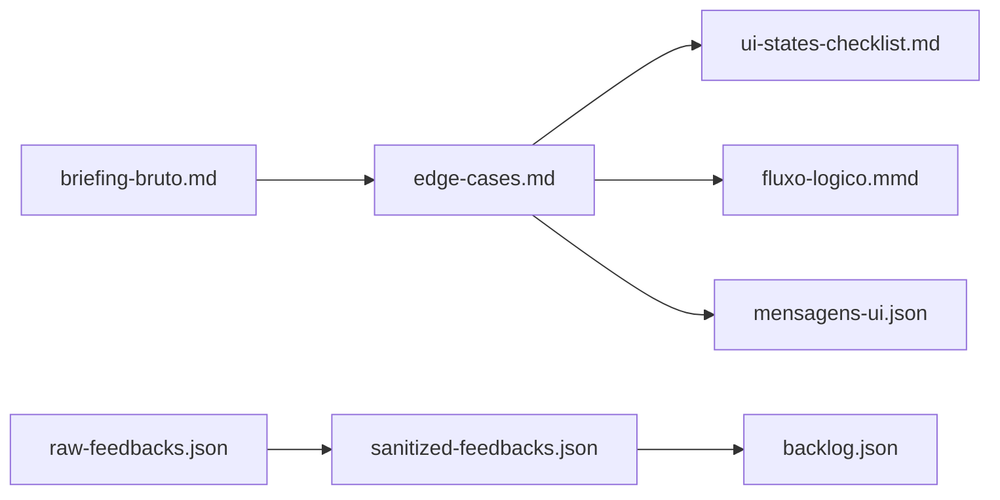

# Pipeline — Discovery & Refinement

Fluxo completo do exemplo Pix Agendado.

## Projeto 1 — Refinamento de requisitos

| Etapa | Prompt | Entrada | Saída |
|-------|--------|---------|-------|
| 1 | `system-instructions-refinement.md` | `briefing-bruto.md` | `edge-cases.md`, `ui-states-checklist.md` |
| 2 | `mermaid-flowchart.md` | `edge-cases.md` | `fluxo-logico.mmd` |
| 3 | `ux-writing-system.md` | `edge-cases.md` | `mensagens-ui.json` |

## Projeto 2 — Data discovery

| Etapa | Prompt | Entrada | Saída |
|-------|--------|---------|-------|
| 1 | `data-sanitizer.md` | `raw-feedbacks.json` | `sanitized-feedbacks.json` |
| 2 | `tech-leader.md` | `sanitized-feedbacks.json` | `backlog.json` |

Use **temperature 0** no LLM para saída determinística.

## Sanitização (6 → 3 tickets)

| Ticket | Decisão | Motivo |
|--------|---------|--------|
| tkt_01 | Manter | Bug tela branca — PII redigido |
| tkt_02 | Descartar | Teste de desenvolvimento |
| tkt_03 | Descartar | Atendimento físico (agência) |
| tkt_04 | Descartar | Bot / auto-reply |
| tkt_05 | Manter | Crash em data inválida |
| tkt_06 | Manter | UX comprovante — telefone redigido |

## Backlog priorizado

| ID | Ref | Categoria | Severidade |
|----|-----|-----------|------------|
| TKT-101 | tkt_01 | BUG_CRITICO | ALTA |
| TKT-102 | tkt_05 | BUG_CRITICO | ALTA |
| TKT-103 | tkt_06 | UX_UI_IMPROVEMENT | MEDIA |

## Próximo passo

Artefatos deste pipeline alimentam o **Exemplo 2**: [`modulo-5-exemplo-2-prototyping-ui`](../../modulo-5-exemplo-2-prototyping-ui/docs/ENTRADA_EXEMPLO_1.md)
