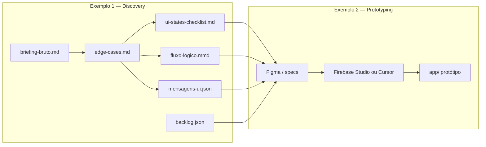

# Pipeline — Exemplo 1 → Exemplo 2

## Trilha A — Firebase Studio (UNIPDS)

| Etapa | Ferramenta | Entrada |
|-------|------------|---------|
| 1 | Figma + Builder.io | Wireframe / design Pix Agendado |
| 2 | Firebase Studio Import | Export Builder.io |
| 3 | App Prototyping agent | `firebase-studio-prototyper.md` + checklist Ex. 1 |
| 4 | Preview / App Hosting | URL compartilhável |

## Trilha B — Cursor (local)

| Etapa | Prompt | Entrada | Saída |
|-------|--------|---------|-------|
| 1 | `figma-to-code.md` | Artefatos Ex. 1 | `app/` React |
| 2 | — | `mensagens-ui.json` | Componentes de erro |
| 3 | — | `ui-states-checklist.md` | Validação manual |

## Critério de pronto

Protótipo aceito quando o fluxo principal (contato → valor → data → revisão → MFA → comprovante) e **≥ 3 unhappy paths** do `edge-cases.md` estiverem cobertos.
