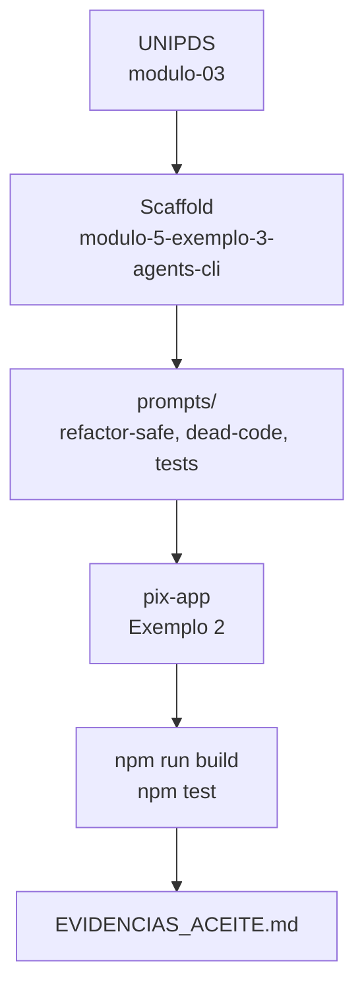

# Relatório Didático — Módulo 5, Exemplo 3

> Gerado no padrão **delivery-agent** (`gerar_relatorio_didatico_aula`) — scaffold local sem download UNIPDS (Python indisponível no ambiente; base alinhada ao [modulo-03 UNIPDS](https://github.com/unipds-engenharia-de-ia-aplicada/engenharia-de-software-com-ia-aplicada/tree/main/modulo05-ferramentas-de-IA-para-UI-UX/modulo-03)).

## Resumo

| Campo | Valor |
|-------|-------|
| Módulo | 5 — Ferramentas de IA para UI/UX |
| Exemplo | 3 — `modulo-5-exemplo-3-agents-cli` |
| Aula UNIPDS | `modulo-03` |
| Aula anterior | `modulo-5-exemplo-2-prototyping-ui` ✅ |
| App alvo | `pix-app` (Angular 21) |

## Fluxo da aula



## Tópicos didáticos

### 1. Agents CLI na consolidação de código
- **Conceito:** após prototipar com Cursor/Figma/Stitch, agentes CLI refatoram com diff revisável.
- **Exemplo:** `cd modulo-5-exemplo-2-prototyping-ui/app && gemini` (ou CLI UNIPDS)

### 2. Refatoração segura
- **Conceito:** prompts com escopo mínimo, gates de build/test, proibição de over-engineering.
- **Exemplo:** anexar `prompts/refactor-safe.md` antes de qualquer mudança.

### 3. Limpeza de código morto
- **Conceito:** scaffold inicial do `figma-to-code.md` deixa pastas não usadas; CLI identifica imports órfãos.
- **Exemplo:** `prompts/dead-code-cleanup.md` → remover `features/contacts`, `features/review`, etc.

### 4. Testes como gate de qualidade
- **Conceito:** componentes gerados por IA precisam de testes Vitest antes de merge.
- **Exemplo:** `prompts/test-gap-fixer.md` → `pix-receipt.component.spec.ts`

### 5. Cursor vs CLI
- **Conceito:** comparar mesmo prompt (`correcao_css.md`) em IDE vs terminal — tempo, diff, revisão.
- **Exemplo:** viewport 375px no extrato (`pix-history.component.css`)

## Comandos detectados

```bash
# Validacao inicial
cd modulo-5-exemplo-2-prototyping-ui/app
npm run build
npm test -- --watch=false

# Delivery-agent (quando Python disponivel)
cd modulo-4-exemplo-1-agente-ia-contratos/runtime
python run_delivery_modulo5.py
```

## Estrutura do scaffold

```
modulo-5-exemplo-3-agents-cli/
├── README.md
├── prompts/
│   ├── refactor-safe.md
│   ├── dead-code-cleanup.md
│   └── test-gap-fixer.md
└── docs/
    ├── ROTEIRO_AULA.md
    ├── EVIDENCIAS_ACEITE.md
    └── RELATORIO_DIDATICO.md
```

## Próximo passo (Ex. 4)

**Automação MCP** — testes E2E com Playwright e depuração via MCP ([modulo-04 UNIPDS](https://github.com/unipds-engenharia-de-ia-aplicada/engenharia-de-software-com-ia-aplicada/tree/main/modulo05-ferramentas-de-IA-para-UI-UX/modulo-04)).

## Mensagem de commit sugerida

```
feat(modulo-5): add exemplo-3 agents-cli scaffold

Prepare next lesson with delivery-agent: prompts, roteiro and acceptance docs.
```
