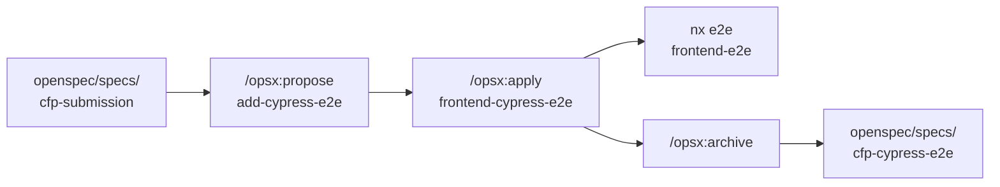

# Fluxo Cypress + OpenSpec — CFP Platform

Estende o fluxo do [Exemplo 3](../../modulo-5-exemplo-3-openspec-cfp/docs/FLUXO_OPENSPEC.md) com testes E2E em Cypress.

## Visão geral



| Fase | Ferramenta | Entregável |
|------|------------|------------|
| 1 | Specs existentes (Ex. 3) | Comportamento documentado em `openspec/specs/` |
| 2 | `/opsx:propose add-cypress-e2e` | `proposal.md`, `design.md`, `tasks.md`, delta spec |
| 3 | `/opsx:apply` | Projeto `frontend-cypress-e2e/` + `.cy.ts` |
| 4 | `nx e2e` | Testes verdes |
| 5 | `/opsx:archive` | Spec canônica `cfp-cypress-e2e/` |

## Fase 1 — Ler specs de comportamento

Antes de propor Cypress, o agente deve ler:

- `openspec/specs/cfp-submission/spec.md` — formulário, estados, acessibilidade
- `openspec/specs/cfp-dashboard/spec.md` — listagem, navegação

Cada **Scenario** da spec vira um **it()** ou **describe()** no Cypress.

## Fase 2 — Propose `add-cypress-e2e`

```bash
cd cfp-platform
/opsx:propose add-cypress-e2e
```

**proposal.md** deve declarar:
- Nova capability `cfp-cypress-e2e`
- Projeto Nx `frontend-e2e` (pasta `frontend-cypress-e2e/`)
- Cenários: submissão happy path, navegação, dashboard

**design.md** deve fixar:
- `baseUrl`: `http://localhost:4200`
- Seletores: `data-cy` ou roles (`cy.get('#name')`, `cy.contains('Submit Proposal')`)
- Estrutura: `src/e2e/cfp-submission.cy.ts`, `src/support/e2e.ts`

**tasks.md** exemplo:

```
- [ ] Adicionar @nx/cypress e Cypress ao workspace
- [ ] Gerar projeto frontend-cypress-e2e
- [ ] Spec: submissão CFP happy path
- [ ] Spec: navegação entre rotas
- [ ] Spec: submissão aparece no dashboard
- [ ] nx e2e frontend-e2e verde
```

## Fase 3 — Apply

```
/opsx:apply add-cypress-e2e
```

Prompt auxiliar: [`prompts/cypress-from-spec.md`](../prompts/cypress-from-spec.md)

## Fase 4 — Executar

```bash
# Servidores rodando
npx nx run-many -t serve -p api frontend

# Headless
npx nx e2e frontend-e2e

# UI interativa (debug)
npx nx open-cypress frontend-e2e
```

## Fase 5 — Archive

```
/opsx:archive add-cypress-e2e
```

Consolida cenários E2E em `openspec/specs/cfp-cypress-e2e/spec.md`.

## Princípio didático

| OpenSpec (Ex. 3) | Cypress (Ex. 4) |
|------------------|-----------------|
| Spec descreve **comportamento** | Cypress **verifica** comportamento |
| Change planeja implementação | Change planeja **testes** |
| Archive → specs canônicas | Archive → specs E2E canônicas |

O Ex. 3 já tem Playwright (`frontend-e2e/aceite.spec.ts`) como baseline CI. O Ex. 4 mostra o mesmo fluxo via **OpenSpec + Cypress** — ferramenta diferente, mesmo ciclo spec-driven.
