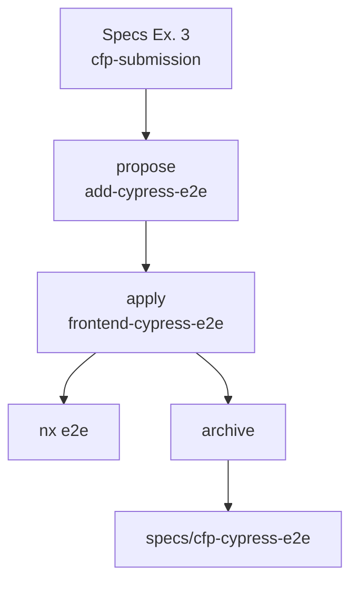

# Relatório Didático — Módulo 5, Exemplo 4

Alinhado ao [modulo-04 UNIPDS](https://github.com/unipds-engenharia-de-ia-aplicada/engenharia-de-software-com-ia-aplicada/tree/main/modulo05-ferramentas-de-IA-para-UI-UX/modulo-04).

## Resumo

| Campo | Valor |
|-------|-------|
| Módulo | 5 — Ferramentas de IA para UI/UX |
| Exemplo | 4 — `modulo-5-exemplo-4-cypress-openspec` |
| Aula UNIPDS | `modulo-04` — Cypress + OpenSpec |
| Aula anterior | `modulo-5-exemplo-3-openspec-cfp` ✅ |
| App alvo | `cfp-platform` (do Ex. 3) |

## Fluxo da aula



## Tópicos didáticos

### 1. Spec-driven E2E

- **Conceito:** cenários OpenSpec viram testes Cypress antes de codificar.
- **Exemplo:** `openspec/changes/archive/2026-03-31-add-cypress-e2e/`

### 2. Cypress no monorepo Nx

- **Conceito:** projeto `frontend-cypress-e2e` com `baseUrl` e `implicitDependencies`.
- **Exemplo:** `npx nx e2e frontend-e2e`

### 3. Scenario → it()

- **Conceito:** cada Scenario da spec vira um bloco `it()` com steps Cypress.
- **Exemplo:** `prompts/cypress-from-spec.md`

### 4. Coexistência Playwright + Cypress + cy.prompt

- **Conceito:** Playwright (Ex. 3), Cypress determinístico e `cy.prompt` (Ex. 4) no mesmo monorepo.
- **Exemplo:** `cfp-submission.cy.ts` vs `event-registration-ai.cy.ts`

## Comandos de referência

```bash
cd ../modulo-5-exemplo-3-openspec-cfp/cfp-platform
npx nx e2e frontend-e2e
npx nx open-cypress frontend-e2e
openspec list --specs
```

## Documentação

| Arquivo | Conteúdo |
|---------|----------|
| [`FLUXO_CYPRESS_OPENSPEC.md`](FLUXO_CYPRESS_OPENSPEC.md) | Fases completas |
| [`ROTEIRO_AULA.md`](ROTEIRO_AULA.md) | Roteiro ~2h |
| [`EVIDENCIAS_ACEITE.md`](EVIDENCIAS_ACEITE.md) | Checklist |
