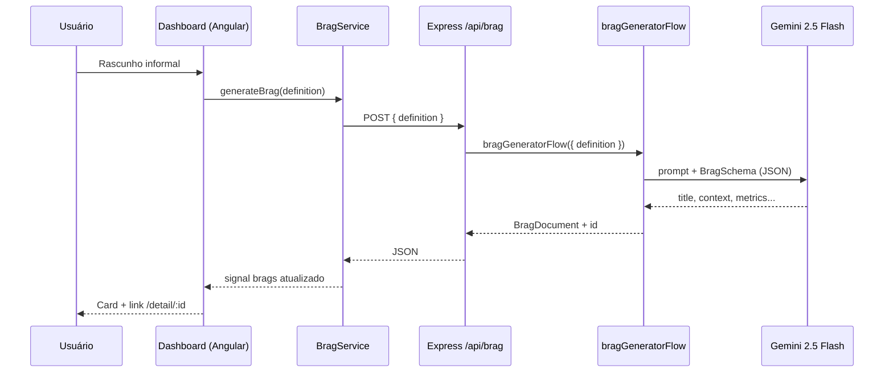

# Fluxo Genkit — BragBot

Arquitetura da integração IA no Exemplo 6.

## Visão geral



## Micro-BFF (Integração Full-Stack)

O Angular SSR roda no mesmo processo Express que expõe a API — padrão **Micro-BFF**: backend mínimo colocado junto ao frontend, sem serviço separado.

### Backend (`server.ts`)

1. `express.json()` logo após `const app = express()`
2. Rota `POST /api/brag` **antes** do catch-all do Angular
3. Extrai `req.body.definition` e chama `bragGeneratorFlow({ definition })`
4. Retorna JSON; em erro, status `500`

### Frontend

| Arquivo | Mudança |
|---------|---------|
| `app.config.ts` | `provideHttpClient(withFetch())` para SSR |
| `brag.service.ts` | Remove mock; `generateBrag(definition)` com `loading` + POST `/api/brag` |
| `dashboard.component.ts` | Chama `bragService.generateBrag(prompt)` no submit |

### Validação de build

```bash
cd app && npm run build   # deve passar sem erros TypeScript/SSR
```

## Camadas

| Camada | Arquivo | Responsabilidade |
|--------|---------|------------------|
| **Flow** | `app/src/flows.ts` | Define `BragInputSchema`, `BragSchema`, prompt e `bragGeneratorFlow` |
| **API** | `app/src/server.ts` | `POST /api/brag` — chama o flow e retorna JSON |
| **Service** | `app/src/app/services/brag.service.ts` | HTTP client + signals (`brags`, `loading`) |
| **UI** | `dashboard/`, `detail/` | Formulário, lista e visualização |

## Schema de saída (`BragSchema`)

| Campo | Descrição |
|-------|-----------|
| `title` | Ação + resultado de alto nível |
| `context` | Situação / problema original |
| `actionTaken` | Passos técnicos tomados |
| `businessImpact` | Impacto de negócio |
| `metrics` | Dados quantificáveis |
| `technologiesUsed` | Stack inferida ou mencionada |

## Genkit UI

```bash
cd app
npm run genkit:ui
```

Permite executar `bragGeneratorFlow` isoladamente, ajustar temperatura e inspecionar traces — útil antes de alterar o prompt em produção.

## Diferença vs Ex. 4–5

| Aspecto | Cypress / Playwright (Ex. 4–5) | Genkit (Ex. 6) |
|---------|-------------------------------|----------------|
| Objetivo | Validar UI existente | **Gerar conteúdo** com IA |
| IA no loop | `cy.prompt()` / agentes MCP | Flow tipado + Gemini |
| Artefato | Spec de teste | Brag Document estruturado |

## Referência UNIPDS

[brag-bot no repositório UNIPDS](https://github.com/unipds-engenharia-de-ia-aplicada/engenharia-de-software-com-ia-aplicada/tree/main/modulo05-ferramentas-de-IA-para-UI-UX/modulo-05/brag-bot)
