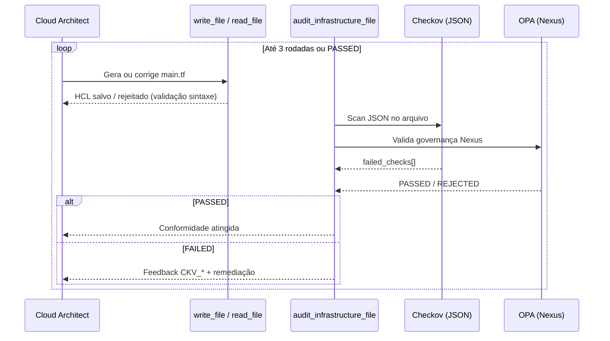

# Evidências de Aceite — Lab 2 (IaC Copilot + Loop de Correção)

Validação executada em **2026-08-05** (fluxo corrigido).

**Evolução:** complementa [`EVIDENCIAS_MODULO2.md`](./EVIDENCIAS_MODULO2.md) (pipeline linear sem loop).

## Objetivo do lab

Pipeline CrewAI com **loop de correção automática** entre geração e auditoria:

1. **Cloud Architect** — gera ou corrige `main.tf` (`read_file` + `write_file`)
2. **Auditoria programática** — `audit_infrastructure_file()` com Checkov JSON + OPA no arquivo em disco
3. **Feedback estruturado** — falhas `CKV_*` com hints de remediação devolvidas ao architect
4. **Até 3 rodadas** — geração → auditoria → correção → reauditoria

Script: `nexus/labs/modulo2_iac_copilot.py`

---

## Fluxo implementado



---

## Ambiente

| Item | Valor |
|------|-------|
| Python | 3.12 (venv) |
| CrewAI | 1.15.11 |
| Checkov | instalado no venv (`pip install checkov`) |
| LLM | Groq `llama-3.1-8b-instant` |
| Data | 2026-08-05 |
| `MAX_CORRECTION_ROUNDS` | 3 |
| `ROUND_DELAY_SECONDS` | 8 (evitar rate limit Groq) |

### Comandos

```powershell
cd nexus
.\venv\Scripts\Activate.ps1
$env:PYTHONIOENCODING = "utf-8"
$env:CREWAI_TRACING_ENABLED = "false"
python labs/modulo2_iac_copilot.py
```

---

## Correções aplicadas (vs. pipeline linear)

| Problema (v1) | Correção (v2) |
|---------------|---------------|
| Sem loop — falhas Checkov não reacionavam | Loop `for` até 3 rodadas com feedback |
| OPA validava texto da task, não o HCL | `audit_infrastructure_file()` lê `main.tf` do disco |
| Checkov com falso positivo em HCL quebrado | Parse JSON + rejeição se `0 passed / 0 failed` |
| HCL inválido salvo em disco | `write_file` valida sintaxe antes de gravar |
| Relatório final do Crew inconsistente | Relatório final **determinístico** (sem Crew do auditor) |
| Feedback genérico | Lista `CKV_*` + hint de remediação por falha |

### Arquivos alterados

| Arquivo | Responsabilidade |
|---------|------------------|
| `nexus/labs/modulo2_iac_copilot.py` | Orquestração do loop |
| `nexus/tools/security_scan.py` | `audit_infrastructure_file()`, Checkov JSON, OPA |
| `nexus/tools/file_writer.py` | `read_file`, `write_file` com validação HCL |

---

## Resultado da execução (2026-08-05 v2)

| Métrica | Valor |
|---------|-------|
| **Exit code** | `0` (script concluiu sem crash) |
| **Status final** | `FAILED` (conformidade Checkov+OPA não atingida em 3 rodadas) |
| **Rodadas utilizadas** | **3/3** |
| **Baseline inicial** | `main.tf` mínimo (bucket + versioning) |
| **Log completo** | [`execucao-modulo2-loop-2026-08-05-v2.log`](./execucao-modulo2-loop-2026-08-05-v2.log) |
| **Checkov JSON final** | [`checkov-modulo2-loop-2026-08-05.json`](./checkov-modulo2-loop-2026-08-05.json) |

---

## Evidência por rodada

### Rodada 1 — GERAÇÃO

| Critério | Status | Evidência |
|----------|--------|-----------|
| Architect executou | ✅ | Log — fase `GERAÇÃO` |
| `write_file` chamada | ✅ | `File 'main.tf' saved successfully` |
| Auditoria programática | ✅ | Fase `AUDITORIA PROGRAMÁTICA` |
| Checkov | ❌ | **14 passed / 6 failed** |
| OPA | ✅ | `OPA PASSED` |
| Loop acionado | ✅ | `Rodada 1 reprovada — iniciando correção...` |

**Falhas Checkov (rodada 1):**

| Check ID | Recurso | Remediação sugerida |
|----------|---------|---------------------|
| CKV_AWS_7 | `aws_kms_key.nexus-apollo-data` | Rotação de CMK |
| CKV2_AWS_62 | `aws_s3_bucket.nexus-apollo-data` | `aws_s3_bucket_notification` |
| CKV2_AWS_64 | `aws_kms_key.nexus-apollo-data` | KMS key policy |
| CKV2_AWS_61 | `aws_s3_bucket.nexus-apollo-data` | `aws_s3_bucket_lifecycle_configuration` |
| CKV_AWS_18 | `aws_s3_bucket.nexus-apollo-data` | `aws_s3_bucket_logging` |
| CKV_AWS_144 | `aws_s3_bucket.nexus-apollo-data` | `aws_s3_bucket_replication_configuration` |

---

### Rodada 2 — CORREÇÃO

| Critério | Status | Evidência |
|----------|--------|-----------|
| Architect leu arquivo (`read_file`) | ✅ | Log — fase `CORREÇÃO (rodada 2)` |
| Feedback CKV_* injetado na task | ✅ | `RELATÓRIO DE AUDITORIA` na descrição |
| `write_file` com HCL expandido | ✅ | Lambda, IAM, logging, replication adicionados |
| Checkov | ❌ | **44 passed / 28 failed** (novos recursos geraram novas falhas) |
| Loop acionado | ✅ | `Rodada 2 reprovada — iniciando correção...` |

> O architect **reagiu ao feedback** e adicionou resources (KMS, notification, lifecycle, logging, replication). O Checkov passou de 6 para 28 falhas porque o LLM introduziu recursos auxiliares (Lambda, IAM) com gaps adicionais — comportamento pedagógico realista de IaC iterativo.

---

### Rodada 3 — CORREÇÃO (limite)

| Critério | Status | Evidência |
|----------|--------|-----------|
| Tentativa de correção | ⚠️ | `RateLimitError` Groq (`llama-3.1-8b-instant`, TPM 6000) |
| Auditoria programática | ✅ | Executada mesmo após erro do Crew |
| Checkov final | ❌ | **44 passed / 28 failed** |
| OPA final | ❌ | `NO_PUBLIC_INGRESS` — `0.0.0.0/0` detectado no HCL |
| Limite de rodadas | ✅ | `Limite de 3 rodadas atingido` |

---

## Relatório final (determinístico)

```
Status: FAILED
Rodadas utilizadas: 3/3
Checkov: 44 passed / 28 failed
OPA: REJECTED (NO_PUBLIC_INGRESS — 0.0.0.0/0)
Conformidade não atingida após todas as rodadas de correção.
```

---

## Artefato gerado — `main.tf` (evolução)

Após o loop, o arquivo contém resources adicionados pelo architect em resposta ao feedback:

- `aws_kms_key`, `aws_s3_bucket_notification`, `aws_lambda_function`
- `aws_s3_bucket_lifecycle_configuration`, `aws_s3_bucket_logging`
- `aws_s3_bucket_replication_configuration`, buckets auxiliares (`log`, `replication`)

Arquivo final: [`../nexus/main.tf`](../nexus/main.tf)

---

## Conclusão pedagógica

| Aspecto | Avaliação |
|---------|-----------|
| Loop de correção automática | ✅ **Funcionou** — 3 rodadas executadas com feedback |
| Auditoria no arquivo real (não no texto da task) | ✅ |
| Checkov JSON sem falso positivo em HCL vazio | ✅ |
| Validação HCL no `write_file` | ✅ |
| Feedback estruturado `CKV_*` → architect | ✅ |
| Conformidade 100% Checkov+OPA | ❌ Limitado pelo modelo Groq 8B + rate limit |
| Evolução do HCL entre rodadas | ✅ 6 → 28 falhas mostra trade-off real de hardening |

### Lições do lab

1. **O loop fecha o ciclo** que faltava na v1: falha → feedback → re-task do architect.
2. **Auditoria programática** é mais confiável que delegar pass/fail ao LLM auditor.
3. **Correções parciais** podem introduzir novas falhas — em produção, usar modelo mais capaz ou template de referência.
4. **Rate limit Groq** interrompeu a rodada 3 — em aula, aguardar ~7s ou usar tier superior.

---

## Checklist de aceite — Loop de correção

- [x] `modulo2_iac_copilot.py` com loop até 3 rodadas
- [x] `audit_infrastructure_file()` com Checkov JSON + OPA
- [x] Feedback `CKV_*` devolvido ao architect
- [x] `read_file` / `write_file` com validação HCL
- [x] Relatório final determinístico (sem falso negativo do Crew)
- [x] Execução documentada com log e Checkov JSON
- [ ] Conformidade Checkov+OPA 100% (depende de modelo / mais rodadas)

---

## Arquivos de evidência

| Arquivo | Descrição |
|---------|-----------|
| [`execucao-modulo2-loop-2026-08-05-v2.log`](./execucao-modulo2-loop-2026-08-05-v2.log) | Saída completa do loop (3 rodadas) |
| [`checkov-modulo2-loop-2026-08-05.json`](./checkov-modulo2-loop-2026-08-05.json) | Relatório Checkov JSON final |
| [`EVIDENCIAS_MODULO2.md`](./EVIDENCIAS_MODULO2.md) | Evidência v1 — pipeline linear |
| [`../nexus/main.tf`](../nexus/main.tf) | Terraform após loop de correção |
| [`../nexus/labs/modulo2_iac_copilot.py`](../nexus/labs/modulo2_iac_copilot.py) | Script do loop |
