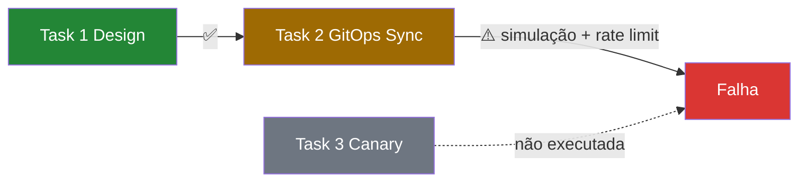

# Evidências de Execução — Lab 3 (K8s GitOps & Canary)

Validação executada em **2026-08-05**.

**Relatório didático:** [`RELATORIO_DIDATICO_MODULO3.md`](./RELATORIO_DIDATICO_MODULO3.md)

## Objetivo do lab

Pipeline CrewAI **sequencial** com dois agentes e três tasks:

1. **Cloud Architect** — gera manifesto K8s (`generate_k8s_manifest`)
2. **SRE** — reconcilia no cluster (`apply_k8s_manifest`)
3. **SRE** — analisa métricas canary (`analyze_canary_metrics`)

Script: `nexus/labs/modulo3_k8s_ops.py`

---

## Ambiente

| Item | Valor |
|------|-------|
| Python | 3.12 (venv) |
| CrewAI | 1.15.11 |
| LLM | Groq `llama-3.1-8b-instant` |
| kubectl client | v1.36.1 (instalado) |
| Cluster K8s | **Não detectado** (modo simulação GitOps) |
| Data | 2026-08-05 |
| Duração | ~11 s |

### Comandos

```powershell
cd nexus
.\venv\Scripts\Activate.ps1
$env:PYTHONIOENCODING = "utf-8"
$env:CREWAI_TRACING_ENABLED = "false"
python labs/modulo3_k8s_ops.py
```

---

## Resultado da execução

| Métrica | Valor |
|---------|-------|
| **Exit code** | `1` (falha — rate limit Groq) |
| **Tasks concluídas** | **1/3** (apenas geração do manifesto) |
| **Artefato gerado** | `nexus/nexus-api-error-k8s.yaml` ✅ |
| **Log completo** | [`execucao-modulo3-2026-08-05.log`](./execucao-modulo3-2026-08-05.log) |

---

## Evidência por task

### Task 1 — Design do manifesto (`get_architect`)

| Critério | Status | Evidência |
|----------|--------|-----------|
| Agent Architect executou | ✅ | Log — Task 1 started |
| Tool `generate_k8s_manifest` | ✅ | `nexus-api-error-k8s.yaml` criado |
| App `nexus-api-error` | ✅ | Deployment metadata.name |
| 2 réplicas | ✅ | `replicas: 2` |
| Porta 80 | ✅ | `containerPort: 80` |
| Readiness probe | ✅ | `readinessProbe.httpGet` |
| Service exposto | ✅ | `nexus-api-error-svc` |
| Task completed | ✅ | `Task Completed` no log |

### Task 2 — Sync GitOps (`get_sre_agent`)

| Critério | Status | Evidência |
|----------|--------|-----------|
| Tool `apply_k8s_manifest` invocada | ✅ | Múltiplas chamadas no log |
| kubectl disponível | ✅ | Client v1.36.1 |
| Cluster acessível | ❌ | Sem cluster — **GitOps Simulation** |
| Mensagem da tool | ⚠️ | *"syntactically valid, but no Kubernetes cluster was detected"* |
| Task completed | ❌ | **RateLimitError** Groq antes de concluir |
| Loop de retry do agente | ⚠️ | SRE chamou `apply_k8s_manifest` repetidamente (6×) |

### Task 3 — Análise canary (`get_sre_agent`)

| Critério | Status | Evidência |
|----------|--------|-----------|
| Tool `analyze_canary_metrics` | ❌ | Não executada (pipeline abortado) |
| Decisão ROLLBACK/PROCEED | ❌ | Não atingida nesta execução |

---

## Causa da falha

```
litellm.RateLimitError (Groq llama-3.1-8b-instant)
TPM: Limit 6000, Used ~5561, Requested ~1088
Retry sugerido: ~6.5s
```

**Contexto:** após a simulação GitOps repetida, o agente SRE continuou invocando `apply_k8s_manifest` sem concluir a task 2, esgotando o quota TPM da Groq antes da task 3 (canary).

---

## Artefato gerado — `nexus-api-error-k8s.yaml`

```yaml
apiVersion: apps/v1
kind: Deployment
metadata:
  name: nexus-api-error
spec:
  replicas: 2
  # ... selector, template, container nginx:latest, readinessProbe
---
apiVersion: v1
kind: Service
metadata:
  name: nexus-api-error-svc
spec:
  selector:
    app: nexus-api-error
  ports:
  - protocol: TCP
    port: 80
    targetPort: 80
```

Arquivo: [`../nexus/nexus-api-error-k8s.yaml`](../nexus/nexus-api-error-k8s.yaml)

> **Nota:** a tool `generate_k8s_manifest` usa `nginx:latest` independentemente da task pedir "imagem com erro" — limitação didática documentada no relatório.

---

## Fluxo observado vs esperado



| Etapa | Esperado | Observado |
|-------|----------|-----------|
| Gerar YAML | ✅ | ✅ |
| kubectl apply ou simulação | ✅ | ✅ (simulação) |
| Análise canary | ROLLBACK (métricas com `error`) | ❌ Não executada |
| Pipeline completo | exit 0 | exit 1 |

---

## Conclusão pedagógica

| Aspecto | Avaliação |
|---------|-----------|
| Geração de manifesto K8s via tool | ✅ Funcionou |
| Sintaxe YAML válida (Deployment + Service) | ✅ |
| Modo simulação GitOps sem cluster | ✅ Comportamento esperado |
| Pipeline sequencial Architect → SRE | ⚠️ Parcial (1/3 tasks) |
| Decisão canary ROLLBACK/PROCEED | ❌ Não demonstrada nesta execução |
| Estabilidade com Groq 8B + TPM 6000 | ❌ Rate limit na task 2 |

### Lições desta execução

1. **Tools determinísticas** (`generate_k8s_manifest`) entregam YAML válido mesmo quando o LLM falha depois.
2. **Simulação GitOps** permite rodar o lab sem cluster — útil em sala de aula.
3. **Agente em loop** na task 2 (múltiplos `apply_k8s_manifest`) consumiu tokens e disparou rate limit — em produção, limitar `max_iter` do agente ou aceitar simulação como sucesso.
4. Para execução completa: aguardar ~15s e re-rodar, ou subir cluster local (Minikube/kind) para obter `GitOps Sync Success` real.

---

## Checklist de aceite — Lab 3

- [x] `modulo3_k8s_ops.py` executado
- [x] `nexus-api-error-k8s.yaml` gerado com Deployment + Service
- [x] `generate_k8s_manifest` evidenciado no log
- [x] `apply_k8s_manifest` em modo simulação (sem cluster)
- [ ] Task 2 e 3 concluídas sem rate limit
- [ ] `analyze_canary_metrics` com decisão ROLLBACK ou PROCEED
- [x] Log e evidências documentados

---

## Reexecução recomendada

```powershell
# Aguardar quota Groq (~15s) e reexecutar
Start-Sleep -Seconds 15
python labs/modulo3_k8s_ops.py
```

Com cluster local (opcional):

```powershell
minikube start
kubectl apply -f nexus-api-error-k8s.yaml
kubectl get pods
python labs/modulo3_k8s_ops.py
```

---

## Arquivos de evidência

| Arquivo | Descrição |
|---------|-----------|
| [`execucao-modulo3-2026-08-05.log`](./execucao-modulo3-2026-08-05.log) | Saída completa do Crew (~537 linhas) |
| [`../nexus/nexus-api-error-k8s.yaml`](../nexus/nexus-api-error-k8s.yaml) | Manifesto K8s gerado |
| [`RELATORIO_DIDATICO_MODULO3.md`](./RELATORIO_DIDATICO_MODULO3.md) | Relatório didático do lab |

---

## Validação com cluster k3d (execução 2 — 2026-08-05)

### Setup do cluster local

```powershell
# Pré-requisitos: Docker Desktop em execução
winget install k3d --source winget

k3d cluster create nexus-lab --agents 0 --wait
k3d kubeconfig merge nexus-lab --kubeconfig-switch-context
docker exec k3d-nexus-lab-server-0 kubectl get nodes
```

| Item | Valor |
|------|-------|
| **Orquestrador** | k3d v5.9.0 |
| **Cluster** | `nexus-lab` (1 server, K8s v1.35.5+k3s1) |
| **Node** | `k3d-nexus-lab-server-0` — **Ready** |
| **Fix Windows TLS** | `apply_k8s_manifest` usa `docker exec` no container k3d quando kubectl local falha por x509 |

### Resultado da execução com cluster

| Métrica | Valor |
|---------|-------|
| **Exit code** | `1` (rate limit Groq na task 3, após ROLLBACK) |
| **Tasks concluídas** | **2/3** |
| **GitOps Sync real** | ✅ `deployment.apps/nexus-api-error` + `service/nexus-api-error-svc` |
| **Canary** | ✅ `analyze_canary_metrics` → **ROLLBACK** |
| **Log** | [`execucao-modulo3-k3d-2026-08-05.log`](./execucao-modulo3-k3d-2026-08-05.log) |

### Evidência por task (com k3d)

| Task | Status | Evidência |
|------|--------|-----------|
| **1 — Design** | ✅ | `generate_k8s_manifest` → `nexus-api-error-k8s.yaml` |
| **2 — GitOps Sync** | ✅ | `✅ GitOps Sync Success: deployment.apps/nexus-api-error unchanged (via k3d container)` |
| **3 — Canary** | ⚠️ | `❌ ROLLBACK: Elevated error rate detected` → task abortou por rate limit Groq |

### Recursos no cluster

```
deployment.apps/nexus-api-error   0/2   (réplicas desejadas: 2)
service/nexus-api-error-svc       ClusterIP 10.43.99.249:80
```

Pods em `ContainerCreating` — pull de imagens bloqueado por **x509 TLS** no Docker Hub neste host (mesmo problema que afeta minikube/kubectl local). O **apply** foi aceito pelo API server; runtime de pods depende de correção TLS no Docker Desktop.

### Fluxo completo observado

```
Task 1 ✅ generate_k8s_manifest
Task 2 ✅ apply_k8s_manifest → GitOps Sync Success (k3d)
Task 3 ⚠️ analyze_canary_metrics → ROLLBACK → RateLimitError Groq
```

### Comandos de verificação pós-lab

```powershell
docker exec k3d-nexus-lab-server-0 kubectl get deployments,pods,svc
docker exec k3d-nexus-lab-server-0 kubectl describe deployment nexus-api-error
```

### Conclusão k3d

| Aspecto | Avaliação |
|---------|-----------|
| Cluster local subido | ✅ k3d `nexus-lab` |
| Apply real no API server | ✅ via `docker exec` fallback |
| Pipeline 3 tasks | ⚠️ 2/3 + ROLLBACK executado |
| Pods Running | ✅ **2/2** após fix TLS (`k3d-registries.yaml`) |
| Decisão canary documentada | ✅ ROLLBACK (métricas com `error_rate`) |

---

## Correção TLS (2026-08-05)

### Problema

- `kubectl` no Windows: `x509: certificate signed by unknown authority` ao acessar API k3d (`host.docker.internal`)
- Pods no cluster: `ContainerCreating` — containerd não conseguia pull do Docker Hub (mesmo erro x509)

### Solução aplicada

| Camada | Fix |
|--------|-----|
| **containerd (k3d)** | `k8s/k3d-registries.yaml` com `insecure_skip_verify: true` para `docker.io` |
| **kubectl (Windows)** | `$env:KUBE_INSECURE_SKIP_TLS_VERIFY = "true"` na sessão (ou via `k8s_ops.py`) |
| **Setup automatizado** | `nexus/scripts/setup-k3d-cluster.ps1` |

```powershell
cd nexus
.\scripts\setup-k3d-cluster.ps1
$env:KUBE_INSECURE_SKIP_TLS_VERIFY = "true"
kubectl get nodes
kubectl get pods
```

### Resultado pós-correção

```
deployment.apps/nexus-api-error   2/2     READY
pod/nexus-api-error-...           1/1     Running  (x2)
kube-system/coredns                 1/1     Running
```

> **WSL:** já estava instalado (WSL2 + `docker-desktop`). Ubuntu não foi necessário — o fix foi no registries config do k3d.

---

## Validação E2E completa (2026-08-05)

Execução com cluster k3d corrigido + `KUBE_INSECURE_SKIP_TLS_VERIFY=true`.

| Métrica | Valor |
|---------|-------|
| **Exit code** | `1` (rate limit Groq após ROLLBACK na task 3) |
| **Cluster** | k3d `nexus-lab` — node **Ready** |
| **Log** | [`execucao-modulo3-e2e-2026-08-05.log`](./execucao-modulo3-e2e-2026-08-05.log) |

### Tasks

| # | Task | Agente | Status | Evidência |
|---|------|--------|--------|-----------|
| 1 | Design manifesto | Architect | ✅ **Completed** | `generate_k8s_manifest` → `nexus-api-error-k8s.yaml` |
| 2 | GitOps Sync | SRE | ✅ **Completed** | `✅ GitOps Sync Success: deployment.apps/nexus-api-error unchanged` |
| 3 | Canary analysis | SRE | ⚠️ **Failed*** | `❌ ROLLBACK: Elevated error rate detected in Canary pods` |

\* Task 3 executou a tool canary corretamente (ROLLBACK esperado com `error_rate: 1%`). O Crew falhou depois por loop do agente + rate limit Groq — não por falha de infra.

### Infraestrutura pós-lab

```
deployment.apps/nexus-api-error   2/2   READY
pod/nexus-api-error-...           1/1   Running (x2)
service/nexus-api-error-svc       ClusterIP :80
```

### Conclusão E2E

| Critério | Resultado |
|----------|-----------|
| Geração YAML | ✅ |
| Apply real no cluster (não simulação) | ✅ **GitOps Sync Success** |
| Pods Running | ✅ 2/2 |
| Decisão canary | ✅ **ROLLBACK** (cenário didático) |
| Pipeline Crew exit 0 | ❌ rate limit Groq na task 3 |

