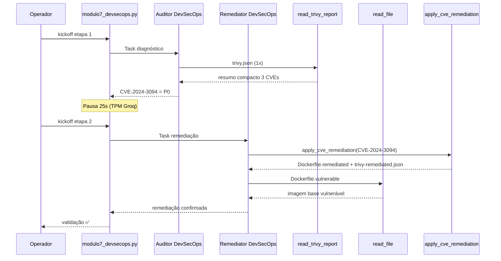

# Evidências de Execução — Lab 7 (DevSecOps: Diagnóstico + Remediação)

Validação executada em **2026-08-06**.

**Relatório didático:** [`RELATORIO_DIDATICO_MODULO7.md`](./RELATORIO_DIDATICO_MODULO7.md)

---

## Objetivo do lab

Pipeline CrewAI em **2 etapas** (padrão self-healing do M4):

| Etapa | Agente | Ação |
|-------|--------|------|
| **1 — Diagnóstico** | Analista DevSecOps AI | Lê Trivy, tria CVEs, identifica P0 |
| **2 — Remediação** | Analista DevSecOps AI | Analisa diagnóstico e aplica correção |

Script: `nexus/labs/modulo7_devsecops.py`

---

## Ambiente

| Item | Valor |
|------|-------|
| Python | 3.12.10 (venv) |
| CrewAI | 1.15.11 |
| LLM | Groq `llama-3.1-8b-instant` |
| Data | 2026-08-06 |
| Duração total | ~43 s |
| Exit code | **0** ✅ |

### Comando

```powershell
cd modulo-6-exemplo-1-aiops-foundation/nexus
.\venv\Scripts\Activate.ps1
python labs/modulo7_devsecops.py
```

---

## Cenário do caso

**Situação:** Pipeline CI bloqueou deploy após scan Trivy da imagem `python:3.11-slim`.

**Ameaça P0:** CVE-2024-3094 — backdoor no upstream XZ (`liblzma5` 5.6.0-1).

**Missão do agente:**
1. Diagnosticar e priorizar
2. Analisar o diagnóstico
3. Efetuar a correção (Dockerfile + re-scan simulado)

---

## Processo executado



---

## Etapa 1 — Diagnóstico

| Critério | Status | Evidência |
|----------|--------|-----------|
| Tool `read_trivy_report` | ✅ | 1 chamada |
| Resumo compacto retornado | ✅ | 3 CVEs listadas |
| CVE-2024-3094 como P0 | ✅ | `CRITICAL \| liblzma5 5.6.0-1 -> fix 5.6.1-1` |
| Backdoor identificado | ✅ | "Backdoor in lzma upstream as of 5.6.0" |
| Task concluída | ✅ | Exit etapa 1 sem erro |

**Output do agente:**

> Diagnóstico com CVE-2024-3094 como P0 em liblzma5 e versão fix 5.6.1-1.

---

## Etapa 2 — Remediação (análise + correção)

| Critério | Status | Evidência |
|----------|--------|-----------|
| Leitura da imagem vulnerável | ✅ | `read_file` → `data/Dockerfile.vulnerable` |
| Playbook aplicado | ✅ | `apply_cve_remediation(CVE-2024-3094)` |
| `Dockerfile.remediated` criado | ✅ | Base `python:3.11-slim-bookworm` + `liblzma5` |
| `data/trivy-remediated.json` criado | ✅ | P0 removida, 2 CVEs restantes |
| Validação automática | ✅ | Script confirmou artefatos |

**Output do agente:**

> Remediação aplicada: Dockerfile.remediated e data/trivy-remediated.json sem CVE-2024-3094.

---

## Artefatos gerados

### `data/Dockerfile.vulnerable` (antes)

```dockerfile
FROM python:3.11-slim   # liblzma5 5.6.0-1 comprometida
```

### `Dockerfile.remediated` (depois)

```dockerfile
# Remediated by Nexus DevSecOps — CVE-2024-3094 (liblzma5 backdoor) patched
FROM python:3.11-slim-bookworm

RUN apt-get update \
    && apt-get install -y --no-install-recommends liblzma5 \
    && rm -rf /var/lib/apt/lists/*
```

### Comparativo Trivy

| Relatório | Imagem | CVE-2024-3094 | Outras CVEs |
|-----------|--------|---------------|-------------|
| `data/trivy.json` (antes) | `python:3.11-slim` | ✅ presente | 2 |
| `data/trivy-remediated.json` (depois) | `nexus-api:remediated` | ❌ removida | 2 (HIGH + LOW) |

---

## Resolução do caso

### Diagnóstico

| Campo | Valor |
|-------|-------|
| **CVE prioritária** | CVE-2024-3094 |
| **Tipo** | Backdoor supply chain (XZ Utils) |
| **Pacote** | `liblzma5` |
| **Versão vulnerável** | 5.6.0-1 |
| **Versão corrigida** | 5.6.1-1+ |

### Correção aplicada

| Ação | Detalhe |
|------|---------|
| 1. Trocar base image | `python:3.11-slim` → `python:3.11-slim-bookworm` |
| 2. Atualizar liblzma5 | `apt-get install liblzma5` na layer de build |
| 3. Gerar Dockerfile corrigido | `Dockerfile.remediated` |
| 4. Re-scan simulado | `trivy-remediated.json` sem P0 |
| 5. Próximo passo CI | `docker build -f Dockerfile.remediated -t nexus-api:remediated .` |

### Status final

| Item | Status |
|------|--------|
| Backdoor CVE-2024-3094 | **Remediada** ✅ |
| Pipeline CI | **Liberado para rebuild** (conceitual) |
| CVEs residuais | 2 (monitoramento P2/P3) |
| Validação automática | **Passou** ✅ |

---

## Componentes implementados

| Artefato | Arquivo | Papel |
|----------|---------|-------|
| Tool leitura Trivy | `tools/devsecops_tools.py` → `read_trivy_report` | Resumo compacto (economia TPM) |
| Tool remediação | `tools/devsecops_tools.py` → `apply_cve_remediation` | Playbook determinístico CVE-2024-3094 |
| Dockerfile vulnerável | `data/Dockerfile.vulnerable` | Baseline do caso |
| Lab orchestrator | `labs/modulo7_devsecops.py` | 2 etapas + validação |

---

## Lições da execução

### Tentativa inicial (falhou)

Na primeira execução com agente único e JSON bruto do Trivy, o agente entrou em **loop de 17 tool calls** e estourou o limite TPM da Groq (10.345 tokens vs. 6.000).

### Mitigações aplicadas

| Problema | Solução |
|----------|---------|
| JSON grande no contexto | `read_trivy_report` retorna **resumo compacto** |
| Loop de tools | Agentes separados por etapa + `allow_delegation=False` |
| Prompt ambíguo | "UMA única vez" em cada task |
| TPM entre etapas | Pausa de 25s (`ROUND_DELAY_SECONDS`) |

---

## Critérios de aceite

- [x] Etapa 1: diagnóstico com CVE-2024-3094 como P0
- [x] Etapa 2: remediação executada via `apply_cve_remediation`
- [x] `Dockerfile.remediated` gerado com base bookworm + liblzma5
- [x] `trivy-remediated.json` sem CVE-2024-3094
- [x] Validação automática passou
- [x] Exit code 0

---

## Próximo passo

Lab 8 — CI/CD: [`modulo8_cicd.py`](../nexus/labs/modulo8_cicd.py)

```powershell
python labs/modulo8_cicd.py
```

---

## Referências

| Recurso | Caminho |
|---------|---------|
| Script | [`nexus/labs/modulo7_devsecops.py`](../nexus/labs/modulo7_devsecops.py) |
| Tools | [`nexus/tools/devsecops_tools.py`](../nexus/tools/devsecops_tools.py) |
| Dockerfile corrigido | [`nexus/Dockerfile.remediated`](../nexus/Dockerfile.remediated) |
| Trivy pós-fix | [`nexus/data/trivy-remediated.json`](../nexus/data/trivy-remediated.json) |
