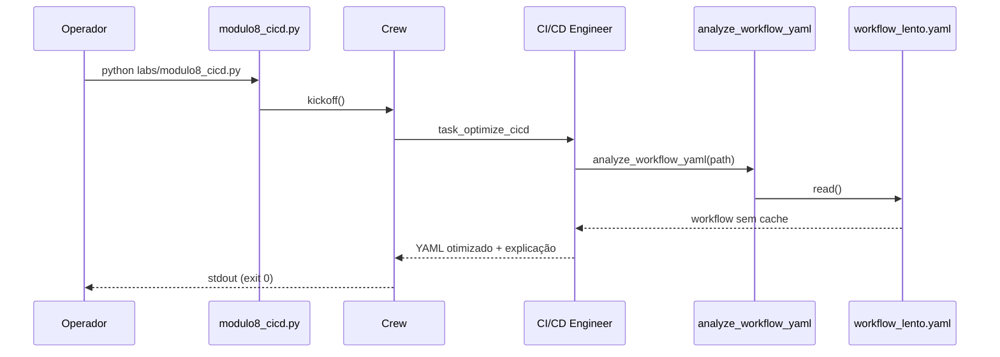

# Evidências de Execução — Lab 8 (CI/CD Copilot)

Validação executada em **2026-08-06**.

**Relatório didático:** [`RELATORIO_DIDATICO_MODULO8.md`](./RELATORIO_DIDATICO_MODULO8.md)  
**Log resumido:** [`execucao-modulo8-2026-08-06.log`](./execucao-modulo8-2026-08-06.log)

---

## Objetivo do lab

Pipeline CrewAI **single-agent** com uma task de otimização de CI/CD:

1. **Engenheiro de Platform e CI/CD** — lê `workflow_lento.yaml`
2. Identifica gargalo (falta de cache no `npm install`)
3. Propõe YAML otimizado com `actions/cache@v3`
4. Estima economia de tempo

Script: `nexus/labs/modulo8_cicd.py`

---

## Ambiente

| Item | Valor |
|------|-------|
| Python | 3.12.10 (venv) |
| CrewAI | 1.15.11 |
| LLM | Groq `llama-3.1-8b-instant` |
| Entrada | `nexus/data/workflow_lento.yaml` |
| Referência | `nexus/data/workflow_rapido.yaml` |
| Data | 2026-08-06 |
| Duração | **~21 s** |
| Exit code | **0** ✅ |

### Comando

```powershell
cd modulo-6-exemplo-1-aiops-foundation/nexus
.\venv\Scripts\Activate.ps1
python labs/modulo8_cicd.py
```

---

## Resultado da execução

| Métrica | Valor |
|---------|-------|
| **Exit code** | `0` ✅ |
| **Tasks concluídas** | **1/1** |
| **Tool calls** | **1** (`analyze_workflow_yaml`) |
| **Agente** | Engenheiro de Platform e CI/CD |
| **Artefato em disco** | Nenhum (output só no terminal) |

---

## Fluxo observado



| # | Etapa | Evidência |
|---|-------|-----------|
| 1 | Inicialização | `INICIANDO MÓDULO 8: OTIMIZAÇÃO DE CI/CD` |
| 2 | Agente iniciado | `Engenheiro de Platform e CI/CD` |
| 3 | Tool invocada | `analyze_workflow_yaml` — 1 chamada |
| 4 | YAML lido | `workflow_lento.yaml` com `npm install` sem cache |
| 5 | Resposta final | YAML com `actions/cache@v3` + estimativa 50% |
| 6 | Conclusão | Exit 0, sem rate limit |

---

## Diagnóstico do agente

### Problema identificado

| Item | Detalhe |
|------|---------|
| **Gargalo** | `npm install` sem cache |
| **Efeito** | Re-download de dependências a cada `push` |
| **Impacto** | Pipeline lento + maior custo de runner |
| **Anti-padrão** | Comentário explícito no YAML: `# ERRO: Sem cache` |

### Workflow original (`workflow_lento.yaml`)

```yaml
steps:
  - uses: actions/checkout@v4
  - name: Install Dependencies
    run: npm install  # ERRO: Sem cache, baixa tudo toda vez
  - name: Build
    run: npm run build
  - name: Run Tests
    run: npm test
```

---

## Solução proposta pelo agente

### YAML otimizado (output da execução)

```yaml
name: CI Checkout Service
on: [push]
jobs:
  build:
    runs-on: ubuntu-latest
    steps:
      - uses: actions/checkout@v4
      - name: Cache Dependencies
        uses: actions/cache@v3
        with:
          path: ~/.npm
          key: ${{ runner.os }}-npm-cache
          restore-keys: |
            ${{ runner.os }}-npm-cache
      - name: Install Dependencies
        run: npm install
      - name: Build
        run: npm run build
      - name: Run Tests
        run: npm test
```

### Melhorias aplicadas

| Melhoria | Presente no output? |
|----------|---------------------|
| `actions/cache@v3` | ✅ |
| Cache em `~/.npm` | ✅ |
| `restore-keys` | ✅ |
| Key com `hashFiles('package-lock.json')` | ❌ (usou `${{ runner.os }}-npm-cache`) |
| `actions/setup-node` com `cache: npm` | ❌ |

### Economia estimada

> **~50% do tempo de build** — agente atribuiu a maior parte da lentidão à etapa de instalação de dependências.

Slides do curso citam ~60%; o agente foi conservador (50%), mas na mesma ordem de magnitude.

---

## Comparação com golden reference

Arquivo de referência didática: `data/workflow_rapido.yaml`

| Aspecto | Output do agente | `workflow_rapido.yaml` |
|---------|------------------|------------------------|
| Action de cache | `actions/cache@v3` | `actions/cache@v3` |
| Path | `~/.npm` | `~/.npm` |
| Cache key | `${{ runner.os }}-npm-cache` | `${{ runner.os }}-node-${{ hashFiles('package-lock.json') }}` |
| restore-keys | `${{ runner.os }}-npm-cache` | `${{ runner.os }}-node-` |
| Invalidação por lockfile | **Não** | **Sim** |

**Avaliação:** o agente **acertou o diagnóstico e a solução principal** (cache npm). A key de cache poderia ser mais precisa com `hashFiles('package-lock.json')` — ponto de melhoria para revisão humana antes do merge.

---

## Evidência por critério de aceite

| Critério | Status |
|----------|--------|
| Execução sem erro | ✅ |
| Tool `analyze_workflow_yaml` invocada | ✅ (1×) |
| Falta de cache identificada | ✅ |
| `actions/cache@v3` sugerido | ✅ |
| Economia de tempo mencionada | ✅ (~50%) |
| YAML completo na resposta | ✅ |

---

## Análise de qualidade

### Pontos positivos

- Execução rápida e estável (~21 s, 1 tool call)
- Diagnóstico correto do anti-padrão
- YAML válido e aplicável
- Explicação técnica do funcionamento do cache

### Pontos de melhoria (discussão em sala)

| Aspecto | Observação |
|---------|------------|
| Cache key genérica | Sem `hashFiles`, risco de deps desatualizadas entre projetos |
| Não persiste arquivo | Diferente do M7 — sugestão só no terminal |
| Sem validação automática | Não compara com `workflow_rapido.yaml` |
| `setup-node` moderno | Alternativa mais simples não foi sugerida |

---

## Conclusão

A execução do **Lab 8** foi **bem-sucedida**. O agente:

1. Leu o workflow lento do microserviço checkout;
2. Identificou `npm install` sem cache como gargalo;
3. Propôs `actions/cache@v3` em `~/.npm`;
4. Estimou **~50% de redução** no tempo de build.

O caso está **resolvido conceitualmente** para fins didáticos. Em produção, o próximo passo seria abrir PR com o YAML otimizado, validar com `actionlint` e medir minutos de runner antes/depois no GitHub Actions.

---

## Próximo passo

Lab 9 — FinOps: [`modulo9_finops.py`](../nexus/labs/modulo9_finops.py)

```powershell
python labs/modulo9_finops.py
```

---

## Referências

| Recurso | Caminho |
|---------|---------|
| Script | [`nexus/labs/modulo8_cicd.py`](../nexus/labs/modulo8_cicd.py) |
| Workflow lento | [`nexus/data/workflow_lento.yaml`](../nexus/data/workflow_lento.yaml) |
| Workflow referência | [`nexus/data/workflow_rapido.yaml`](../nexus/data/workflow_rapido.yaml) |
| Relatório didático | [`RELATORIO_DIDATICO_MODULO8.md`](./RELATORIO_DIDATICO_MODULO8.md) |
| Lab anterior | [`EVIDENCIAS_MODULO7.md`](./EVIDENCIAS_MODULO7.md) |
