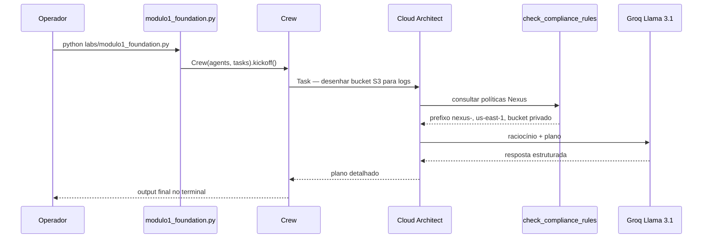

# Fluxo CrewAI — Lab 1 Foundation

Arquitetura da primeira aula do Módulo 6.

## Visão geral

## Componentes

| Artefato | Arquivo | Papel |
|----------|---------|-------|
| **Agent** | `core/agents.py` → `get_architect()` | Arquiteto de Cloud com foco em governança |
| **LLM** | `core/llm_config.py` → `nexus_llm` | Groq `llama-3.1-8b-instant`, temp 0.2 |
| **Tool** | `tools/policy_rag.py` → `check_compliance_rules` | RAG simulado de políticas corporativas |
| **Task** | `labs/modulo1_foundation.py` | "Desenhe bucket S3 para logs seguindo normas Nexus" |
| **Crew** | `labs/modulo1_foundation.py` | Orquestra agent + task |

## Policy RAG (simulado)

A tool `check_compliance_rules` retorna regras fixas:

- Prefixo obrigatório: `nexus-`
- Região: `us-east-1`
- Buckets S3: sempre privados

> Nos labs posteriores, o RAG evolui para runbooks reais (`data/runbook_db.md`) e scans Trivy.

## Diferença vs Módulo 5 (BragBot)

| Aspecto | Módulo 5 — Genkit | Módulo 6 — CrewAI |
|---------|-------------------|-------------------|
| Domínio | Produto / UX | Infraestrutura / plataforma |
| Orquestração | Flow tipado (Zod) | Crew + Tasks + Tools |
| Output | JSON schema fixo | Texto/plano consultivo |
| LLM | Gemini / OpenRouter | Groq Llama 3.1 |
| Tools | Nenhuma (prompt only) | `check_compliance_rules`, K8s, Trivy... |

## Trilha dos 12 labs

| Lab | Script | Tema |
|-----|--------|------|
| 1 | `modulo1_foundation.py` | **IA consultiva + compliance** ← esta aula |
| 2 | `modulo2_iac_copilot.py` | IaC Copilot + Terraform HCL |
| 3 | `modulo3_k8s_ops.py` | Kubernetes GitOps & Canary |
| 4 | `modulo4_troubleshooting.py` | Troubleshooting ReAct + self-healing |
| 5–12 | `modulo5_*.py` … `modulo12_*.py` | AIOps, ChatOps, DevSecOps, FinOps, RAG, Guardrails, Final |
