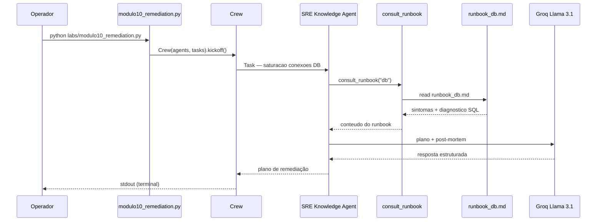

# Relatório Didático — Módulo 10: RAG de Runbooks & Auto-Remediação

**Trilha:** Nexus AI-Ops · Módulo 6, Exemplo 1  
**Script:** [`nexus/labs/modulo10_remediation.py`](../nexus/labs/modulo10_remediation.py)  
**Público:** Pós-graduação em AI-Ops e Engenharia de Plataforma  
**Objetivo:** Usar RAG sobre runbooks corporativos para remediar incidente de saturação de conexões em PostgreSQL e gerar rascunho de post-mortem.

---

## 1. Posicionamento na trilha

| Lab | Foco | Fonte de conhecimento |
|-----|------|------------------------|
| **M1** — Foundation | Compliance S3 | Policy RAG simulado (`check_compliance_rules`) |
| **M4** — Troubleshooting | Diagnóstico ReAct | Métricas + traces + K8s (simulados) |
| **M6** — ChatOps | Aprovação humana | Governança de comandos destrutivos |
| **M10** — RAG Runbooks | Remediação documentada | **`data/runbook_db.md`** (arquivo real) |
| **M11** — Guardrails | Execução segura | Dry-run + aprovação inline |
| **M12** — Projeto Final | Orquestração hierárquica | Manager + SRE + Segurança + FinOps |

O Lab 4 pergunta: *“por que o checkout está lento?”* (investigação reativa)  
O Lab 10 pergunta: *“qual é o procedimento oficial para saturar conexões no DB?”* (conhecimento institucional)

---

## 2. Cenário de negócio

O time de plantão recebe alerta **`PostgresqlTooManyConnections`** no serviço de banco de dados. A aplicação reporta:

```
FATAL: remaining connection slots are reserved for non-replication superuser connections
```

Latência de escrita ultrapassa **500 ms**. O SRE precisa:

1. Consultar o **runbook oficial** do serviço `db`;
2. Identificar o comando SQL para limpar conexões ociosas;
3. Aplicar a remediação (conceitualmente — no lab, só documentar);
4. Produzir **rascunho de post-mortem** para aprendizado organizacional.

> **Problema que o RAG resolve (slides):** documentação no Wiki que ninguém lê às 3h da manhã. O agente **recupera** o runbook no momento do incidente.

---

## 3. Arquitetura do pipeline



Pipeline **single-agent, single-task** — padrão dos labs 8–10.

---

## 4. Componentes

### 4.1 Agente

| Agente | Factory | Papel no lab |
|--------|---------|--------------|
| **Engenheiro SRE de Resposta a Incidentes** | `get_sre_knowledge_agent()` | Consultar runbooks e propor remediação baseada em evidências |

```python
role='Engenheiro SRE de Resposta a Incidentes',
goal='Consultar a base de conhecimento (Runbooks) e propor remediações precisas para incidentes.',
backstory='Veterano de plantões — toda solução deve vir de documentação oficial e virar aprendizado.'
```

**Diferença vs `get_oncall_sre()` (M4):**

| Aspecto | M4 On-Call SRE | M10 SRE Knowledge |
|---------|----------------|-------------------|
| Abordagem | ReAct — investigar métricas/logs | RAG — consultar runbook |
| Tools | Prometheus, Jaeger, K8s diag | `consult_runbook` |
| Output | Causa raiz + hotfix YAML | Plano SQL + post-mortem |
| Mindset | Detetive em tempo real | Executor de playbook documentado |

### 4.2 Tool — `consult_runbook`

Definida **inline** no script:

```python
@tool("consult_runbook")
def consult_runbook(service_name: str) -> str:
    """Reads the official runbook file for a specific service and returns the remediation steps."""
    runbook_path = os.path.join(PROJECT_ROOT, "data", f"runbook_{service_name}.md")
    ...
```

| Aspecto | Comportamento |
|---------|---------------|
| Entrada | `service_name` — ex.: `"db"` → `data/runbook_db.md` |
| Saída | Conteúdo Markdown do runbook ou erro se não existir |
| RAG real? | **Retrieval simulado** — leitura direta por convenção de nome (sem embeddings) |
| Produção | Vector DB (Pinecone, pgvector) + chunking + similarity search |

> **Evolução didática:** Lab 1 usa RAG **fixo** (`policy_rag.py`); Lab 10 lê **arquivo real** — passo intermediário antes de RAG vetorial completo.

### 4.3 Task — `task_remediate_incident`

| Passo | Instrução |
|-------|-----------|
| 1 | Alerta: saturação de conexões no `db` |
| 2 | Consultar runbook oficial (`consult_runbook("db")`) |
| 3 | Identificar comando SQL para limpar conexões ociosas |
| 4 | Escrever rascunho de post-mortem |

**Expected output:** plano de remediação + post-mortem.

### 4.4 Crew

```python
crew = Crew(agents=[agent], tasks=[task_remediate_incident])
crew.kickoff()
```

---

## 5. Artefato de dados — `data/runbook_db.md`

Conteúdo atual do runbook:

```markdown
# Runbook: Saturação de Conexões no PostgreSQL

## 🚨 Sintoma
- Alerta: PostgresqlTooManyConnections
- Erro: FATAL: remaining connection slots are reserved...
- Latência de escrita > 500ms.

## 🔍 Diagnóstico (Troubleshooting)
SELECT count(*), state FROM pg_stat_activity GROUP BY state;
```

### Lacuna didática importante

O runbook **não contém** (ainda) a seção de **Remediação** com o SQL de limpeza de conexões ociosas — apenas sintomas e query de diagnóstico.

| Implicação | Detalhe |
|------------|---------|
| Agente pode **alucinar** o comando `pg_terminate_backend` | Comum em labs incompletos |
| Exercício em sala | Completar o runbook antes de executar |
| SQL esperado (referência) | Ver seção 5.1 abaixo |

### 5.1 Golden reference — seção de remediação sugerida

Para completar o runbook didaticamente:

```markdown
## 🛠️ Remediação

### Limpar conexões ociosas (> 5 min)
```sql
SELECT pg_terminate_backend(pid)
FROM pg_stat_activity
WHERE state = 'idle'
  AND state_change < now() - interval '5 minutes'
  AND pid <> pg_backend_pid();
```

### Prevenção
- Revisar pool de conexões da aplicação (HikariCP, PgBouncer)
- Ajustar `max_connections` apenas após análise de capacidade
```

---

## 6. Conceitos-chave ensinados

### 6.1 RAG (Retrieval-Augmented Generation)

```
Alerta → Retrieve (runbook) → Augment (contexto no prompt) → Generate (plano + post-mortem)
```

| Sem RAG | Com RAG |
|---------|---------|
| LLM inventa procedimento | LLM ancora resposta no documento oficial |
| Risco operacional alto | Consistência com playbook da empresa |

### 6.2 Post-mortem automático (Aula 10.2)

O agente deve produzir rascunho com:

- **Timeline** do incidente
- **Causa raiz** (saturação de conexões)
- **Ação tomada** (SQL executado)
- **Aprendizado** / ações preventivas

Reduz tempo de preenchimento de formulário pós-incidente.

### 6.3 Circuito de remediação completo (Aula 10.3)

```text
1. Alerta dispara          →  M5 (AIOps preditivo) / M4 (métricas)
2. IA diagnostica          →  M4 ReAct
3. IA consulta runbook     →  M10 RAG  ← este lab
4. IA propõe fix no Slack  →  M6 ChatOps
5. Humano aprova           →  M6 GESTOR-APROVA / M11 guardrails
6. IA executa              →  M11 dry-run + apply
```

O Lab 10 cobre o **passo 3** — ponte entre diagnóstico e execução governada.

---

## 7. Comparação com outros labs

| Aspecto | M1 Policy RAG | M4 Troubleshooting | M10 Runbook RAG |
|---------|-----------------|--------------------|-----------------|
| Tool | `check_compliance_rules` | 4 tools observabilidade | `consult_runbook` |
| Dados | String fixa | Simulados | Arquivo `.md` real |
| Retrieval | Não (fake RAG) | N/A | Por convenção de path |
| Domínio | Governança IaC | Incidente checkout | Saturação PostgreSQL |
| Output | Plano S3 | Hotfix YAML | SQL + post-mortem |

---

## 8. Execução

### Pré-requisitos

```powershell
cd modulo-6-exemplo-1-aiops-foundation/nexus
.\venv\Scripts\Activate.ps1
# GROQ_API_KEY em .env
```

### Comando

```powershell
$env:CREWAI_TRACING_ENABLED = "false"
python labs/modulo10_remediation.py
```

### Saída esperada (conceitual)

1. Tool `consult_runbook("db")` lê `runbook_db.md`;
2. Agente cita sintoma `PostgresqlTooManyConnections`;
3. Propõe query de diagnóstico (`pg_stat_activity`);
4. Sugere SQL de limpeza (pode alucinar se runbook incompleto);
5. Entrega rascunho de post-mortem.

---

## 9. Riscos operacionais e mitigações

### 9.1 Runbook incompleto

**Risco:** agente inventa `pg_terminate_backend` sem estar no documento.

| Mitigação didática | Mitigação produção |
|--------------------|-------------------|
| Completar `runbook_db.md` antes do lab | Runbooks versionados + review obrigatório |
| Comparar output com golden SQL | CI valida que runbook tem seção Remediação |

### 9.2 RAG por path ≠ RAG vetorial

Lab usa `runbook_{service}.md` — não há embeddings nem ranking de chunks.

**Evolução:** Lab 10+ com pgvector / LangChain retriever.

### 9.3 Execução SQL em produção

Lab **não executa** SQL — apenas documenta. Em produção: aprovação humana (M6/M11) antes de `pg_terminate_backend`.

### 9.4 Rate limit Groq

Lab leve (1 tool, markdown pequeno) — risco baixo.

---

## 10. Exercícios sugeridos

### Exercício 1 — Completar o runbook

Adicione seção **Remediação** em `runbook_db.md` e reexecute. O agente passa a citar SQL do documento?

### Exercício 2 — Runbook inexistente

Chame `consult_runbook("redis")` — qual erro retorna? Como o agente reage?

### Exercício 3 — Ponte M4 → M10

**Pergunta:** quando usar ReAct (M4) vs. runbook RAG (M10)?

### Exercício 4 — Circuito completo

Desenhe o fluxo: alerta Grafana → M10 runbook → M6 Slack → M11 guardrails → execução.

---

## 11. Critérios de aceite sugeridos

- [ ] `python labs/modulo10_remediation.py` executa sem erro Groq
- [ ] Tool `consult_runbook("db")` invocada com sucesso
- [ ] Output menciona `PostgresqlTooManyConnections`
- [ ] Output inclui query de diagnóstico (`pg_stat_activity`)
- [ ] Output propõe plano de remediação + post-mortem
- [ ] Aluno diferencia RAG fixo (M1) vs. runbook real (M10)
- [ ] Aluno identifica lacuna do runbook incompleto

---

## 12. Próximo passo — Lab 11

[`modulo11_guardrails.py`](../nexus/labs/modulo11_guardrails.py) — remediação Kubernetes com dry-run e aprovação humana inline.

```powershell
python labs/modulo11_guardrails.py
```

---

## 13. Referências

| Recurso | Caminho |
|---------|---------|
| Script do lab | [`nexus/labs/modulo10_remediation.py`](../nexus/labs/modulo10_remediation.py) |
| Agente | [`nexus/core/agents.py`](../nexus/core/agents.py) → `get_sre_knowledge_agent()` |
| Runbook | [`nexus/data/runbook_db.md`](../nexus/data/runbook_db.md) |
| Policy RAG (M1) | [`nexus/tools/policy_rag.py`](../nexus/tools/policy_rag.py) |
| Slides UNIPDS | [`nexus/slides/slides10.md`](../nexus/slides/slides10.md) |
| Lab anterior | [`RELATORIO_DIDATICO_MODULO9.md`](./RELATORIO_DIDATICO_MODULO9.md) |
| Troubleshooting (M4) | [`RELATORIO_DIDATICO_MODULO4.md`](./RELATORIO_DIDATICO_MODULO4.md) |
