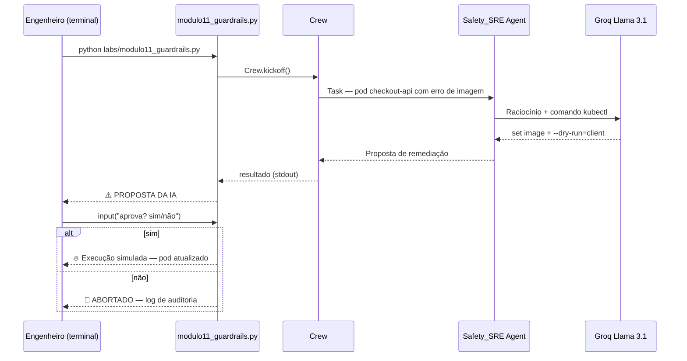

# Relatório Didático — Módulo 11: Guardrails & Human-in-the-Loop (Kubernetes)

**Trilha:** Nexus AI-Ops · Módulo 6, Exemplo 1  
**Script:** [`nexus/labs/modulo11_guardrails.py`](../nexus/labs/modulo11_guardrails.py)  
**Público:** Pós-graduação em AI-Ops e Engenharia de Plataforma  
**Objetivo:** Demonstrar remediação Kubernetes **segura** — a IA propõe correção com `--dry-run`, o engenheiro valida e só então autoriza a execução em produção.

---

## 1. Posicionamento na trilha

| Lab | Foco | Mecanismo de segurança |
|-----|------|------------------------|
| **M4** — Troubleshooting | Diagnóstico + hotfix YAML | Humano aplica `kubectl apply` |
| **M6** — ChatOps | Governança Terraform | Tool bloqueia sem `GESTOR-APROVA` |
| **M10** — RAG Runbooks | Plano documentado | Runbook exige aprovação do plantão |
| **M11** — Guardrails | Remediação K8s | **Dry-run + `input()` no terminal** |
| **M12** — Projeto Final | Orquestração multiagente | Manager consolida SRE + Segurança + FinOps |

O Lab 10 responde: *“qual é o procedimento oficial?”* (RAG)  
O Lab 11 responde: *“posso executar isso em produção com segurança?”* (guardrails)

---

## 2. Cenário de negócio

O deployment **`checkout-api`** está em falha por **erro de imagem** — mesmo cenário raiz do Módulo 4 (`checkout-broken.yaml`):

```yaml
image: nginx:versao-que-nao-existe-999   # → ImagePullBackOff / ErrImagePull
```

O plantão precisa:

1. **Diagnosticar** que a causa é tag de imagem inválida;
2. **Propor** `kubectl set image` apontando para a versão estável **`v2.0`**;
3. Apresentar o comando com **`--dry-run=client`** para validação de sintaxe e impacto previsto;
4. **Aguardar aprovação humana** antes de qualquer escrita no cluster;
5. Executar (ou abortar) e registrar decisão.

> **Problema que os guardrails resolvem (slides):** IA autônoma pode “alucinar” comandos destrutivos ou aplicar correções precipitadas. **Inteligência não substitui o juízo crítico do engenheiro.**

---

## 3. Arquitetura do pipeline



Pipeline **single-agent, single-task** — sem tools CrewAI. A governança está no **script Python** (`input()`), não em uma tool dedicada.

---

## 4. Componentes

### 4.1 Agente — `Safety_SRE` (inline)

Definido diretamente no script (não usa `core/agents.py`):

```python
safety_sre = Agent(
    role='Safety_SRE',
    goal='Diagnosticar falhas e propor correções seguras no Kubernetes.',
    backstory='Você é um engenheiro sênior cauteloso. Você SEMPRE usa dry-run.',
    llm=nexus_llm,
    verbose=True
)
```

| Campo | Intenção pedagógica |
|-------|---------------------|
| `role` | Papel explícito de **segurança operacional** |
| `backstory` | Reforço no prompt: **sempre dry-run** |
| Sem `tools` | LLM gera o comando textualmente (lab simplificado) |
| Sem `crew_config` | Não herda `max_iter` / `kickoff_with_retry` dos labs 7–10 |

**Diferença vs agentes factory:**

| Aspecto | `get_oncall_sre()` (M4) | `Safety_SRE` (M11) |
|---------|-------------------------|---------------------|
| Foco | Investigar métricas/logs | Propor fix **seguro** |
| Tools | 4 tools de observabilidade | Nenhuma |
| Output | Relatório + hotfix YAML | Comando `kubectl` + dry-run |
| Governança | Humano aplica YAML | Humano aprova no terminal |

### 4.2 Task — `task_remediation`

| Passo | Instrução |
|-------|-----------|
| 1 | Contexto: pod `checkout-api` com erro de imagem |
| 2 | Propor `kubectl set image` para versão estável `v2.0` |
| 3 | Incluir flag `--dry-run=client` para validação |

**Expected output:** comando exato + resultado conceitual do dry-run.

### 4.3 Human-in-the-Loop — bloco `__main__`

```python
resultado = nexus_crew.kickoff()
print(f"\n⚠️ PROPOSTA DA IA:\n{resultado}")
aprovacao = input("\n✅ Você aprova a execução deste comando em PRODUÇÃO? (sim/não): ")

if aprovacao.strip().lower() == 'sim':
    print("\n🔥 Executando comando... (Simulado)")
    print("Status: Pod 'checkout-api' atualizado com sucesso!")
else:
    print("\n🛑 Operação ABORTADA pelo engenheiro. Registrando no log de auditoria.")
```

| Etapa | Comportamento |
|-------|---------------|
| **Proposta** | CrewAI imprime sugestão da IA |
| **Gate humano** | `input()` bloqueia até decisão |
| **Aprovação** | `sim` → execução **simulada** (sem `kubectl` real) |
| **Rejeição** | Mensagem de abort + menção a log de auditoria |

> Em produção, o gate seria Slack (M6), PagerDuty, ou workflow de change management — o lab usa terminal para simplicidade.

### 4.4 Crew

```python
nexus_crew = Crew(agents=[safety_sre], tasks=[task_remediation], verbose=True)
resultado = nexus_crew.kickoff()
```

Sem `nexus_crew_kwargs()` — diferente dos labs 7–10 otimizados para TPM.

---

## 5. Golden reference — comando esperado

Com base na task e no cenário `checkout-api`:

```bash
kubectl set image deployment/checkout-api \
  checkout-api=checkout-api:v2.0 \
  --dry-run=client -o yaml
```

| Flag | Função |
|------|--------|
| `set image` | Atualiza imagem do container no Deployment |
| `--dry-run=client` | Valida no cliente **sem enviar** ao API server |
| `-o yaml` | Mostra manifesto resultante para revisão |

**Validação em cluster real (opcional, fora do lab):**

```bash
# Após aprovação humana
kubectl set image deployment/checkout-api checkout-api=checkout-api:v2.0
kubectl rollout status deployment/checkout-api
```

**Relação com M4:** o hotfix [`checkout-k8s-fix.yaml`](../nexus/checkout-k8s-fix.yaml) corrige imagem + probes via manifesto GitOps; o M11 corrige via **imperativo** (`kubectl set image`) — dois estilos operacionais válidos.

---

## 6. Conceitos-chave ensinados

### 6.1 Risco da IA autônoma (slides 11.1)

| Risco | Exemplo |
|-------|---------|
| Comando destrutivo alucinado | `kubectl delete deployment --all` |
| Viés de confirmação | IA “resolve” trocando imagem errada |
| Escopo excessivo | `set image` no namespace inteiro |

**Mitigação:** camadas de defesa — prompt + dry-run + aprovação humana.

### 6.2 Human-in-the-Loop (HITL)

```
IA diagnostica → IA propõe → HUMANO valida → IA/humano executa
```

| Sem HITL | Com HITL (M11) |
|----------|----------------|
| Automação cega em produção | Engenheiro no circuito de decisão |
| MTTR baixo, risco alto | MTTR moderado, risco controlado |

**Regra de ouro (slides):** nenhuma ação de escrita (`kubectl apply`, `terraform apply`) sem aprovação explícita.

### 6.3 Dry-run como guardrail técnico

| Modo | O que faz |
|------|-----------|
| `--dry-run=client` | Validação local; não persiste no cluster |
| `--dry-run=server` | API server valida admission controllers |
| Sem dry-run | Mudança imediata (perigoso em produção) |

O backstory do agente reforça dry-run; a task exige explicitamente `--dry-run=client`.

### 6.4 Log de auditoria (conceitual)

O script menciona “registrando no log de auditoria” ao abortar — **não implementa** persistência. Em produção:

- Quem propôs (agente + modelo + prompt version)
- Comando sugerido + output do dry-run
- Quem aprovou/rejeitou + timestamp
- Resultado da execução

Integração natural com M6 (ChatOps) e ferramentas como CloudTrail, Kubernetes audit logs, ou SIEM.

### 6.5 Circuito completo da trilha (M4 → M11)

```text
1. Deploy quebrado           →  checkout-broken.yaml (M4)
2. Diagnóstico ReAct         →  M4 (métricas, traces, logs)
3. Hotfix declarativo        →  checkout-k8s-fix.yaml (M4)
4. Plano documentado         →  M10 runbook (outros incidentes)
5. Proposta imperativa K8s   →  M11 kubectl set image + dry-run
6. Aprovação humana          →  M6 GESTOR-APROVA / M11 input()
7. Orquestração multi-domínio → M12 Manager
```

---

## 7. Comparação M6 (ChatOps) vs M11 (Guardrails)

| Aspecto | M6 ChatOps | M11 Guardrails |
|---------|------------|----------------|
| Interface | Streamlit (Slack simulado) | Terminal interativo |
| Domínio | Terraform / infra genérica | Kubernetes (`checkout-api`) |
| Governança | **Na tool** (`execute_terraform`) | **No script** (`input()`) |
| Credencial | `GESTOR-APROVA` na mensagem | `sim` / `não` no prompt |
| Dry-run | Não explícito | **Obrigatório na task** |
| Execução | Simulada na tool | Simulada no `if sim` |
| Padrão produção | Tool-first (recomendado) | Gate pós-LLM (lab didático) |

> **Lição de arquitetura:** M6 coloca guardrails **dentro da tool** (determinístico, testável). M11 coloca o gate **depois** do LLM — útil para ensinar HITL, mas em produção prefira validação na tool + política OPA/Kyverno.

---

## 8. Lacunas do lab atual (transparência didática)

| Lacuna | Impacto | Evolução sugerida |
|--------|---------|-------------------|
| Sem tools CrewAI | LLM pode inventar sintaxe `kubectl` | Tool `propose_kubectl_fix()` com template |
| Dry-run não executado de fato | Só texto na resposta do agente | Tool que roda `kubectl ... --dry-run=client` |
| Flag `--dry-run` nos slides | `slides11.md` cita `python ... --dry-run` | Script não implementa `argparse` |
| Sem `crew_config` | Risco TPM / sem retry Groq | Adicionar `kickoff_with_retry` |
| Log de auditoria | Apenas mensagem print | Escrever JSON em `data/audit_log.json` |
| Execução simulada | Não valida cluster k3d | Integrar com `checkout-broken.yaml` + k3d |

Essas lacunas são **intencionais** no estágio atual — o lab foca no **conceito** HITL + dry-run, não em automação completa.

---

## 9. Execução

### Pré-requisitos

```powershell
cd modulo-6-exemplo-1-aiops-foundation/nexus
.\venv\Scripts\Activate.ps1
# GROQ_API_KEY em .env
```

### Comando

```powershell
$env:CREWAI_TRACING_ENABLED = "false"
python labs/modulo11_guardrails.py
```

### Fluxo interativo esperado

1. CrewAI inicia análise de remediação;
2. Agente propõe comando `kubectl set image` com `--dry-run=client`;
3. Terminal exibe **PROPOSTA DA IA**;
4. Operador digita `sim` ou `não`;
5. Script imprime execução simulada ou aborto.

### Cenário opcional com cluster (M4)

```powershell
kubectl apply -f checkout-broken.yaml
kubectl get pods -l app=checkout-api   # ImagePullBackOff
python labs/modulo11_guardrails.py
# Após aprovar manualmente em produção real:
# kubectl set image deployment/checkout-api checkout-api=nginx:latest
```

---

## 10. Riscos operacionais e mitigações

### 10.1 LLM sem tool kubectl

**Risco:** comando malformado ou imagem/tag incorreta.

| Mitigação lab | Mitigação produção |
|---------------|-------------------|
| Revisar output antes de `sim` | Tool que valida contra allowlist de imagens |
| Golden reference na seção 5 | Policy OPA / Kyverno no cluster |

### 10.2 Aprovação por `input()` apenas

**Risco:** gate frágil — script pode ser modificado para pular aprovação.

| Mitigação | Detalhe |
|-----------|---------|
| RBAC Kubernetes | ServiceAccount do bot sem permissão de write |
| Break-glass | Apenas role `cluster-admin` humana executa |
| M6 integrado | Aprovação via Slack com identidade SSO |

### 10.3 Dry-run apenas no prompt

**Risco:** agente esquece `--dry-run` apesar do backstory.

| Mitigação | Detalhe |
|-----------|---------|
| Validação regex no script | Rejeitar proposta sem `--dry-run` |
| Tool determinística | Sempre anexa flag na geração do comando |

### 10.4 Execução simulada enganosa

**Risco:** aluno assume que cluster foi corrigido.

| Mitigação | Detalhe |
|-----------|---------|
| Mensagem explícita `(Simulado)` | Já presente no script |
| Lab E2E com k3d | Verificar pod Running após apply real |

---

## 11. Exercícios sugeridos

### Exercício 1 — Caminho feliz

Execute o lab, digite `sim`. O agente citou `checkout-api`, `v2.0` e `--dry-run=client`?

### Exercício 2 — Abortar operação

Execute novamente e digite `não`. O que seria registrado em um log de auditoria real?

### Exercício 3 — Comparar M6 e M11

**Pergunta:** por que `GESTOR-APROVA` na tool (M6) é mais seguro que `input()` após o LLM (M11)?

### Exercício 4 — Implementar tool `kubectl_dry_run`

Crie `tools/guardrails_tools.py` que recebe deployment, container e imagem e retorna o comando com `--dry-run=client` fixo.

### Exercício 5 — Ponte M10 → M11

O runbook do M10 exige “aprovação do plantão”. Desenhe como M11 seria o passo de execução após o plano RAG.

### Exercício 6 — argparse `--dry-run`

Implemente a flag citada em `slides11.md` para pular o `input()` e apenas imprimir a proposta (modo revisão).

---

## 12. Critérios de aceite sugeridos

- [ ] `python labs/modulo11_guardrails.py` executa sem erro Groq
- [ ] Agente propõe remediação para `checkout-api`
- [ ] Output menciona `kubectl set image` e versão `v2.0`
- [ ] Output inclui `--dry-run=client` (ou equivalente)
- [ ] Gate `input()` funciona para `sim` e `não`
- [ ] Aluno diferencia governança na tool (M6) vs gate pós-LLM (M11)
- [ ] Aluno explica por que dry-run não substitui aprovação humana

---

## 13. Próximo passo — Lab 12

[`modulo12_projeto_final.py`](../nexus/labs/modulo12_projeto_final.py) — incidente multidomínio: checkout 500 + pico de custo + backdoor. O **Nexus Manager** orquestra SRE, Segurança e FinOps em crew hierárquico.

```powershell
python labs/modulo12_projeto_final.py
```

---

## 14. Referências

| Recurso | Caminho |
|---------|---------|
| Script do lab | [`nexus/labs/modulo11_guardrails.py`](../nexus/labs/modulo11_guardrails.py) |
| LLM config | [`nexus/core/llm_config.py`](../nexus/core/llm_config.py) |
| Deploy quebrado (M4) | [`nexus/checkout-broken.yaml`](../nexus/checkout-broken.yaml) |
| Hotfix declarativo (M4) | [`nexus/checkout-k8s-fix.yaml`](../nexus/checkout-k8s-fix.yaml) |
| ChatOps / HITL (M6) | [`docs/RELATORIO_DIDATICO_MODULO6.md`](./RELATORIO_DIDATICO_MODULO6.md) |
| RAG Runbooks (M10) | [`docs/RELATORIO_DIDATICO_MODULO10.md`](./RELATORIO_DIDATICO_MODULO10.md) |
| Slides UNIPDS | [`nexus/slides/slides11.md`](../nexus/slides/slides11.md) |
| Menu interativo | [`nexus/nexus_iac_copilot.py`](../nexus/nexus_iac_copilot.py) |
