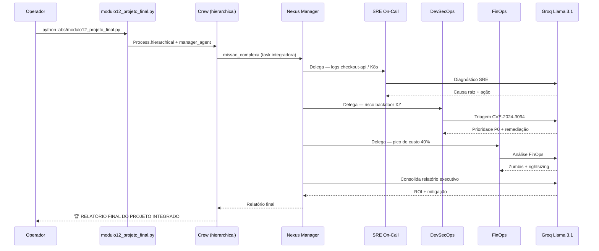
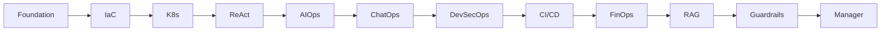

# Relatório Didático — Módulo 12: Projeto Final (Orquestração Hierárquica)

**Trilha:** Nexus AI-Ops · Módulo 6, Exemplo 1  
**Script:** [`nexus/labs/modulo12_projeto_final.py`](../nexus/labs/modulo12_projeto_final.py)  
**Público:** Pós-graduação em AI-Ops e Engenharia de Plataforma  
**Objetivo:** Integrar os domínios **SRE**, **Segurança** e **FinOps** em um incidente multidomínio (Game Day), com o **Nexus Manager** delegando tarefas e consolidando um relatório executivo com ROI.

---

## 1. Posicionamento na trilha

| Lab | Paradigma | Papel do humano |
|-----|-----------|-----------------|
| **M4** — Troubleshooting | ReAct single-agent | Aplica hotfix YAML |
| **M7** — DevSecOps | Pipeline 2 etapas | Valida remediação CVE |
| **M9** — FinOps | Single-agent + tool | Revisa economia $325/mês |
| **M10** — RAG Runbooks | Conhecimento documentado | Aprova plano SQL |
| **M11** — Guardrails | Dry-run + HITL | Autoriza `kubectl` |
| **M12** — **Projeto Final** | **Orquestração hierárquica** | Revisa relatório consolidado |

O Lab 12 é o **fechamento da trilha Nexus**: não ensina um domínio novo — **recombina** especialistas já introduzidos nos labs anteriores sob um **manager** que coordena a resposta a um desastre simulado.

> **Metáfora (slides):** o Nexus-Bot deixa de ser um especialista isolado e vira uma **Unidade de Inteligência Operacional** — correlacionando SRE + Segurança + FinOps em um único Game Day.

---

## 2. Cenário de negócio — Game Day

Três crises simultâneas atingem a plataforma Nexus em produção:

| # | Domínio | Sintoma | Origem nos labs anteriores |
|---|---------|---------|----------------------------|
| 1 | **SRE** | `checkout-api` fora do ar — **HTTP 500** no Kubernetes | M4 — `checkout-broken.yaml`, troubleshooting ReAct |
| 2 | **Segurança** | Backdoor crítico no pacote **XZ Utils** (scan de vulnerabilidade) | M7 — `CVE-2024-3094` em `data/trivy.json` |
| 3 | **FinOps** | Custo de infraestrutura **+40%** na última hora | M9 — `data/inventario_cloud.json` (zumbis + rightsizing) |

O **Nexus Manager** deve:

1. Delegar análise de logs K8s ao **SRE On-Call**;
2. Delegar triagem do backdoor XZ ao **Analista DevSecOps**;
3. Delegar investigação do pico de custo ao **Consultor FinOps**;
4. Consolidar tudo em **relatório executivo** com ações tomadas e **ROI da operação**.

---

## 3. Arquitetura do pipeline



**Diferencial arquitetural:** `Process.hierarchical` — o manager **não executa** tecnicamente; ele **delega** aos especialistas e **sintetiza** o resultado.

---

## 4. Componentes

### 4.1 Agentes especialistas

Instanciados **sem tools** no script atual:

```python
sre = get_oncall_sre()
seguranca = get_devsecops_agent()
finops = get_finops_agent()
```

| Agente | Factory | Domínio | Tools no M12 | Tools nos labs origem |
|--------|---------|---------|--------------|----------------------|
| **SRE On-Call** | `get_oncall_sre()` | K8s / MTTR | ❌ nenhuma | M4: Prometheus, Jaeger, `inspect_pod_failure` |
| **Analista DevSecOps** | `get_devsecops_agent()` | CVE / backdoor | ❌ nenhuma | M7: `read_trivy_report`, `apply_cve_remediation` |
| **Consultor FinOps** | `get_finops_agent()` | Custo / ROI | ❌ nenhuma | M9: `analyze_cloud_costs` |

> **Lacuna didática:** no M12 os especialistas respondem com **conhecimento do LLM**, não invocam as tools dos labs 4/7/9. Em produção, o manager delegaria para agentes **com tools conectadas aos dados reais**.

### 4.2 Nexus Manager — o cérebro

```python
nexus_manager = get_nexus_manager_agent()
```

| Campo | Valor |
|-------|-------|
| Papel | Nexus Manager (Orquestrador de Operações) |
| Goal | Coordenar SRE, Segurança e FinOps em crises |
| Backstory | Cérebro do sistema — delega estrategicamente e consolida relatórios |
| `allow_delegation` | `True` (obrigatório para hierárquico) |

O manager é **dono da task principal** e também `manager_agent` da crew.

### 4.3 Task integradora — `missao_complexa`

| Bloco | Conteúdo |
|-------|----------|
| **Incidentes** | Checkout 500 + backdoor XZ + custo +40% |
| **Coordenação** | Instruções explícitas de delegação aos 3 especialistas |
| **Entrega** | Relatório executivo + ações + ROI |
| **Agent** | `nexus_manager` |

```python
missao_complexa = Task(
    description="""ANALISAR E REMEDIAR INCIDENTE MULTIDOMÍNIO: ...""",
    expected_output="Relatório Executivo de Resposta a Incidentes e Otimização de Custos.",
    agent=nexus_manager,
)
```

### 4.4 Crew hierárquica

```python
nexus_crew = Crew(
    agents=[sre, seguranca, finops],
    tasks=[missao_complexa],
    process=Process.hierarchical,
    manager_agent=nexus_manager,
    verbose=True,
    memory=False,
)
```

| Parâmetro | Significado |
|-----------|-------------|
| `agents` | Especialistas **delegáveis** (não inclui o manager) |
| `process=Process.hierarchical` | Manager decide quem trabalha e em que ordem |
| `manager_agent` | Define **quem manda** |
| `memory=False` | Memória desativada (evita erros de biblioteca — comentário no código) |

**Comparação de processos CrewAI:**

| Processo | Quem coordena | Uso no Nexus |
|----------|---------------|--------------|
| `sequential` | Ordem fixa das tasks | Labs 1–11 (single/multi task linear) |
| `hierarchical` | Manager delega dinamicamente | **M12 — Projeto Final** |

---

## 5. Correlação com artefatos dos labs anteriores

### 5.1 Eixo SRE — checkout-api (M4)

**Manifesto quebrado:**

```yaml
# checkout-broken.yaml
image: nginx:versao-que-nao-existe-999   # ImagePullBackOff → 500
```

**Resposta esperada do SRE:** diagnóstico de imagem inválida, hotfix (`checkout-k8s-fix.yaml`) ou `kubectl set image` (M11).

### 5.2 Eixo Segurança — backdoor XZ (M7)

**CVE crítica no inventário Trivy:**

```json
{
  "VulnerabilityID": "CVE-2024-3094",
  "PkgName": "liblzma5",
  "Severity": "CRITICAL",
  "Title": "Backdoor in lzma upstream as of 5.6.0"
}
```

**Resposta esperada do DevSecOps:** P0, remediação de imagem base, referência ao playbook do M7.

### 5.3 Eixo FinOps — pico de custo (M9)

**Inventário com desperdício documentado:**

| Recurso | Problema | Economia/mês |
|---------|----------|--------------|
| `vol-0a1b2c3d` | EBS órfão | $50 |
| `eipalloc-001122` | EIP solto | $5 |
| `i-99887766` | m5.4xlarge → m5.large | $270 |
| **Total** | | **$325/mês** |

O pico de **+40%** pode ser correlacionado a recursos zumbis provisionados durante o incidente ou instância superdimensionada ainda ativa.

### 5.4 ROI consolidado (conceitual)

O relatório final deve articular **retorno sobre a automação IA**:

| Métrica | Como o Game Day demonstra |
|---------|---------------------------|
| **MTTR** | SRE identifica causa em minutos (vs. horas manual) |
| **Risco de segurança** | CVE P0 triada e remediada antes de exploração |
| **Economia cloud** | FinOps quantifica $325/mês recuperáveis |
| **ROI** | Custo da operação IA &lt; custo do downtime + waste + breach |

---

## 6. Conceitos-chave ensinados

### 6.1 Orquestração hierárquica

```
Manager (estratégia) → Especialistas (tática) → Manager (síntese)
```

- O manager **não substitui** os especialistas — **orquestra** them;
- Delegação dinâmica vs. pipeline fixo (M7 com 2 crews sequenciais);
- Padrão de **equipe de plantão virtual**: um coordenador + N experts.

### 6.2 Correlação multidomínio

Incidentes reais raramente são isolados:

```text
Deploy quebrado (SRE)  →  pode expor imagem vulnerável (Segurança)
                         →  pode escalar réplicas caras (FinOps)
```

O Game Day força o aluno a pensar em **causa comum** e **priorização** (P0 segurança vs. P0 disponibilidade).

### 6.3 Relatório executivo vs. relatório técnico

| Público | Conteúdo | Agente |
|---------|----------|--------|
| Engenheiro | Logs, YAML, SQL, CVE IDs | Especialistas (M4–M11) |
| Gestor / CTO | Impacto, ROI, decisões | **Nexus Manager (M12)** |

### 6.4 Fechamento da trilha Nexus



---

## 7. Comparação com outros labs

| Aspecto | M4 Troubleshooting | M7 DevSecOps | M12 Projeto Final |
|---------|-------------------|--------------|-------------------|
| Agentes | 2 (sequencial) | 2 (sequencial) | **4** (1 manager + 3 specialists) |
| Processo | `sequential` | `sequential` | **`hierarchical`** |
| Domínios | SRE only | Segurança only | **SRE + Seg + FinOps** |
| Tools | 5 tools | 2 tools | **0 tools** (gap) |
| Output | Hotfix YAML | Dockerfile remediado | Relatório executivo ROI |
| Coordenação | Script Python | Script Python | **Manager LLM** |

---

## 8. Lacunas do lab atual (transparência didática)

| Lacuna | Impacto | Evolução sugerida |
|--------|---------|-------------------|
| Especialistas sem tools | Respostas baseadas só no LLM | Conectar tools de M4/M7/M9 |
| Sem `kickoff_with_retry` | Risco TPM Groq em crew grande | Usar `core/crew_config.py` |
| Sem validação programática | Relatório não auditável | Checar menções a CVE-2024-3094, $325, checkout-api |
| `memory=False` | Sem contexto entre delegações | Habilitar com embedding provider configurado |
| Sem HITL | Execução totalmente autônoma | Gate M11 antes de ações destrutivas |
| Dockerfile aponta para M12 | [`nexus/Dockerfile`](../nexus/Dockerfile) usa M12 como CMD | Container = showcase do projeto final |

---

## 9. Execução

### Pré-requisitos

```powershell
cd modulo-6-exemplo-1-aiops-foundation/nexus
.\venv\Scripts\Activate.ps1
# GROQ_API_KEY em .env
```

### Comando

```powershell
$env:CREWAI_TRACING_ENABLED = "false"
python labs/modulo12_projeto_final.py
```

### Saída esperada (conceitual)

1. `🚀 [NEXUS-BOT] INICIANDO OPERAÇÃO HIERÁRQUICA...`
2. Manager delega aos especialistas (logs CrewAI verbose);
3. Cada especialista contribui com sua análise;
4. Manager consolida relatório executivo;
5. `🏆 RELATÓRIO FINAL DO PROJETO INTEGRADO` impresso no terminal.

### Duração estimada

Maior que labs single-agent — múltiplas delegações LLM. Esperar **30–120 s** dependendo de quota Groq.

---

## 10. Riscos operacionais e mitigações

### 10.1 TPM / rate limit Groq

**Risco:** crew hierárquica = várias chamadas LLM (manager + 3 especialistas + síntese).

| Mitigação | Detalhe |
|-----------|---------|
| `CREWAI_TRACING_ENABLED=false` | Reduz overhead |
| `kickoff_with_retry` | Backoff em rate limit |
| `NEXUS_AGENT_MAX_ITER=3` | Limita loops por agente |

### 10.2 Alucinação sem tools

**Risco:** FinOps inventa totais; SRE inventa logs; Segurança cita CVE errada.

| Mitigação | Detalhe |
|-----------|---------|
| Conectar `analyze_cloud_costs` | Totais determinísticos ($325) |
| Conectar `read_trivy_report` | CVE-2024-3094 da fixture |
| Conectar `inspect_pod_failure` | Diagnóstico checkout-api real |

### 10.3 Manager sem juízo humano

**Risco:** relatório executivo aprovado sem revisão.

| Mitigação | Detalhe |
|-----------|---------|
| HITL pós-relatório | Gestor aprova antes de executar ações |
| M6 ChatOps | Comandos destrutivos com `GESTOR-APROVA` |
| M11 Guardrails | Dry-run K8s antes de apply |

### 10.4 Priorização conflitante

**Risco:** manager prioriza FinOps quando Segurança é P0.

| Mitigação | Detalhe |
|-----------|---------|
| Prompt com matriz de severidade | Segurança CRITICAL &gt; disponibilidade &gt; custo |
| Runbook de Game Day | Ordem de resposta documentada |

---

## 11. Exercícios sugeridos

### Exercício 1 — Mapear delegações

Execute com `verbose=True` e liste: quantas vezes o manager delegou? Para quais agentes?

### Exercício 2 — Conectar tools do M9

Adicione `analyze_cloud_costs` ao `get_finops_agent()` no M12. O relatório cita **$325/mês**?

### Exercício 3 — Matriz de prioridade

**Pergunta:** na crise simultânea, o que você resolve primeiro — checkout 500, CVE XZ ou custo +40%? Justifique.

### Exercício 4 — Relatório executivo

Reescreva o output do manager em 5 bullets para o CTO (sem jargão técnico).

### Exercício 5 — Sequential vs hierarchical

Implemente o mesmo Game Day com `Process.sequential` e 3 tasks fixas. Compare flexibilidade e custo TPM.

### Exercício 6 — Docker showcase

O [`Dockerfile`](../nexus/Dockerfile) usa M12 como `CMD`. Por que o projeto final é o ponto de entrada do container?

---

## 12. Critérios de aceite sugeridos

- [ ] `python labs/modulo12_projeto_final.py` executa sem erro Groq
- [ ] Crew usa `Process.hierarchical` com `manager_agent=nexus_manager`
- [ ] Relatório menciona `checkout-api` / erro 500
- [ ] Relatório menciona backdoor **XZ** / **CVE-2024-3094**
- [ ] Relatório aborda pico de custo / FinOps
- [ ] Output inclui síntese executiva com ROI ou economia
- [ ] Aluno diferencia `sequential` vs `hierarchical`
- [ ] Aluno identifica que tools dos labs 4/7/9 não estão conectadas no M12 atual

---

## 13. Referências

| Recurso | Caminho |
|---------|---------|
| Script do lab | [`nexus/labs/modulo12_projeto_final.py`](../nexus/labs/modulo12_projeto_final.py) |
| Agentes | [`nexus/core/agents.py`](../nexus/core/agents.py) |
| Slides UNIPDS | [`nexus/slides/slides12.md`](../nexus/slides/slides12.md) |
| Deploy quebrado (SRE) | [`nexus/checkout-broken.yaml`](../nexus/checkout-broken.yaml) |
| Scan Trivy (Segurança) | [`nexus/data/trivy.json`](../nexus/data/trivy.json) |
| Inventário cloud (FinOps) | [`nexus/data/inventario_cloud.json`](../nexus/data/inventario_cloud.json) |
| Fluxo CrewAI | [`docs/FLUXO_CREWAI.md`](./FLUXO_CREWAI.md) |
| Lab anterior | [`RELATORIO_DIDATICO_MODULO11.md`](./RELATORIO_DIDATICO_MODULO11.md) |
| Troubleshooting (M4) | [`RELATORIO_DIDATICO_MODULO4.md`](./RELATORIO_DIDATICO_MODULO4.md) |
| DevSecOps (M7) | [`RELATORIO_DIDATICO_MODULO7.md`](./RELATORIO_DIDATICO_MODULO7.md) |
| FinOps (M9) | [`RELATORIO_DIDATICO_MODULO9.md`](./RELATORIO_DIDATICO_MODULO9.md) |

---

## 14. Conclusão da trilha Nexus

O Módulo 12 encerra a jornada **Labs 1–12** demonstrando que AI-Ops maduro não é um único agente inteligente — é um **sistema de especialistas coordenados**, com governança (M6/M11), conhecimento institucional (M10) e métricas de retorno (M9).

O Nexus Manager personifica o papel do **coordenador de incidentes** na era da engenharia agêntica: delega, correlaciona e comunica — enquanto humanos mantêm a autoridade final sobre ações em produção.
