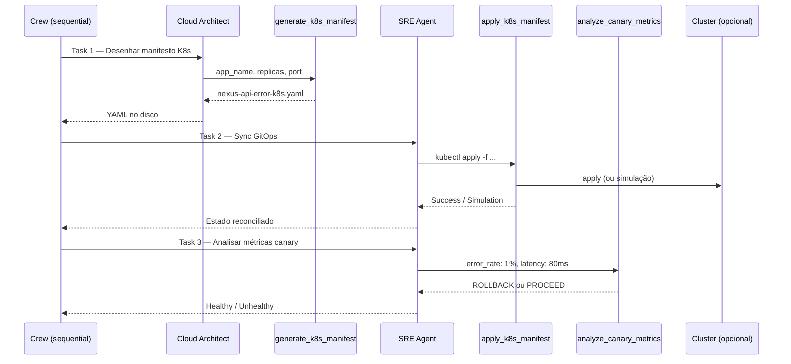

# Relatório Didático — Lab 3: Kubernetes GitOps & Canary

> Material base [UNIPDS modulo06-aiops-engenharia-agentica](https://github.com/unipds-engenharia-de-ia-aplicada/engenharia-de-software-com-ia-aplicada/tree/main/modulo06-aiops-engenharia-agentica) · Script: `nexus/labs/modulo3_k8s_ops.py`

## Posição no curso

O Lab 3 é o **terceiro degrau** da trilha Nexus AI-Ops. Depois de consultar políticas (Lab 1) e gerar/auditar IaC (Lab 2), os agentes passam a operar **workloads Kubernetes** com fluxo GitOps e decisão de rollout canary.

```
Lab 1 — Foundation        → IA consultiva (policy RAG)
Lab 2 — IaC Copilot       → geração HCL + auditoria Checkov/OPA + loop de correção
Lab 3 — K8s GitOps        → manifestos YAML + sync + análise canary  ← esta aula
Lab 4 — Troubleshooting   → ReAct + self-healing em incidentes K8s
```

**Ponte pedagógica:** no Lab 2 a IA escreve **Terraform** para infraestrutura estática. No Lab 3 ela escreve **manifestos declarativos** e um agente SRE **reconcilia** o estado desejado no cluster — espelhando Argo CD / Flux na prática.

---

## Objetivo de aprendizagem

Ao final, o aluno será capaz de:

1. Explicar um pipeline CrewAI **multiagente sequencial** (Architect → SRE)
2. Descrever o papel de **tools** que geram YAML, aplicam manifests e analisam métricas
3. Relacionar **GitOps** (estado desejado em arquivo) com `kubectl apply`
4. Interpretar uma decisão **Go/No-Go** de rollout canary baseada em métricas
5. Comparar este lab com troubleshooting reativo (Lab 4)

---

## Cenário do lab

| Item | Valor |
|------|-------|
| **App** | `nexus-api-error` |
| **Réplicas** | 2 |
| **Porta** | 80 |
| **Artefato** | `nexus-api-error-k8s.yaml` (Deployment + Service) |
| **Twist intencional** | Task pede imagem com erro e forçar falha no canary analyzer |

O nome `nexus-api-error` e a instrução de “forçar erro” preparam o aluno para ver o SRE **reprovar** o rollout na task de monitoramento — não é bug, é **cenário didático**.

---

## Arquitetura do pipeline



### Componentes

| Artefato | Arquivo | Papel |
|----------|---------|-------|
| **Script** | `labs/modulo3_k8s_ops.py` | Orquestra Crew com 3 tasks |
| **Agent Architect** | `core/agents.py` → `get_architect()` | Gera manifesto via tool |
| **Agent SRE** | `core/agents.py` → `get_sre_agent()` | Apply + análise canary |
| **LLM** | `core/llm_config.py` | Groq `llama-3.1-8b-instant` |
| **Tool gerar** | `tools/k8s_ops.py` → `generate_k8s_manifest` | Template Deployment + Service |
| **Tool sync** | `tools/k8s_ops.py` → `apply_k8s_manifest` | `kubectl apply` ou simulação |
| **Tool métricas** | `tools/k8s_ops.py` → `analyze_canary_metrics` | Go/No-Go do canary |
| **Process** | `Process.sequential` | Tasks em ordem fixa |

---

## As três tasks em detalhe

### Task 1 — Design (`get_architect`)

```python
description="Desenhe o manifesto K8s para o app 'nexus-api-error' com 2 réplicas na porta 80..."
expected_output="Arquivo YAML criado no disco com sintaxe Kubernetes V1 estrita."
agent=architect
```

O architect **não escreve YAML manualmente no prompt** — ele chama `generate_k8s_manifest` com parâmetros extraídos da task. Isso ensina o padrão **agente + tool determinística**: o LLM decide *o quê* pedir; a tool garante *sintaxe válida*.

**Output da tool:** arquivo `{app_name}-k8s.yaml` com:

- `Deployment` (`apps/v1`) — replicas, selector, container, `readinessProbe` HTTP
- `Service` (`v1`) — ClusterIP na porta 80

### Task 2 — Sync GitOps (`get_sre_agent`)

```python
description="Realize a reconciliação (Sync) do manifesto 'nexus-api-error-k8s.yaml'..."
agent=sre
```

O SRE executa `apply_k8s_manifest`, que tenta:

1. `kubectl apply -f <arquivo>` se o cluster estiver acessível
2. **Simulação** se kubectl falhar ou não existir — mensagem de que Argo CD/Flux reconciliaria

> Em sala de aula **sem cluster**, o lab ainda completa — importante para discutir a diferença entre *simulação* e *execução real*.

### Task 3 — Canary Go/No-Go (`get_sre_agent`)

```python
description="Após o deploy, analise estas métricas: 'error_rate: 1%, latency: 80ms'..."
agent=sre
```

A tool `analyze_canary_metrics` aplica regra simples:

| Condição | Decisão |
|----------|---------|
| `error_rate > 5%` **ou** substring `"error"` nas métricas | ❌ **ROLLBACK** |
| Caso contrário | ✅ **PROCEED** |

**Atenção didática:** a string `error_rate: 1%` contém `"error"` → a tool retorna **ROLLBACK**, mesmo com taxa de erro baixa (1%). Isso demonstra:

- Tools com lógica **ingênua** podem gerar falsos positivos
- Em produção, parsers estruturados (Prometheus, JSON) substituem `in metrics_data.lower()`
- O cenário “forçar erro” da task 1 alinha com essa decisão de rollback

---

## Fluxo GitOps explicado

```
┌─────────────┐     ┌──────────────┐     ┌─────────────────┐
│  Git / YAML │ ──► │ kubectl apply │ ──► │ Cluster (estado │
│  (desejado) │     │  ou Argo CD   │     │   reconciliado) │
└─────────────┘     └──────────────┘     └─────────────────┘
       ▲                                          │
       │                                          ▼
  Architect gera                          SRE valida métricas
  manifesto em disco                      pós-deploy (canary)
```

| Conceito | No lab | Em produção |
|----------|--------|-------------|
| **Estado desejado** | `nexus-api-error-k8s.yaml` | Repo Git versionado |
| **Reconciliação** | `apply_k8s_manifest` | Argo CD / Flux sync |
| **Observabilidade** | String de métricas na task | Prometheus + Grafana / Datadog |
| **Decisão canary** | `analyze_canary_metrics` | Flagger / Argo Rollouts / custom controller |

---

## Comparação com labs anteriores

| Aspecto | Lab 1 | Lab 2 | Lab 3 |
|---------|-------|-------|-------|
| **Domínio** | Compliance S3 | Terraform HCL | Kubernetes YAML |
| **Agentes** | 1 (Architect) | 1 (+ auditoria programática) | 2 (Architect + SRE) |
| **Process** | Single task | Loop externo (for) | `Process.sequential` |
| **Artefato** | Texto/plano | `main.tf` | `*-k8s.yaml` |
| **Validação** | Policy RAG | Checkov + OPA | kubectl + métricas canary |
| **Autonomia** | Consultiva | Semi-autônoma (loop) | Operacional (sync + decisão) |

---

## Pré-requisitos

| Recurso | Obrigatório? | Uso |
|---------|--------------|-----|
| Python 3.10–3.13 + venv Nexus | ✅ | CrewAI + Groq |
| `GROQ_API_KEY` | ✅ | LLM nos agentes |
| **kubectl** | Opcional | Apply real no cluster |
| **Cluster K8s** (Minikube, kind, Docker Desktop) | Opcional | Sync real; senão simulação |
| Terraform / Checkov | ❌ | Labs 2 apenas |

### Execução

```powershell
cd nexus
.\venv\Scripts\Activate.ps1
$env:PYTHONIOENCODING = "utf-8"
python labs/modulo3_k8s_ops.py
```

### Validação manual (com cluster)

```powershell
kubectl apply -f nexus-api-error-k8s.yaml
kubectl get deployments
kubectl get pods
kubectl describe deployment nexus-api-error
```

Manifestos de referência adicionais em `nexus/k8s/` (ex.: `deploy.yml` para o Lab 4).

---

## Competências trabalhadas

| Competência | Evidência no lab |
|-------------|------------------|
| **Engenharia agêntica multiagente** | Architect e SRE com tools distintas |
| **GitOps declarativo** | YAML versionável + apply |
| **SRE / rollout seguro** | Readiness probe no template; decisão canary |
| **Separação de papéis** | Quem desenha ≠ quem opera ≠ quem decide rollout |
| **Tools determinísticas** | Template K8s fixo reduz alucinação de sintaxe |
| **Limites da IA em ops** | Parser ingênuo de métricas; simulação sem cluster |

---

## Exercícios sugeridos em sala

### Exercício 1 — Métricas saudáveis

Altere a task `task_monitor` para:

```
'analyze estas métricas: latency: 80ms, success_rate: 99%'
```

**Pergunta:** o canary aprova ou faz rollback? Por quê?

### Exercício 2 — Cluster real

Suba Minikube/kind, rode o lab e confirme pods com `kubectl get pods`.

**Pergunta:** a mensagem da tool foi *GitOps Sync Success* ou *Simulation*?

### Exercício 3 — End sharding

Edite `generate_k8s_manifest` para incluir `resources.limits` (CPU/memória) como em `k8s/deploy.yml`.

**Pergunta:** quais campos o LLM ainda precisa inferir vs o que a tool fixa?

### Exercício 4 — Ponte para Lab 4

Leia `k8s/deploy.yml` (imagem `nexus-bot:v1`, `imagePullPolicy: Never`) usado no troubleshooting.

**Pergunta:** qual a diferença entre *prevenir* falha no canary (Lab 3) e *remediar* CrashLoop (Lab 4)?

---

## Riscos e mitigações

| Risco | Mitigação |
|-------|-----------|
| Sem cluster — aluno acha que “não funcionou” | Explicar modo simulação na tool `apply_k8s_manifest` |
| Falso positivo no canary (`"error"` na string) | Exercício 1; discutir parsers estruturados |
| `generate_k8s_manifest` ignora “imagem com erro” | Tool sempre usa `nginx:latest` — LLM não controla imagem; evoluir tool ou aceitar como limitação didática |
| kubectl não no PATH (Windows) | Instalar kubectl ou validar só o YAML gerado |
| Groq rate limit | `CREWAI_TRACING_ENABLED=false`; pausa entre labs |

---

## Manifesto gerado (estrutura)

A tool produz aproximadamente:

```yaml
apiVersion: apps/v1
kind: Deployment
metadata:
  name: nexus-api-error
spec:
  replicas: 2
  selector:
    matchLabels:
      app: nexus-api-error
  template:
    metadata:
      labels:
        app: nexus-api-error
    spec:
      containers:
      - name: nexus-api-error
        image: nginx:latest
        ports:
        - containerPort: 80
        readinessProbe:
          httpGet:
            path: /
            port: 80
---
apiVersion: v1
kind: Service
metadata:
  name: nexus-api-error-svc
spec:
  selector:
    app: nexus-api-error
  ports:
  - protocol: TCP
    port: 80
    targetPort: 80
```

**Boas práticas já embutidas:** `readinessProbe` HTTP — tráfego só chega quando o pod responde.

**Gaps intencionais para discussão:** sem `resources`, sem `livenessProbe`, sem HPA, imagem genérica `nginx:latest`.

---

## Critérios de aceite sugeridos

- [ ] `python labs/modulo3_k8s_ops.py` executa sem exceção (exit 0)
- [ ] Arquivo `nexus-api-error-k8s.yaml` criado no diretório de execução
- [ ] Aluno identifica os 3 papéis: design → sync → monitor
- [ ] Aluno explica por que o canary tende a **ROLLBACK** com as métricas default
- [ ] (Opcional) Deploy validado em cluster local com `kubectl get pods`

---

## Próximo passo — Lab 4

[`modulo4_troubleshooting.py`](../nexus/labs/modulo4_troubleshooting.py) introduz o agente **on-call SRE** com padrão **ReAct**: observar logs/eventos → correlacionar → propor hotfix — quando o deploy *já falhou*, não apenas quando o canary reprova.

```powershell
kubectl apply -f k8s/deploy.yml   # cenário com imagem problemática
python labs/modulo4_troubleshooting.py
```

---

## Referências

| Recurso | Caminho |
|---------|---------|
| Script do lab | [`nexus/labs/modulo3_k8s_ops.py`](../nexus/labs/modulo3_k8s_ops.py) |
| Tools K8s | [`nexus/tools/k8s_ops.py`](../nexus/tools/k8s_ops.py) |
| Slides UNIPDS | [`nexus/slides/slides3.md`](../nexus/slides/slides3.md) |
| Trilha CrewAI | [`FLUXO_CREWAI.md`](FLUXO_CREWAI.md) |
| Lab 2 (anterior) | [`RELATORIO_DIDATICO.md`](RELATORIO_DIDATICO.md) · [`EVIDENCIAS_MODULO2_LOOP.md`](EVIDENCIAS_MODULO2_LOOP.md) |
