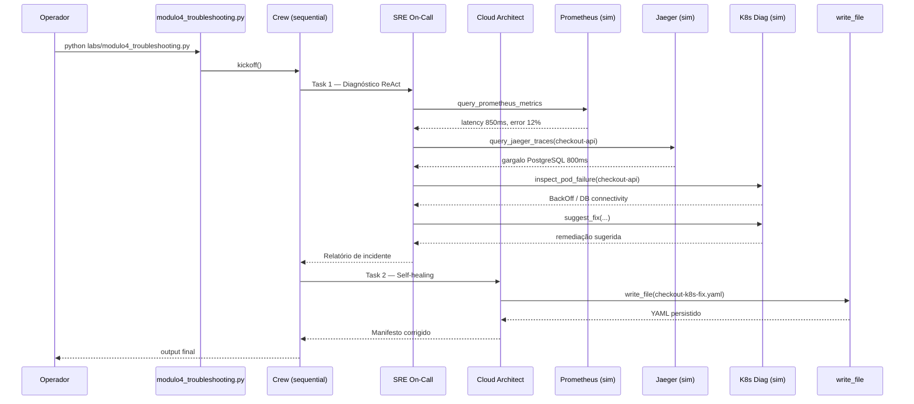

# Relatório Didático — Módulo 4: Troubleshooting ReAct & Self-Healing

**Trilha:** Nexus AI-Ops · Módulo 6, Exemplo 1  
**Script:** [`nexus/labs/modulo4_troubleshooting.py`](../nexus/labs/modulo4_troubleshooting.py)  
**Público:** Pós-graduação em AI-Ops e Engenharia de Plataforma  
**Objetivo:** Reduzir MTTR com agente on-call que investiga incidentes (ReAct) e gera hotfix Kubernetes automatizado.

---

## 1. Posicionamento na trilha

| Lab | Foco | Quando age |
|-----|------|------------|
| **M3** — GitOps & Canary | Deploy preventivo + decisão de rollout | *Antes* de ir para produção |
| **M4** — Troubleshooting | Diagnóstico reativo + self-healing | *Depois* que o incidente já ocorreu |

O Lab 3 pergunta: *“o canary pode ir para produção?”*  
O Lab 4 pergunta: *“por que o checkout está lento/quebrado e como corrigir?”*

---

## 2. Cenário de negócio

Usuários reportam **lentidão e erros no checkout**. O time de plantão precisa:

1. Correlacionar **métricas** (Prometheus), **traces** (Jaeger) e **estado do pod** (Kubernetes).
2. Identificar a **causa raiz** (gargalo + falha de pod).
3. Gerar um **manifesto corrigido** (`checkout-k8s-fix.yaml`) para reconciliação GitOps.

Cenário inicial opcional no cluster:

```bash
kubectl apply -f checkout-broken.yaml   # ImagePullBackOff proposital
python labs/modulo4_troubleshooting.py
kubectl apply -f checkout-k8s-fix.yaml    # hotfix gerado pela IA
kubectl get pods
```

---

## 3. Arquitetura do pipeline



---

## 4. Componentes

### 4.1 Agentes

| Agente | Factory | Papel no lab |
|--------|---------|--------------|
| **SRE On-Call** | `get_oncall_sre()` | Investigação ReAct com 4 tools de observabilidade/diagnóstico |
| **Cloud Architect** | `get_architect()` | Gera e persiste o manifesto de correção |

O SRE On-Call tem `allow_delegation=True` (padrão do agente), mas neste lab as duas tasks são **sequenciais e explícitas** — o Architect recebe o contexto do diagnóstico na task 2.

**Limites herdados** (desde `crew_config.py`): `max_iter=3`, `max_rpm=4` por agente.

### 4.2 Tools

#### Observabilidade — `tools/obs_tools.py`

| Tool | Entrada | Comportamento simulado |
|------|---------|------------------------|
| `query_prometheus_metrics` | query PromQL (texto) | Se contém `latency`/`error` → latência 850ms e taxa 5XX 12% |
| `query_jaeger_traces` | `service_name` | Gargalo em chamada PostgreSQL (~800ms) |

#### Diagnóstico K8s — `tools/k8s_diag.py`

| Tool | Entrada | Comportamento simulado |
|------|---------|------------------------|
| `inspect_pod_failure` | `pod_name` | Se nome contém `api` → BackOff + erro de DB; `worker` → OOMKilled; senão → readiness falhando |
| `suggest_fix` | `issue_type` | Mapa: OOMKilled, ImagePullBackOff, CrashLoopBackOff → texto de remediação |

#### Persistência — `tools/file_writer.py`

| Tool | Uso no lab |
|------|------------|
| `write_file` | Architect salva `checkout-k8s-fix.yaml` no disco |

> Todas as integrações (Prometheus, Jaeger, `kubectl describe`) são **simuladas** para o ambiente didático — o aluno aprende o *fluxo* ReAct sem depender de stack completa de observabilidade.

### 4.3 Tasks

#### Task 4.1–4.3 — `task_diagnose` (SRE On-Call)

Instrui o agente a seguir ReAct em 4 passos:

1. Métricas Prometheus (`error rate`, `latency`)
2. Traces Jaeger (`checkout-api`)
3. Inspeção do pod `checkout-api`
4. Sugestão de correção via `suggest_fix`

**Expected output:** relatório com causa raiz (gargalo + status do pod) e sugestão de correção.

#### Task 4.4 — `task_self_healing` (Architect)

Com base no diagnóstico anterior, gera `checkout-k8s-fix.yaml` com **regras rígidas de laboratório**:

| Regra | Valor obrigatório |
|-------|-------------------|
| Kind | `Deployment` (nunca Pod solto) |
| Imagem | `nginx:latest` |
| Porta / probes | `80` |
| Path dos probes HTTPGet | `/` (nginx retorna 404 em `/healthz`) |
| API | `initialDelaySeconds` na probe |

---

## 5. Artefatos YAML

### `checkout-broken.yaml` — cenário de quebra

```yaml
image: nginx:versao-que-nao-existe-999   # → ImagePullBackOff
```

Deployment `checkout-api` com tag inexistente para simular incidente de pull de imagem.

### `checkout-k8s-fix.yaml` — golden fix esperado

- Imagem `nginx:latest`
- `livenessProbe` e `readinessProbe` em `/` porta 80
- `initialDelaySeconds` configurado

---

## 6. Padrão ReAct no contexto do lab

```
Thought  → "Preciso ver se há erro nas métricas"
Action   → query_prometheus_metrics("error rate checkout")
Observation → 12% de 5XX

Thought  → "Onde está o gargalo na cadeia?"
Action   → query_jaeger_traces("checkout-api")
Observation → PostgreSQL 800ms

Thought  → "O pod está saudável?"
Action   → inspect_pod_failure("checkout-api")
Observation → BackOff, DB unreachable

Thought  → "Qual o fix?"
Action   → suggest_fix("CrashLoopBackOff")
Observation → revisar env vars / secrets / probes
```

O CrewAI orquestra esse ciclo via tool-calling do LLM (Groq `llama-3.1-8b-instant`). O agente **decide a ordem** das tools — diferente dos labs com pipeline fixo (M2 auditoria programática, M3 etapas isoladas).

---

## 7. Comparação com outros labs

| Aspecto | M3 GitOps | M4 Troubleshooting |
|---------|-----------|-------------------|
| Trigger | Deploy canary | Incidente em produção |
| Agente principal | SRE (sync + metrics) | SRE On-Call (ReAct) |
| Tools | `generate/apply/analyze` | Prometheus + Jaeger + diag K8s |
| Output | Decisão ROLLBACK/PROCEED | Relatório + YAML de hotfix |
| Cluster | Opcional (k3d) | Opcional (`checkout-broken` → fix) |
| Loop LLM | Mitigado (3 crews) | **Risco maior** — 1 crew, 4+ tools na task 1 |

---

## 8. Riscos operacionais e mitigações

### 8.1 Rate limit Groq (TPM)

A task de diagnóstico incentiva **várias tool calls** na mesma task — padrão ReAct consome mais tokens que M3.

**Mitigações já no projeto:**

- `max_iter=3` nos agentes (`core/agents.py`)
- `max_rpm=4` no crew (se aplicado — *este lab ainda usa crew único sem `crew_config`*)
- `CREWAI_TRACING_ENABLED=false`

**Melhorias sugeridas** (ainda não aplicadas ao M4):

- Dividir em 2 crews como no M3 (diagnóstico → self-healing) com pausa entre etapas
- Usar `kickoff_with_retry()` de `core/crew_config.py`
- Encurtar a `description` da task_diagnose

### 8.2 Delegação desnecessária

`get_oncall_sre()` tem `allow_delegation=True`, o que pode gerar chamadas extras ao Architect antes da task 2. Em turmas com TPM apertado, considerar `allow_delegation=False` só neste lab.

### 8.3 Diagnóstico simulado vs cluster real

As tools retornam dados fixos baseados em **substrings** (`api`, `error`, `latency`). O relatório pode mencionar DB/BackOff mesmo quando o incidente real no cluster for `ImagePullBackOff` — isso é aceitável no lab didático, mas deve ser explicado em sala.

---

## 9. Como executar

```powershell
cd modulo-6-exemplo-1-aiops-foundation\nexus
.\venv\Scripts\Activate.ps1
$env:CREWAI_TRACING_ENABLED = "false"

# Opcional: provocar incidente no cluster k3d
kubectl apply -f checkout-broken.yaml

# Pipeline agêntico
.\venv\Scripts\python.exe labs/modulo4_troubleshooting.py

# Validar artefato gerado
Get-Content checkout-k8s-fix.yaml
kubectl apply -f checkout-k8s-fix.yaml
kubectl get pods -l app=checkout-api
```

Via menu central:

```bash
python nexus_iac_copilot.py   # opção 4
```

---

## 10. Critérios de aceite sugeridos

- [ ] `python labs/modulo4_troubleshooting.py` conclui sem exceção (exit 0)
- [ ] SRE invocou ao menos uma tool de métricas, uma de traces e uma de diagnóstico de pod
- [ ] Arquivo `checkout-k8s-fix.yaml` criado com `kind: Deployment` e `image: nginx:latest`
- [ ] Probes HTTP em `/` porta 80 com `initialDelaySeconds`
- [ ] Aluno explica a diferença entre **canary preventivo (M3)** e **troubleshooting reativo (M4)**
- [ ] (Opcional) Pod `checkout-api` em `Running` após `kubectl apply` do fix

---

## 11. Próximo passo — Lab 5

[`modulo5_aiops.py`](../nexus/labs/modulo5_aiops.py) evolui de **reativo** para **preditivo**: NL → PromQL, regressão linear e alerta de saturação de disco *antes* do incidente.

```powershell
python labs/modulo5_aiops.py
```

---

## 12. Referências

| Recurso | Caminho |
|---------|---------|
| Script do lab | [`nexus/labs/modulo4_troubleshooting.py`](../nexus/labs/modulo4_troubleshooting.py) |
| Tools observabilidade | [`nexus/tools/obs_tools.py`](../nexus/tools/obs_tools.py) |
| Tools diagnóstico K8s | [`nexus/tools/k8s_diag.py`](../nexus/tools/k8s_diag.py) |
| Cenário quebrado | [`nexus/checkout-broken.yaml`](../nexus/checkout-broken.yaml) |
| Golden fix | [`nexus/checkout-k8s-fix.yaml`](../nexus/checkout-k8s-fix.yaml) |
| Slides UNIPDS | [`nexus/slides/slides4.md`](../nexus/slides/slides4.md) |
| Lab anterior | [`RELATORIO_DIDATICO_MODULO3.md`](RELATORIO_DIDATICO_MODULO3.md) |
| Economia TPM | [`nexus/core/crew_config.py`](../nexus/core/crew_config.py) |
