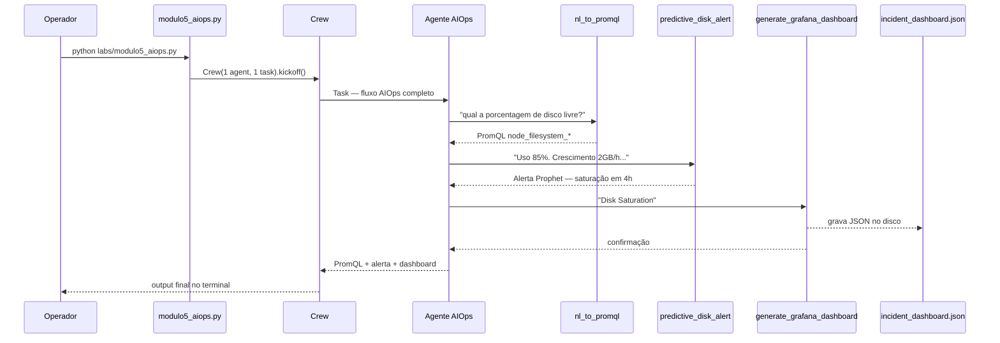

# Relatório Didático — Módulo 5: AIOps & Observabilidade Preditiva

**Trilha:** Nexus AI-Ops · Módulo 6, Exemplo 1  
**Script:** [`nexus/labs/modulo5_aiops.py`](../nexus/labs/modulo5_aiops.py)  
**Público:** Pós-graduação em AI-Ops e Engenharia de Plataforma  
**Objetivo:** Evoluir de observabilidade **reativa** (Lab 4) para **preditiva** — traduzir linguagem natural em PromQL, prever saturação de disco e gerar dashboard Grafana automaticamente.

---

## 1. Posicionamento na trilha

| Lab | Paradigma | Pergunta central |
|-----|-----------|------------------|
| **M3** | Preventivo (canary) | O deploy pode ir para produção? |
| **M4** | Reativo (ReAct) | O que quebrou e como corrigir agora? |
| **M5** | **Preditivo (AIOps)** | **O que vai quebrar nas próximas horas?** |

O Lab 4 espera o alerta tocar. O Lab 5 tenta **antecipar** o incidente com séries temporais e ML (simulado) antes da saturação do disco.

---

## 2. Cenário de negócio

A equipe reporta **lentidão no banco de dados** e suspeita de **disco enchendo** no volume `/data`. Em vez de montar queries e dashboards manualmente durante o plantão, o agente AIOps executa um fluxo único:

1. Traduzir a pergunta operacional para **PromQL**
2. Analisar histórico de métricas e emitir **alerta preditivo** (saturação em ~4h)
3. Gerar **`incident_dashboard.json`** para importação no Grafana

---

## 3. Arquitetura do pipeline



**Orquestração:** 1 agente, 1 task, 1 crew — o LLM decide **quando** chamar cada tool (padrão ReAct leve, sem etapas programáticas).

---

## 4. Componentes

### 4.1 Agente

| Campo | Valor |
|-------|-------|
| Factory | `get_aiops_agent()` |
| Papel | Engenheiro de AIOps e Dados (Observabilidade Preditiva) |
| Goal | Transformar dados brutos em insights preditivos e painéis dinâmicos |
| Backstory | Séries temporais, PromQL, Prophet, Isolation Forest |
| Limites herdados | `max_iter=3`, `max_rpm=4` (`core/crew_config.py`) |

### 4.2 Tools — `tools/aiops_tools.py`

#### `nl_to_promql` (Aula 5.1 — NL → Query)

Converte linguagem natural em PromQL (simulado por palavras-chave).

| Entrada contém | PromQL retornado |
|----------------|------------------|
| `taxa de erro`, `error` | `rate(http_requests_total{status=~"5.."}[5m]) / rate(http_requests_total[5m])` |
| `disco`, `disk` | `node_filesystem_avail_bytes{mountpoint="/data"} / node_filesystem_size_bytes{mountpoint="/data"} * 100` |
| (outros) | `up{job="kubernetes-pods"}` |

**Uso no lab:** traduzir *"qual a porcentagem de disco livre?"* → query de espaço em `/data`.

#### `predictive_disk_alert` (Aula 5.2 — ML preditivo)

Simula Prophet / Isolation Forest sobre histórico textual.

| Entrada contém | Saída |
|----------------|-------|
| `growth`, `crescimento` | Alerta: saturação 100% em **4 horas** + ação recomendada |
| (outros) | Padrão normal, sem anomalia |

**Uso no lab:** analisar `'Uso atual 85%. Crescimento de 2GB por hora contínuo'`.

#### `generate_grafana_dashboard` (Aula 5.3 — Dashboard dinâmico)

Gera JSON Grafana e persiste em `incident_dashboard.json` no diretório de execução.

```json
{
  "title": "Dynamic Incident Dashboard: Disk Saturation",
  "panels": [
    { "title": "Disk Usage Prediction", "type": "timeseries", ... },
    { "title": "Error Rate Spike", "type": "stat", ... }
  ]
}
```

**Uso no lab:** contexto `Disk Saturation` para painéis de disco e taxa de erro.

> Todas as tools são **simuladas** — não há chamada real a Prometheus, Prophet ou API do Grafana. O foco didático é o **fluxo agêntico** e os artefatos gerados.

### 4.3 Task única — `task_aiops_workflow`

A task descreve os 3 passos em sequência lógica:

1. NL → PromQL (*disco livre*)
2. Previsão sobre histórico de métricas
3. Dashboard Grafana para o incidente

**Expected output:** PromQL gerado, alerta preditivo detalhado e JSON do dashboard.

---

## 5. Artefatos de saída

| Artefato | Local | Conteúdo |
|----------|-------|----------|
| Output do Crew | Terminal | Texto consolidado pelo agente |
| `incident_dashboard.json` | `nexus/` (cwd) | JSON importável no Grafana |

### Importar no Grafana (opcional)

```bash
docker run -d -p 3000:3000 --name meu-grafana grafana/grafana
# Grafana UI → Dashboards → Import → upload incident_dashboard.json
```

---

## 6. Conceitos das aulas (slides)

| Aula | Tema | No lab |
|------|------|--------|
| **5.1** | NL2Q — democratizar PromQL | `nl_to_promql` |
| **5.2** | Anomalias — Prophet, Isolation Forest | `predictive_disk_alert` |
| **5.3** | Dashboards dinâmicos — reduzir MTTR | `generate_grafana_dashboard` |

### Alertas estáticos vs AIOps

| Abordagem | Limite | AIOps |
|-----------|--------|-------|
| Threshold fixo (ex.: disco > 90%) | Ruído em picos legítimos (Black Friday) | Aprende tendência e sazonalidade |
| Alerta após saturação | MTTR alto | Aviso **4h antes** (simulado) |
| Dashboard manual no incidente | 15–30 min perdidos | JSON gerado em segundos |

---

## 7. Comparação com Lab 4

| Aspecto | M4 Troubleshooting | M5 AIOps |
|---------|-------------------|----------|
| Foco | Causa raiz **atual** | Risco **futuro** |
| Tools | Prometheus/Jaeger/K8s diag (obs reativa) | PromQL/ML/Grafana (obs preditiva) |
| Output | `checkout-k8s-fix.yaml` (hotfix) | `incident_dashboard.json` (visibilidade) |
| Agentes | SRE On-Call + Architect | 1 agente AIOps |
| Etapas | 2 crews (otimizado) | 1 crew (ainda não otimizado) |

---

## 8. Como executar

```powershell
cd modulo-6-exemplo-1-aiops-foundation\nexus
.\venv\Scripts\Activate.ps1
$env:CREWAI_TRACING_ENABLED = "false"
.\venv\Scripts\python.exe labs/modulo5_aiops.py
```

Via menu:

```bash
python nexus_iac_copilot.py   # opção 5
```

---

## 9. Riscos e melhorias sugeridas

### 9.1 Rate limit Groq (TPM)

A task única incentiva **3 tool calls** + síntese final em um único crew — risco moderado de TPM (menor que M4 ReAct, maior que cada etapa isolada do M3).

**Melhorias possíveis** (ainda não aplicadas):

- Dividir em 3 crews com pausa (`crew_config.ROUND_DELAY_SECONDS`)
- Usar `kickoff_with_retry()` como nos Labs 3 e 4
- Encurtar a `description` da task

### 9.2 Simulação vs produção

Em produção, `nl_to_promql` seria um LLM com schema de query validado; `predictive_disk_alert` usaria dados reais do Prometheus/Mimir; `generate_grafana_dashboard` chamaria a API HTTP do Grafana.

### 9.3 Escrita de arquivo

O dashboard é gravado **dentro da tool** `generate_grafana_dashboard`, não via `write_file` — padrão diferente do Lab 4 (Architect + `write_file`).

---

## 10. Critérios de aceite sugeridos

- [ ] `python labs/modulo5_aiops.py` executa sem exceção (exit 0)
- [ ] Agente invocou `nl_to_promql`, `predictive_disk_alert` e `generate_grafana_dashboard`
- [ ] Output menciona PromQL de disco (`node_filesystem_*`)
- [ ] Alerta preditivo indica saturação em ~4 horas
- [ ] Arquivo `incident_dashboard.json` criado no diretório de execução
- [ ] Aluno explica diferença entre observabilidade **reativa (M4)** e **preditiva (M5)**

---

## 11. Próximo passo — Lab 6

[`modulo6_chatops.py`](../nexus/labs/modulo6_chatops.py) adiciona a camada **humana**: ChatOps com governança, RBAC e aprovação antes de ações destrutivas (Human-in-the-Loop).

```powershell
streamlit run labs/modulo6_chatops.py
```

---

## 12. Referências

| Recurso | Caminho |
|---------|---------|
| Script do lab | [`nexus/labs/modulo5_aiops.py`](../nexus/labs/modulo5_aiops.py) |
| Tools AIOps | [`nexus/tools/aiops_tools.py`](../nexus/tools/aiops_tools.py) |
| Agente | [`nexus/core/agents.py`](../nexus/core/agents.py) → `get_aiops_agent()` |
| Slides UNIPDS | [`nexus/slides/slides5.md`](../nexus/slides/slides5.md) |
| Lab anterior | [`RELATORIO_DIDATICO_MODULO4.md`](RELATORIO_DIDATICO_MODULO4.md) |
| Economia TPM | [`nexus/core/crew_config.py`](../nexus/core/crew_config.py) |
