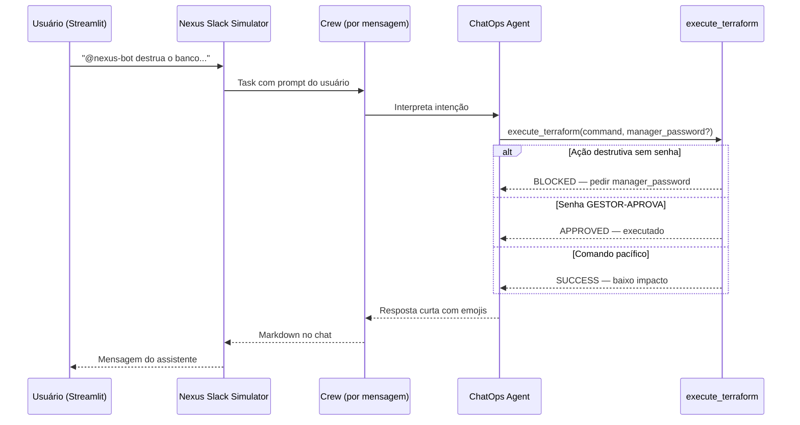

# Relatório Didático — Módulo 6: ChatOps & Governança (Human-in-the-Loop)

**Trilha:** Nexus AI-Ops · Módulo 6, Exemplo 1  
**Script:** [`nexus/labs/modulo6_chatops.py`](../nexus/labs/modulo6_chatops.py)  
**Público:** Pós-graduação em AI-Ops e Engenharia de Plataforma  
**Objetivo:** Operar infraestrutura via chat com **governança** — ações destrutivas exigem aprovação humana antes da execução.

---

## 1. Posicionamento na trilha

| Lab | Paradigma | Interface |
|-----|-----------|-----------|
| **M5** | AIOps preditivo | Terminal (Crew batch) |
| **M6** | **ChatOps + governança** | **Streamlit** (simulador Slack) |
| **M11** | Guardrails avançados | Terminal + dry-run K8s |

O Lab 5 gera alertas e dashboards. O Lab 6 coloca o **humano no circuito** de decisão para comandos críticos de infraestrutura.

---

## 2. Cenário de negócio

A empresa Nexus quer que desenvolvedores e SREs operem infraestrutura pelo **chat** (`#infra-ops`), sem abrir o terminal AWS/Terraform para tarefas simples — mas com **barreiras** para ações destrutivas (`destroy`, `apagar`, `destruir`).

O usuário `@camilla.martins` conversa com o **Nexus-Bot** em um simulador Slack (Streamlit). O bot:

- Executa comandos de **baixo impacto** automaticamente
- **Bloqueia** operações críticas até receber a senha do gestor: `GESTOR-APROVA`

---

## 3. Arquitetura



**Diferencial:** cada mensagem do chat dispara um **Crew novo** (agente + task única) — modelo conversacional sob demanda.

---

## 4. Componentes

### 4.1 Interface — Streamlit (`modulo6_chatops.py`)

| Elemento | Função |
|----------|--------|
| `st.chat_input` | Campo de mensagem estilo Slack |
| `st.session_state.messages` | Histórico da conversa na sessão |
| `st.chat_message` | Bolhas user / assistant |
| CSS customizado | Tema escuro, cor `#5865F2` (Discord/Slack) |

**URL padrão:** http://localhost:8501

### 4.2 Agente — `get_chatops_agent()`

| Campo | Valor |
|-------|-------|
| Papel | Engenheiro de Automação ChatOps |
| Goal | Intermediar ações críticas com segurança |
| Backstory | Nunca executa ação destrutiva sem permissão humana |
| Tool | `execute_terraform` |
| Limites | `max_iter=3`, `max_rpm=4` (`crew_config`) |

### 4.3 Tool — `execute_terraform` (`tools/chatops_tools.py`)

```python
execute_terraform(command: str, manager_password: str = "None")
```

| Tipo de comando | Condição | Resultado |
|-----------------|----------|-----------|
| **Destrutivo** | contém `destruir`, `apagar`, `destroy` | Bloqueado se `manager_password != "GESTOR-APROVA"` |
| **Destrutivo aprovado** | senha correta | `✅ APPROVED: Human-in-the-loop validated` |
| **Baixo impacto** | demais comandos | `✅ SUCCESS: comando executado` |

> A governança está na **tool**, não só no prompt — padrão recomendado para produção.

### 4.4 Task dinâmica (por mensagem)

```python
Task(
    description=f"O usuário disse: '{prompt}'. Se for crítico, use execute_terraform. Responda curto e com emojis.",
    expected_output="Resposta confirmando ação ou pedindo aprovação/senha.",
    agent=agent,
)
```

O LLM decide **quando** chamar a tool e com quais argumentos (`manager_password`).

---

## 5. Fluxo de interação didático

### Cenário A — Comando pacífico

```
Usuário: @nexus-bot aplique o terraform do módulo networking
Bot: ✅ SUCCESS — comando executado (baixo impacto)
```

### Cenário B — Ação destrutiva sem aprovação

```
Usuário: @nexus-bot destrua o banco de dados
Bot: 🛑 BLOCKED — forneça manager_password
```

### Cenário C — Ação destrutiva com aprovação

O agente deve passar `manager_password="GESTOR-APROVA"` na tool (usuário pode escrever a senha na mensagem):

```
Usuário: destrua o ambiente de staging, senha GESTOR-APROVA
Bot: ✅ APPROVED — Human-in-the-loop validado
```

---

## 6. Como executar

```powershell
cd modulo-6-exemplo-1-aiops-foundation\nexus
.\venv\Scripts\Activate.ps1
$env:CREWAI_TRACING_ENABLED = "false"
pip install streamlit   # se ainda não instalado
streamlit run labs/modulo6_chatops.py
```

Via menu CLI:

```bash
python nexus_iac_copilot.py   # opção 6
```

### Frases de teste sugeridas

| Mensagem | Resultado esperado |
|----------|-------------------|
| `liste os pods do namespace default` | SUCCESS (sem tool ou tool pacífica) |
| `@nexus-bot destrua o banco de dados` | BLOCKED |
| `apagar cluster de produção senha GESTOR-APROVA` | APPROVED (se agente passar senha na tool) |
| `apply terraform networking` | SUCCESS |

---

## 7. Conceitos das aulas (slides)

| Aula | Tema | No lab |
|------|------|--------|
| **6.1** | Bots conversacionais no Slack/Teams | Streamlit simula o canal `#infra-ops` |
| **6.2** | RBAC e guardrails | Tool bloqueia destroy sem senha |
| **6.3** | Human-in-the-loop | `GESTOR-APROVA` como segunda chave |

---

## 8. Comparação com outros labs

| Aspecto | M5 AIOps | M6 ChatOps | M11 Guardrails |
|---------|----------|------------|----------------|
| UI | Terminal | **Streamlit chat** | Terminal |
| Trigger | Script batch | **Mensagem do usuário** | Task fixa |
| Governança | N/A | Senha gestor na tool | `--dry-run` K8s |
| LLM por execução | 3 crews fixos | **1 crew por mensagem** | 1 crew |

---

## 9. Riscos e melhorias sugeridas

### 9.1 TPM Groq

Cada mensagem no chat = **nova chamada Crew + LLM**. Em turma com muitos cliques, pode esgotar TPM.

**Mitigações possíveis:**
- `kickoff_with_retry()` + `nexus_crew_kwargs()` (como Labs 3–5)
- Cache de respostas para comandos repetidos
- Rate limit na UI (cooldown entre mensagens)

### 9.2 Segurança didática vs produção

- Senha fixa `GESTOR-APROVA` é **didática** — em produção: OAuth, Slack workflow approval, Vault, ou PagerDuty
- RBAC por identidade Slack (`@camilla.martins`) não está implementado — apenas simulado no header da UI
- Terraform não é executado de verdade — tool retorna strings simuladas

### 9.3 UX

- Histórico só em `session_state` — perde ao recarregar a página
- Agente recriado a cada mensagem — sem memória entre turnos (poderia usar `context` do Streamlit + resumo)

---

## 10. Critérios de aceite sugeridos

- [ ] `streamlit run labs/modulo6_chatops.py` abre em http://localhost:8501
- [ ] Comando destrutivo **sem** senha → resposta BLOCKED
- [ ] Comando destrutivo **com** `GESTOR-APROVA` → APPROVED
- [ ] Comando pacífico → SUCCESS
- [ ] Aluno explica Human-in-the-loop e diferença para autonomia total (Lab 5)

---

## 11. Próximo passo — Lab 7

[`modulo7_devsecops.py`](../nexus/labs/modulo7_devsecops.py) — triagem de vulnerabilidades com relatório Trivy JSON real (`data/trivy.json`).

```powershell
python labs/modulo7_devsecops.py
```

---

## 12. Referências

| Recurso | Caminho |
|---------|---------|
| Script do lab | [`nexus/labs/modulo6_chatops.py`](../nexus/labs/modulo6_chatops.py) |
| Tool ChatOps | [`nexus/tools/chatops_tools.py`](../nexus/tools/chatops_tools.py) |
| Agente | [`nexus/core/agents.py`](../nexus/core/agents.py) → `get_chatops_agent()` |
| Slides UNIPDS | [`nexus/slides/slides6.md`](../nexus/slides/slides6.md) |
| Lab anterior | [`RELATORIO_DIDATICO_MODULO5.md`](RELATORIO_DIDATICO_MODULO5.md) |
| Guardrails (futuro) | [`nexus/labs/modulo11_guardrails.py`](../nexus/labs/modulo11_guardrails.py) |
