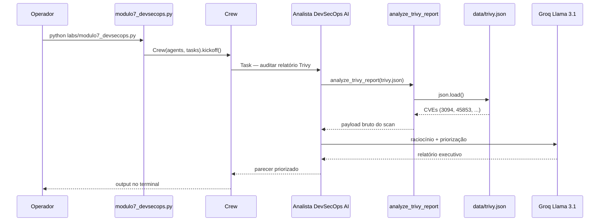

# Relatório Didático — Módulo 7: DevSecOps + AI (Triagem Trivy)

**Trilha:** Nexus AI-Ops · Módulo 6, Exemplo 1  
**Script:** [`nexus/labs/modulo7_devsecops.py`](../nexus/labs/modulo7_devsecops.py)  
**Público:** Pós-graduação em AI-Ops e Engenharia de Plataforma  
**Objetivo:** Priorizar vulnerabilidades reais em relatórios de scan de container, filtrando ruído e destacando ameaças exploráveis (backdoor CVE-2024-3094).

---

## 1. Posicionamento na trilha

| Lab | Foco | Tipo de segurança |
|-----|------|-------------------|
| **M2** — IaC Copilot | Checkov + OPA em Terraform HCL | Segurança **estática de infra** (pré-deploy) |
| **M6** — ChatOps | Aprovação humana em comandos destrutivos | Segurança **operacional** (controle de ações) |
| **M7** — DevSecOps AI | Triagem de relatório Trivy JSON | Segurança **de supply chain / imagem** (pós-build) |

O Lab 2 pergunta: *“o Terraform está em conformidade?”*  
O Lab 6 pergunta: *“este comando destrutivo pode ser executado?”*  
O Lab 7 pergunta: *“dentre centenas de CVEs, qual ameaça exige ação imediata?”*

---

## 2. Cenário de negócio

O time de plataforma escaneou a imagem base `python:3.11-slim` com **Trivy** e recebeu um JSON com dezenas de alertas `CRITICAL` e `HIGH`. O pipeline de CI bloqueou o deploy — mas o time não consegue triar tudo manualmente antes do incidente escalar.

O analista DevSecOps AI deve:

1. Carregar o relatório real em `data/trivy.json`.
2. Separar **ruído** (CVEs teóricas, pacotes não usados em runtime) de **risco real**.
3. Identificar a ameaça de **backdoor** (CVE-2024-3094 no ecossistema XZ/liblzma).
4. Produzir um **relatório executivo** com risco e plano de ação imediato.

> **Contexto histórico:** CVE-2024-3094 foi um backdoor inserido propositalmente no upstream do XZ Utils (versões 5.6.0–5.6.1), afetando distribuições Linux que empacotavam `liblzma5` comprometida. É um caso didático forte de *supply chain attack* — não é “só mais um bug”.

---

## 3. Arquitetura do pipeline



---

## 4. Componentes

### 4.1 Agente

| Agente | Factory | Papel no lab |
|--------|---------|--------------|
| **Analista de DevSecOps AI** | `core/agents.py` → `get_devsecops_agent()` | Triar CVEs, eliminar falsos positivos, priorizar explorabilidade |

Definição do agente:

```python
role='Analista de DevSecOps AI',
goal='Triar vulnerabilidades reais e eliminar falsos positivos de scans de segurança, priorizando o que é explorável.',
backstory='Especialista em segurança ofensiva que distingue biblioteca vulnerável teórica de backdoor ativo.'
```

**Diferença vs `get_auditor()` (Lab 2):**

| Aspecto | `get_auditor()` (M2) | `get_devsecops_agent()` (M7) |
|---------|----------------------|------------------------------|
| Foco | Conformidade de IaC (Checkov/OPA) | Triagem de CVEs em imagem/container |
| Entrada | Arquivo `.tf` | Relatório JSON do Trivy |
| Saída | Pass/Fail estruturado | Relatório executivo priorizado |
| Mindset | Auditor rigoroso de política | Analista ofensivo / priorização de risco |

### 4.2 Tool — `analyze_trivy_report`

Definida **inline** no script do lab (não em `tools/security_scan.py`):

```python
@tool("analyze_trivy_report")
def analyze_trivy_report(file_path: str) -> dict:
    """Reads a Trivy security scan JSON report and returns its raw data."""
    with open(file_path, 'r', encoding='utf-8') as file:
        return json.load(file)
```

| Aspecto | Comportamento |
|---------|---------------|
| Entrada | Caminho absoluto para `data/trivy.json` |
| Saída | Dict Python com o JSON completo do Trivy |
| Lógica | **Sem filtro** — a tool só lê; a triagem é responsabilidade do LLM |
| Produção | Em ambiente real, poderia chamar `trivy image --format json` ou ler do artefato CI |

> **Nota didática:** manter a tool “burra” (só I/O) deixa explícito que o valor da IA está no **raciocínio sobre os dados**, não na leitura do arquivo.

### 4.3 Task — `task_audit_security`

| Campo | Conteúdo |
|-------|----------|
| **description** | Analisar `trivy.json`, filtrar ruído, focar em backdoor CVE-2024-3094, gerar relatório executivo |
| **expected_output** | Relatório priorizado com foco em ameaças reais e exploráveis |
| **agent** | `get_devsecops_agent()` |

### 4.4 Crew

```python
crew = Crew(agents=[agent], tasks=[task_audit_security])
crew.kickoff()
```

Pipeline **single-agent, single-task** — o menor crew da trilha após o Lab 1. Toda a complexidade está na interpretação semântica do JSON, não na orquestração multi-etapas.

### 4.5 LLM

Mesmo stack dos demais labs: Groq `llama-3.1-8b-instant` via `core/llm_config.py` (`GROQ_API_KEY` no `.env`).

---

## 5. Artefato de dados — `data/trivy.json`

Scan simulado da imagem `python:3.11-slim` com três CVEs representativas:

| CVE | Pacote | Severidade | Papel didático |
|-----|--------|------------|----------------|
| **CVE-2024-3094** | `liblzma5` 5.6.0-1 | CRITICAL | **Backdoor XZ** — ameaça principal |
| CVE-2023-45853 | `zlib1g` | HIGH | Ruído comum — overflow teórico em miniizip |
| CVE-2022-123 | `nginx` 1.19.0 | LOW | Falso contexto — nginx nem deveria estar na imagem slim |

Trecho do backdoor:

```json
{
  "VulnerabilityID": "CVE-2024-3094",
  "PkgName": "liblzma5",
  "Severity": "CRITICAL",
  "Title": "Backdoor in lzma upstream as of 5.6.0",
  "Description": "Malicious code was discovered in the upstream tarballs of xz..."
}
```

**Resposta esperada do agente (conceitual):**

1. **P0 — CVE-2024-3094:** substituir base image / atualizar `liblzma5` para ≥ 5.6.1-1; isolar workloads afetados; rotacionar secrets se a imagem já rodou em produção.
2. **P2 — CVE-2023-45853:** avaliar se o código usa miniizip; provável aceite temporário com monitoramento.
3. **Descartar / investigar — nginx:** pacote suspeito na imagem slim — pode indicar layer incorreta ou falso positivo de inventário.

---

## 6. Conceitos-chave ensinados

### 6.1 Alert fatigue (fadiga de alertas)

Scanners como Trivy, Snyk e Grype geram volume alto de findings. Nem todo `CRITICAL` é urgente — o analista sênior cruza:

- severidade do scanner;
- **exploitabilidade** (EPSS, PoC público, backdoor conhecido);
- **exposição** (pacote em runtime vs. build-only);
- **blast radius** (imagem base compartilhada por N serviços).

### 6.2 Supply chain security

CVE-2024-3094 ilustra ataque na **cadeia de suprimentos**: código malicioso no upstream, não bug acidental do time. Implica:

- pinagem e verificação de imagens base;
- rebuild imediato ao sair advisory;
- SBOM (Software Bill of Materials) para rastrear pacotes afetados.

### 6.3 Compliance as Code (ponte para auditoria)

Slides da aula 7.3 conectam triagem automatizada com evidências para SOC2/ISO 27001: o agente atua como **pré-auditor**, organizando findings antes da certificação formal.

---

## 7. Comparação com outros labs

| Aspecto | M2 IaC Auditor | M6 ChatOps | M7 DevSecOps AI |
|---------|----------------|------------|-----------------|
| Artefato analisado | `main.tf` | Comando Slack/simulado | `trivy.json` |
| Tool principal | Checkov + OPA | `execute_terraform_command` | `analyze_trivy_report` |
| Decisão | Binária (pass/fail) | APPROVED / BLOCKED | Priorização P0/P1/P2 |
| Automação | Programática (Checkov) | Regra + senha gestor | Raciocínio LLM sobre CVEs |
| Momento no SDLC | Pré-merge infra | Execução operacional | Pós-build de imagem |

---

## 8. Execução

### Pré-requisitos

```powershell
cd modulo-6-exemplo-1-aiops-foundation/nexus
.\venv\Scripts\Activate.ps1
# .env com GROQ_API_KEY (ver docs/GROQ_SETUP.md)
```

### Comando

```powershell
python labs/modulo7_devsecops.py
```

Saída esperada no terminal: relatório em linguagem natural priorizando CVE-2024-3094 com plano de ação (atualizar imagem, rebuild, possível isolamento).

### Via UI Nexus (opcional)

```powershell
streamlit run ui/app.py
# Selecionar "Módulo 7: Auditoria de Segurança AI (Trivy Real)"
```

---

## 9. Riscos operacionais e mitigações

### 9.1 Alucinação do LLM

O modelo pode inventar CVEs ou mitigações incorretas.

| Mitigação didática | Mitigação produção |
|--------------------|-------------------|
| JSON fixo com CVE conhecida | Validar IDs contra NVD/OSV |
| Comparar output com advisory oficial | Pipeline determinístico para P0 (regex em CVE-2024-*) |
| Discussão em sala sobre hallucination | Human review obrigatório antes de block deploy |

### 9.2 Tool sem validação

`analyze_trivy_report` retorna JSON bruto — não valida schema Trivy.

**Evolução sugerida:** validar com JSON Schema do Trivy; falhar cedo se `Results` estiver vazio.

### 9.3 Confiança cega na severidade do scanner

Trivy marca severidade por CVSS; backdoor pode não ter score tradicional alto em todos os feeds.

**Lição:** priorizar **contexto de ameaça** (backdoor ativo > overflow teórico em lib não usada).

### 9.4 Rate limit Groq

Lab leve (1 agente, 1 task, ~1 tool call) — risco baixo vs. M4/M5. Se falhar auth, revisar `GROQ_API_KEY`.

---

## 10. Exercícios sugeridos

### Exercício 1 — Expandir o JSON

Adicione uma CVE `CRITICAL` falsa (pacote `openssl` com descrição genérica) e peça ao aluno: *o agente priorizou corretamente? Por quê?*

### Exercício 2 — Tool determinística

Implemente `prioritize_cve(cve_id: str) -> str` que sempre retorna P0 para `CVE-2024-3094` e compare com o parecer do LLM.

### Exercício 3 — Scan real

```bash
trivy image python:3.11-slim --format json -o data/trivy-live.json
```

Aponte o lab para o arquivo gerado e discuta diferenças vs. o fixture didático.

### Exercício 4 — Ponte com M2

**Pergunta:** qual a diferença entre falha de **Checkov** no Terraform (M2) e **CVE em imagem** (M7)? Em que fase do pipeline cada uma deve bloquear o deploy?

---

## 11. Critérios de aceite sugeridos

- [ ] `python labs/modulo7_devsecops.py` executa sem erro de autenticação Groq
- [ ] Agente invoca `analyze_trivy_report` com o path de `data/trivy.json`
- [ ] Output menciona **CVE-2024-3094** e classifica como ameaça crítica/backdoor
- [ ] Output propõe ação concreta (atualizar imagem/pacote, rebuild, isolamento)
- [ ] Aluno explica **alert fatigue** e diferença entre M2 (IaC) e M7 (container scan)
- [ ] Aluno diferencia `get_auditor()` de `get_devsecops_agent()`

---

## 12. Próximo passo — Lab 8

[`modulo8_cicd.py`](../nexus/labs/modulo8_cicd.py) — otimização de pipelines GitHub Actions: ler `data/workflow_lento.yaml` e sugerir versão com cache e paralelismo.

```powershell
python labs/modulo8_cicd.py
```

---

## 13. Referências

| Recurso | Caminho |
|---------|---------|
| Script do lab | [`nexus/labs/modulo7_devsecops.py`](../nexus/labs/modulo7_devsecops.py) |
| Agente | [`nexus/core/agents.py`](../nexus/core/agents.py) → `get_devsecops_agent()` |
| Fixture Trivy | [`nexus/data/trivy.json`](../nexus/data/trivy.json) |
| Scans IaC (M2) | [`nexus/tools/security_scan.py`](../nexus/tools/security_scan.py) |
| Slides UNIPDS | [`nexus/slides/slides7.md`](../nexus/slides/slides7.md) |
| Lab anterior | [`RELATORIO_DIDATICO_MODULO6.md`](RELATORIO_DIDATICO_MODULO6.md) |
| CVE-2024-3094 | [NVD / Aqua CVE](https://avd.aquasecurity.jp/nvd/cve-2024-3094) |
