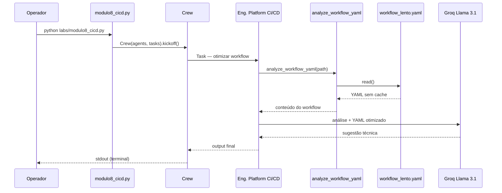

# Relatório Didático — Módulo 8: CI/CD Copilot (Otimização de Pipeline)

**Trilha:** Nexus AI-Ops · Módulo 6, Exemplo 1  
**Script:** [`nexus/labs/modulo8_cicd.py`](../nexus/labs/modulo8_cicd.py)  
**Público:** Pós-graduação em AI-Ops e Engenharia de Plataforma  
**Objetivo:** Analisar um workflow GitHub Actions lento, identificar gargalos de cache e propor YAML otimizado para reduzir tempo e custo de runner.

---

## 1. Posicionamento na trilha

| Lab | Foco | Momento no SDLC |
|-----|------|-----------------|
| **M3** — K8s GitOps | Deploy canary + decisão de rollout | Pós-build, pré-produção |
| **M7** — DevSecOps | Triagem Trivy + remediação de imagem | Segurança no pipeline |
| **M8** — CI/CD Copilot | Otimização de workflow GitHub Actions | **Build/test** — feedback ao dev |
| **M9** — FinOps | Custos de recursos cloud | Pós-operacional |

O Lab 3 pergunta: *“o canary pode ir para produção?”*  
O Lab 7 pergunta: *“qual CVE bloqueia o deploy?”*  
O Lab 8 pergunta: *“por que o pipeline demora 10 minutos e como reduzir?”*

---

## 2. Cenário de negócio

O microserviço **checkout** dispara um pipeline GitHub Actions a cada `push`. O time reclama:

- **~10 minutos** de feedback por commit;
- runners `ubuntu-latest` ligados por muito tempo;
- custo crescente na fatura de CI (minutos de runner × frequência de push).

O arquivo `data/workflow_lento.yaml` modela um anti-padrão comum: `npm install` **sem cache**, baixando todas as dependências a cada execução.

O **Engenheiro de Platform e CI/CD** (agente IA) deve:

1. Ler o workflow atual;
2. Identificar o gargalo (falta de cache em `npm`);
3. Reescrever o YAML com `actions/cache`;
4. Estimar a economia de tempo (slides: ~60%).

---

## 3. Arquitetura do pipeline



Pipeline **single-agent, single-task** — o agente lê o YAML, raciocina e responde em texto (não persiste arquivo automaticamente).

---

## 4. Componentes

### 4.1 Agente

| Agente | Factory | Papel no lab |
|--------|---------|--------------|
| **Engenheiro de Platform e CI/CD** | `core/agents.py` → `get_cicd_agent()` | Analisar workflow, propor cache e reduzir tempo de build |

```python
role='Engenheiro de Platform e CI/CD',
goal='Otimizar pipelines de entrega, reduzir tempo de build e garantir rollbacks seguros.',
backstory='Especialista em DevOps que domina cache, builds multi-stage e canary deployments.'
```

**Diferença vs outros agentes da trilha:**

| Agente | Lab | Entrada | Saída |
|--------|-----|---------|-------|
| `get_sre_agent()` | M3 | Manifestos K8s + métricas | Go/No-Go canary |
| `get_devsecops_agent()` | M7 | Trivy JSON | Parecer de segurança |
| `get_cicd_agent()` | M8 | Workflow YAML | YAML otimizado + explicação |
| `get_finops_agent()` | M9 | Inventário cloud | ROI de cortes |

### 4.2 Tool — `analyze_workflow_yaml`

Definida **inline** no script do lab:

```python
@tool("analyze_workflow_yaml")
def analyze_workflow_yaml(file_path: str) -> str:
    """Reads a CI/CD workflow YAML file and returns its content for bottleneck analysis."""
    with open(file_path, 'r', encoding='utf-8') as file:
        return file.read()
```

| Aspecto | Comportamento |
|---------|---------------|
| Entrada | Caminho para `data/workflow_lento.yaml` |
| Saída | Conteúdo textual do YAML |
| Lógica | Somente leitura — análise fica com o LLM |
| Produção | Poderia integrar com API GitHub (`GET /repos/.../contents/.github/workflows/ci.yml`) |

> **Nota:** `tools/governance_tools.py` define `optimize_cicd_pipeline` (resposta simulada fixa), mas **não é usada** neste lab — o M8 usa tool real de leitura + raciocínio do agente.

### 4.3 Task — `task_optimize_cicd`

| Campo | Conteúdo |
|-------|----------|
| **description** | Analisar workflow, identificar lentidão/custo (dica: cache), reescrever YAML com cache Node.js, estimar economia |
| **expected_output** | YAML otimizado + explicação técnica |
| **agent** | `get_cicd_agent()` |

### 4.4 Crew

```python
crew = Crew(agents=[agent], tasks=[task_optimize_cicd])
crew.kickoff()
```

### 4.5 LLM

Groq `llama-3.1-8b-instant` via `core/llm_config.py` (`GROQ_API_KEY` no `.env`).

---

## 5. Artefatos de dados

### 5.1 `data/workflow_lento.yaml` — anti-padrão (entrada)

```yaml
name: CI Checkout Service
on: [push]
jobs:
  build:
    runs-on: ubuntu-latest
    steps:
      - uses: actions/checkout@v4
      - name: Install Dependencies
        run: npm install  # ERRO: Sem cache, baixa tudo toda vez
      - name: Build
        run: npm run build
      - name: Run Tests
        run: npm test
```

**Problemas didáticos:**

| # | Anti-padrão | Impacto |
|---|-------------|---------|
| 1 | `npm install` sem cache | Re-download de `node_modules` a cada push |
| 2 | Sem `actions/cache` | Runner ocioso em I/O de rede |
| 3 | Job único sequencial | Sem paralelismo (aceitável neste lab simples) |
| 4 | Sem `setup-node` com cache integrado | Alternativa moderna não explorada |

### 5.2 `data/workflow_rapido.yaml` — golden reference (não gerado pelo lab)

Referência didática do resultado esperado:

```yaml
- name: Cache e Instala Dependências
  uses: actions/cache@v3
  with:
    path: ~/.npm
    key: ${{ runner.os }}-node-${{ hashFiles('package-lock.json') }}
    restore-keys: |
      ${{ runner.os }}-node-

- name: Instala Dependências
  run: npm install
```

**Melhorias aplicadas:**

| Melhoria | Benefício |
|----------|-----------|
| `actions/cache@v3` em `~/.npm` | Reutiliza pacotes entre runs |
| Key com `hashFiles('package-lock.json')` | Invalida cache só quando deps mudam |
| `restore-keys` parcial | Cache parcial em upgrades menores |

**Economia estimada (slides):** ~60% do tempo de pipeline (ex.: 10 min → ~4 min na parte de deps).

---

## 6. Conceitos-chave ensinados

### 6.1 CI/CD adaptativo (Aula 8.1)

Pipelines inteligentes podem:

- rodar apenas jobs afetados por arquivos alterados (`paths` / `dorny/paths-filter`);
- pular testes irrelevantes em mudanças de docs;
- reduzir feedback loop para o desenvolvedor.

> O lab M8 foca no subconjunto **cache** — base para CI adaptativo.

### 6.2 Cache de dependências (Aula 8.2)

| Estratégia | Quando usar |
|------------|-------------|
| `actions/cache` + `~/.npm` | Projetos Node com `package-lock.json` |
| `actions/setup-node` com `cache: npm` | Abstração oficial GitHub (Node 16+) |
| Cache Docker layer | Builds de imagem (não coberto neste lab) |
| Cache pip/poetry | Projetos Python |

**ROI:** menos minutos de runner = menor custo GitHub Actions / self-hosted.

### 6.3 Gates e auto-rollback (Aula 8.3 — visão futura)

Slides mencionam monitoramento pós-deploy (HTTP 5xx nos primeiros 5 min) e rollback autônomo — conecta com:

- **M3** — decisão canary Go/No-Go;
- **M4** — self-healing reativo;
- **M11** — guardrails com aprovação humana.

O M8 prepara o terreno: pipeline rápido → mais deploys → mais necessidade de gates inteligentes.

---

## 7. Comparação com outros labs

| Aspecto | M7 DevSecOps | M8 CI/CD Copilot |
|---------|--------------|------------------|
| Artefato | `trivy.json` | `workflow_lento.yaml` |
| Tool | `read_trivy_report` | `analyze_workflow_yaml` |
| Objetivo | Segurança (CVE P0) | Performance (tempo/custo) |
| Saída em disco | Sim (`Dockerfile.remediated`) | **Não** — só stdout do LLM |
| Validação programática | Sim (M7 estendido) | Não (nesta versão) |
| Domínio | Supply chain | Developer experience |

---

## 8. Execução

### Pré-requisitos

```powershell
cd modulo-6-exemplo-1-aiops-foundation/nexus
.\venv\Scripts\Activate.ps1
# .env com GROQ_API_KEY (ver docs/GROQ_SETUP.md)
```

### Comando

```powershell
$env:CREWAI_TRACING_ENABLED = "false"
python labs/modulo8_cicd.py
```

### Via menu Nexus

```powershell
python nexus_iac_copilot.py
# Opção 8 — Módulo 8: Otimização de CI/CD
```

### Saída esperada (conceitual)

O agente deve:

1. Apontar ausência de cache no `npm install`;
2. Sugerir bloco `actions/cache@v3` (ou `setup-node` com cache);
3. Explicar economia estimada (~45–60% na etapa de deps);
4. Entregar trecho YAML reescrito.

---

## 9. Riscos operacionais e mitigações

### 9.1 YAML alucinado pelo LLM

O modelo pode gerar sintaxe inválida ou versões de actions incorretas.

| Mitigação didática | Mitigação produção |
|--------------------|-------------------|
| Comparar com `workflow_rapido.yaml` | Validar com `actionlint` no CI |
| Revisão humana antes do merge | Branch protection + PR obrigatório |

### 9.2 Lab não persiste o YAML otimizado

Diferente do M7 (que grava `Dockerfile.remediated`), o M8 só imprime sugestão.

**Evolução sugerida:** segunda task com `write_file` → `workflow_otimizado.yaml` + validação YAML.

### 9.3 Cache incorreto

Key de cache mal configurada pode servir deps desatualizadas.

**Lição:** sempre usar `hashFiles('package-lock.json')` ou equivalente; nunca cache global sem invalidação.

### 9.4 Rate limit Groq

Lab leve (1 agente, 1 task, YAML pequeno) — risco baixo. Se o agente chamar a tool em loop, aplicar padrão do M7: resumo compacto + `allow_delegation=False` + prompt “UMA única vez”.

---

## 10. Exercícios sugeridos

### Exercício 1 — Comparar golden files

Diff manual entre `workflow_lento.yaml` e `workflow_rapido.yaml`. Quais linhas o agente deveria ter produzido?

### Exercício 2 — `setup-node` moderno

Reescreva o workflow usando:

```yaml
- uses: actions/setup-node@v4
  with:
    node-version: 20
    cache: npm
```

Compare com `actions/cache` manual.

### Exercício 3 — CI adaptativo

Adicione `paths-filter` para rodar testes só quando `src/**` mudar. O agente consegue sugerir?

### Exercício 4 — Ponte com FinOps (M9)

**Pergunta:** se o pipeline cai de 10 min para 4 min em 50 pushes/dia, quantos minutos de runner economizamos por mês? (Preparação para Lab 9.)

---

## 11. Critérios de aceite sugeridos

- [ ] `python labs/modulo8_cicd.py` executa sem erro de autenticação Groq
- [ ] Agente invoca `analyze_workflow_yaml` com path de `data/workflow_lento.yaml`
- [ ] Output identifica **falta de cache** no `npm install`
- [ ] Output sugere `actions/cache` ou `setup-node` com cache
- [ ] Output menciona economia de tempo estimada
- [ ] Aluno explica diferença entre otimizar **pipeline** (M8) e **imagem** (M7)

---

## 12. Próximo passo — Lab 9

[`modulo9_finops.py`](../nexus/labs/modulo9_finops.py) — auditoria de inventário cloud, recursos zumbis e cálculo de ROI.

```powershell
python labs/modulo9_finops.py
```

---

## 13. Referências

| Recurso | Caminho |
|---------|---------|
| Script do lab | [`nexus/labs/modulo8_cicd.py`](../nexus/labs/modulo8_cicd.py) |
| Agente | [`nexus/core/agents.py`](../nexus/core/agents.py) → `get_cicd_agent()` |
| Workflow lento | [`nexus/data/workflow_lento.yaml`](../nexus/data/workflow_lento.yaml) |
| Workflow referência | [`nexus/data/workflow_rapido.yaml`](../nexus/data/workflow_rapido.yaml) |
| Slides UNIPDS | [`nexus/slides/slides8.md`](../nexus/slides/slides8.md) |
| Lab anterior | [`RELATORIO_DIDATICO_MODULO7.md`](./RELATORIO_DIDATICO_MODULO7.md) |
| GitHub Actions Cache | [actions/cache](https://github.com/actions/cache) |
