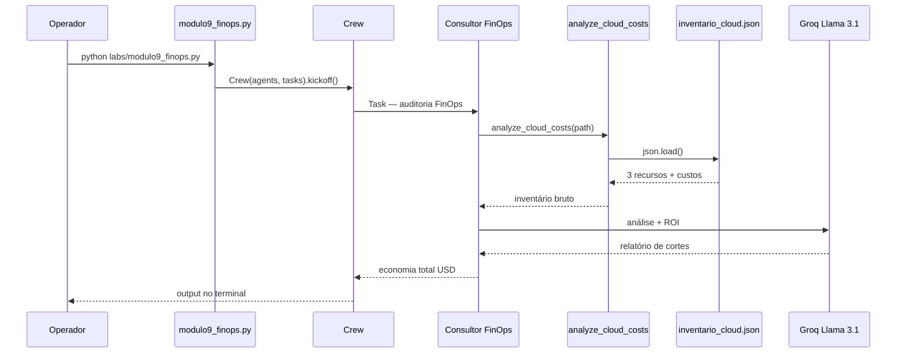

# Relatório Didático — Módulo 9: FinOps Cloud (Zombie Resources & Rightsizing)

**Trilha:** Nexus AI-Ops · Módulo 6, Exemplo 1  
**Script:** [`nexus/labs/modulo9_finops.py`](../nexus/labs/modulo9_finops.py)  
**Público:** Pós-graduação em AI-Ops e Engenharia de Plataforma  
**Objetivo:** Auditar inventário cloud, identificar recursos zumbis e instâncias superdimensionadas, calcular economia mensal em USD e gerar plano de cortes.

---

## 1. Posicionamento na trilha

| Lab | Foco | Pergunta central |
|-----|------|------------------|
| **M2** — IaC Copilot | Conformidade Terraform (OPA: `t3.large` bloqueado) | *“O código respeita governança de custo?”* |
| **M8** — CI/CD Copilot | Tempo/custo de runners CI | *“O pipeline desperdiça minutos?”* |
| **M9** — FinOps | Desperdício em recursos AWS | *“O que está gerando custo sem valor?”* |
| **M12** — Projeto Final | Manager coordena SRE + Segurança + FinOps | *“Como resolver crise multidomínio?”* |

O Lab 8 pergunta: *“por que o pipeline demora?”*  
O Lab 9 pergunta: *“quanto dinheiro estamos queimando em recursos ociosos?”*

---

## 2. Cenário de negócio

A conta AWS `123456789012` (região `us-east-1`) recebeu alerta de **aumento de 40% na fatura**. O time de plataforma exportou um inventário simplificado em `data/inventario_cloud.json`.

Suspeitas:

- volumes EBS **órfãos** (status `available`, sem instância);
- Elastic IPs **não associados**;
- instâncias EC2 **superdimensionadas** com CPU média &lt; 5%.

O **Consultor de FinOps Cloud** (agente IA) deve:

1. Ler o inventário;
2. Classificar recursos zumbis vs. rightsizing;
3. Calcular economia mensal total em dólares;
4. Entregar relatório de recomendações acionáveis.

> **Cultura FinOps (slides):** custo deve ser visível na **criação** do recurso (PR com Infracost), não só na fatura do fim do mês. O M9 atua na **auditoria reativa** — complementar ao gate preventivo do M2.

---

## 3. Arquitetura do pipeline



Pipeline **single-agent, single-task** — leitura do JSON + raciocínio do LLM (sem persistir relatório em disco).

---

## 4. Componentes

### 4.1 Agente

| Agente | Factory | Papel no lab |
|--------|---------|--------------|
| **Consultor de FinOps Cloud** | `core/agents.py` → `get_finops_agent()` | Caçar zumbis, propor rightsizing, calcular ROI |

```python
role='Consultor de FinOps Cloud',
goal='Reduzir o desperdício financeiro na nuvem e sugerir o dimensionamento correto (rightsizing).',
backstory='Auditor financeiro que caça recursos zumbis e instâncias superdimensionadas.'
```

**Reuso no Lab 12:** o mesmo `get_finops_agent()` é convocado pelo **Nexus Manager** em incidentes multidomínio (pico de custo + erro 500 + backdoor).

### 4.2 Tool — `analyze_cloud_costs`

Implementada em `tools/finops_tools.py` (auditoria **determinística**):

```python
@tool("analyze_cloud_costs")
def analyze_cloud_costs(file_path: str) -> str:
    """Returns pre-calculated FinOps audit: zombies (full cost) + rightsizing (partial savings)."""
```

| Aspecto | Comportamento |
|---------|---------------|
| **Zumbis** | EBS `available` + EIP `unassociated` → economia = `cost_per_month` integral |
| **Rightsizing** | EC2 com CPU baixa → economia = `cost_per_month − rightsized_cost_per_month` |
| **Saída** | Resumo textual com subtotais (evita erro de soma do LLM) |
| **Validação** | `modulo9_finops.py` revalida totais ao final via `audit_cloud_inventory()` |

> **Nota:** `tools/governance_tools.py` define `analyze_finops_costs` (simulada), mas **não é usada** neste lab.

### 4.3 Task — `task_audit_finops`

| Campo | Conteúdo |
|-------|----------|
| **description** | Analisar inventário; identificar zumbis (EBS available, IPs soltos) e rightsizing; calcular economia USD |
| **expected_output** | Relatório FinOps com cortes e economia total |
| **agent** | `get_finops_agent()` |

### 4.4 Crew

```python
crew = Crew(agents=[agent], tasks=[task_audit_finops])
crew.kickoff()
```

### 4.5 LLM

Groq `llama-3.1-8b-instant` via `core/llm_config.py`.

---

## 5. Artefato de dados — `inventario_cloud.json`

```json
{
  "account_id": "123456789012",
  "region": "us-east-1",
  "resources": [
    { "id": "vol-0a1b2c3d", "type": "EBS Volume", "status": "available",
      "size_gb": 500, "cost_per_month": 50.00, "note": "Not attached" },
    { "id": "i-99887766", "type": "EC2 Instance", "instance_type": "m5.4xlarge",
      "avg_cpu_utilization": "2.5%", "cost_per_month": 340.00,
      "recommended_instance_type": "m5.large", "rightsized_cost_per_month": 70.00,
      "note": "Extremely overprovisioned" },
    { "id": "eipalloc-001122", "type": "Elastic IP", "status": "unassociated",
      "cost_per_month": 5.00 }
  ]
}
```

### Análise esperada (golden reference didática)

| Recurso | Tipo | Problema | Ação recomendada | Custo/mês |
|---------|------|----------|------------------|-----------|
| `vol-0a1b2c3d` | EBS 500 GB | **Zumbi** — `available`, sem attachment | Snapshot opcional + `DeleteVolume` | **$50** |
| `eipalloc-001122` | Elastic IP | **Zumbi** — `unassociated` | `ReleaseAddress` | **$5** |
| `i-99887766` | EC2 `m5.4xlarge` | **Rightsizing** — CPU média 2,5% | Downsize → `m5.large` ($70/mês) | **$270** economia |

**Subtotal zumbis:** **$55/mês** (integral) · **Subtotal rightsizing:** **$270/mês** (parcial) · **Total:** **$325/mês**.

Slides citam plano de **~$500/mês** em cenários ampliados (snapshots antigos, Spot, etc.).

---

## 6. Conceitos-chave ensinados

### 6.1 Visibilidade de custo (Aula 9.1)

| Prática | Momento |
|---------|---------|
| **Infracost** no PR | Antes do merge — *“essa mudança custa +$200/mês”* |
| **Auditoria FinOps (M9)** | Depois — *“já estamos pagando por lixo”* |
| **OPA cost control (M2)** | Gate — bloqueia `t3.large` sem aprovação |

### 6.2 Recursos zumbis (Aula 9.2)

Recursos que **existem na conta mas não entregam valor**:

- EBS `available` (disco órfão após terminate de EC2);
- Elastic IP sem associação;
- Snapshots antigos (não no fixture, mas conceito das slides);
- Load balancers sem targets.

**Impacto:** economia **imediata** e **baixo risco** — não afetam workloads em produção.

### 6.3 Rightsizing (Aula 9.3)

| Sinal | Ação |
|-------|------|
| CPU média &lt; 10% por 30 dias | Reduzir `instance_type` |
| Memória ociosa | Família menor ou burstable (`t3`) |
| Carga batch / dev | Considerar **Spot** (~70% desconto) |

No fixture: `m5.4xlarge` com **2,5% CPU** é caso extremo de superdimensionamento.

---

## 7. Comparação com outros labs

| Aspecto | M8 CI/CD | M9 FinOps |
|---------|----------|-----------|
| Artefato | `workflow_lento.yaml` | `inventario_cloud.json` |
| Tool | `analyze_workflow_yaml` | `analyze_cloud_costs` |
| Métrica | Tempo de pipeline (min) | Custo cloud (USD/mês) |
| Anti-padrão | Sem cache npm | Recursos órfãos |
| Saída em disco | Não | Não |
| Agente | `get_cicd_agent()` | `get_finops_agent()` |

| Aspecto | M2 OPA | M9 FinOps |
|---------|--------|-----------|
| Quando | Pré-deploy (Terraform) | Pós-faturamento (inventário) |
| Mecanismo | Regra determinística | Análise semântica LLM |
| Exemplo | Bloqueia `t3.large` | Sugere downsize de `m5.4xlarge` |

---

## 8. Execução

### Pré-requisitos

```powershell
cd modulo-6-exemplo-1-aiops-foundation/nexus
.\venv\Scripts\Activate.ps1
# GROQ_API_KEY em .env (docs/GROQ_SETUP.md)
```

### Comando

```powershell
$env:CREWAI_TRACING_ENABLED = "false"
python labs/modulo9_finops.py
```

### Via menu Nexus

```powershell
python nexus_iac_copilot.py
# Opção 9 — Módulo 9: Auditoria FinOps
```

### Saída esperada (conceitual)

1. Listar **2 zumbis** (EBS + EIP) → **$55/mês** recuperáveis com baixo risco;
2. Identificar **rightsizing** em `i-99887766` → **$270/mês** ($340 − $70);
3. **Total:** **$325/mês** (validado programaticamente);
4. Plano de ação: deletar volumes, liberar IPs, redimensionar instância após janela de manutenção.

---

## 9. Riscos operacionais e mitigações

### 9.1 Cálculo incorreto pelo LLM

Mitigado nesta versão: `finops_tools.py` calcula subtotais; o script valida `$55 + $270 = $325` ao final.

| Mitigação didática | Mitigação produção |
|--------------------|-------------------|
| Validação `_validate_finops_totals()` no lab | AWS Compute Optimizer + aprovação humana |
| Rightsizing ≠ delete total | Change control + janela de manutenção |

### 9.2 Tool retorna resumo compacto

Risco de rate limit TPM se o agente chamar a tool em loop (lição do M7).

**Mitigação:** prompt com “UMA única chamada”; evoluir tool para resumo compacto.

### 9.3 Deletar zumbi com dados críticos

EBS `available` pode conter backup esquecido.

**Lição FinOps:** snapshot antes de delete; política de retenção.

### 9.4 Sem integração AWS real

Lab é **simulado** — não executa `DeleteVolume` nem `ModifyInstanceAttribute`.

---

## 10. Exercícios sugeridos

### Exercício 1 — Conferência matemática

Some manualmente `cost_per_month` do JSON. O agente chegou ao mesmo total?

### Exercício 2 — Expandir inventário

Adicione um snapshot de 2 TB ($80/mês) e um ALB sem targets ($25/mês). O agente classifica corretamente?

### Exercício 3 — Ponte com M2

**Pergunta:** como a regra OPA `COST_CONTROL` no Lab 2 **previne** o problema que o Lab 9 **detecta**?

### Exercício 4 — Infracost no PR

Desenhe um fluxo: dev abre PR com `t3.large` → Infracost comenta → OPA bloqueia → FinOps nunca precisa caçar zumbi de oversizing.

---

## 11. Critérios de aceite sugeridos

- [ ] `python labs/modulo9_finops.py` executa sem erro Groq
- [ ] Tool `analyze_cloud_costs` invocada com `inventario_cloud.json`
- [ ] Output identifica EBS `available` como zumbi
- [ ] Output identifica Elastic IP `unassociated` como zumbi
- [ ] Output identifica `m5.4xlarge` com 2,5% CPU como rightsizing
- [ ] Output apresenta economia total **$325** (zumbis $55 + rightsizing $270)
- [ ] Validação automática passa ao final do script
- [ ] Aluno diferencia FinOps **reativo** (M9) vs. **preventivo** (M2/M8)

---

## 12. Próximo passo — Lab 10

[`modulo10_remediation.py`](../nexus/labs/modulo10_remediation.py) — RAG com runbooks corporativos para auto-remediação de incidentes de banco.

```powershell
python labs/modulo10_remediation.py
```

---

## 13. Referências

| Recurso | Caminho |
|---------|---------|
| Script do lab | [`nexus/labs/modulo9_finops.py`](../nexus/labs/modulo9_finops.py) |
| Tool FinOps | [`nexus/tools/finops_tools.py`](../nexus/tools/finops_tools.py) |
| Agente | [`nexus/core/agents.py`](../nexus/core/agents.py) → `get_finops_agent()` |
| Inventário | [`nexus/data/inventario_cloud.json`](../nexus/data/inventario_cloud.json) |
| Slides UNIPDS | [`nexus/slides/slides9.md`](../nexus/slides/slides9.md) |
| Lab anterior | [`RELATORIO_DIDATICO_MODULO8.md`](./RELATORIO_DIDATICO_MODULO8.md) |
| Lab final (reuso agente) | [`nexus/labs/modulo12_projeto_final.py`](../nexus/labs/modulo12_projeto_final.py) |
| Infracost | [infracost.io](https://www.infracost.io/) |
