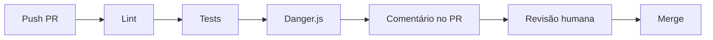

# Relatório — Danger.js: Automação de Code Review no CI

> Material de apoio · Engenharia de Software com IA Aplicada (UNIPDS)
> Complementar ao pipeline de qualidade (M6 DevSecOps, M7 automação de ecossistema)

**Referência oficial:** [danger.systems/js](https://danger.systems/js/) · [GitHub danger/danger-js](https://github.com/danger/danger-js)

**Nota:** o repositório `pos-unipds-IA` **não utiliza** Danger.js atualmente — este relatório documenta a ferramenta para adoção futura em projetos Node/TS do monorepo.

---

## 1. O que é Danger.js?

**Danger.js** automatiza **tarefas repetitivas de code review** no **CI**, publicando `message`, `warn` ou `fail` **diretamente no Pull Request** (GitHub, GitLab, Bitbucket).

Slogan: *"Formalize your Pull Request etiquette"*.

Não substitui revisores humanos — codifica **normas de equipe** (CHANGELOG, lockfile, tamanho de PR, assignee, links Jira) para que humanos foquem em arquitetura e lógica de negócio.

---

## 2. Pipeline



Danger roda **após** lint e testes — camada de **processo**, não de sintaxe (ESLint/Prettier).

---

## 3. Componentes

| Componente | Descrição |
|------------|-----------|
| Pacote `danger` | devDependency NPM |
| `dangerfile.js/ts` | Regras customizadas na raiz |
| `danger ci` | CLI no pipeline CI |
| DSL `danger` | Metadados do PR (arquivos, diff, título…) |

---

## 4. API de feedback

```javascript
import { message, warn, fail, markdown } from "danger"

message("Info — tabela do comentário")
warn("Aviso — não bloqueia merge")
fail("Falha — CI pode bloquear merge")
markdown("## Markdown extra")
```

| Função | Severidade |
|--------|------------|
| `message()` | Informativo |
| `warn()` | Aviso |
| `fail()` | Bloqueante (se CI tratar exit ≠ 0) |
| `markdown()` | Formatação rica |

O comentário no PR é **atualizado** a cada run — não acumula spam.

---

## 5. Exemplos de regras

### CHANGELOG

```javascript
const hasChangelog = danger.git.modified_files.includes("CHANGELOG.md")
const isTrivial = (danger.github.pr.body + danger.github.pr.title).includes("#trivial")
if (!hasChangelog && !isTrivial) warn("Adicione CHANGELOG ou marque #trivial.")
```

### package.json sem lockfile

```javascript
if (danger.git.modified_files.includes("package.json") &&
    !danger.git.modified_files.includes("yarn.lock")) {
  warn("package.json alterado sem yarn.lock.")
}
```

### PR grande

```javascript
if (danger.github.pr.additions + danger.github.pr.deletions > 600) {
  warn("PR grande — considere dividir.")
}
```

---

## 6. Objeto `danger`

| Propriedade | Conteúdo |
|-------------|----------|
| `danger.git.modified_files` | Arquivos modificados |
| `danger.git.created_files` | Arquivos novos |
| `danger.github.pr.title/body` | Título e descrição |
| `danger.github.pr.additions/deletions` | Tamanho do PR |

---

## 7. Setup mínimo

```bash
yarn add danger -D
```

**GitHub Actions:**

```yaml
name: Danger
on: [pull_request]
jobs:
  danger:
    runs-on: ubuntu-latest
    steps:
      - uses: actions/checkout@v4
      - uses: actions/setup-node@v4
        with:
          node-version: 20
      - run: npm ci
      - run: npx danger ci
        env:
          GITHUB_TOKEN: ${{ secrets.GITHUB_TOKEN }}
```

**Teste local:**

```bash
DANGER_TEST_PR=42 npx danger pr
```

---

## 8. Danger vs outras ferramentas

| Ferramenta | Foco |
|------------|------|
| ESLint / Prettier | Sintaxe e estilo |
| **Danger.js** | Processo de PR |
| Husky + lint-staged | Pre-commit local |
| SonarQube / CodeQL | Segurança estática |

---

## 9. Aplicação no pos-unipds-IA

Candidatos naturais:

| Projeto | Regra Danger sugerida |
|---------|----------------------|
| `modulo-5-exemplo-6-brag-bot` | PR exige changelog ou label `#trivial` |
| `modulo-3-exemplo-8-publish-mcp` | Bump de versão com alteração em `package.json` |
| `modulo-5-exemplo-3-openspec-cfp` | PR grande alerta split; link OpenSpec |

Relacionado ao **M6 Lab 8** (CI/CD Copilot — otimização de workflow) e **M7 M09** (automação de ecossistema Jira/Slack).

---

## 10. Limitações

- Requer token de API e CI configurado
- Regras frágeis se paths hardcoded
- Não substitui análise AST (ESLint/Sonar)
- `fail()` só bloqueia se o CI respeitar exit code

---

*Relatório elaborado para o repositório pos-unipds-IA · Material complementar Módulo 7*
