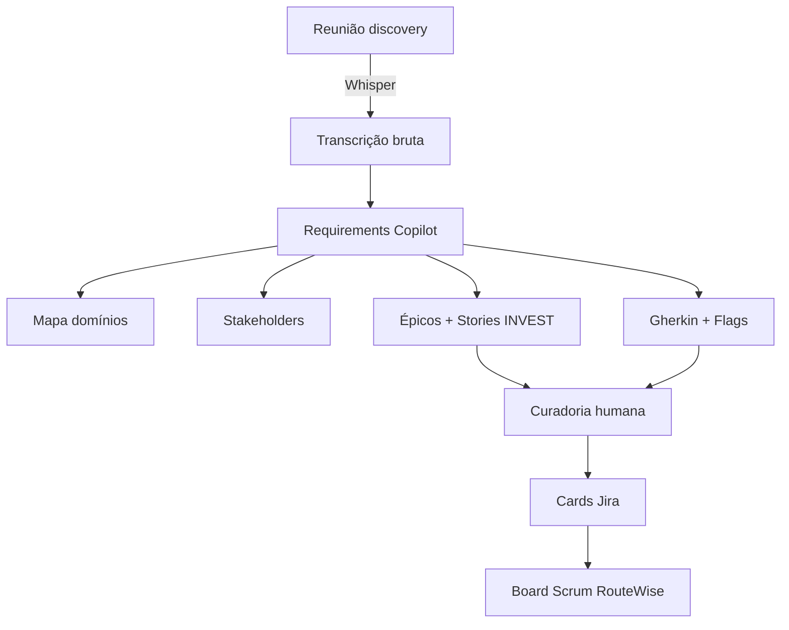

# Relatório — Transcrição e Definição de Requisitos com IA (M01)

> **Módulo 7 UNIPDS — Ferramentas de IA para Gestão de Projetos**
> Caso **RouteWise** · PM AI Toolkit (Prof. Ahirton Lopes)
> Material local: [`modulo-7-exemplo-1-planejamento-e-escopo`](../)

**Referência UNIPDS:** [modulo-01-planejamento-e-escopo](https://github.com/unipds-engenharia-de-ia-aplicada/engenharia-de-software-com-ia-aplicada/tree/main/modulo07-ferramentas-de-ia-para-gestao-de-projetos/modulo-01-planejamento-e-escopo)

---

## 1. Resumo executivo

O **Módulo 1** do PM AI Toolkit aborda **engenharia de requisitos assistida por IA**: transformar inputs não estruturados de reuniões de discovery (transcrições, áudio, e-mails, briefings) em artefatos rastreáveis, testáveis e prontos para o backlog Jira.

Tese central do **Requirements Copilot**:

> *"Você não é um transcrevedor. Você é um analista."*

A IA captura o que foi **dito e o que foi implicado**, sinaliza ambiguidades, valida qualidade com **INVEST**, escreve critérios de aceite em **Gherkin** e produz cards para **Jira** — sempre com revisão humana antes do sprint.

**Fluxo didático:**

```
Áudio/reunião → Transcrição (Whisper) → Requirements Copilot → Backlog Jira
```

---

## 2. Pipeline: da reunião ao backlog



### Artefatos na pasta do módulo

| Etapa | Arquivo | Função |
|-------|---------|--------|
| Captura | [`cena-logistica-carlos.wav`](../cena-logistica-carlos.wav) | Áudio opcional da cena de discovery |
| Transcrição | [`transcricao-discovery-routewise.md`](../transcricao-discovery-routewise.md) | Input principal (35 min, 3 stakeholders) |
| System prompt | [`requirements-copilot-system-prompt.md`](../requirements-copilot-system-prompt.md) v1.2 | Instruções do Copilot (Gem/AI Studio) |
| Output esperado | [`output-demo-m1.2-v1.0.md`](../output-demo-m1.2-v1.0.md) | Referência para validação da demo |
| Backlog | [`routewise-jira-import.csv`](../routewise-jira-import.csv) | ~400 issues pré-montados |
| Board | [`guia-board-routewise.md`](../guia-board-routewise.md) | Import CSV + estado do board por módulo |

---

## 3. Tópicos principais

### 3.1 Transcrição automática como insumo

A transcrição RouteWise simula saída real de **Whisper** com limitações documentadas:

- Pausas, silêncios e sobreposições de fala **não representados**
- Trechos inaudíveis omitidos (~3 min)
- Revisão mínima pós-transcrição

**Exemplo (Carlos, discovery):**

> *"A gente tem cento e quarenta veículos... o operador fica olhando pra tela o dia inteiro... às vezes a coisa acontece e ninguém viu."*

**Paralelo real:** Otter.ai, Fireflies, Teams transcription ou Whisper local. A transcrição é **matéria-prima**; o valor está na análise estruturada.

### 3.2 Requirements Copilot — 9 seções (modo completo)

1. Mapa de domínios
2. Mapa de stakeholders
3. Estrutura de épicos (P/M/G/GG)
4. User stories + validação INVEST
5. Perguntas em aberto
6. Flags de risco
7. Cards prontos para Jira
8. Dependências não declaradas
9. Diagrama Mermaid

**Modo rápido** (`modo rápido` no prompt): apenas seções 4, 5 e 7 — iterações em reunião ou inputs preliminares.

### 3.3 Framework INVEST

| Critério | Pergunta | Exemplo RouteWise |
|----------|----------|-------------------|
| **I**ndependent | Desenvolvível sem bloquear/ser bloqueada? | US01 depende de API de mapas |
| **N**egotiable | Escopo negociável no planning? | Frenagem brusca: v1 vs fase 2 |
| **V**aluable | Valor claro para o papel? | Alerta → evitar multas/acidentes |
| **E**stimable | Time estima SP? | US02 falha: "uns minutos" ambíguo |
| **S**mall | Cabe em sprint (≤8 SP)? | US01 falha: GIS + regras por veículo |
| **T**estable | QA automatiza testes? | Gherkin com `[A CONFIRMAR]` |

Stories com `[INVEST-FAIL]` **não geram card Jira**.

### 3.4 Gherkin — critérios testáveis

- Mínimo **2 cenários**: happy path + edge case
- Proibido termos subjetivos ("rápido", "adequadamente")
- Marcar `[MANUAL-ONLY]` se não automatizável

**Exemplo (US01, demo):**

```gherkin
Cenário: Detecção de excesso de velocidade em tempo real
  Dado que o veículo "Caminhão-01" tem limite de 80km/h na rodovia atual
  Quando o dispositivo enviar telemetria de 85km/h
  Então o sistema deve gerar alerta visual em menos de [A CONFIRMAR] segundos
```

### 3.5 Protocolo de ambiguidade

| Termo na fala | Marcação | Exemplo RouteWise |
|---------------|----------|-------------------|
| "em tempo real", "rápido" | `[A CONFIRMAR COM STAKEHOLDER]` | Carlos: *"Não sei te dizer um número exato"* |
| Integração externa | `[DEPENDÊNCIA NÃO MAPEADA]` | RH: *"Não tenho a menor ideia se tem API"* |
| Compliance | Flag jurídica | LGPD — pendente |

### 3.6 Anti-padrões detectados

| Anti-padrão | Ação do Copilot |
|-------------|-----------------|
| Voz passiva sem sujeito | Solicitar ator responsável |
| Resultado não verificável | Pedir métrica mensurável |
| Escopo infinito | Lista fechada de casos |
| Requisito duplo (AND) | Decompor em 2 stories |
| Dependência circular | Identificar pré-requisito real |

### 3.7 Flags de risco

| Flag | Significado |
|------|-------------|
| `[ESPECIFICAÇÃO INVENTADA]` | SLA/número não fornecido pelo stakeholder |
| `[DEPENDÊNCIA NÃO MAPEADA]` | API/serviço externo não confirmado |
| `[VIABILIDADE TÉCNICA SILENCIOSA]` | Infra/dado não confirmado |
| `[GOLD PLATING]` | Requisito além do pedido (ex.: manutenção preditiva fase 2) |

---

## 4. Caso RouteWise — contexto e inferências

### Dores extraídas da transcrição

| Elemento | Valor |
|----------|-------|
| Frota | 140 veículos |
| Sistema legado | Plataforma de 2016, operação manual |
| Dor #1 | Multas/acidentes por velocidade não detectada |
| Dor #2 | GPS offline sem visibilidade |
| Dor #3 | Relatórios manuais (2h/semana em Excel) |
| Prazo | Board de julho |
| Compliance | LGPD pendente |
| Fase 2 | Frenagem brusca, manutenção preditiva |

### Épicos gerados (demo)

| Épico | Complexidade | Origem |
|-------|--------------|--------|
| E01: Motor de Alertas Críticos | G | Alertas + escalação |
| E02: Monitoramento Saúde da Frota | M | Dispositivos offline/bateria |
| E03: Portal Inteligência Operacional | M | Dashboard + exportação RH |

### Inferido vs explícito

| Inferência | Explícito na transcrição? |
|------------|---------------------------|
| Speed Limits API (GIS) | Não |
| WebSocket/Push para alertas | Não |
| De-para hardware novo vs antigo | Parcial |
| Manutenção preditiva fora do v1 | Sim |

---

## 5. Human-in-the-loop

1. Aviso obrigatório no output: *"Rascunho analítico — revisão humana antes do sprint"*
2. Conflitos `[CONFLITO]` documentados — PO decide
3. Viabilidade técnica sinalizada para arquitetura, não decidida pela IA

---

## 6. Adaptação de plataformas

Ver [`nota-adaptacao-modelos.md`](../nota-adaptacao-modelos.md): Gemini AI Studio (demo), Claude, GPT, Azure OpenAI, Ollama 70B (dados sensíveis).

---

## 7. Critérios de sucesso (aula M01)

- [ ] Gem configurado com system prompt v1.2
- [ ] Transcrição processada nas 9 seções (ou modo rápido documentado)
- [ ] ≥3 user stories com INVEST explícito
- [ ] Gherkin com happy path + edge case
- [ ] Jira RouteWise criado e CSV importado (UTF-8)
- [ ] Ambiguidades listadas (escalação, RH, LGPD)

---

## 8. Relação com outros relatórios desta pasta

| Relatório | Conexão |
|-----------|---------|
| [`RELATORIO_RICE_VS_WSJF.md`](./RELATORIO_RICE_VS_WSJF.md) | Priorização do backlog gerado |
| [`RELATORIO_M05_RISCOS_AIOPS_PT1.md`](./RELATORIO_M05_RISCOS_AIOPS_PT1.md) | Flags → registro de riscos |
| [`RELATORIO_M07_STATUS_REPORTS_IA.md`](./RELATORIO_M07_STATUS_REPORTS_IA.md) | Fecha ciclo: relatório para diretoria (pedido de Carlos) |

---

*Relatório elaborado para o repositório pos-unipds-IA · Módulo 7 — Gestão de Projetos com IA*
