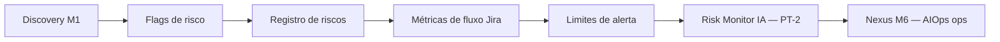

# Relatório Didático — Módulo 5: Riscos e Mitigações com AIOps de Projeto (PT-1)

> **Módulo 7 UNIPDS — Ferramentas de IA para Gestão de Projetos**
> Caso **RouteWise** · PM AI Toolkit (Prof. Ahirton Lopes)
> **PT-1** = fundamentos de risco de projeto + preparação para **AIOps de Projeto (M5.2)**

**Referência UNIPDS:** [modulo-05-riscos-e-aiops](https://github.com/unipds-engenharia-de-ia-aplicada/engenharia-de-software-com-ia-aplicada/tree/main/modulo07-ferramentas-de-ia-para-gestao-de-projetos/modulo-05-riscos-e-aiops)

---

## 1. Resumo executivo

O **Módulo 5** conecta **gestão de riscos de projeto** (PM clássico) com **AIOps aplicado ao fluxo de entrega** (métricas do Jira + IA). A aula é dividida em duas partes:

| Parte | Foco | Entrega |
|-------|------|---------|
| **PT-1** (esta aula) | Identificar, classificar e mitigar riscos; métricas de fluxo; curadoria | Registro de riscos + limites de alerta |
| **PT-2 (M5.2)** | **Risk Monitor** — IA analisa telemetria do projeto | Cockpit VERDE/AMARELO/VERMELHO + plano de mitigação |

**Ideia central:** risco não é “surpresa no dia da demo” — é **sinal antecipado** (flags, bugs, Lead Time, blockers) tratado com **mitigação** antes da crise.

---

## 2. Mapa da aula PT-1



| # | Tema PT-1 | O que você aprende |
|---|-----------|-------------------|
| 1 | Risco de projeto vs AIOps | PM previne atraso de release; AIOps prevê degradação de fluxo |
| 2 | Flags → riscos | Converter output do Requirements Copilot em registro rastreável |
| 3 | Tipos de risco RouteWise | Técnico, dependência, escopo, qualidade, compliance |
| 4 | Mitigação vs contingência | Ação preventiva vs plano se o risco ocorrer |
| 5 | Métricas de fluxo | Lead Time, Cycle Time, velocity, WIP, bugs |
| 6 | Limites de alerta | Baseline + thresholds antes da IA (M5.2) |
| 7 | Ponte Nexus M6 | Reativo → preditivo → orquestrado (labs) |

---

## 3. Risco de projeto vs AIOps de projeto

| Dimensão | Risco de projeto (PM) | AIOps de projeto (M5.2) |
|----------|----------------------|-------------------------|
| **Pergunta** | O que pode impedir entregar o MVP? | O fluxo está **degradando** antes da crise? |
| **Fonte** | Discovery, planning, dependências | **Métricas Jira** (sprints 1–4) |
| **Horizonte** | Release, OKR, board julho | Sprint atual + marco em 2 semanas |
| **Saída** | Registro + mitigação | Cockpit + diagnóstico + projeção |
| **RouteWise** | LGPD, GIS API, hardware v2 | Lead Time 10,8 d; 9 bugs acumulados |

**AIOps de projeto** aqui **não** é só Prometheus/K8s (Nexus M6) — é usar a mesma **lógica de telemetria** (dados + tendência + alerta) sobre o **board Scrum**.

---

## 4. Da discovery à matriz de riscos (PT-1)

No **Módulo 1**, o Requirements Copilot já gera **FLAGS DE RISCO**. PT-1 transforma flags em **gestão formal**.

### 4.1 Flags do Copilot (M1.1)

| Flag | Significado | Ação PT-1 |
|------|-------------|-----------|
| `[ESPECIFICAÇÃO INVENTADA]` | SLA/timeout sem dono | Workshop → número ou spike |
| `[DEPENDÊNCIA NÃO MAPEADA]` | API/hardware não validado | Spike + label `bloqueado` |
| `[VIABILIDADE TÉCNICA SILENCIOSA]` | Hardware heterogêneo | Arquitetura + fase 2 |
| `[GOLD PLATING]` | Escopo além do discovery | Descope ou backlog futuro |

### 4.2 Registro de risco (template)

| ID | Risco | Categoria | Prob. | Impacto | Mitigação | Contingência | Dono |
|----|-------|-----------|-------|---------|-----------|--------------|------|
| R-01 | API GIS não disponível | Dependência | Média | Alto | Spike mapas Sprint 2 | Alertas sem limite por via | Priya |
| R-02 | Hardware v2 atrasa | Dependência | Alta | Alto | Label `hardware-dependente` | Demo só frota v1 | Carlos |
| R-03 | LGPD sem parecer | Compliance | Média | Crítico | Jurídico antes go-live | Não subir produção | Compliance |
| R-04 | Bugs > resolução 3 sprints | Qualidade | Alta | Médio | 40% sprint em débito | Parar features (Andon) | PM |

**Curadoria:** cada risco no Jira com label `risco` + link à story bloqueada.

---

## 5. Tipos de risco no RouteWise (exemplos práticos)

### 5.1 Dependência externa — **VERMELHO** no demo M5.2

- **Risco:** acelerômetro v2 não chega → US-03 Score bloqueada desde Sprint 3.
- **Sintoma Jira:** US-03 em `bloqueado hardware`; WIP parado > 5 dias.
- **Mitigação PT-1:** não puxar US-03/US-06 até hardware **físico** na mesa.
- **Contingência:** apresentação foca US-01 + US-05 (frota v1).

### 5.2 Qualidade / débito técnico

- **Risco:** bugs abertos (11) > resolvidos (6) na Sprint 4; saldo **9** acumulado.
- **Exemplo crítico:** **BUG-S4-10** — guard de hardware quebra alertas para **43 veículos v1**.
- **Mitigação:** 40% da sprint (~9 SP) só para bugs; BUG-S4-10 em 48 h.

### 5.3 Escopo e fluxo

- **Risco:** Lead Time **6,2 → 10,8 dias** (3 sprints); Cycle Time estável (~5 d).
- **Diagnóstico:** fila em *Blocked*, não dev lento.
- **Mitigação:** DoR — nada entra no sprint com dependência externa não resolvida.

### 5.4 Compliance

- **Risco:** LGPD localização motorista (discovery Carlos).
- **Mitigação:** parecer jurídico antes go-live; WSJF RR alto (habilitador).

### 5.5 Marco / stakeholder

- **Risco:** board diretoria em **2 semanas**; hardware chega na **mesma** sprint.
- **Projeção demo:** risco **ALTO (>80%)** para demo US-03 ao vivo.

---

## 6. Métricas de fluxo — insumos para AIOps (PT-1 → PT-2)

Antes do **Risk Monitor** (IA), o PM define **o que medir** e **limites de alerta**.

### 6.1 Siglas e métricas

| Sigla / métrica | O que é | Onde no Jira | RouteWise (tendência) |
|-----------------|---------|--------------|------------------------|
| **LT** — Lead Time | Ideia → Done | Reports → Control Chart | 6,2 → **10,8** dias ⚠️ |
| **CT** — Cycle Time | In Progress → Done | Control Chart | 4,8 → 5,3 (estável) |
| **Velocity** | SP entregues/sprint | Velocity Chart | 28 → **22** SP |
| **WIP** | Itens em progresso | Board | 3 parados > 5 dias |
| **Bug saldo** | Abertos − resolvidos (acum.) | Issues tipo Bug | 0 → **9** |
| **Scope creep** | Stories com critério alterado em sprint | Auditoria manual | Planejar vs entregar ↓ |

### 6.2 Como definir limites de alerta (PT-1)

Regra do material UNIPDS:

```
Lead Time alerta = média Sprint 1–2 + 25%
RouteWise: baseline saúde ≈ 6,5 dias (S1–S2)
S4 = 10,8 → VERMELHO
```

| Componente cockpit (M5.2) | Limite RouteWise (exemplo) |
|---------------------------|----------------------------|
| Fluxo e eficiência | LT > 6,5 d ou WIP parado > 0 |
| Qualidade | Saldo bugs positivo 2+ sprints |
| Dependências | Blocker hardware ativo |
| Escopo/entregas | Entregues/planejadas < 60% |
| Prontidão marco | Hardware + demo na mesma semana |

---

## 7. Mitigação — conceitos PT-1

| Conceito | Definição | Exemplo RouteWise |
|----------|-----------|-------------------|
| **Mitigação** | Ação para **reduzir** prob. ou impacto **antes** | Spike GIS; DoR com hardware na mesa |
| **Contingência** | Plano **se** o risco ocorrer | Demo sem US-03; CSV manual RH |
| **Aceite** | Risco documentado; time segue | INVEST-FAIL Small aceito pelo PO |
| **Transferência** | Terceiro assume | Contrato fornecedor rastreadores |
| **Evitação** | Remover escopo | SAP descartado do MVP (Spike S3) |

**Regra do Risk Monitor:** mitigação deve ser **específica** — não “revisar processo”, mas *“40% da sprint em bugs até saldo < 4”*.

---

## 8. PT-2 — Risk Monitor com IA (preview)

Na **parte 2**, você cola no AI Studio o prompt `risk-monitor-prompt.md` + `risk-monitor-data-exemplo.csv`.

**A IA entrega 4 blocos:**

1. **Cockpit** — 5 componentes com VERDE / AMARELO / VERMELHO
2. **Diagnóstico** — sintoma vs causa raiz (≥ 2 sprints tendência)
3. **Plano de mitigação** — ação imediata + processo + critério de sucesso
4. **Projeção de risco** — Baixo / Médio / Alto para o marco

**Output de referência:** `output-exemplo-riskmonitor-m52.md` — RouteWise Sprint 5, recomendação executiva: **pivotar demo** para US-01 + US-05, resolver BUG-S4-10 em 48 h.

---

## 9. Ponte com Módulo 6 Nexus (AIOps “de plataforma”)

| M7 — AIOps de **projeto** | M6 — AIOps de **operações** |
|---------------------------|----------------------------|
| Métricas **Jira** (LT, bugs) | Métricas **Prometheus/Grafana** |
| Risk Monitor (Gemini) | Labs Nexus (CrewAI) |
| Risco de **não entregar MVP** | Risco de **incidente em produção** |
| BUG-S4-10 no board | CVE-2024-3094, checkout 500 (M12) |

| Lab Nexus | Paradigma | Ligação com M7 M5 |
|-----------|-----------|-------------------|
| M4 Troubleshooting | **Reativo** | Bug crítico em produção |
| M5 AIOps preditivo | **Preditivo** | “Disco enche em 4h” ≈ LT vai explodir |
| M7 DevSecOps | **Segurança** | OWASP pré-go-live (CSV RouteWise) |
| M11 Guardrails | **HITL** | PM aprova mitigação antes de kubectl |
| M12 Projeto Final | **Orquestrado** | SRE + Sec + FinOps = crises múltiplas |

**Metáfora:** M7 M5 vigia o **cronograma**; Nexus vigia a **plataforma**. Ambos usam **telemetria + IA + humano**.

---

## 10. Glossário de siglas (Módulo 5)

| Sigla | Significado | Uso no M5 |
|-------|-------------|-----------|
| **AIOps** | Artificial Intelligence for IT Operations | IA sobre dados de fluxo/projeto ou infra |
| **LT** | Lead Time | Tempo total até Done |
| **CT** | Cycle Time | Tempo em desenvolvimento |
| **WIP** | Work In Progress | Itens em andamento; excesso = gargalo |
| **SP** | Story Points | Velocity RouteWise ~22/sprint |
| **DoR** | Definition of Ready | Gate antes do sprint (mitigação M5.2) |
| **DoD** | Definition of Done | Critério de entrega |
| **HITL** | Human-in-the-Loop | IA sugere; PM decide (curadoria) |
| **CVE** | Common Vulnerabilities and Exposures | Risco segurança (OWASP task CSV) |
| **OWASP** | Open Web Application Security Project | Revisão pré-go-live RouteWise |
| **SLA** | Service Level Agreement | Acordo de nível de serviço (latência alerta) |
| **RR** | Risk Reduction (WSJF) | Dimensão SAFe — compliance LGPD |
| **MVP** | Minimum Viable Product | Release v1 antes board |
| **PI** | Program Increment | Horizonte de planejamento (SAFe) |

---

## 11. Exemplos práticos — roteiro RouteWise

### Exercício PT-1 (sem IA)

1. Exportar do M1: seção **FLAGS DE RISCO** → 4 linhas no registro R-01…R-04.
2. Abrir Jira Sprint 4 → contar bugs abertos vs resolvidos.
3. Calcular LT alerta: (6,2 + 7,1)/2 × 1,25 ≈ **6,5 dias**.
4. Marcar US-03 `bloqueado hardware`; BUG-S4-10 como **crítico**.
5. Escrever **1 mitigação + 1 contingência** para o board de julho.

### Exercício PT-2 (com IA)

1. Copiar `risk-monitor-prompt.md` no Gemini AI Studio.
2. Colar bloco **Dados de Exemplo — Projeto Frota Carlos** (ou seu CSV).
3. Comparar output com `output-exemplo-riskmonitor-m52.md`.
4. Registrar no Jira: comentário “Mitigação M5.2” nas issues afetadas.

### Dados CSV (Sprint 1–4)

Fonte UNIPDS `risk-monitor-data-exemplo.csv`:

| Sprint | LT | CT | Bugs +/− | Saldo | Velocidade | Parados >5d |
|--------|-----|-----|----------|-------|------------|-------------|
| 1 | 6,2 | 4,8 | 3/3 | 0 | 28/28 | 0 |
| 2 | 7,1 | 5,0 | 5/4 | 1 | 22/28 | 1 |
| 3 | 9,4 | 5,1 | 8/5 | 4 | 21/30 | 2 |
| 4 | 10,8 | 5,3 | 11/6 | 9 | 22/22 | 3 |

---

## 12. Checklist PT-1

- [ ] Flags M1 convertidas em registro de riscos (ID, dono, mitigação)
- [ ] Limites de alerta definidos (LT, bugs, WIP)
- [ ] Board Jira Sprint 5 com bloqueios visíveis (guia `jira-estado-board.md` M5.2)
- [ ] Distinção clara: mitigação vs contingência para marco diretoria
- [ ] Métricas exportadas ou CSV preenchido para PT-2
- [ ] Curadoria humana no output IA (PT-2) — não automação cega

---

## 13. Referências

| Artefato | Caminho / link |
|----------|----------------|
| Flags de risco M1 | [`requirements-copilot-system-prompt.md`](../requirements-copilot-system-prompt.md) |
| Output flags demo | [`output-demo-m1.2-v1.0.md`](../output-demo-m1.2-v1.0.md) |
| Board Sprint 5 | [`guia-board-routewise.md`](../guia-board-routewise.md) — Módulo 5.2 |
| Bugs RouteWise | [`routewise-jira-import.csv`](../routewise-jira-import.csv) |
| UNIPDS M5 | [modulo-05-riscos-e-aiops](https://github.com/unipds-engenharia-de-ia-aplicada/engenharia-de-software-com-ia-aplicada/tree/main/modulo07-ferramentas-de-ia-para-gestao-de-projetos/modulo-05-riscos-e-aiops) |
| Risk Monitor prompt | `risk-monitor-prompt.md` (UNIPDS) |
| Output demo M5.2 | `output-exemplo-riskmonitor-m52.md` (UNIPDS) |
| Nexus AIOps | [`modulo-6-exemplo-1-aiops-foundation`](../../modulo-6-exemplo-1-aiops-foundation/) |
| What-If / Monte Carlo | [`RELATORIO_WHAT_IF_IA.md`](./RELATORIO_WHAT_IF_IA.md), [`RELATORIO_PERT_MONTE_CARLO.md`](./RELATORIO_PERT_MONTE_CARLO.md) |

---

## 14. Síntese PT-1

| Pergunta | Resposta curta |
|----------|----------------|
| O que é PT-1? | Fundamentos: riscos, métricas, limites, mitigação |
| O que vem no PT-2? | Risk Monitor IA + cockpit VERDE/AMARELO/VERMELHO |
| Principal ferramenta PT-1 | Jira + registro de riscos + curadoria |
| Principal ferramenta PT-2 | Gemini + `risk-monitor-prompt.md` |
| Caso | RouteWise — hardware v2, BUG-S4-10, board em 2 semanas |
| Ligação M6 | Mesma lógica AIOps, dados de **infra** em vez de **board** |

**Frase para Carlos (demo M5.2):** *“Os dados do fluxo mostram risco alto para a demo do score comportamental; mitigamos pivotando a apresentação e zerando o bug da frota v1 antes do board.”*

---

*Relatório elaborado para o repositório pos-unipds-IA · Módulo 7 — Gestão de Projetos com IA*
