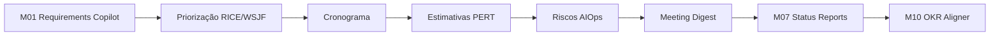
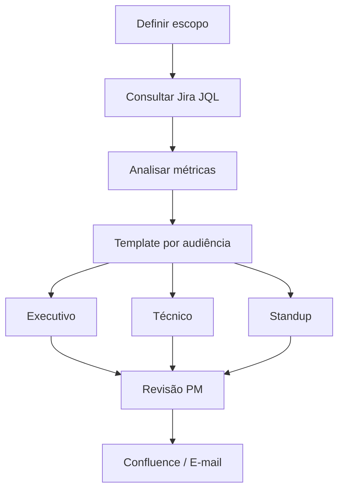

# Relatório — Status Reports / Summary Report com IA (M07)

> **Módulo 7 UNIPDS — Ferramentas de IA para Gestão de Projetos**
> Caso **RouteWise** · PM AI Toolkit (Prof. Ahirton Lopes)

**Referência UNIPDS:** [modulo-07-status-reports](https://github.com/unipds-engenharia-de-ia-aplicada/engenharia-de-software-com-ia-aplicada/tree/main/modulo07-ferramentas-de-ia-para-gestao-de-projetos/modulo-07-status-reports)

**Material local:** [`guia-board-routewise.md`](../guia-board-routewise.md) · [`routewise-jira-import.csv`](../routewise-jira-import.csv)

---

## 1. Resumo executivo

O **Status Report** (ou **Summary Report**) transforma **dados operacionais do Jira** em **narrativas de status** para stakeholders — eliminando horas de consolidação manual.

Tese central do Módulo 7.2 (UNIPDS):

> **O mesmo dado bruto gera três relatórios para três audiências.**

Um snapshot do board alimenta formatos distintos — executivo, técnico e standup — cada um com profundidade e vocabulário adequados ao leitor.

Fecha o ciclo aberto no **M01**: na discovery, Carlos pedia dashboard automático — *"hoje levo duas horas exportando pro Excel e mandando por e-mail pro diretor"*.

---

## 2. Posicionamento na trilha RouteWise



| Módulo anterior | Como alimenta o Status Report |
|-----------------|-------------------------------|
| M01 — Discovery | Épicos e OKRs = contexto estratégico |
| M05 — Riscos | Blockers, LT, velocity |
| M06 — Meeting Digest | Decisões recentes complementam o report |

---

## 3. Conceito: três artefatos, três direções

| Artefato | Input | Output |
|----------|-------|--------|
| Requirements Copilot (M01) | Transcrição não estruturada | Stories, Gherkin, Jira |
| Meeting Digest (M06) | Ata de reunião | Ações, decisões |
| **Status Report (M07)** | **Dados Jira + contexto** | **Narrativa por audiência** |

A IA **não inventa progresso** — interpreta, agrupa e redige. O PM valida antes de enviar ao board.

---

## 4. Pipeline



### JQL típico (RouteWise)

```jql
project = "RW" AND sprint = "Sprint 4" AND status = Done
project = "RW" AND status IN ("Em Progresso", "Fazendo")
project = "RW" AND labels = "bloqueado hardware"
```

---

## 5. Três relatórios, três audiências

### 5.1 Executivo (Summary Report)

**Para:** Carlos, diretoria, board de julho  
**Estrutura:** status 🟢🟡🔴 · métricas · highlights · blockers · prioridades

**Exemplo Sprint 4:**

| Métrica | Valor |
|---------|-------|
| SP entregues | 22/30 (73%) |
| Concluídas | US-01 (8 SP), US-05 (14 SP) |
| Em progresso | US-02, US-06 |
| Bloqueada | US-03 (hardware v2) |
| Bugs resolvidos | BUG-S4-01 a 06 |
| Bugs abertos | BUG-S4-07 a 11 |

**Status sugerido:** 🟡 At Risk — US-03 bloqueia OKR 1 KR 1.2; BUG-S4-10 afeta 43 veículos v1.

### 5.2 Técnico (team-level)

**Para:** Priya, Marcus, time dev  
**Estrutura:** completed / in-progress / blocked com issue keys, assignee, root cause

**Métricas de fluxo (M05):**

| Métrica | RouteWise | Sinal |
|---------|-----------|-------|
| Lead Time | 6,2 → 10,8 dias | ⚠️ fila Blocked |
| Bugs S4 | 11 abertos / 6 resolvidos | ⚠️ saldo negativo |

### 5.3 Daily Standup

**Para:** cerimônia diária  
**Estrutura:** ontem / hoje / blockers (breve)

---

## 6. Snapshot Sprint 4 (guia oficial)

Estado que o output da aula deve refletir ([`guia-board-routewise.md`](../guia-board-routewise.md)):

| Issue | Descrição | Status |
|-------|-----------|--------|
| ROUTEWISE-201 | US-01 Alertas de Velocidade | Feito |
| ROUTEWISE-202 | US-05 Dashboard Base | Feito |
| ROUTEWISE-203 | US-02 Manutenção Preditiva | Fazendo |
| ROUTEWISE-204 | US-03 Score de Comportamento | A fazer (bloqueado) |
| ROUTEWISE-205 | US-06 Painel de Motoristas | Fazendo |
| ROUTEWISE-206–211 | BUG-S4-01 a 06 | Feito |
| ROUTEWISE-212–216 | BUG-S4-07 a 11 | A fazer |

**Story points entregues:** 22/30

### Bugs abertos — impacto no report

| Bug | Impacto |
|-----|---------|
| BUG-S4-07 | Mapa não centraliza ao clicar alerta |
| BUG-S4-08 | Score errado na troca de turno |
| BUG-S4-10 | **43 veículos v1 sem alertas compliance** |
| BUG-S4-11 | Dashboard não carrega Safari iOS (Carlos mobile) |

---

## 7. Ligação com OKRs

| KR | Status Sprint 4 | Mensagem |
|----|-----------------|----------|
| KR 1.1 — Acidentes velocidade | US-01 entregue | 🟢 |
| KR 1.2 — Score comportamental | US-03 bloqueada | 🔴 |
| KR 2.1 — Custo manutenção | US-02 em progresso | 🟡 |

Ver definição de OKR em [`RELATORIO_OKRS.md`](./RELATORIO_OKRS.md).

---

## 8. Princípios de qualidade

| Princípio | Aplicação |
|-----------|-----------|
| Data-driven | 22/30 SP, 6 bugs resolvidos, 43 veículos afetados |
| Audience-first | Executivo = negócio; time = issue keys |
| Actionable | Blocker + dono + ação |
| Sem alucinação | Status derivado do Jira |
| Human-in-the-loop | PM revisa antes do board |

---

## 9. Ferramentas

| Ferramenta | Papel |
|------------|-------|
| Jira Cloud | Fonte de verdade |
| JQL | Queries por sprint/status/label |
| LLM | Redação por audiência |
| Confluence | Publicação recorrente |
| MCP Atlassian | Automação Jira → report → Confluence |

---

## 10. Critérios de sucesso (aula M07)

- [ ] Board no snapshot Sprint 4
- [ ] Três relatórios do mesmo dado bruto
- [ ] Executivo 🟡/🔴 justificado (US-03, BUG-S4-10)
- [ ] Métricas: 22/30 SP
- [ ] Revisão humana documentada

---

## 11. Relação com outros relatórios

| Relatório | Conexão |
|-----------|---------|
| [`RELATORIO_M01_REQUISITOS_IA.md`](./RELATORIO_M01_REQUISITOS_IA.md) | Pedido original de Carlos (relatório semanal) |
| [`RELATORIO_M05_RISCOS_AIOPS_PT1.md`](./RELATORIO_M05_RISCOS_AIOPS_PT1.md) | Métricas LT e bugs como insumo |
| [`RELATORIO_RICE_VS_WSJF.md`](./RELATORIO_RICE_VS_WSJF.md) | OKRs e priorização no report executivo |

---

*Relatório elaborado para o repositório pos-unipds-IA · Módulo 7 — Gestão de Projetos com IA*
