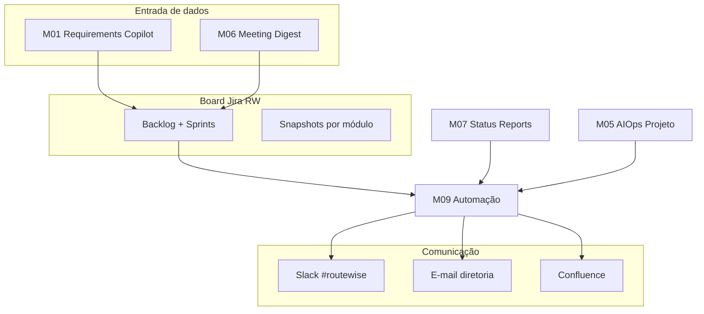
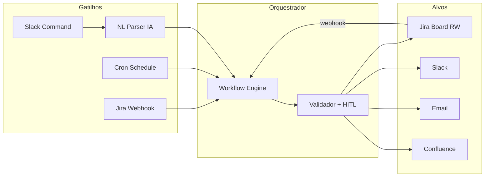

# Relatório — Módulo 09: Automação de Boards e Comunicação

> **Módulo 7 UNIPDS — Ferramentas de IA para Gestão de Projetos**
> **PM AI Toolkit** · Caso **RouteWise** (Prof. Ahirton Lopes)

**Referência UNIPDS:** [modulo-09-automacao-de-ecossistema](https://github.com/unipds-engenharia-de-ia-aplicada/engenharia-de-software-com-ia-aplicada/tree/main/modulo07-ferramentas-de-ia-para-gestao-de-projetos/modulo-09-automacao-de-ecossistema)

**Material local:** [`guia-board-routewise.md`](../guia-board-routewise.md) · [`routewise-jira-import.csv`](../routewise-jira-import.csv) · [`jira-estado-board.md`](../jira-estado-board.md)

**Demo complementar:** [`RELATORIO_M09_NL_TO_WORKFLOW_JIRA_SLACK.md`](./RELATORIO_M09_NL_TO_WORKFLOW_JIRA_SLACK.md) — parsing NL + sync Jira-Slack

---

## 1. Resumo executivo

O **Módulo 09 — Automação de Boards e Comunicação** fecha o loop operacional do PM AI Toolkit: depois de estruturar requisitos (M01), priorizar (M02), planejar (M03–M04), monitorar riscos (M05), sintetizar reuniões (M06) e gerar status reports (M07), o time precisa que o **board Jira** e os **canais de comunicação** (Slack, e-mail, Confluence) funcionem **sem trabalho manual repetitivo**.

Duas frentes integradas:

| Frente | O que automatiza | Ferramentas |
|--------|------------------|-------------|
| **Automação de boards** | Status, labels, assignee, snapshots por sprint, scripts API | Jira Automation, REST API, CSV import |
| **Automação de comunicação** | Notificações, digest, relatórios, escalação | Slack, e-mail, Confluence, LLM |

Tese do módulo:

> *O board é a fonte de verdade; a comunicação é o reflexo em tempo real — IA conecta os dois.*

Na discovery, Carlos pedia exatamente isso: *dashboard automático* e *relatório semanal pro diretor sem 2h de Excel*. O M09 implementa essa promessa no **ecossistema de gestão**, não só no produto RouteWise.

---

## 2. Posicionamento na trilha RouteWise



| Módulo | Entrega que o M09 consome ou amplifica |
|--------|----------------------------------------|
| **M01** | Cards Jira, labels, épicos, components |
| **M05** | Alertas quando LT sobe ou bugs acumulam |
| **M06** | Ações de reunião → transições no board |
| **M07** | Status report → post Slack + e-mail (US-07) |
| **M09** | **Orquestração board ↔ canais** |
| **M10** | OKRs refletidos em épicos no board |

---

## 3. Automação de boards (Jira)

### 3.1 Board como artefato vivo

O projeto **RouteWise** (`RW`) usa template **Scrum**:

- **Backlog** com épicos (`[EPIC] Segurança…`, `[EPIC] Manutenção Inteligente`)
- **Sprints** 1–5+ importados via CSV
- **Story Points**, **Epic Link**, **Labels**, **Components**
- Colunas: A fazer → Fazendo → Feito (+ estados customizados: bloqueado)

Material: [`routewise-jira-import.csv`](../routewise-jira-import.csv) (~400 issues).

### 3.2 Snapshots por módulo (estado didático)

Cada aula exige um **estado específico** do board — documentado em [`guia-board-routewise.md`](../guia-board-routewise.md):

| Módulo UNIPDS | Estado do board |
|---------------|-----------------|
| M1.2 — Planejamento | Backlog importado; Sprint 1 visível, **não iniciado** |
| M2.3 — Priorização | Igual M1.2; foco em ordenação IA |
| M3.2 — Scheduling | **Sprint 1 ativo** |
| M4.2 — Forecast | Sprint 1 ativo; SP visíveis |
| M5.2 — AIOps Projeto | Sprint 1 concluído; **Sprint 2 ativo** |
| M6.2 — Meeting Digest | Sprint 2 ou 3; bugs visíveis |
| M7.2 — Status Reports | **Sprint 4**; status mistos (22/30 SP) |
| M10.2 — OKR Aligner | Sprint 4 + épicos ligados a KRs |

**Automação:** scripts Node/Python na Parte 3 do guia usam **Jira REST API** para transicionar issues em lote (`configurar-board.mjs`), evitando cliques manuais em dezenas de cards.

### 3.3 Regras de automação no board (Jira Automation)

Padrões RouteWise aplicáveis:

| Gatilho | Condição | Ação automática |
|---------|----------|-----------------|
| Issue criada | `Issue Type = Bug` | Label `bug aberto` + assignee SRE |
| Status → Feito | Sprint ativo | Comentário com DoD checklist |
| Label `bloqueado hardware` | > 5 dias | Flag no board + notificação PM |
| Priority = Highest | Status não muda 48h | Escalar no Slack |
| Sprint fechado | SP não entregues | Mover para sprint seguinte + comentário |

### 3.4 Labels como linguagem de automação

O CSV RouteWise usa labels operacionais que workflows interpretam:

| Label | Significado | Automação típica |
|-------|-------------|------------------|
| `bloqueado hardware` | Depende rastreador v2 | Não puxar para sprint; alerta Carlos |
| `blocker-compliance` | BUG-S4-10 — 43 veículos v1 | P0 + post Slack |
| `bug arrastado` | Débito entre sprints | Incluir em bug bash |
| `entregue` / `em-progresso` | Estado semântico no import | Filtros JQL para status report |
| `infra entregue` | Task de infra done | Liberar dependência downstream |

### 3.5 JQL como API de leitura do board

Queries que alimentam comunicação automatizada:

```jql
project = RW AND sprint in openSprints() AND status != Done
project = RW AND labels = "blocker-compliance" AND status != Done
project = RW AND status changed to Done AFTER -7d
project = RW AND "Epic Link" = "Segurança e Redução de Sinistros"
```

Usadas por: Status Report (M07), Risk Monitor (M5.2), NL to Workflow (M09 demo).

---

## 4. Automação de comunicação

### 4.1 Canais no caso RouteWise

| Canal | Papel | Exemplo no backlog |
|-------|-------|-------------------|
| **Slack `#routewise`** | Ops em tempo real | Deploy CI, alertas duplicados (BUG-S4-01), digest |
| **E-mail** | Diretoria, RH, jurídico | Relatório executivo US-07 |
| **Confluence** | ADRs, status reports, runbooks | ADR-003 integração SAP |
| **Push (FCM)** | Motoristas/supervisores | Produto — fora do M09, mas origem dos alertas |

### 4.2 US-07 — Relatório executivo automatizado

Story no CSV (Sprint 5):

> *Como Carlos, quero receber automaticamente toda segunda-feira um relatório executivo… enviado por **e-mail e Slack**.*

Critérios de aceite:

- Geração **segunda 07h30**
- Conteúdo: alertas, velocity, KPIs manutenção, comparativo semanal
- PDF com gráficos; geração < 30s

**Workflow M09:**

```
Cron 07:30 seg → JQL sprint + alertas 7d → LLM Status Report (M07) → PDF → Slack + e-mail
```

Fecha pedido da discovery: *"dashboard automático… sem 2h de Excel"*.

### 4.3 Notificações de pipeline (board ↔ Slack)

Task infra no CSV:

> *Notificação Slack no canal #routewise a cada deploy em staging e prod*

```
GitHub Actions deploy → webhook → Slack post + Jira comment na issue INFRA
```

### 4.4 Escalação de alertas (discovery → comunicação)

Carlos na transcrição:

> *"Supervisor precisa saber já… se não atender, escala pra coordenação."*

No **produto** RouteWise isso é push/GPS; no **M09** o padrão equivalente é:

```
Issue Jira bloqueada > X min → @coordenação no Slack + link RW-xxx
```

Mesma lógica de **escalação hierárquica**, domínio gestão de projeto.

### 4.5 Meeting Digest (M06) → board → Slack

Fluxo integrado:

1. IA resume standup/planning (M06)
2. Extrai ações: *"Priya corrige BUG-S4-10 em 48h"*
3. Cria/atualiza issues Jira
4. Post resumo no `#routewise` com links

---

## 5. Arquitetura integrada M09



### 5.1 Padrões de sync

| Direção | Caso RouteWise |
|---------|----------------|
| **Jira → Slack** | Issue Done → "US-01 entregue 🎉" |
| **Jira → E-mail** | US-07 relatório segunda |
| **Slack → Jira** | `/rw bug dashboard CSV BOM` |
| **CI → Jira + Slack** | Deploy staging |
| **IA → Confluence** | Status report publicado (M07) |

### 5.2 Human-in-the-loop

| Ação | Gate |
|------|------|
| Fechar sprint | PM confirma |
| Delete / bulk update | Bloqueado |
| NL ambíguo | Bot pergunta no thread |
| Dados LGPD | Não postar PII no Slack público |
| Relatório diretoria | PM revisa antes do envio |

Paralelo **Nexus M6 ChatOps:** `GESTOR-APROVA` para infra; M09 usa confirmação para mutações críticas no board.

---

## 6. Demo NL to Workflow (submódulo)

A demo **NL to Workflow — RouteWise** (*Parsing de linguagem natural + sincronização Jira-Slack*) é o **caso avançado** do M09: o PM fala em linguagem natural e a IA executa workflow determinístico.

Exemplo:

> *"Quando BUG-S4-10 for resolvido, avise #routewise e mova US-03 para em progresso."*

Detalhamento completo: [`RELATORIO_M09_NL_TO_WORKFLOW_JIRA_SLACK.md`](./RELATORIO_M09_NL_TO_WORKFLOW_JIRA_SLACK.md).

---

## 7. Exemplos reais RouteWise

### 7.1 Sprint 4 — board + comunicação alinhados

Estado M7.2/M9 (guia):

| Issue | Status | Comunicação esperada |
|-------|--------|----------------------|
| US-01, US-05 | Feito | Highlight no report segunda |
| US-03 | Bloqueado hardware | Alerta Slack + label visível |
| BUG-S4-10 | Aberto P0 | `@channel` compliance — 43 veículos |
| BUG-S4-01 | Resolvido | Post mortem: dedup alertas Slack |

### 7.2 BUG-S4-01 — board e Slack acoplados

Steps to reproduce no CSV:

> *Observar canal Slack #routewise: mesmo alerta recebido múltiplas vezes*

Automação pós-fix: regra Jira *Done* → Slack *"Dedup alertas deployado"* + métrica falsos positivos.

### 7.3 Script API — automação de snapshot

O guia fornece `configurar-board.mjs` / Python equivalente:

- Transiciona `ROUTEWISE-201`, `202` → Feito
- `203`, `205` → Fazendo
- Bugs 206–211 → Feito; 212–216 → A fazer

**Valor:** reproducibilidade didática + base para CI que valida estado do board antes de demos.

---

## 8. Ferramentas

| Ferramenta | Uso no M09 |
|------------|------------|
| **Jira Cloud** | Board, Automation, webhooks |
| **Jira REST API** | Scripts snapshot, bulk transition |
| **Slack API** | `chat.postMessage`, slash commands |
| **Gemini / GPT** | NL parsing, digest, status report |
| **n8n / Make / GitHub Actions** | Orquestração |
| **MCP Atlassian** | Agente Cursor: JQL + Confluence |
| **Confluence** | Repositório de reports e ADRs |

---

## 9. Métricas de sucesso da automação

| Métrica | Baseline (manual) | Meta M09 |
|---------|-------------------|----------|
| Tempo relatório Carlos | ~2h/semana (discovery) | < 5 min revisão |
| Latência issue Done → Slack | Horas (manual) | < 1 min |
| Issues bloqueadas invisíveis | Frequentes | 0 com label + alerta |
| Snapshots board para aula | 30+ min cliques | Script < 2 min |
| Falsos positivos comunicação | BUG-S4-01 (alertas dup) | Dedup + monitoramento |

---

## 10. Riscos e mitigações

| Risco | Mitigação |
|-------|-----------|
| Spam no Slack | Debounce, dedup, canal vs DM |
| Parser NL erra issue | Confirmar antes de executar |
| Board diverge da realidade | Single source of truth = Jira |
| LGPD em notificações | Só IDs/links; sem dados motorista |
| Automação opaca | Audit log: quem/o quê/quando |

---

## 11. Critérios de sucesso (aula M09)

- [ ] ≥1 regra **Jira Automation** ou script API documentado
- [ ] ≥1 fluxo **Jira → Slack** (webhook ou cron)
- [ ] ≥1 fluxo **comunicação → board** (Slack/NL → issue ou transição)
- [ ] US-07 ou equivalente: report agendado segunda 07h30
- [ ] Snapshot Sprint 4 reproduzível via script ou checklist
- [ ] HITL definido para ações críticas
- [ ] Cross-link com M07 Status Report e M06 Digest

---

## 12. Relação com outros relatórios

| Relatório | Conexão |
|-----------|---------|
| [`RELATORIO_M01_REQUISITOS_IA.md`](./RELATORIO_M01_REQUISITOS_IA.md) | Vocabulário do board |
| [`RELATORIO_M07_STATUS_REPORTS_IA.md`](./RELATORIO_M07_STATUS_REPORTS_IA.md) | Conteúdo dos reports automatizados |
| [`RELATORIO_M05_RISCOS_AIOPS_PT1.md`](./RELATORIO_M05_RISCOS_AIOPS_PT1.md) | Telemetria do board → alertas |
| [`RELATORIO_M09_NL_TO_WORKFLOW_JIRA_SLACK.md`](./RELATORIO_M09_NL_TO_WORKFLOW_JIRA_SLACK.md) | Demo NL parsing |
| [`RELATORIO_OKRS.md`](./RELATORIO_OKRS.md) | Épicos no board ligados a KRs |
| [`RELATORIO_M10_PORTFOLIO_OKRS_IA.md`](./RELATORIO_M10_PORTFOLIO_OKRS_IA.md) | OKR Aligner — consolida estratégia |
| [`RELATORIO_DANGER_JS.md`](./RELATORIO_DANGER_JS.md) | Automação PR (código) vs M09 (gestão) |

---

## 13. Paralelos no mundo real

| Prática | Similaridade |
|---------|--------------|
| Jira + Slack app Atlassian | Sync básico |
| Microsoft Teams + Azure DevOps | Mesmo padrão board ↔ chat |
| PagerDuty escalations | Escalação Carlos → coordenação |
| Statuspage / incident comms | Status report externo |
| Nexus ChatOps (M6) | NL + governança em **infra** |

O M09 aplica o mesmo princípio — **automação com governança** — ao **board Scrum** e aos **stakeholders de negócio** (Carlos, diretoria, Priya).

---

## 14. Conclusão

**Automação de Boards e Comunicação** transforma o Jira RouteWise de planilha estática em **sistema nervoso** do projeto: cada mudança de status propaga informação certa, no canal certo, no momento certo — com IA para parsing, redação e orquestração, e humanos para decisões que importam.

O módulo consolida todo o PM AI Toolkit: o que nasceu como transcrição de discovery (M01) volta ao Carlos como **relatório automático na segunda-feira**, sem as 2 horas de Excel — porque board e comunicação finalmente falam a mesma língua.

---

*Relatório elaborado para o repositório pos-unipds-IA · Módulo 7 — M09 Automação de Boards e Comunicação*
