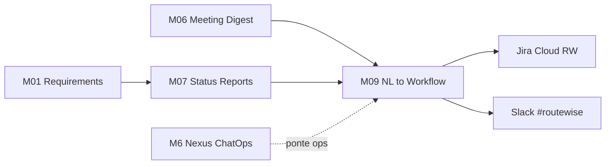
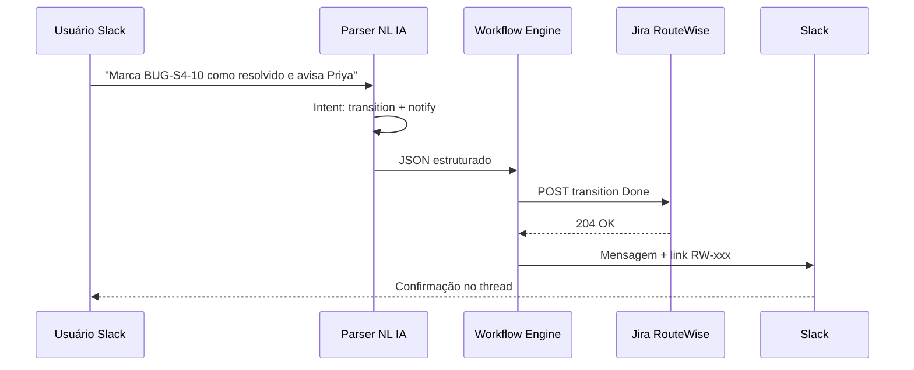
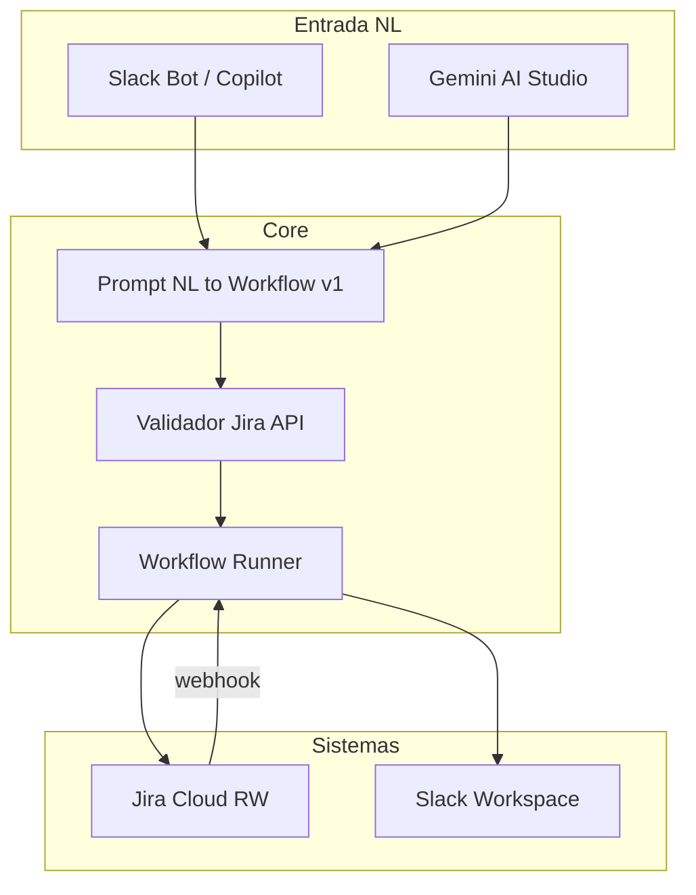

# Relatório — NL to Workflow: Parsing de Linguagem Natural + Sincronização Jira-Slack (M09)

> **Módulo 7 UNIPDS — Ferramentas de IA para Gestão de Projetos**
> Demo: **NL to Workflow — RouteWise** · PM AI Toolkit (Prof. Ahirton Lopes)
> *Parsing de linguagem natural + sincronização Jira-Slack*

**Referência UNIPDS:** [modulo-09-automacao-de-ecossistema](https://github.com/unipds-engenharia-de-ia-aplicada/engenharia-de-software-com-ia-aplicada/tree/main/modulo07-ferramentas-de-ia-para-gestao-de-projetos/modulo-09-automacao-de-ecossistema)

**Relatório principal M09:** [`RELATORIO_M09_AUTOMACAO_BOARDS_COMUNICACAO.md`](./RELATORIO_M09_AUTOMACAO_BOARDS_COMUNICACAO.md)

**Material local RouteWise:** [`routewise-jira-import.csv`](../routewise-jira-import.csv) · [`guia-board-routewise.md`](../guia-board-routewise.md)

---

## 1. Resumo executivo

O **NL to Workflow** (Natural Language to Workflow) é a camada de **automação de ecossistema** do PM AI Toolkit: o PM ou stakeholder descreve uma intenção em **linguagem natural** (Slack, chat ou prompt) e a IA **interpreta, estrutura e executa** ações em ferramentas conectadas — tipicamente **Jira** (backlog, status, assignee) e **Slack** (notificações, aprovações, digest).

Tese da demo RouteWise:

> *De frase solta no chat → workflow determinístico que mantém Jira e Slack sincronizados.*

Exemplo de intenção:

> *"Quando BUG-S4-10 for resolvido, avise o #routewise e mova US-03 para em progresso se o hardware chegou."*

A IA faz o **parsing** (extrair entidades, condições, ações) e dispara o **workflow** (webhook Jira → atualização Slack, ou comando Slack → transição Jira).

---

## 2. Posicionamento na trilha RouteWise



| Módulo | Relação com NL to Workflow |
|--------|----------------------------|
| **M01** | Stories e labels no Jira são o vocabulário que o parser reconhece |
| **M06** | Digest de reunião → ações automáticas no board |
| **M07** | Status report pode ser **disparado** por workflow (segunda 07h30) |
| **M09** | **Orquestração** Jira ↔ Slack via NL |
| **M6 Nexus Lab 6** | ChatOps em **infra** (Terraform); M09 em **gestão de projeto** |

---

## 3. O que é NL to Workflow?

### 3.1 Componentes

| Camada | Função | Tecnologia típica |
|--------|--------|-------------------|
| **Input NL** | Frase do usuário no Slack ou copilot | Slack slash command, Gemini, GPT |
| **Parser / Intent** | Extrair intenção, entidades, condições | LLM + schema JSON (Zod) |
| **Workflow engine** | Executar passos na ordem correta | n8n, Make, GitHub Actions, custom |
| **Jira API** | CRUD issues, transições, comentários | REST `/rest/api/3/` |
| **Slack API** | Post message, thread, bot | `chat.postMessage`, webhooks |

### 3.2 Fluxo geral



---

## 4. Parsing de linguagem natural

### 4.1 O que o parser extrai

| Campo | Exemplo NL | Valor estruturado |
|-------|------------|-------------------|
| **Ação** | "move para feito" | `transition: Done` |
| **Alvo** | "BUG-S4-10" | `issueKey: RW-290` |
| **Condição** | "se Priya aprovar" | `gate: approval @priya` |
| **Notificação** | "avisa no #routewise" | `channel: #routewise` |
| **Agendamento** | "toda segunda 7h30" | `cron: 0 30 7 * * 1` |

### 4.2 Schema de intent (exemplo)

```json
{
  "intent": "jira_transition_and_notify",
  "issueKey": "RW-290",
  "transition": "Done",
  "slack": {
    "channel": "#routewise",
    "message": "BUG-S4-10 resolvido — guard hardware separado de score."
  },
  "confidence": 0.92,
  "requires_confirmation": true
}
```

### 4.3 Regras de qualidade (espelhando Requirements Copilot)

- Não inventar issue keys — validar contra projeto `RW`
- Ambiguidade → perguntar no thread Slack antes de executar
- Ações destrutivas (delete, close sprint) → **HITL** (aprovação explícita)
- Log de auditoria: quem pediu, o que a IA interpretou, o que executou

**Paralelo M6 Nexus:** Lab 6 ChatOps usa `GESTOR-APROVA` para Terraform destroy; M09 usa aprovação para transições críticas no Jira.

---

## 5. Sincronização Jira-Slack

### 5.1 Direções de sync

| Direção | Gatilho | Ação |
|---------|---------|------|
| **Jira → Slack** | Issue criada/atualizada (webhook) | Post no `#routewise` com summary + link |
| **Slack → Jira** | Comando `/rw bug ...` ou NL | Cria issue tipo Bug no sprint ativo |
| **Bidirecional** | Comentário Jira | Espelha thread Slack (e vice-versa) |

### 5.2 Exemplos reais no backlog RouteWise

O CSV local já modela integração Slack:

| Artefato | Referência Slack |
|----------|------------------|
| Pipeline CI/CD | Notificação `#routewise` a cada deploy staging/prod |
| BUG-S4-01 | Repro steps: observar **canal Slack** — alertas duplicados |
| Relatório semanal | Gerado segunda **07h30** — e-mail **e Slack** |

Isso mostra que RouteWise trata Slack como **canal operacional**, não só chat social.

### 5.3 Webhook Jira → Slack (padrão)

```yaml
# Conceitual — Jira Automation ou n8n
trigger: issue_updated
filter: project = RW AND status changed
action:
  - post_slack:
      channel: "#routewise"
      text: "{{issue.key}} → {{issue.status}}: {{issue.summary}}"
      link: "https://SEU-DOMINIO.atlassian.net/browse/{{issue.key}}"
```

### 5.4 NL → Jira (padrão demo)

Entrada:

> *"Cria bug High: CSV exportado sem BOM no Excel Windows, componente dashboard, sprint 5"*

Saída estruturada → API Jira:

```json
{
  "fields": {
    "project": { "key": "RW" },
    "issuetype": { "name": "Bug" },
    "priority": { "name": "High" },
    "summary": "CSV exportado sem BOM no Excel Windows",
    "components": [{ "name": "dashboard" }],
    "customfield_sprint": "Sprint 5"
  }
}
```

Equivalente manual ao que o **Requirements Copilot** gera como card — aqui disparado por **chat**.

---

## 6. Workflows RouteWise exemplificados

### 6.1 Escalação de alerta (discovery → automação)

Na discovery, Carlos pediu escalação supervisor → coordenação. Workflow NL:

```
QUANDO alerta velocidade não reconhecido em X min
ENTÃO post #routewise + @coordenação
E criar sub-task Jira ligada a US-01
```

Parser extrai `X` como `[A CONFIRMAR]` — workflow só ativa após PM fixar SLA no Jira custom field.

### 6.2 Bug crítico → standup automático

```
QUANDO bug label blocker-compliance aberto > 48h
ENTÃO resumo NL no #routewise
E sugerir ação: "Priorizar BUG-S4-10"
```

Conecta **M05 Riscos** (métricas) + **M09** (notificação).

### 6.3 Status report agendado (ponte M07)

```
TODA segunda 07:30
ENTÃO JQL sprint ativo
E gerar Status Report executivo (M07)
E postar resumo no #routewise + e-mail Carlos
```

Referência CSV: *"Gerado toda segunda-feira às 07h30 e enviado por e-mail e Slack"*.

### 6.4 Deploy → Jira + Slack

Task infra no CSV:

> *Notificação Slack no canal #routewise a cada deploy em staging e prod*

Workflow CI (GitHub Actions) → Jira comment na issue INFRA + Slack message.

---

## 7. Arquitetura recomendada (demo)



| Peça | Responsabilidade |
|------|------------------|
| **System prompt** | Definir intents permitidos, schema JSON, limites |
| **Validador** | Issue existe? Transição legal? Usuário tem permissão? |
| **Runner** | Idempotência — não postar duplicata no Slack |
| **Audit log** | Confluence ou Jira comment com trace da automação |

---

## 8. Intents suportados na demo (M09)

| Intent | Exemplo NL | Ações |
|--------|------------|-------|
| `create_issue` | "Abre bug High no dashboard" | POST Jira |
| `transition_issue` | "Move RW-204 para em progresso" | POST transition |
| `notify_channel` | "Avisa #routewise que US-01 fechou" | Slack post |
| `query_sprint` | "O que falta no sprint 4?" | JQL + resumo NL |
| `link_issues` | "Liga BUG-S4-10 à US-03" | Jira link |
| `schedule_report` | "Manda status toda sexta 17h" | Cron + M07 template |

Intents **proibidos** sem HITL: `delete_issue`, `close_sprint`, `bulk_update`.

---

## 9. Human-in-the-loop e governança

| Risco | Mitigação |
|-------|-----------|
| Parser erra issue key | Confirmar no Slack antes de executar |
| NL ambígua | Bot pergunta clarificação (1 de N opções) |
| Spam no canal | Debounce + dedup (lição BUG-S4-01 — alertas duplicados) |
| Compliance LGPD | Não espelhar dados de motorista no Slack público |
| Auditoria | Log "pedido por @carlos → interpretado como X → executado Y" |

---

## 10. Ferramentas para implementar

| Abordagem | Prós | Contras |
|-----------|------|---------|
| **Jira Automation + Slack** | No-code, nativo | NL limitado |
| **n8n / Make** | Visual, rápido | Custo, hosting |
| **Gemini + script** | Alinhado ao curso | Requer código |
| **MCP Atlassian** | Agente Cursor consulta Jira | Precisa orquestrador |
| **Slack Workflow Builder** | Simples | Pouco flexível |

Demo UNIPDS tipicamente usa **LLM (Gemini)** para parsing + **APIs REST** Jira/Slack.

---

## 11. Critérios de sucesso (aula M09)

- [ ] Intent NL parseado em JSON validável (≥3 exemplos RouteWise)
- [ ] Pelo menos 1 fluxo **Jira → Slack** (webhook issue updated)
- [ ] Pelo menos 1 fluxo **Slack → Jira** (criar ou transicionar issue)
- [ ] Confirmação humana para ações de impacto alto
- [ ] Mensagem no `#routewise` com link clicável para issue Jira
- [ ] Documentação do workflow em markdown (este relatório + diagrama)

---

## 12. Relação com outros relatórios desta pasta

| Relatório | Conexão |
|-----------|---------|
| [`RELATORIO_M01_REQUISITOS_IA.md`](./RELATORIO_M01_REQUISITOS_IA.md) | Vocabulário de stories/bugs que o parser reconhece |
| [`RELATORIO_M07_STATUS_REPORTS_IA.md`](./RELATORIO_M07_STATUS_REPORTS_IA.md) | Report agendado via workflow |
| [`RELATORIO_M05_RISCOS_AIOPS_PT1.md`](./RELATORIO_M05_RISCOS_AIOPS_PT1.md) | Alertas quando LT ou bugs degradam |
| [`RELATORIO_DANGER_JS.md`](./RELATORIO_DANGER_JS.md) | Danger no PR; M09 no board/chat |

---

## 13. Paralelos no mundo real

| Prática | Similaridade |
|---------|--------------|
| **Jira Automation** | Regras if/then sem NL |
| **Slack + Jira app oficial** | Sync básico de notificações |
| **PagerDuty ↔ Slack** | Escalação como Carlos pediu na discovery |
| **Nexus ChatOps (M6)** | NL para ops de infra com governança |
| **Zapier "AI Actions"** | NL → multi-step workflow |

O diferencial do **NL to Workflow** no curso é combinar **interpretação semântica** (LLM) com **governança de PM** (HITL, audit, vocabulário RouteWise) — não apenas notificações automáticas.

---

*Relatório elaborado para o repositório pos-unipds-IA · Módulo 7 — Gestão de Projetos com IA · Demo NL to Workflow RouteWise*
