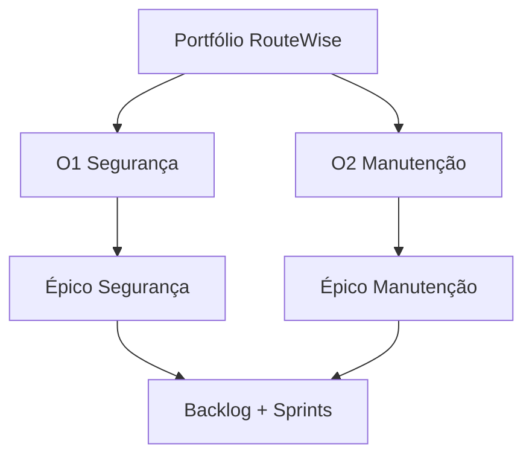
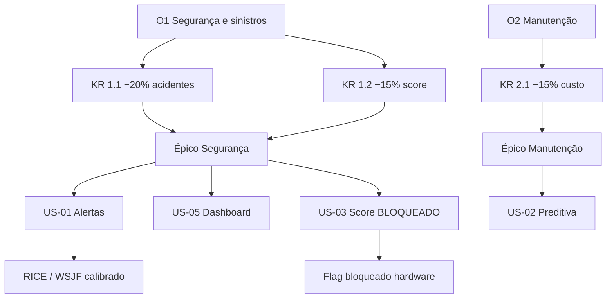
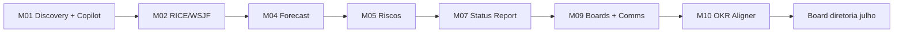

# Relatório — Módulo 10: Portfólio e OKRs com IA

> **Módulo 7 UNIPDS — Ferramentas de IA para Gestão de Projetos**
> **PM AI Toolkit** · Caso **RouteWise** (Prof. Ahirton Lopes)
> Ferramenta central: **OKR Aligner**

**Referência UNIPDS:** [modulo-10-portfolio-e-okrs](https://github.com/unipds-engenharia-de-ia-aplicada/engenharia-de-software-com-ia-aplicada/tree/main/modulo07-ferramentas-de-ia-para-gestao-de-projetos/modulo-10-portfolio-e-okrs)

**Material local:** `[routewise-jira-import.csv](../routewise-jira-import.csv)` · `[guia-board-routewise.md](../guia-board-routewise.md)` · `[transcricao-discovery-routewise.md](../transcricao-discovery-routewise.md)`

**Resumo OKR:** `[RELATORIO_OKRS.md](./RELATORIO_OKRS.md)` · **Priorização:** `[RELATORIO_RICE_VS_WSJF.md](./RELATORIO_RICE_VS_WSJF.md)` (seção 10)

---


## 1. Resumo executivo

O **Módulo 10 — Portfólio e OKRs com IA** eleva a gestão do RouteWise do **backlog tático** (sprints, stories) para a **visão estratégica** (objetivos trimestrais, resultados mensuráveis, portfólio de iniciativas).

Tese do módulo:

> *RICE/WSJF dizem **o que fazer primeiro**; OKRs dizem **para onde ir** — a IA alinha os dois.*

A ferramenta didática **OKR Aligner** usa LLM para:

1. Derivar **Objectives** e **Key Results** a partir da discovery e do backlog Jira
2. Vincular **épicos e stories** a KRs específicos
3. **Sinalizar** itens sem alinhamento estratégico (US-08, US-09, US-10)
4. Calibrar **priorização** — score alto só para o que move KR do board de julho

Fecha o pipeline PM AI Toolkit iniciado no M01: da transcrição de Carlos à apresentação para a diretoria com **métricas de OKR**, não só lista de features.

---


## 2. Portfólio vs backlog vs OKR


| Nível         | Horizonte       | Artefato RouteWise                | Pergunta                                      |
| ------------- | --------------- | --------------------------------- | --------------------------------------------- |
| **Portfólio** | Trimestre / ano | Conjunto de épicos + iniciativas  | *Quais apostas estratégicas estamos fazendo?* |
| **OKR**       | Trimestre       | O1, O2 + KRs 1.1, 1.2, 2.1        | *Como medimos sucesso estratégico?*           |
| **Épico**     | 2–8 semanas     | Segurança, Manutenção Inteligente | *Qual capacidade de negócio entrega o KR?*    |
| **Story**     | Sprint          | US-01, US-05, BUG-S4-10…          | *Qual incremento mede progresso do KR?*       |
| **Task**      | Dias            | INFRA, spikes                     | *Implementação*                               |





---


## 3. OKRs — definição rápida

**OKR** = **Objectives and Key Results** (Objetivos e Resultados-Chave).


| Componente          | Pergunta                 | Regra                                              |
| ------------------- | ------------------------ | -------------------------------------------------- |
| **O — Objective**   | O que queremos alcançar? | Qualitativo, inspirador, **sem números**           |
| **KR — Key Result** | Como medimos?            | `[métrica] de [baseline] para [target] até [data]` |


**Bom KR (RouteWise):** *"Reduzir acidentes por excesso de velocidade em 20% até set/2026"*  
**KR ruim:** *"Melhorar segurança"* (sem %, baseline ou prazo)

Detalhes: `[RELATORIO_OKRS.md](./RELATORIO_OKRS.md)`.

---


## 4. OKR Aligner com IA


### 4.1 O que faz

O **OKR Aligner** (demo M10.2) recebe:

- Transcrição de discovery (`[transcricao-discovery-routewise.md](../transcricao-discovery-routewise.md)`)
- Épicos e stories do Jira (`[routewise-jira-import.csv](../routewise-jira-import.csv)`)
- Contexto de negócio (board de julho, 140 veículos, LGPD)

E produz:

1. **Objectives** (1–2 por trimestre)
2. **Key Results** mensuráveis com baseline e prazo
3. **Mapa de alinhamento** épico → KR → stories
4. **Flags** `[SEM OKR]` para itens fora de estratégia
5. **Recomendações** de priorização alinhada a KR (complementa RICE/WSJF)


### 4.2 O que a IA não faz

- Não substitui decisão da diretoria sobre metas numéricas
- Não inventa baseline sem dado — marca `[BASELINE A CONFIRMAR]`
- Não promove story sem critério de aceite ligado à métrica do KR
- Não resolve conflito estratégico — documenta `[CONFLITO OKR]` para humano


### 4.3 Modos de operação (espelhando Requirements Copilot)


| Modo         | Entrega                                                   |
| ------------ | --------------------------------------------------------- |
| **Completo** | O + KRs + árvore alinhamento + flags + recomendações Jira |
| **Rápido**   | Apenas realinhamento de épicos/stories a KRs existentes   |


---


## 5. OKRs RouteWise (derivados do discovery + CSV)


### 5.1 OKR 1 — Segurança e sinistros

**Contexto discovery:** multas por velocidade, acidente com caminhão acima do limite, alerta em tempo real, board de julho.

```
Objective (O1):
  Tornar a frota RouteWise mais segura e reduzir custos com sinistros.

Key Results:
  KR 1.1 — Reduzir índice de acidentes por excesso de velocidade
           em 20% até setembro de 2026 (baseline Q1 2026).

  KR 1.2 — Reduzir índice de eventos de condução de risco (score comportamental)
           em 15% até setembro de 2026 (depende hardware v2 / acelerômetro).
```

**Épico Jira** (`[routewise-jira-import.csv](../routewise-jira-import.csv)` linha 2):

> `[EPIC] Segurança e Redução de Sinistros` — OKR 1 · KR 1.1


| Story                       | Contribuição ao KR                        | Status Sprint 4 |
| --------------------------- | ----------------------------------------- | --------------- |
| US-01 Alertas velocidade    | KR 1.1 — intervenção antes do sinistro    | **Entregue**    |
| US-05 Dashboard operacional | Visibilidade para diretoria (board julho) | **Entregue**    |
| US-03 Score comportamento   | KR 1.2 — bloqueado hardware v2            | **Bloqueado**   |
| US-06 Painel motoristas     | KR 1.2 parcial (só velocidade)            | Em progresso    |
| US-07 Relatório executivo   | Mede KR 1.1 + 2.1 (dupla convergência)    | Sprint 5        |


### 5.2 OKR 2 — Manutenção inteligente

```
Objective (O2):
  Reduzir custo operacional com manutenção inteligente.

Key Result:
  KR 2.1 — Reduzir custo médio de manutenção corretiva por veículo
           em 15% até setembro de 2026.
```

**Épico Jira** (linha 3 do CSV):

> `[EPIC] Manutenção Inteligente` — OKR 2 · KR 2.1


| Story                             | Contribuição                | Nota             |
| --------------------------------- | --------------------------- | ---------------- |
| US-02 Manutenção preditiva        | KR 2.1 direto               | Em progresso S4  |
| Monitoramento dispositivos        | Evita corretiva emergencial | Entregue parcial |
| US-08 Manutenção preditiva fase 2 | Roadmap longo prazo         | Backlog          |


---


## 6. Árvore de alinhamento OKR → Jira




**Regra de priorização:** dentro do release, WSJF favorece itens que **movem KRs do board de julho** (KR 1.1 + dashboard); fase 2 e itens sem OKR ficam fora do corte do PI atual.

Fonte: `[RELATORIO_RICE_VS_WSJF.md](./RELATORIO_RICE_VS_WSJF.md)` seções 10 e 11.

---


## 7. Itens sem alinhamento OKR (M10.2)

Estado do board na demo **OKR Aligner** (`[guia-board-routewise.md](../guia-board-routewise.md)` M10.2):

> Histórias **US-08, US-09, US-10** permanecem no backlog **sem sprint** — ainda não alinhadas a OKRs.


| Issue     | Título                             | Por que sem OKR                                  |
| --------- | ---------------------------------- | ------------------------------------------------ |
| **US-08** | Integração SAP PM                  | **Descartada** do MVP (POC inviável — ADR-003)   |
| **US-09** | Sensor de baú / temperatura ANVISA | **Fora** do escopo discovery v1; novo domínio    |
| **US-10** | Seguro UBI (telemetria)            | **Fase futura**; depende score completo (KR 1.2) |


**Papel do OKR Aligner:** classificar como `roadmap`, `descartado` ou `spike OKR` — **não** entrar no ranking WSJF até KR explícito.

---


## 8. Posicionamento na trilha (M01 → M10)




| Módulo  | Relação com M10                                                |
| ------- | -------------------------------------------------------------- |
| **M01** | Épicos originados na discovery → insumo dos OKRs               |
| **M02** | RICE/WSJF ordena backlog **dentro** dos KRs                    |
| **M04** | Forecast probabilístico: *% chance de atingir KR até set/2026* |
| **M05** | US-03 bloqueada → risco alto para KR 1.2                       |
| **M07** | Status report mede progresso % dos KRs                         |
| **M08** | LGPD como habilitador (Risk Reduction WSJF, não KR de produto) |
| **M09** | Automação comunica avanço de KR no Slack                       |
| **M10** | **Consolida estratégia** e valida alinhamento                  |


---


## 9. OKR Aligner — output esperado (estrutura)


### Seção 1 — Objectives propostos

Lista O1, O2 com justificativa da discovery.

### Seção 2 — Key Results

Fórmula completa: métrica, baseline, target, prazo, dono (Carlos/diretoria).

### Seção 3 — Mapa épico ↔ KR

Tabela + % de stories do épico ligadas a cada KR.

### Seção 4 — Stories alinhadas / desalinhadas

- ✅ Alinhadas: US-01 → KR 1.1
- ⚠️ Parcial: US-06 → KR 1.2 (só velocidade)
- ❌ Sem OKR: US-08, US-09, US-10
- 🔴 Bloqueio KR: US-03 → KR 1.2 (hardware)


### Seção 5 — Scorecard trimestral (preview)


| KR     | Baseline | Atual | Target | % progresso    | Confiança |
| ------ | -------- | ----- | ------ | -------------- | --------- |
| KR 1.1 | 100      | 85*   | 80     | 50%*           | Média     |
| KR 1.2 | 100      | —     | 85     | 0% (bloqueado) | Baixa     |
| KR 2.1 | R$ X     | —     | −15%   | Em curso       | Média     |


*Valores ilustrativos — exigem baseline real.

### Seção 6 — Recomendações para board de julho

Narrativa executiva: o que apresentar, o que adiar, trade-offs (demo foco KR 1.1 + dashboard).

### Seção 7 — Perguntas abertas

Baseline Q1 2026, definição formal "evento de risco", aprovação diretoria para US-09/US-10.

---


## 10. Integração com What-If e priorização

O `[RELATORIO_WHAT_IF_IA.md](./RELATORIO_WHAT_IF_IA.md)` usa OKRs como **âncora estratégica** em cenários:

- *"E se cortarmos manutenção preditiva no v1?"* → impacto em KR 2.1
- *"E se atrasarmos hardware v2?"* → KR 1.2 inviável; pivotar demo para KR 1.1

**Sequência híbrida sensata** (RICE + WSJF + OKR):

```
RW-06 (LGPD) → RW-03 (dashboard) → RW-05 (regras) ∥ RW-02 (dispositivos) → RW-01 (alerta) → fase 2
```

---


## 11. Estado do board — demo M10.2

Conforme `[guia-board-routewise.md](../guia-board-routewise.md)`:

- **Sprint 4 ativo** (mesmo snapshot M7.2)
- Épicos visíveis com vínculo estratégico:
  - `[EPIC] Segurança e Redução de Sinistros` → **KR 1.1**
  - `[EPIC] Manutenção Inteligente` → **KR 2.1**
- US-08, US-09, US-10 **sem sprint** (não alinhadas)

**Checklist OKR Aligner:**

- [ ] Cada épico tem `OKR n` + `KR n.x` na descrição Jira
- [ ] Nenhuma story no sprint ativo sem KR mapeado (exceto infra/habilitadores)
- [ ] Itens descartados (US-08) com label `backlog descartado`
- [ ] KR 1.2 com flag de risco visível (US-03 bloqueada)

---


## 12. Human-in-the-loop


| Decisão                          | Quem                               |
| -------------------------------- | ---------------------------------- |
| Metas numéricas (20%, 15%)       | Diretoria + Carlos                 |
| Baseline histórica               | Ops + financeiro                   |
| Incluir US-09/US-10 no portfólio | Product / steering committee       |
| Pivot demo board julho           | PM + Carlos                        |
| OKR draft da IA                  | PM valida antes de Confluence/Jira |


Aviso obrigatório no output:

> *⚠️ OKRs propostos por IA — validar baseline, prazo e ownership com stakeholders antes de publicar.*

---


## 13. Ferramentas


| Ferramenta                                | Uso M10                                       |
| ----------------------------------------- | --------------------------------------------- |
| **Gemini AI Studio / OKR Aligner prompt** | Derivar e realinhar OKRs                      |
| **Jira Cloud**                            | Épicos, labels, Epic Link, custom field OKR   |
| **Confluence**                            | Scorecard trimestral, ADRs (ex.: SAP ADR-003) |
| **M07 Status Report**                     | Progresso % KRs para diretoria                |
| **What-If Copilot**                       | Trade-offs estratégicos                       |


---


## 14. Critérios de sucesso (aula M10)

- [ ] ≥2 Objectives com 1–3 KRs mensuráveis cada
- [ ] Épicos CSV alinhados a KRs na descrição
- [ ] US-08/09/10 classificadas (sem OKR / descartado / roadmap)
- [ ] Árvore O → KR → épico → story documentada
- [ ] Scorecard preview para board julho
- [ ] Conflito KR 1.2 (hardware) explicitado com plano de contingência
- [ ] Cross-check com RICE/WSJF — prioridade coerente com KRs

---


## 15. Relação com outros relatórios


| Relatório                                                                                          | Conexão                              |
| -------------------------------------------------------------------------------------------------- | ------------------------------------ |
| `[RELATORIO_OKRS.md](./RELATORIO_OKRS.md)`                                                         | Definição resumida OKR               |
| `[RELATORIO_RICE_VS_WSJF.md](./RELATORIO_RICE_VS_WSJF.md)`                                         | Seção 10 — OKRs + calibração scoring |
| `[RELATORIO_M01_REQUISITOS_IA.md](./RELATORIO_M01_REQUISITOS_IA.md)`                               | Origem dos épicos                    |
| `[RELATORIO_M07_STATUS_REPORTS_IA.md](./RELATORIO_M07_STATUS_REPORTS_IA.md)`                       | Comunicação progresso KR             |
| `[RELATORIO_M09_AUTOMACAO_BOARDS_COMUNICACAO.md](./RELATORIO_M09_AUTOMACAO_BOARDS_COMUNICACAO.md)` | Board reflete OKRs                   |
| `[RELATORIO_WHAT_IF_IA.md](./RELATORIO_WHAT_IF_IA.md)`                                             | Cenários vs KRs                      |
| `[RELATORIO_M05_RISCOS_AIOPS_PT1.md](./RELATORIO_M05_RISCOS_AIOPS_PT1.md)`                         | Riscos a KRs                         |


---


## 16. Conclusão

O **Módulo 10** encerra o PM AI Toolkit conectando **execução ágil** (sprints, bugs, velocity) à **estratégia de portfólio** (OKRs). O **OKR Aligner** garante que cada entrega RouteWise — desde US-01 até o relatório de segunda-feira — possa responder: *"Qual Key Result isso move?"*

Para Carlos e a diretoria, isso transforma o board de julho de demo de features em **apresentação de resultados**: −20% acidentes, dashboard ao vivo, plano honesto para KR 1.2 com hardware atrasado — exatamente o que a discovery pedia, agora com linguagem que a diretoria entende.

---

*Relatório elaborado para o repositório pos-unipds-IA · Módulo 7 — M10 Portfólio e OKRs com IA*