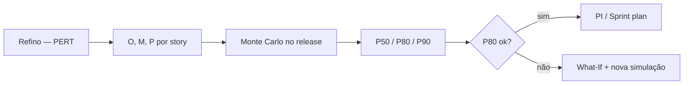

# Relatório — PERT e Monte Carlo: Guia Didático de Estimativas

> **Módulo 7 — Estimativas e Previsões** · Caso **RouteWise**
> "Troque a 'bola de cristal' pela matemática da incerteza."

---

## 1. O Problema: A Armadilha do "Número Mágico"

Imagine Carlos, o Diretor de Operações, perguntando: *"Quanto tempo leva para entregar o Alerta de Velocidade?"*. 
A resposta padrão costuma ser: *"3 semanas"*.

**O problema?** Esse número é uma aposta cega. Ele ignora que a API de Mapas pode atrasar, que o dev sênior pode ficar doente ou que os rastreadores v2 podem não chegar a tempo. 

As estimativas probabilísticas (PERT e Monte Carlo) substituem o "número único" por uma **faixa de possibilidades**.

---

## 2. PERT: A Média Ponderada (A Sabedoria das 3 Visões)

O PERT é como planejar uma viagem com três amigos: o **Otimista**, o **Pessimista** e o **Realista**.

### 2.1 Como funciona (Didática)
Em vez de um palpite, você colhe três:
1.  **O (Otimista):** "Tudo deu certo, a API funcionou de primeira."
2.  **M (Mais Provável):** "O dia a dia normal, com os probleminhas de sempre."
3.  **P (Pessimista):** "Tudo que podia dar errado, deu (dentro do razoável)."

**A "Mágica" do PERT:** Ele dá um peso maior (4x) ao cenário Realista, mas não ignora os extremos.

**A Fórmula Simples:**
`Resultado = (Otimista + 4×Realista + Pessimista) / 6`

### 2.2 Exemplo no RouteWise (Item RW-01)
*   **Otimista:** 15 dias
*   **Realista:** 21 dias
*   **Pessimista:** 34 dias

**PERT:** `(15 + 4×21 + 34) / 6 = 22 dias`
*Note que a média subiu para 22 dias (o otimismo de 15 foi 'puxado' para cima pelo risco de 34).*

### 2.3 Quando usar?
*   Para estimar **uma tarefa específica** ou um conjunto pequeno.
*   Quando você só tem uma calculadora ou papel e caneta.
*   Para conversas rápidas de refino técnico.

---

## 3. Monte Carlo: O Simulador de Futuros (A Máquina do Tempo)

Se o PERT é uma fórmula, o Monte Carlo é uma **simulação**. Imagine o Doutor Estranho (Marvel) olhando 14 milhões de futuros possíveis para ver em quantos eles vencem. É exatamente isso que o computador faz com o seu projeto.

### 3.1 Como funciona (Didática)
O computador pega suas estimativas (O, M, P) e "joga os dados" milhares de vezes.
*   Na rodada #1, ele supõe que a tarefa A foi rápida, mas a B foi lenta.
*   Na rodada #2, supõe que tudo atrasou.
*   Na rodada #1.547, supõe que tudo foi perfeito.

No final, ele te entrega um gráfico (histograma) mostrando as chances.

### 3.2 O que ele te diz?
Ele não diz "acaba dia 10". Ele diz:
*   "Você tem **50% de chance** de acabar dia 10 (P50)." -> *Cuidado! É como jogar uma moeda.*
*   "Você tem **80% de chance** de acabar dia 15 (P80)." -> *Aqui é um compromisso seguro.*
*   "Você tem **95% de chance** de acabar dia 20 (P95)." -> *Para quem não pode errar de jeito nenhum.*

### 3.3 Quando usar?
*   Para o **projeto inteiro** (Release v1).
*   Quando as tarefas dependem uma da outra (o atraso de uma 'atropela' a outra).
*   Para dar prazos à diretoria (Board de Julho) com segurança estatística.

---

## 4. Comparativo Lado a Lado

| Característica | PERT | Monte Carlo |
| :--- | :--- | :--- |
| **O que é?** | Uma fórmula matemática simples. | Uma simulação computacional. |
| **Esforço** | Baixo (calcula em 1 minuto). | Médio (precisa de ferramenta ou script). |
| **Visão** | Foca no valor "médio" esperado. | Foca na **probabilidade** de sucesso. |
| **Complexidade** | Trata cada tarefa de forma isolada. | Entende o efeito dominó (dependências). |
| **Analoga** | Um termômetro (mede o agora). | Um GPS (calcula rotas e trânsito futuro). |

---

## 5. Quando usar PERT, Monte Carlo ou os dois juntos?

### 5.1 Resposta rápida

| Situação | Use |
|----------|-----|
| Uma story no refino / planning | **PERT** |
| Release ou PI com deadline (board de julho) | **Monte Carlo** |
| Processo completo RouteWise | **Os dois** — PERT nas stories, Monte Carlo no release |

---

### 5.2 Quando usar só **PERT**

Use quando a pergunta é: *“Quanto leva **esta** tarefa?”*

**Bom para:**
- Refinamento de **uma story** (ex.: RW-01 alerta de velocidade)
- Workshop de 15–30 min (O, M, P na calculadora)
- Comparar planning poker (21 SP) com valor esperado PERT (~22 SP)
- Caminho **curto e em série** (2–4 tarefas encadeadas)

**Evite PERT sozinho para:**
- Prometer data ao diretor com % de confiança
- Release inteiro com trabalho em **paralelo**
- Muitos riscos ligados (mesma API GIS, mesmo time)

**Frase típica:** *“Esta story: esperado ~22 SP, faixa ~17–27.”*

---

### 5.3 Quando usar só **Monte Carlo**

Use quando a pergunta é: *“Com **qual chance** terminamos antes de julho?”*

**Bom para:**
- **Release v1** RouteWise (~95 SP, velocity variável)
- Velocity **não fixa** (ex.: triangular 32 – 40 – 48 SP/sprint)
- **Dependências** (LGPD → dashboard; dispositivos → alerta)
- Comunicação com **diretoria** (P80, não “acho que dá”)
- Depois de um **What-If** (cortar escopo e ver novo P80)

**Evite Monte Carlo sem:**
- Scope total (SP do release) definido
- Velocity mínima/média/máxima ou histórico
- Prazo ou número de sprints até o deadline

**Frase típica:** *“Com 80% de confiança, terminamos em 4 sprints.”*

---

### 5.4 Quando usar **os dois juntos** (recomendado)

PERT e Monte Carlo **não competem** — o PERT **alimenta** o Monte Carlo.

| Fase RouteWise | Ferramenta | Entrega |
|----------------|------------|---------|
| Discovery + flags | Copilot | Ambiguidades → alimentam **P** |
| Refino por story | **PERT** | O/M/P → E (ex.: RW-01 ≈ 20,8 SP) |
| PI / diretoria | **Monte Carlo** | 95 SP + velocity → **P80** em X sprints |
| P80 inaceitável | What-If | Novo scope → rodar MC de novo |

**PERT** mede incerteza **de cada pedaço**.  
**Monte Carlo** combina pedaços + capacidade + (opcional) dependências.

---

### 5.5 Tabela de decisão

| Pergunta que você está fazendo | PERT | Monte Carlo |
|--------------------------------|------|-------------|
| “Esta story é 5 ou 8 SP?” | ✅ | ❌ |
| “O release cabe em 3 sprints?” | ⚠️ aproximação | ✅ |
| “Qual % de chance antes do board?” | ❌ | ✅ |
| “Tenho só 5 minutos e papel?” | ✅ | ❌ |
| “Paralelismo + bugs na velocity?” | ❌ | ✅ |
| “Preciso de O/M/P do time?” | ✅ gera | ✅ consome |

---

### 5.6 Regras práticas para o PM

1. **Sempre PERT** (ou O/M/P) nas stories **críticas** e com flags (`[A CONFIRMAR]`, `bloqueado`).
2. **Monte Carlo** antes de **commit externo** (Carlos, board, OKR com data).
3. **Não** use só PERT somando SP e dividindo por velocity fixa para prometer julho — ignora variância da capacidade.
4. **Não** use só Monte Carlo sem O/M/P calibrados — vira simulação com números frágeis.

---

### 5.7 Exemplo RouteWise (PERT + Monte Carlo)

**PERT no RW-01 (alerta velocidade):**
- O = 15 SP · M = 21 SP · P = 34 SP
- **E ≈ 20,8 SP** · risco moderado (σ ≈ 3,2 SP)

**Monte Carlo no release v1:**
- Scope **95 SP** must-have
- Velocity **triangular(32, 40, 48)** SP/sprint
- Resultado ilustrativo `[CENÁRIO SIMULADO]`: **P80 ≈ 4 sprints**

**Juntos:** se o pessimista do RW-01 (34 SP) aparece nas simulações, o P80 pode ir de 3 → 4 sprints — o PERT já avisava que o alerta não é “só 21 SP”.

---

### 5.8 Insumos mínimos para Monte Carlo (após PERT)

Antes de rodar Monte Carlo, confirme:

- [ ] **SP total** do release
- [ ] **Velocity** otimista / média / pessimista por sprint
- [ ] **Deadline** ou sprints disponíveis
- [ ] **Percentil** alvo (P80 para diretoria)
- [ ] O/M/P das **stories grandes** (via PERT no refino)

Detalhe das perguntas: ver discussão de insumos no material complementar e [`RELATORIO_WHAT_IF_IA.md`](./RELATORIO_WHAT_IF_IA.md).

---

## 6. Resumo para o PM

1. **No Refino (Planning):** use **PERT** — entre 15 e 34 SP, a média segura pode ser 22, não 21.
2. **Na reunião com diretores:** use **Monte Carlo** — *“Com 80% de confiança, entregamos antes do board de julho.”*
3. **No ciclo RouteWise:** use **os dois** — PERT refina; Monte Carlo valida o release.

**Lembre-se:** a incerteza não é o inimigo; a falta de medição da incerteza é que destrói cronogramas.

---

## 7. Ver também

- [`RELATORIO_RICE_VS_WSJF.md`](./RELATORIO_RICE_VS_WSJF.md) — Confidence e flags alimentam O/M/P
- [`RELATORIO_WHAT_IF_IA.md`](./RELATORIO_WHAT_IF_IA.md) — cenários discretos antes/depois do Monte Carlo

---

*Relatório didático para o repositório pos-unipds-IA · Módulo 7*
