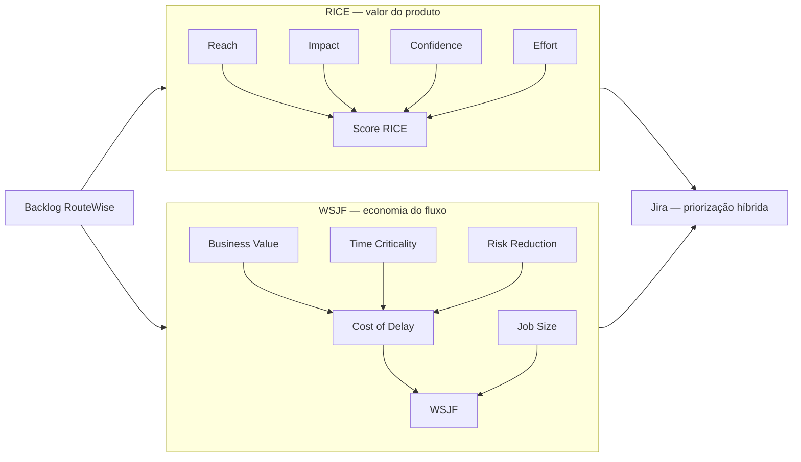
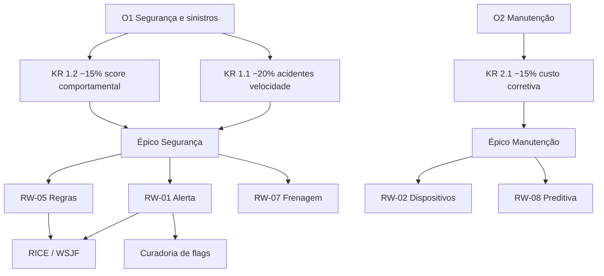
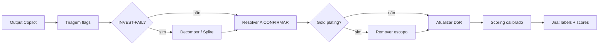

# Relatório — RICE vs WSJF na Priorização de Backlog

> **Módulo 7 — Priorização de Backlog** · Caso **RouteWise** (gestão de frota logística)
> Material de apoio à pós UNIPDS — Ferramentas de IA para Gestão de Projetos

---

## 1. Resumo executivo

**RICE** e **WSJF** são modelos de priorização com **lentes diferentes**: RICE mede o **valor esperado do produto** em escala relativa (alcance, impacto, confiança, esforço); WSJF mede a **economia do fluxo** — quanto o atraso custa versus o tamanho do trabalho.

Não são mutuamente excludentes. Podem **coexistir** no mesmo backlog:


| Uso                                                           | Modelo típico                                                |
| ------------------------------------------------------------- | ------------------------------------------------------------ |
| Refinar e comparar iniciativas no discovery                   | RICE                                                         |
| Ordenar o que entra no próximo PI/sprint com pressão de prazo | WSJF                                                         |
| Campos no Jira                                                | `RICE Score` + `WSJF` (custom fields) ou labels por dimensão |


O mesmo item pode ter score RICE alto por impacto de usuário, mas WSJF moderado se o job size é grande — ou vice-versa se o **Cost of Delay** é crítico (ex.: compliance antes do go-live).

**Camadas complementares (seções 10–13):** **OKRs** definem o resultado estratégico; **RICE/WSJF** ordenam o backlog; **calibração** ajusta scores após **curadoria de flags** (INVEST, `[A CONFIRMAR]`, riscos do Copilot).

---

## 2. RICE — características

### 2.1 Origem e intenção

Popularizado por **Intercom**, RICE responde: *“Qual feature traz mais valor relativo ao esforço, para quem e com qual certeza?”*

Foco: **priorização de roadmap de produto** com estimativas explícitas de incerteza.

### 2.2 Fórmula

```
RICE Score = (Reach × Impact × Confidence) / Effort
```


| Dimensão       | O que mede                                                                         | Escala usual                              |
| -------------- | ---------------------------------------------------------------------------------- | ----------------------------------------- |
| **Reach**      | Quantas pessoas (ou unidades) são impactadas no período escolhido (ex.: trimestre) | Número absoluto                           |
| **Impact**     | Magnitude do efeito em cada pessoa atingida                                        | 0,25 · 0,5 · 1 · 2 · 3 (mínimo → massivo) |
| **Confidence** | Certeza das estimativas de Reach/Impact                                            | 100% · 80% · 50% (ou 1,0 · 0,8 · 0,5)     |
| **Effort**     | Esforço total do time (pessoa-mês ou story points de equipe)                       | Número absoluto                           |


### 2.3 Características distintivas

- **Orientado a produto e usuário** — Reach e Impact descrevem benefício percebido.
- **Penaliza incerteza** — Confidence reduz o score quando o requisito ainda é nebuloso.
- **Normaliza por esforço** — features grandes precisam de impacto proporcional.
- **Comparativo, não absoluto** — o número só faz sentido **entre itens do mesmo backlog**.
- **Período de Reach** deve ser fixo (ex.: “usuários impactados por trimestre”) para não distorcer rankings.

### 2.4 Quando usar RICE

- Backlog após discovery (user stories, épicos).
- Discussão com stakeholders de negócio.
- Comparar features de **domínios diferentes** com linguagem comum.
- Quando **confiança nos dados** é variável (muitos `[A CONFIRMAR]`).

### 2.5 Limitações

- Reach pode ser definido de formas inconsistentes (usuários vs. veículos vs. eventos).
- Não modela **urgência de prazo** explicitamente (só indiretamente via Impact).
- Esforço em pessoa-mês exige calibragem com o time.

---

## 3. WSJF — características

### 3.1 Origem e intenção

**Weighted Shortest Job First (WSJF)** vem do **SAFe / Lean** e responde: *“O que devemos fazer primeiro para maximizar valor econômico no fluxo?”*

Foco: **sequenciamento** sob restrição de capacidade e **Cost of Delay (CoD)**.

### 3.2 Fórmula (SAFe)

```
WSJF = Cost of Delay / Job Size
```

**Cost of Delay** (soma de três fatores relativos, escala 1–10 cada):


| Fator                                       | O que mede                                                             |
| ------------------------------------------- | ---------------------------------------------------------------------- |
| **User / Business Value**                   | Valor para usuário ou negócio se entregue agora                        |
| **Time Criticality**                        | Quanto o valor decai se adiamos (deadline, sazonalidade, dependências) |
| **Risk Reduction / Opportunity Enablement** | Redução de risco, habilitação de outras features, compliance           |


**Job Size** — esforço relativo do item (1 = pequeno, 10 = muito grande), alinhado a story points ou t-shirt sizing calibrado.

### 3.3 Características distintivas

- **Orientado a economia e fluxo** — prioriza o que “não pode esperar” e o que é “rápido de entregar com alto CoD”.
- **Time Criticality explícita** — deadline do board de julho, go-live, LGPD entram aqui.
- **Risk Reduction** — compliance, débito técnico, dependências arquiteturais sobem no ranking.
- **Job Size relativo** — comparação dentro do backlog, não horas absolutas.
- **Alinhado a PI Planning / sprint planning** — sequência de entrega, não só “vale a pena no roadmap”.

### 3.4 Quando usar WSJF

- Planejamento de **release** ou **Program Increment (PI)**.
- Backlog com **deadline fixo** (ex.: RouteWise antes do board de julho).
- Itens que **habilitam** outros (infra, compliance, dados).
- Times que já estimam em **story points** relativos.

### 3.5 Limitações

- Fatores 1–10 exigem **calibragem em grupo** (planning poker de CoD).
- Não captura bem “quantas pessoas” — User Value é relativo, não Reach absoluto.
- Pode subestimar iniciativas grandes de alto valor estratégico de longo prazo.

---

## 4. Comparação direta


| Aspecto                | RICE                              | WSJF                                  |
| ---------------------- | --------------------------------- | ------------------------------------- |
| **Pergunta central**   | Qual feature vale mais o esforço? | O que deve entrar no fluxo agora?     |
| **Valor**              | Reach × Impact × Confidence       | Cost of Delay (3 dimensões)           |
| **Esforço**            | Effort (absoluto, ex. pessoa-mês) | Job Size (relativo 1–10)              |
| **Urgência / prazo**   | Implícito                         | **Time Criticality** explícito        |
| **Risco / compliance** | Via Confidence baixa              | Via **Risk Reduction**                |
| **Origem**             | Intercom / produto                | SAFe / Lean                           |
| **Melhor momento**     | Discovery, roadmap                | PI Planning, sprint ordering          |
| **Incerteza**          | Confidence                        | Discussão qualitativa nos fatores CoD |


### Diagrama mental




---

## 5. Como coexistir nas métricas

### 5.1 Modelo híbrido recomendado

1. **Discovery (M01)** — user stories e épicos no Jira.
2. **Refino (M02)** — aplicar **RICE** a todos os itens candidatos ao release.
3. **Planejamento** — aplicar **WSJF** aos itens do release para sequência de sprints.
4. **Decisão** — usar WSJF para *ordem*; usar RICE para *corte* (“fica fora do release?”).

### 5.2 Campos sugeridos no Jira (RouteWise)


| Campo customizado | Tipo                         | Modelo |
| ----------------- | ---------------------------- | ------ |
| Reach             | Número                       | RICE   |
| Impact            | Select (0,25–3)              | RICE   |
| Confidence        | %                            | RICE   |
| Effort (PM)       | Número                       | RICE   |
| RICE Score        | Fórmula ou calculado         | RICE   |
| User Value        | 1–10                         | WSJF   |
| Time Criticality  | 1–10                         | WSJF   |
| Risk Reduction    | 1–10                         | WSJF   |
| Job Size          | 1–10                         | WSJF   |
| WSJF              | Fórmula: (UV+TC+RR)/Job Size | WSJF   |


### 5.3 Regras de governança

- **Mesma escala de esforço** — calibrar Effort (RICE) com Job Size (WSJF) em sessão de planning.
- **Revisão trimestral** — RICE quando o contexto de Reach muda; WSJF quando o deadline se aproxima.
- **Transparência** — registrar no card o *porquê* dos scores (comentário Jira ou descrição).
- **IA assistida** — Requirements Copilot ou PM Copilot pode *sugerir* scores com `[REVISAR]`; humano valida.

---

## 6. Exemplos RouteWise

Base: transcrição de discovery (`transcricao-discovery-routewise.md`) — 140 veículos, board de julho, alertas em tempo real, dispositivos GPS, dashboard, RH, LGPD.

**Período Reach (RICE):** usuários diretos impactados por **trimestre** (operadores, supervisores, técnicos, gestores).

### 6.1 Tabela de inputs


| ID    | Iniciativa                                      | Reach (trim.) | Impact | Conf. | Effort (PM) | UV  | TC  | RR  | Job Size |
| ----- | ----------------------------------------------- | ------------- | ------ | ----- | ----------- | --- | --- | --- | -------- |
| RW-01 | Alerta de velocidade em tempo real + escalação  | 20            | 3      | 0,8   | 3,0         | 10  | 10  | 8   | 8        |
| RW-02 | Monitoramento dispositivos (offline, bateria)   | 12            | 2      | 0,7   | 2,0         | 7   | 6   | 7   | 5        |
| RW-03 | Dashboard gerencial automático (diretoria)      | 5             | 2      | 0,9   | 1,5         | 8   | 9   | 4   | 3        |
| RW-04 | Exportação de ocorrências para RH               | 3             | 2      | 0,5   | 2,0         | 6   | 5   | 3   | 4        |
| RW-05 | Regras de alerta configuráveis por veículo/rota | 20            | 2      | 0,85  | 2,0         | 7   | 7   | 6   | 4        |
| RW-06 | Compliance LGPD (localização motorista)         | 140*          | 2      | 0,6   | 1,5         | 6   | 8   | 9   | 3        |
| RW-07 | Detecção de frenagem brusca (fase 2)            | 20            | 2      | 0,6   | 2,0         | 7   | 4   | 5   | 5        |
| RW-08 | Manutenção preditiva (fase 2)                   | 5             | 2      | 0,4   | 5,0         | 6   | 2   | 4   | 9        |


Reach LGPD: frota inteira afetada indiretamente se o produto não pode ir a produção.

### 6.2 Cálculo RICE

```
RICE = (Reach × Impact × Confidence) / Effort
```


| ID    | Cálculo               | **RICE Score** |
| ----- | --------------------- | -------------- |
| RW-05 | (20 × 2 × 0,85) / 2,0 | **17,0**       |
| RW-01 | (20 × 3 × 0,8) / 3,0  | **16,0**       |
| RW-07 | (20 × 2 × 0,6) / 2,0  | **12,0**       |
| RW-02 | (12 × 2 × 0,7) / 2,0  | **8,4**        |
| RW-03 | (5 × 2 × 0,9) / 1,5   | **6,0**        |
| RW-04 | (3 × 2 × 0,5) / 2,0   | **1,5**        |
| RW-06 | (140 × 2 × 0,6) / 1,5 | **112,0** ⚠️   |
| RW-08 | (5 × 2 × 0,4) / 5,0   | **0,8**        |


**Ranking RICE (sem distorção LGPD):** RW-05 → RW-01 → RW-07 → RW-02 → RW-03 → RW-04 → RW-08.

⚠️ **RW-06 (LGPD)** infla Reach se contabilizamos 140 “usuários” — na prática, LGPD é **habilitador de release**, não feature de produto. Por isso RICE sozinho pode ranquear compliance de forma enganosa; WSJF trata melhor via Risk Reduction.

**Interpretação RICE:** regras configuráveis e alerta de velocidade lideram por **alcance + impacto** entre usuários da central; manutenção preditiva fica no fim (esforço alto, confiança baixa).

### 6.3 Cálculo WSJF

```
CoD = User Value + Time Criticality + Risk Reduction
WSJF = CoD / Job Size
```


| ID    | CoD          | Job Size | **WSJF** |
| ----- | ------------ | -------- | -------- |
| RW-06 | 6+8+9 = 23   | 3        | **7,67** |
| RW-03 | 8+9+4 = 21   | 3        | **7,00** |
| RW-05 | 7+7+6 = 20   | 4        | **5,00** |
| RW-02 | 7+6+7 = 20   | 5        | **4,00** |
| RW-01 | 10+10+8 = 28 | 8        | **3,50** |
| RW-04 | 6+5+3 = 14   | 4        | **3,50** |
| RW-07 | 7+4+5 = 16   | 5        | **3,20** |
| RW-08 | 6+2+4 = 12   | 9        | **1,33** |


**Ranking WSJF:** RW-06 → RW-03 → RW-05 → RW-02 → RW-01 → RW-04 → RW-07 → RW-08.

**Interpretação WSJF:** **LGPD** e **dashboard** sobem — job size menor e time criticality alta (board de julho, go-live). **Alerta de velocidade** cai na ordem WSJF porque job size é grande (real-time + escalação), mesmo com CoD alto.

### 6.4 Ranking lado a lado


| Posição | Por RICE                     | Por WSJF                     |
| ------- | ---------------------------- | ---------------------------- |
| 1       | Regras configuráveis (RW-05) | LGPD (RW-06)                 |
| 2       | Alerta velocidade (RW-01)    | Dashboard gerencial (RW-03)  |
| 3       | Frenagem brusca (RW-07)      | Regras configuráveis (RW-05) |
| 4       | Dispositivos offline (RW-02) | Dispositivos offline (RW-02) |
| 5       | Dashboard (RW-03)            | Alerta velocidade (RW-01)    |


**Conclusão prática RouteWise:**

- **RICE** prioriza capacidades de **maior impacto operacional diário** (alertas, regras).
- **WSJF** prioriza o que **destrava o release** (LGPD) e o que **entrega rápido valor ao diretor** (dashboard) antes do board.
- **Sequência híbrida sensata:** RW-06 (LGPD) → RW-03 (dashboard) → RW-05 (regras) em paralelo com RW-02 (dispositivos) → RW-01 (alerta real-time) → RW-04 (RH) → fase 2.

---

## 7. Exemplo narrativo — um item, duas leituras

### RW-01 — Alerta de velocidade em tempo real

**Leitura RICE**

- Reach 20: operadores e supervisores que reagem aos alertas cada trimestre.
- Impact 3: reduz multas, acidentes e carga manual na central.
- Confidence 80%: requisito claro, mas latência exata `[A CONFIRMAR]`.
- Effort 3 PM: streaming, motor de regras, notificações, escalação.
- **Score 16** — topo do backlog de produto.

**Leitura WSJF**

- User Value 10: dor principal de Carlos na discovery.
- Time Criticality 10: board de julho e histórico de acidente.
- Risk Reduction 8: habilita confiança no restante do sistema.
- Job Size 8: maior item técnico do release.
- **WSJF 3,5** — importante, mas não é o “job mais curto com maior CoD”.

**Coexistência:** manter RW-01 no release (RICE alto), mas **não** ser o primeiro sprint se LGPD e dashboard têm WSJF maior. RICE evita que o time **corte** o alerta; WSJF define **quando** construir.

---

## 8. Checklist para aplicar na aula

- [ ] Definir período fixo de Reach (trimestre) para todos os cards RICE
- [ ] Calibrar Job Size e Effort na mesma sessão de planning
- [ ] Separar **habilitadores** (LGPD, infra) — considerar WSJF para ordem, RICE com Reach ajustado
- [ ] Documentar scores no Jira com comentário de 2–3 linhas
- [ ] Revisar ranking após refinamento (Confidence sobe quando ambiguidades fecham)
- [ ] Comparar ranking IA-sugerido vs. decisão do time (human-in-the-loop)

---

## 10. OKR específico no contexto RouteWise

RICE e WSJF ordenam o **backlog**; **OKRs** definem o **resultado estratégico** que o backlog deve produzir. Um OKR “específico” não é genérico (“melhorar a frota”) — é verificável, com prazo, baseline e vínculo explícito com épicos e métricas de scoring.

### 10.1 Classificação — como definir um OKR específico


| Nível               | Pergunta                                  | Bom (específico)                                   | Ruim (genérico)                      |
| ------------------- | ----------------------------------------- | -------------------------------------------------- | ------------------------------------ |
| **Objective (O)**   | O que queremos alcançar qualitativamente? | Direcional, memorável, alinhado à dor do discovery | “Melhorar o sistema de frota”        |
| **Key Result (KR)** | Como medimos progresso?                   | Número + baseline + prazo                          | “Reduzir acidentes” (sem % nem data) |
| **Épico**           | Qual capacidade de negócio entrega o KR?  | 1 épico ↔ 1 KR principal (ou cluster claro)        | Épico sem KR na descrição            |
| **Story**           | Qual entrega incremental mede o KR?       | Critério de aceite ligado à métrica                | Feature sem indicador                |
| **Scoring**         | O item move o KR?                         | UV/Impact elevado **só** se mede o KR              | Tudo com score alto                  |


**Regra de especificidade (checklist OKR):**

1. **O** — uma frase; sem números (números ficam nos KRs).
2. **KR** — fórmula: `[métrica] de [baseline] para [target] até [data]`.
3. **Baseline documentada** — valor pré-go-live ou trimestre anterior (ex.: índice de acidentes Q1 2026).
4. **Dono** — Carlos / diretoria para RouteWise (não “o time”).
5. **Limite de KRs** — 1–3 por Objective (foco).
6. **Rastreabilidade Jira** — épico descrição contém `OKR n` + `KR n.x`.

### 10.2 Exemplo OKR 1 — derivado do discovery + backlog CSV

**Contexto discovery:** multas por velocidade, acidente com caminhão acima do limite, alerta em tempo real, board de julho.

```
Objective (O1):
  Tornar a frota RouteWise mais segura e reduzir custos com sinistros.

Key Results:
  KR 1.1 — Reduzir o índice de acidentes por excesso de velocidade
           de [baseline Q1 2026] para −20% até setembro de 2026.

  KR 1.2 — Reduzir o índice de eventos de condução de risco (score comportamental)
           de [baseline] para −15% até setembro de 2026.
           (frenagem brusca, aceleração, curva — depende hardware v2)

Épico Jira:
  [EPIC] Segurança e Redução de Sinistros
  → vinculado a KR 1.1 e KR 1.2

Stories que medem o KR (exemplos):
  RW-01 Alerta velocidade real-time     → KR 1.1 (intervenção antes do sinistro)
  RW-05 Regras configuráveis            → KR 1.1 (limite correto por via/veículo)
  RW-07 Frenagem brusca (fase 2)          → KR 1.2 (flag supervisor — discovery)
  Score comportamental (Sprint 4+)      → KR 1.2 (CSV: bloqueado hardware)
```

**Por que este OKR é específico:** cada KR tem **métrica**, **delta percentual**, **prazo** e **épico** no Jira; stories citadas têm critérios Gherkin verificáveis (não “mais segurança”).

### 10.3 Exemplo OKR 2 — manutenção

```
Objective (O2):
  Reduzir custo operacional com manutenção inteligente.

Key Result:
  KR 2.1 — Reduzir custo médio de manutenção corretiva por veículo
           de [baseline] para −15% até setembro de 2026.

Épico Jira:
  [EPIC] Manutenção Inteligente

Stories alinhadas:
  RW-02 Monitoramento dispositivos (bateria/offline) → evita corretiva emergencial
  RW-08 Manutenção preditiva (fase 2)                 → KR 2.1 direto
  US sem OKR (US-08, US-09, US-10 no guia)           → backlog sem sprint até alinhar
```

### 10.4 Árvore de alinhamento (OKR → scoring)




**Regra de priorização com OKR:** dentro do release, primeiro WSJF entre itens que **movem KRs do board de julho** (KR 1.1 + dashboard para diretoria); fase 2 e itens `OKR: não mapeado` ficam fora do corte RICE do release atual.

---

## 11. Ajuste de scoring e calibração

Scores brutos (seção 6) distorcem ranking quando Reach infla habilitadores, flags abertas não penalizam Confidence, ou Effort/Job Size usam escalas diferentes. **Calibração** é o ritual que alinha números ao contexto RouteWise.

### 11.1 Ajustes por tipo de item


| Tipo                          | Reach (RICE)                        | Effort / Job Size   | WSJF UV                             | Nota                   |
| ----------------------------- | ----------------------------------- | ------------------- | ----------------------------------- | ---------------------- |
| **Feature de produto**        | Usuários diretos trimestre          | Estimativa time     | Valor de negócio normal             | RW-01, RW-03, RW-05    |
| **Habilitador** (LGPD, infra) | **Reach = 1** (gate, não audiência) | Real                | UV baixo, **RR alto**               | RW-06                  |
| **Fase 2 / backlog futuro**   | Não scorear no release              | —                   | TC baixo até PI seguinte            | RW-07, RW-08           |
| **Spike / POC**               | —                                   | Effort fixo pequeno | RR alto se destrava decisão         | Integração SAP, RH API |
| **Sem OKR**                   | Reach até alinhar                   | —                   | **Não entra** no ranking WSJF do PI |                        |


### 11.2 Tabela de calibração Effort (PM) ↔ Job Size

Definir **uma vez** em planning poker com o time:


| Job Size (WSJF) | Effort RICE (PM) | Story points (RouteWise) | Exemplo                |
| --------------- | ---------------- | ------------------------ | ---------------------- |
| 1–2             | 0,5–1,0          | 1–3                      | Spike, ajuste de label |
| 3–4             | 1,0–2,0          | 3–5                      | Dashboard, LGPD        |
| 5–6             | 2,0–3,0          | 5–8                      | Dispositivos, regras   |
| 7–8             | 3,0–4,0          | 8–13                     | Alerta real-time       |
| 9–10            | 5,0+             | 13+                      | Manutenção preditiva   |


Se Effort 3 PM e Job Size 8 para o mesmo card → **calibrado**. Se Effort 1 PM e Job Size 8 → **revisar** (subestimou esforço ou inflou job size).

### 11.3 Escada de Confidence (flags → score)

Aplicar após curadoria de flags (seção 12):


| Estado do card                          | Confidence RICE    | Ação WSJF                                  |
| --------------------------------------- | ------------------ | ------------------------------------------ |
| ✅ INVEST validado, zero flags abertas   | 100% (1,0)         | CoD normal                                 |
| ⚠️ 1–2 `[A CONFIRMAR]` com dono e prazo | 80% (0,8)          | TC pode subir se bloqueia sprint           |
| ⚠️ `[INVEST-FAIL: Small/Estimable]`     | 50% (0,5)          | Card **não** entra no ranking até decompor |
| 🚫 `[BLOQUEADA]` ou dependência externa | 50% ou **excluir** | RR alto se resolver destrava KR            |
| `[GOLD PLATING]` removido               | +10% após limpeza  | —                                          |


**Fórmula de recálculo após refinamento:**

```
Confidence_nova = Confidence_base × f_flags

f_flags = 1,0   se DoR ✅
f_flags = 0,8   se ≤2 ambiguidades com dono
f_flags = 0,5   se INVEST-FAIL ou >2 ambiguidades críticas
f_flags = 0     se BLOQUEADA sem plano de resolução
```

### 11.4 Boost OKR (opcional, máx. +1 em UV)

Só aplicar quando o time quer **explicitamente** priorizar entrega de KR no PI:


| Condição                                              | Ajuste WSJF User Value  |
| ----------------------------------------------------- | ----------------------- |
| Story mede KR com critério de aceite **quantificado** | UV +1 (cap em 10)       |
| Story habilita KR mas não mede diretamente            | sem boost               |
| Story `OKR: não mapeado`                              | UV = 0 → **fora do PI** |
| Habilitador LGPD (sem métrica de KR)                  | sem boost em UV; RR +2  |


**Exemplo RW-01 recalibrado:**


| Dimensão   | Score bruto | Após calibração | Motivo                                        |
| ---------- | ----------- | --------------- | --------------------------------------------- |
| Reach      | 20          | 20              | usuários diretos                              |
| Impact     | 3           | 3               | acidente/multa                                |
| Confidence | 0,8         | **0,5**         | latência `[A CONFIRMAR]` + GIS não confirmado |
| Effort PM  | 3,0         | 3,0             | calibrado com Job Size 8                      |
| **RICE**   | 16,0        | **10,0**        | (20×3×0,5)/3                                  |
| UV         | 10          | **10** (cap)    | mede KR 1.1                                   |
| TC         | 10          | 10              | board julho                                   |
| RR         | 8           | 8               | —                                             |
| Job Size   | 8           | 8               | —                                             |
| **WSJF**   | 3,50        | 3,50            | CoD inalterado; ordem mantida                 |


Ranking RICE **recalibrado** (release): RW-05 (17,0) → RW-01 (10,0) → RW-02 (8,4) → … — alerta cai porque flags abertas pesam na Confidence; regras configuráveis mantém topo por menor Effort e flags mais fechadas.

### 11.5 Ritual de calibração (60 min)

1. **10 min** — Revisar OKRs ativos (O1, O2) e KRs do PI.
2. **15 min** — Curadoria de flags em lote (seção 12).
3. **20 min** — Planning poker: Job Size para top 10 cards.
4. **10 min** — Mapear Job Size → Effort PM na tabela 11.2.
5. **5 min** — Recalcular RICE/WSJF; registrar no Jira + comentário “Calibração PI-1”.

---

## 12. Curadoria de flags

Flags são o **mecanismo de qualidade** entre output do Requirements Copilot, scoring e Definition of Ready. **Curadoria** = revisão humana sistemática antes do scoring definitivo.

### 12.1 Taxonomia de flags (classificação)


| Categoria                 | Tag / origem                       | Significado                                          | Curadoria                                 |
| ------------------------- | ---------------------------------- | ---------------------------------------------------- | ----------------------------------------- |
| **INVEST**                | `[INVEST-FAIL: I/N/V/E/S/T]`       | Story não pronta para sprint                         | Decompor, spike ou descope                |
| **Ambiguidade**           | `[A CONFIRMAR]`                    | Valor numérico não dito pelo stakeholder             | Workshop 30 min; fechar ou spike          |
| **Inferência**            | `[VALIDAR COM EQUIPE]`             | IA inferiu stakeholder (ex.: RH)                     | Confirmar com dono; senão remover         |
| **Anti-padrão**           | `[ANTI-PADRÃO: tipo]`              | Voz passiva, escopo infinito, etc.                   | Reescrever story antes de score           |
| **Risco — especificação** | `[ESPECIFICAÇÃO INVENTADA]`        | SLA/timeout inventado                                | Marcar `[A CONFIRMAR]`; Confidence ↓      |
| **Risco — dependência**   | `[DEPENDÊNCIA NÃO MAPEADA]`        | API/SAP/RH não validada                              | Spike ou label `bloqueado`                |
| **Risco — viabilidade**   | `[VIABILIDADE TÉCNICA SILENCIOSA]` | Hardware heterogêneo, dados                          | Arquitetura + label `hardware-dependente` |
| **Risco — escopo**        | `[GOLD PLATING]`                   | Além do discovery                                    | Remover do card; fase 2 ou descope        |
| **DoR**                   | `✅ INVEST` / `⚠️ Pendente`         | Status consolidado                                   | Só ✅ gera card Jira e ranking             |
| **Backlog Jira**          | labels CSV                         | `backlog futuro`, `bloqueado`, `hardware-dependente` | Não scorear no PI atual                   |
| **OKR**                   | `OKR: não mapeado`                 | Sem KR                                               | Descope formal ou novo KR                 |


### 12.2 Workflow de curadoria




**Ordem obrigatória:** INVEST → gold plating → ambiguidades → dependências → scoring. Scoring antes da curadoria produz rankings **falsamente otimistas**.

### 12.3 Matriz flag → ação → scoring (RouteWise)


| Item                    | Flags abertas                      | Ação de curadoria                      | Impacto scoring                |
| ----------------------- | ---------------------------------- | -------------------------------------- | ------------------------------ |
| RW-01 Alerta velocidade | `[A CONFIRMAR]` latência; GIS API  | Spike mapas + workshop SLA             | Conf. 0,8→0,5                  |
| RW-02 Dispositivos      | timeout offline; cadastro hardware | Definir 15 min offline; inventário GPS | Conf. 0,7→0,8 se inventário ok |
| RW-04 Export RH         | `[DEPENDÊNCIA]` API RH             | Spike com RH; CSV manual no MVP        | UV 6→4 se só export manual     |
| RW-06 LGPD              | jurídico pendente                  | Compliance sign-off                    | RR=9; Reach=1 (habilitador)    |
| RW-07 Frenagem          | hardware antigo                    | Label `hardware-dependente`; fase 2    | **Excluir** do PI; TC=4        |
| Score comportamental    | `bloqueado hardware`               | Sprint 4; KR 1.2                       | WSJF só após hardware v2       |
| US-08/09/10             | sem OKR                            | OKR Aligner (M10.2)                    | Fora do ranking até KR         |


### 12.4 Exemplo de curadoria — RW-01 após workshop

**Antes (output demo):**

- `[INVEST-FAIL: Small]` — história grande
- `[A CONFIRMAR]` segundos no Gherkin
- `[DEPENDÊNCIA NÃO MAPEADA]` — GIS/Maps
- DoR: `⚠️ Pendente`

**Depois da curadoria:**

1. **Decompor** em RW-01a (detecção + alerta visual) e RW-01b (escalação workflow) — remove INVEST-FAIL Small.
2. **Fechar** latência: alerta visual ≤ 30 s (Carlos valida); escalação 5 min — remove `[A CONFIRMAR]` → Confidence 0,8.
3. **Spike** GIS (2 dias) — dependência mapeada; label `integracao-gps` até spike ok.
4. **DoR:** `✅ INVEST validado` → entra no ranking com RICE recalculado.

### 12.5 Labels Jira recomendadas (curadoria persistente)


| Label                   | Uso                     |
| ----------------------- | ----------------------- |
| `okr-1` / `okr-2`       | Vínculo OKR para filtro |
| `kr-1.1` / `kr-2.1`     | KR específico           |
| `a-confirmar`           | Ambiguidade aberta      |
| `bloqueado`             | Não entra no sprint     |
| `hardware-dependente`   | Aguarda rastreador v2   |
| `backlog-futuro`        | Fase 2; sem score no PI |
| `gold-plating-removido` | Auditoria de escopo     |


---

## 13. Fluxo integrado — OKR + scoring + flags


| Fase         | Artefato                        | Ferramenta                             |
| ------------ | ------------------------------- | -------------------------------------- |
| Discovery    | Transcrição, flags iniciais     | Requirements Copilot                   |
| OKR          | O + KR específicos              | OKR Aligner (M10) / workshop diretoria |
| Refino       | Stories INVEST, curadoria flags | PM + Copilot `modo rápido`             |
| Calibração   | RICE/WSJF ajustados             | Planning poker + tabela 11.2           |
| Planejamento | Ordem de sprint                 | WSJF dentro do KR do PI                |
| Execução     | Labels `bloqueado` resolvidos   | Jira board RouteWise                   |
| Medição      | KR 1.1, 2.1 vs baseline         | Task relatório semestral (CSV)         |


**Critérios de sucesso integrados:**

- [ ] Cada KR tem baseline, target % e data
- [ ] Cada épico referencia OKR/KR na descrição
- [ ] Nenhum card no sprint com `[INVEST-FAIL]` ou DoR ⚠️
- [ ] Confidence recalculada após curadoria (não score bruto da IA)
- [ ] Habilitadores com Reach=1; features com Reach calibrado
- [ ] Itens sem OKR fora do ranking do PI até alinhamento

---

## 14. Referências

- Intercom — [RICE prioritization framework](https://www.intercom.com/blog/rice-simple-prioritization-for-product-managers/)
- SAFe — [WSJF (Weighted Shortest Job First)](https://scaledagileframework.com/wsjf/)
- Material local RouteWise: `[transcricao-discovery-routewise.md](../transcricao-discovery-routewise.md)`, `[guia-board-routewise.md](../guia-board-routewise.md)`
- UNIPDS M7 M02: [modulo-02-priorizacao-de-backlog](https://github.com/unipds-engenharia-de-ia-aplicada/engenharia-de-software-com-ia-aplicada/tree/main/modulo07-ferramentas-de-ia-para-gestao-de-projetos/modulo-02-priorizacao-de-backlog)
- UNIPDS M7 M10: [modulo-10-portfolio-e-okrs](https://github.com/unipds-engenharia-de-ia-aplicada/engenharia-de-software-com-ia-aplicada/tree/main/modulo07-ferramentas-de-ia-para-gestao-de-projetos/modulo-10-portfolio-e-okrs) — OKR Aligner

---

*Relatório elaborado para o repositório pos-unipds-IA · Módulo 7 — Gestão de Projetos com IA*

**Ver também:** [`RELATORIO_WHAT_IF_IA.md`](./RELATORIO_WHAT_IF_IA.md) · [`RELATORIO_PERT_MONTE_CARLO.md`](./RELATORIO_PERT_MONTE_CARLO.md)