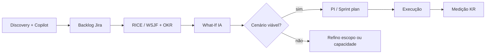
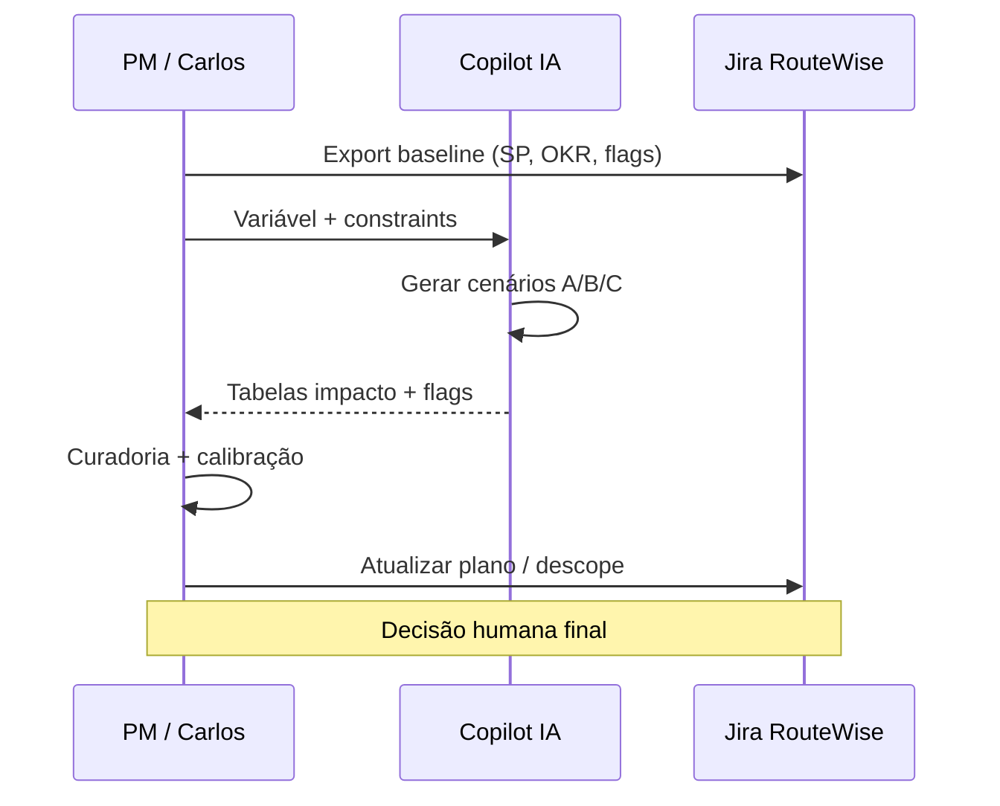

# Relatório — Análise What-If Assistida por IA

> **Módulo 7 — Estimativas, Cronograma e Portfolio** · Caso **RouteWise**
> Complementa [`RELATORIO_RICE_VS_WSJF.md`](./RELATORIO_RICE_VS_WSJF.md) · [`RELATORIO_PERT_MONTE_CARLO.md`](./RELATORIO_PERT_MONTE_CARLO.md)

---

## 1. Resumo executivo

**Análise What-If** (“e se…?”) explora **cenários alternativos** antes de comprometer o plano: mudar prazo, capacidade, escopo ou prioridade e observar o efeito em **cronograma**, **KRs/OKRs**, **risco** e **custo**.

**Assistida por IA** significa que o modelo:

- ingere backlog estruturado (Jira, RICE/WSJF, flags, OKRs);
- gera e compara cenários em linguagem natural;
- quantifica impactos **quando os dados existem** (story points, velocity, datas);
- sinaliza **inferências** e lacunas com flags (`[A CONFIRMAR]`, `[CENÁRIO SIMULADO]`).

A IA **não substitui** o PM: ela acelera exploração e documentação; a **decisão** e a **calibração** permanecem humanas.

---

## 2. O que é análise What-If

### 2.1 Definição

| Conceito | Descrição |
|----------|-----------|
| **Baseline** | Plano atual aceito (release RouteWise até board de julho) |
| **Variável** | O que muda no cenário (prazo, time, escopo, prioridade) |
| **Impacto** | Efeito em datas, KRs, custo, risco, dependências |
| **Cenário** | Combinação variável + impacto + recomendação |

### 2.2 Perguntas típicas no RouteWise

- E se o **board de julho** exige dashboard 100% automatizado e LGPD fechado?
- E se a **entrega de rastreadores v2** atrasa 2 sprints (KR 1.2 bloqueado)?
- E se **cortamos** manutenção preditiva e exportação RH automática no v1?
- E se **adicionamos** 1 dev sênior por 1 sprint?
- E se **repriorizamos** só por WSJF vs. só por RICE?
- E se **latência** do alerta precisa ser ≤ 5 s em vez de 30 s?

### 2.3 Onde entra no pipeline M7



| Submódulo UNIPDS | Ligação com What-If |
|------------------|---------------------|
| M02 Priorização | Variável: reordenar backlog (RICE vs WSJF) |
| M03 Cronograma e capacidade | Variável: velocity, WIP, feriados |
| M04 Estimativas e previsões | Variável: story points, intervalos de confiança |
| M05 Riscos e AI-Ops | Variável: materialização de risco (hardware, LGPD) |
| M10 Portfolio e OKRs | Impacto nos KRs e trade-offs estratégicos |

---

## 3. Como a IA assiste (sem substituir o PM)

### 3.1 Entradas que a IA precisa

| Fonte | Dado | Uso no What-If |
|-------|------|----------------|
| Jira RouteWise | Issues, sprints, SP, dependências | Cronograma simulado |
| `routewise-jira-import.csv` | ~400 issues, épicos, labels | Baseline de capacidade |
| RICE / WSJF calibrado | Scores por card | Reordenação de cenários |
| OKRs (O1, O2, KRs) | Metas e prazos | Avaliar atingimento do cenário |
| Flags / DoR | `[A CONFIRMAR]`, `bloqueado` | Risco e incerteza |
| Transcrição discovery | Dores e deadlines | Validar narrativa do cenário |

**Regra:** What-If com IA é **tão bom quanto o baseline**. Backlog desalinhado ou scores brutos (sem curadoria) produzem cenários **plausíveis mas errados**.

### 3.2 Capacidades da IA

| Capacidade | Exemplo RouteWise |
|------------|-------------------|
| **Geração de cenários** | Listar 5–8 “e se” a partir do backlog |
| **Narrativa de impacto** | “Atraso de hardware empurra KR 1.2 para Q4” |
| **Reordenação sugerida** | Novo top-5 WSJF se TC do board sobe a 10 |
| **Trade-off explícito** | “Dashboard sim, RH API não — KR 2.1 neutro” |
| **Dependências** | GIS API atrasada bloqueia RW-01a |
| **Documentação** | Tabela comparativa baseline vs cenário A/B/C |
| **Perguntas ao stakeholder** | Fechar variáveis que faltam |

### 3.3 Limitações (obrigatório declarar)

| Limitação | Mitigação |
|-----------|-----------|
| IA **não conhece** velocity real do time | Usar velocity histórica ou assumir `[BASELINE VELOCITY: X SP/sprint]` |
| Pode **alucinar** datas ou % de KR | Exigir flag `[CENÁRIO SIMULADO]` em números não medidos |
| Não executa Jira automaticamente (sem integração) | PM aplica mudanças manualmente ou via API |
| Otimiza texto, não Monte Carlo nativo | Para simulação estatística, exportar SP + usar planilha ou ferramenta |

---

## 4. Modelo de cenário (template)

Cada cenário What-If deve seguir estrutura fixa — facilita curadoria humana e comparação:

```markdown
## Cenário [ID]: [nome curto]

**Pergunta:** E se [variável]?

**Baseline:** [resumo do plano atual]
**Alteração:** [o que muda — uma variável principal]

### Impactos
| Dimensão | Baseline | Cenário | Delta |
|----------|----------|---------|-------|
| Data go-live v1 | Jul 2026 | … | … |
| KR 1.1 (acidentes) | no caminho | … | … |
| KR 1.2 (score) | bloqueado HW | … | … |
| KR 2.1 (manutenção) | fase 2 | … | … |
| Capacidade (SP) | 40/sprint | … | … |
| Risco alto | LGPD, GIS | … | … |

### Backlog (delta)
- Entra no release: …
- Sai do release: …
- Reordenado: …

### Flags IA
- [CENÁRIO SIMULADO] — …
- [A CONFIRMAR] — …

### Recomendação
[Go / No-go / Go com mitigação] + próximos passos

### Confiança da análise
Alta | Média | Baixa — [motivo]
```

---

## 5. Exemplos RouteWise (cenários completos)

**Assumptions compartilhadas (para os exemplos):**

- Velocity baseline: **40 SP/sprint** (time de 5 devs)
- Sprint length: 2 semanas
- Release v1 target: **antes do board de julho 2026** (~Sprint 5)
- Baseline scope v1: LGPD, dashboard, dispositivos, regras, alerta (parcial), sem preditiva

### 5.1 Cenário A — Hardware v2 atrasa 2 sprints

**Pergunta:** E se os rastreadores com acelerômetro só chegam **2 sprints depois** do planejado?

| Dimensão | Baseline | Cenário A | Delta |
|----------|----------|-----------|-------|
| KR 1.2 (score comportamental) | Sprint 4+ | Sprint 6+ | **+4 semanas** |
| Frenagem brusca (RW-07) | Fase 2 | Fase 2 confirmada | Sem mudança |
| Score comportamental | `bloqueado hardware` | Mantém bloqueio | KR 1.2 **não atingido** em set/2026 |
| KR 1.1 | RW-01 alerta velocidade | Ainda viável | Sem dependência de v2 |
| Narrativa diretoria | “Segurança melhorou” | Parcial — sem score de condução | Gap em apresentação board |

**Recomendação:** **Go** no v1 sem KR 1.2; negociar KR 1.2 com data revisada ou substituir métrica proxy (alertas de velocidade) no board. Label Jira: `hardware-dependente`, flag `[CENÁRIO SIMULADO]` na data.

**Papel da IA:** identificar automaticamente todos os cards com label `hardware-dependente` e recalcular sprint provável; alertar que CSV já marca score Sprint 4 como bloqueado.

---

### 5.2 Cenário B — Cortar exportação RH API (manter CSV manual)

**Pergunta:** E se a integração com RH **não tiver API** e só export CSV manual no v1?

| Dimensão | Baseline | Cenário B | Delta |
|----------|----------|-----------|-------|
| RW-04 Effort | 2 PM / Job Size 4 | 0,5 PM / Job Size 2 | **−1,5 PM liberados** |
| WSJF RW-04 | 3,50 | ~2,0 | Prioridade cai |
| Capacidade liberada | — | ~8 SP | Realoca para RW-01 |
| KR RH | Integração automática | Manual mensal | **Valor RH reduzido** — aceite necessário |
| RICE RW-04 | 1,5 | 0,8 (Reach 3, Impact 1) | Sai do top ranking |

**Recomendação:** **Go com mitigação** — spike RH em paralelo; liberar SP para alerta. IA sugere realocação: RW-01 sobe 1 posição no WSJF do PI.

**Flags:** `[DEPENDÊNCIA NÃO MAPEADA]` resolvida como CSV; remover `[A CONFIRMAR]` API.

---

### 5.3 Cenário C — Board de julho exige LGPD + dashboard + alerta ≤ 30 s

**Pergunta:** E se o diretor exige **tudo** no board: compliance, dashboard semanal automático e alerta em **≤ 30 s**?

| Dimensão | Baseline | Cenário C | Delta |
|----------|----------|-----------|-------|
| RW-06 LGPD | WSJF 7,67 | Obrigatório Sprint 1 | Sem slip |
| RW-03 Dashboard | WSJF 7,00 | Sprint 2 | Fixo |
| RW-01 Latência | `[A CONFIRMAR]` | ≤ 30 s fixo | Confidence 0,5→0,8 se validado |
| Effort RW-01 | 3 PM | 3,5–4 PM | **+0,5 PM** (infra streaming) |
| Scope cortado | — | RW-07, RW-08, RH API | **Descope formal** |
| SP total v1 | ~120 SP | ~95 SP | Viável em 3 sprints @ 40 SP |

**Recomendação:** **Go** com descope documentado (`OKR: não mapeado` → backlog futuro). What-If mostra que **RICE puro** manteria frenagem (RW-07); **WSJF + OKR** força corte correto.

**Papel da IA:** simular 3 sprints com lista fixa de must-have; gerar texto de descope para Carlos/diretoria.

---

### 5.4 Cenário D — Repriorizar só RICE vs só WSJF

**Pergunta:** E se o time ordena o PI **apenas** por RICE ou **apenas** por WSJF?

| Ordem | Só RICE (top 5) | Só WSJF (top 5) | Convergência |
|-------|-----------------|-----------------|--------------|
| 1 | RW-05 Regras | RW-06 LGPD | Diferente |
| 2 | RW-01 Alerta | RW-03 Dashboard | Diferente |
| 3 | RW-07 Frenagem | RW-05 Regras | Parcial |
| 4 | RW-02 Dispositivos | RW-02 Dispositivos | **Igual** |
| 5 | RW-03 Dashboard | RW-01 Alerta | Diferente |

**Insight What-If:** modelo híbrido evita **não fazer LGPD** (RICE) ou **adiar alerta crítico** (WSJF puro). IA gera matriz de divergência; PM escolhe sequência híbrida (seção 6 do relatório RICE/WSJF).

---

### 5.5 Cenário E — +1 dev sênior por 1 sprint

**Pergunta:** E se contratamos **1 dev sênior** só para o Sprint 3 (streaming/alertas)?

| Dimensão | Baseline | Cenário E | Delta |
|----------|----------|-----------|-------|
| Velocity Sprint 3 | 40 SP | 55 SP `[CENÁRIO SIMULADO]` | +15 SP |
| RW-01 entrega | Sprint 4 | Sprint 3 | **−2 semanas** |
| KR 1.1 | Set/2026 | Possível antecipação | Medição mais cedo |
| Custo | — | + custo contratado | FinOps / PMO |
| Risco | — | Onboarding 3–5 dias | −5 SP efetivos |

**Recomendação:** **Go** se custo < valor de multas evitadas (narrativa Carlos). IA documenta sensibilidade: se onboarding 1 semana, ganho líquido +10 SP não +15.

---

## 6. Fluxo operacional — What-If assistido por IA

### 6.1 Passo a passo (60–90 min)

1. **Exportar baseline** — Jira: sprint atual, backlog filtrado `okr-1`, scores RICE/WSJF, flags abertas.
2. **Definir variável** — Uma mudança por cenário (não misturar “atraso HW + corte RH”).
3. **Prompt ao copilot** — system prompt What-If (seção 7) + baseline em JSON ou tabela.
4. **Gerar 3–5 cenários** — IA preenche template da seção 4.
5. **Curadoria humana** — Validar números, marcar `[CENÁRIO SIMULADO]`, fechar `[A CONFIRMAR]`.
6. **Comparar KRs** — OKR atingido / parcial / não no cenário escolhido.
7. **Decisão** — Registrar no Jira (comentário ou label `what-if-aprovado`) e atualizar plano.
8. **Opcional** — Re-run após mudança real (feedback loop).

### 6.2 Diagrama



### 6.3 Integração com flags e scoring

| Artefato | Uso no What-If |
|----------|----------------|
| Confidence RICE baixa | Cenário “otimista” e “pessimista” (SP +20% / +40%) |
| `bloqueado` | Cenário default: item não entra; What-If: “e se desbloquear?” |
| `a-confirmar` | IA lista variáveis que **impedem** fechar o cenário |
| OKR não mapeado | Cenário de descope: impacto zero em KR se removido |
| Calibração Effort↔Job Size | Recalcular SP totais ao mover items entre sprints |

---

## 7. System prompt — What-If Copilot (RouteWise)

Cole no AI Studio (Gem) ou Project Instructions, **após** o Requirements Copilot ou em Gem dedicado:

```
Você é um analista de planejamento de projetos especializado em
análise What-If para o produto RouteWise (gestão de frota).

ENTRADAS: backlog (tabela ou JSON), OKRs O1/O2, velocity assumida,
scores RICE/WSJF se disponíveis, flags abertas.

REGRAS:
1. Um cenário = UMA variável alterada (prazo, capacidade, escopo ou prioridade).
2. Nunca invente velocity ou datas sem marcar [CENÁRIO SIMULADO].
3. Sempre compare Baseline vs Cenário em tabela (data, KRs, SP, risco).
4. Liste cards Jira impactados (ID, título, delta sprint).
5. Se faltar dado crítico, use [A CONFIRMAR] e não feche recomendação Go.
6. Cite trade-offs explícitos (o que ganha vs o que perde).
7. Recomendação final: Go | No-go | Go com mitigação.
8. Não altere OKRs sem propor revisão formal de KR.

FORMATO: use o template de cenário (seções Baseline, Alteração, Impactos,
Backlog delta, Flags, Recomendação, Confiança).

OKRs RouteWise:
- O1 / KR 1.1: −20% acidentes velocidade até set/2026
- O1 / KR 1.2: −15% score comportamental (hardware v2)
- O2 / KR 2.1: −15% custo manutenção corretiva até set/2026
```

**Modo rápido:** usuário digita `what-if rápido: [variável]` → IA retorna só tabela de impacto + recomendação em 10 linhas.

---

## 8. Ferramentas e automação

| Abordagem | Quando usar |
|-----------|-------------|
| **Gemini / Claude / GPT** + export Jira CSV | Aula e workshops RouteWise |
| **Jira Plans / Advanced Roadmaps** | What-If visual de capacidade (sem IA) |
| **Script Python** + LLM | Batch de cenários sobre `routewise-jira-import.csv` |
| **Monte Carlo** (planilha, @Risk) | Incerteza em estimativas (M04) — IA gera inputs |
| **MCP Jira** (Atlassian) | Futuro: ler board ao vivo no Cursor |

Exemplo de entrada mínima para o Copilot:

```markdown
Baseline: Sprint 1–5, velocity 40 SP, must-have LGPD, dashboard, dispositivos, regras, alerta parcial.
Variável: atraso hardware 2 sprints.
Flags abertas: integracao-gps, a-confirmar latência.
Scores: ver RELATORIO_RICE_VS_WSJF seção 6.
Gere cenário A completo + recomendação.
```

---

## 9. Critérios de qualidade da análise What-If

- [ ] Baseline documentado (sprints, SP, OKRs)
- [ ] Uma variável principal por cenário
- [ ] Impacto em **data**, **KR** e **capacidade** explícitos
- [ ] Números simulados marcados `[CENÁRIO SIMULADO]`
- [ ] Ambiguidades com `[A CONFIRMAR]` e dono
- [ ] Trade-off escrito (ganha / perde)
- [ ] Recomendação clara (Go / No-go / mitigação)
- [ ] Decisão humana registrada no Jira
- [ ] Coerente com RICE/WSJF calibrado (não scores brutos da IA)

---

## 10. Relação com outros artefatos RouteWise

| Artefato | Relação |
|----------|---------|
| [`RELATORIO_RICE_VS_WSJF.md`](./RELATORIO_RICE_VS_WSJF.md) | Cenário D (só RICE vs só WSJF); inputs de scoring |
| [`transcricao-discovery-routewise.md`](../transcricao-discovery-routewise.md) | Constraints de negócio (board julho, 140 veículos) |
| [`routewise-jira-import.csv`](../routewise-jira-import.csv) | Baseline de issues e OKRs nos épicos |
| [`guia-board-routewise.md`](../guia-board-routewise.md) | Estados do board por módulo |
| [`requirements-copilot-system-prompt.md`](../requirements-copilot-system-prompt.md) | Flags que alimentam incerteza do What-If |
| UNIPDS M04 | [modulo-04-estimativas-e-previsoes](https://github.com/unipds-engenharia-de-ia-aplicada/engenharia-de-software-com-ia-aplicada/tree/main/modulo07-ferramentas-de-ia-para-gestao-de-projetos/modulo-04-estimativas-e-previsoes) |
| UNIPDS M03 | [modulo-03-cronograma-e-capacidade](https://github.com/unipds-engenharia-de-ia-aplicada/engenharia-de-software-com-ia-aplicada/tree/main/modulo07-ferramentas-de-ia-para-gestao-de-projetos/modulo-03-cronograma-e-capacidade) |

---

## 11. Síntese

| Pergunta | Resposta |
|----------|----------|
| O que é What-If? | Simular mudanças no plano antes de executar |
| O que a IA faz? | Gera cenários, tabelas de impacto, trade-offs e documentação |
| O que a IA não faz? | Decidir, calibrar velocity real ou garantir datas sem dados |
| Melhor prática RouteWise | Baseline Jira + OKR + scoring calibrado + curadoria de flags |
| Entrega | Cenário documentado + decisão no Jira |

A análise What-If assistida por IA é o **laboratório de decisão** entre priorização (RICE/WSJF) e execução no sprint: testa o plano sob stress sem gastar capacidade do time de desenvolvimento.

---

*Relatório elaborado para o repositório pos-unipds-IA · Módulo 7 — Gestão de Projetos com IA*
