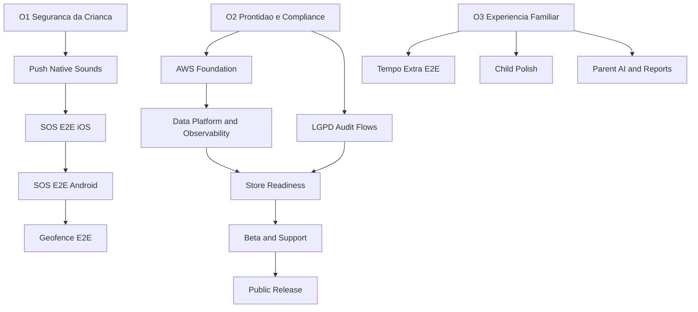

# Diagrama de dependencias

```mermaid
flowchart TB
  O2[O2 Prontidao e Compliance] --> S1[AWS Foundation]
  S1 --> S2[Data Platform and Observability]
  O1[O1 Seguranca da Crianca] --> S3[Push Native Sounds]
  S3 --> S4[SOS E2E iOS]
  S4 --> S5[SOS E2E Android]
  S5 --> S6[Geofence E2E]
  O3[O3 Experiencia Familiar] --> S7[Tempo Extra E2E]
  O2 --> S8[LGPD Audit Flows]
  O3 --> S9[Child Polish]
  O3 --> S10[Parent AI and Reports]
  S2 --> S11[Store Readiness]
  S8 --> S11
  S11 --> S12[Beta and Support]
  S12 --> S13[Public Release]
```
