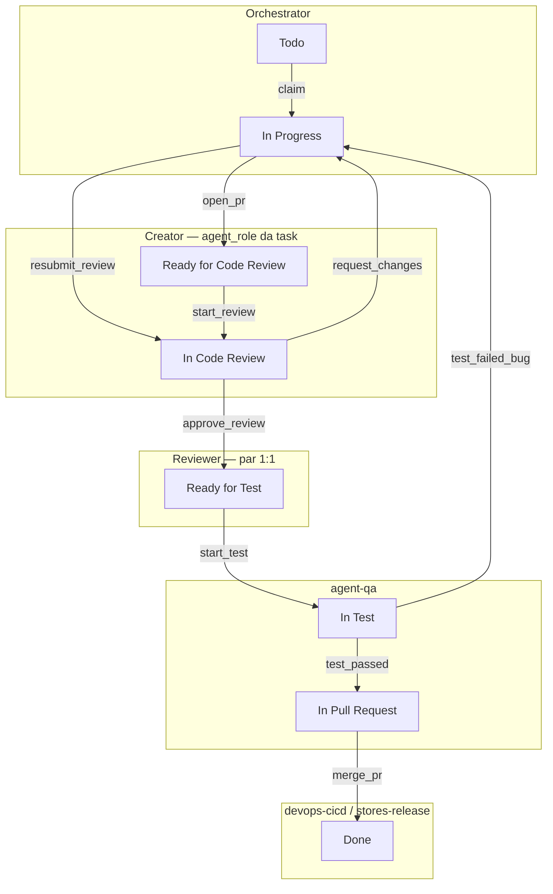

# Agentes × Status — entradas e saídas

Referência: [`TASK_STATUS_WORKFLOW.md`](TASK_STATUS_WORKFLOW.md) · código: [`task_status_workflow.py`](../10-agents/lib/task_status_workflow.py)

## Swimlane (quem entra e quando)



## Tabela por status

| Status | Agente owner | Entra quando | Faz | Sai quando | Evento saída |
|--------|--------------|--------------|-----|------------|--------------|
| **Todo** | Orchestrator | Task no backlog | Planeja, claim | Creator assume | `claim` |
| **In Progress** | Creator (`agent_role`) | claim / CR rejected / bug QA | Código, commit, PR | PR aberto ou re-review | `open_pr` / `resubmit_review` |
| **Ready for Code Review** | Reviewer (fila) | `open_pr` | Revisor pareado pega PR | Review inicia | `start_review` |
| **In Code Review** | Reviewer | `start_review` / `resubmit_review` | Checklist, veredito | Aprovado ou changes | `approve_review` / `request_changes` |
| **Ready for Test** | QA | CR aprovado | Planeja testes | QA inicia | `start_test` |
| **In Test** | QA | `start_test` | E2E, regressão | Pass ou bug | `test_passed` / `test_failed_bug` |
| **In Pull Request** | devops-cicd *(stores-release se trilha stores)* | QA pass | Merge, CI, deploy | Merge OK | `merge_pr` |
| **Done** | Orchestrator | Merge | Fecha ciclo | — | — |

## Por papel de agente

### Orchestrator (CrewAI manager)
| Entra | Status | Sai |
|-------|--------|-----|
| Planejamento | Todo | claim → delega creator |
| Fechamento | Done | métricas sprint |

### Creator (backend, frontend-mobile, …)
| Entra | Status | Sai |
|-------|--------|-----|
| claim | **In Progress** | `open_pr` → Ready for CR |
| request_changes | **In Progress** | corrige → `resubmit_review` → In CR |
| test_failed_bug | **In Progress** | corrige → `open_pr` ou `resubmit_review` |
| (passivo) | Ready for CR | revisor assume |

### Reviewer (backend-reviewer, …)
| Entra | Status | Sai |
|-------|--------|-----|
| start_review | **In Code Review** | `approve_review` → Ready for Test |
| resubmit_review | **In Code Review** | idem ou `request_changes` → In Progress |

### QA
| Entra | Status | Sai |
|-------|--------|-----|
| approve_review (fila) | **Ready for Test** | `start_test` |
| start_test | **In Test** | `test_passed` ou `test_failed_bug` |

### DevOps-CICD / Stores-release
| Entra | Status | Sai |
|-------|--------|-----|
| test_passed | **In Pull Request** | `merge_pr` → Done |

## Tools CrewAI (board)

| Tool | Agente | Evento |
|------|--------|--------|
| `claim_task_on_board` | Orchestrator / Creator | claim |
| `mark_task_in_review` | Creator | open_pr |
| `start_code_review` | Reviewer | start_review |
| `resubmit_after_review` | Creator | resubmit_review |
| `finalize_review_on_board` | Reviewer | approve / request_changes |
| `start_qa_on_board` | QA | start_test |
| `complete_qa_pass_on_board` | QA | test_passed |
| `report_qa_bug_on_board` | QA | test_failed_bug |
| `complete_merge_on_board` | DevOps | merge_pr |

## CLI

```powershell
cd docs/02-criacao-board/10-agents/scripts
python task_status_cli.py --task T-P04-005 --event start_test --dry-run
```
