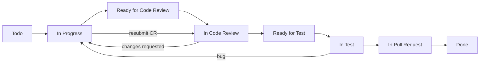

# 10 — Agentes autônomos por skill

Equipe de agentes Cursor alinhada ao [GitHub Project #2](https://github.com/orgs/guardiaofamilia/projects/2) e ao backlog [BACKLOG_PRIORIZADO_FINAL.csv](../07-planilhas/BACKLOG_PRIORIZADO_FINAL.csv).

## Estrutura

| Pasta | Conteúdo |
|-------|----------|
| [skills/](skills/) | `SKILL.md` criadores + `{role}-reviewer/` revisores |
| [agents/](agents/) | Agentes criadores + [agents/reviewers/](agents/reviewers/) |
| [scripts/](scripts/) | Classificação de tasks e orquestrador legado |
| [crew/](crew/) | **CrewAI** — orquestrador hierárquico + board sync |
| [lib/](lib/) | task_router + board_client (compartilhado) |
| [templates/](templates/) | Template estratégico de PR |
| [CLASSIFICACAO_TASKS.md](CLASSIFICACAO_TASKS.md) | Regras de roteamento task → agente |
| [TASK_AGENT_MAP.csv](TASK_AGENT_MAP.csv) | Mapa gerado (272 tasks) |

## Agentes da equipe

| Agente | Skill | Repo(s) principal(is) |
|--------|-------|------------------------|
| `agent-backend` | [skills/backend](skills/backend/SKILL.md) | guardiao-familia-api |
| `agent-frontend-mobile` | [skills/frontend-mobile](skills/frontend-mobile/SKILL.md) | parent, child |
| `agent-frontend-web` | [skills/frontend-web](skills/frontend-web/SKILL.md) | backoffice, site |
| `agent-cloud-infra` | [skills/cloud-infra](skills/cloud-infra/SKILL.md) | api (Terraform/AWS) |
| `agent-database` | [skills/database](skills/database/SKILL.md) | api (PostgreSQL, Redis) |
| `agent-devops-cicd` | [skills/devops-cicd](skills/devops-cicd/SKILL.md) | api (CI/CD, observabilidade) |
| `agent-qa` | [skills/qa](skills/qa/SKILL.md) | cross-repo |
| `agent-stores-release` | [skills/stores-release](skills/stores-release/SKILL.md) | parent, child, api |

## Revisores (par 1:1 com criadores)

| Criador | Revisor | Skill |
|---------|---------|-------|
| backend | backend-reviewer | [skills/backend-reviewer](skills/backend-reviewer/SKILL.md) |
| frontend-mobile | frontend-mobile-reviewer | [skills/frontend-mobile-reviewer](skills/frontend-mobile-reviewer/SKILL.md) |
| frontend-web | frontend-web-reviewer | [skills/frontend-web-reviewer](skills/frontend-web-reviewer/SKILL.md) |
| cloud-infra | cloud-infra-reviewer | [skills/cloud-infra-reviewer](skills/cloud-infra-reviewer/SKILL.md) |
| database | database-reviewer | [skills/database-reviewer](skills/database-reviewer/SKILL.md) |
| devops-cicd | devops-cicd-reviewer | [skills/devops-cicd-reviewer](skills/devops-cicd-reviewer/SKILL.md) |
| qa | qa-reviewer | [skills/qa-reviewer](skills/qa-reviewer/SKILL.md) |
| stores-release | stores-release-reviewer | [skills/stores-release-reviewer](skills/stores-release-reviewer/SKILL.md) |

## Fluxo autônomo (board → PR → review → QA → merge → Done)

Ver workflow completo: [`11-workflow/TASK_STATUS_WORKFLOW.md`](../11-workflow/TASK_STATUS_WORKFLOW.md)

**Agentes × status (entradas/saídas):** [`11-workflow/AGENT_BOARD_STAGES.md`](../11-workflow/AGENT_BOARD_STAGES.md) · [`agents/WORKFLOW_BOARD.md`](agents/WORKFLOW_BOARD.md)



1. Orquestrador claim → **In Progress**
2. Criador abre PR → **Ready for Code Review**
3. Revisor inicia → **In Code Review**
4. `approved` → **Ready for Test** · `changes_requested` → **In Progress**
5. Criador corrige → **`resubmit_review`** → **In Code Review**
6. QA → **In Test** → **In Pull Request** → **Done**

### Revisores

```powershell
cd scripts
python review_orchestrator.py --creator backend --task T-P04-005
python review_orchestrator.py --creator backend --task T-P04-005 --verdict approved --finalize --dry-run

cd ../crew
python main.py --phase review --mode deterministic --dry-run
python main.py --mode review   # CrewAI revisores + LLM
```

## Uso rápido

### CrewAI (recomendado)

```powershell
cd modulo-7-exemplo-pratico-guardiao-familia/docs/criacao-board/10-agents/crew
pip install -r requirements.txt
python main.py --sprint 1 --dry-run                    # sem LLM, sem writes
python main.py --sprint 1 --mode deterministic          # claim no board
python main.py --sprint 1 --mode crew                   # CrewAI + LLM
python main.py --sprint 1 --mode hierarchical           # manager delega
```

Ver [crew/README.md](crew/README.md).

### Orquestrador legado (single agent)

```powershell
cd modulo-7-exemplo-pratico-guardiao-familia/docs/criacao-board/10-agents/scripts

# Regenerar classificação
python classify_tasks.py

# Dry-run: qual task o backend pegaria?
python agent_orchestrator.py --agent backend --dry-run

# Claim + instruções para execução (requer gh autenticado)
python agent_orchestrator.py --agent backend --claim
```

## Cursor Automations

Cada arquivo em [agents/](agents/) pode ser copiado como prompt de uma Automation com trigger `schedule` ou `issue labeled`. Tools recomendadas: GitHub MCP, shell (`gh`), leitura do repositório alvo em `C:\Users\pedro\Documents\guardiao-familia`.

## Campo no board

Adicionar ao Project #2 (manual ou GraphQL):

- **Agent Role** (single select): `backend`, `frontend-mobile`, `frontend-web`, `cloud-infra`, `database`, `devops-cicd`, `qa`, `stores-release`

Valores espelham a coluna `agent_role` em `TASK_AGENT_MAP.csv`.
