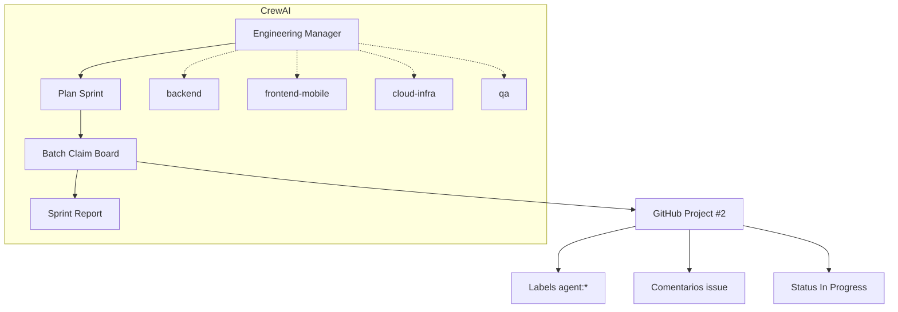

# CrewAI Orchestrator — Guardião Família

Orquestrador [CrewAI](https://docs.crewai.com) que gerencia os 8 agentes especialistas e **atualiza o GitHub Project #2** (labels, comentários, Status).

## Arquitetura



## Modos de execução

| Modo | LLM | Uso |
|------|-----|-----|
| `deterministic` | Não | CI, dry-run, claim automático |
| `crew` | Sim | Planejamento + board sequencial |
| `hierarchical` | Sim | Manager delega specialists |

## Setup

```powershell
cd modulo-7-exemplo-pratico-guardiao-familia/docs/criacao-board/10-agents/crew
python -m venv .venv
.venv\Scripts\activate
pip install -r requirements.txt
copy .env.example .env
# Editar .env: OPENAI_API_KEY + GITHUB_TOKEN
```

Pré-requisito: `gh auth login` e `classify_tasks.py` executado.

## Comandos

```powershell
# Dry-run deterministico (sem API, sem board write)
python main.py --sprint 1 --dry-run

# Claim real no board (1 task por agente)
python main.py --sprint 1 --mode deterministic

# CrewAI completo com LLM
python main.py --sprint 1 --mode crew

# Hierarquico (manager delega)
python main.py --sprint 1 --mode hierarchical
```

## Tools CrewAI

| Tool | Função |
|------|--------|
| `list_backlog_by_agent` | Backlog agrupado por agent_role |
| `select_next_task` | Melhor task para um agente |
| `claim_task_on_board` | Label + comment + Status In Progress |
| `update_board_status` | Atualiza Status (Todo/In Progress/Done) |
| `plan_sprint_assignments` | 1 task por agente no sprint |
| `batch_claim_sprint` | Claim em lote no Project #2 |
| `mark_task_in_review` | Label in-review + link PR |

## Saídas

- `output/sprint_claims.json` — modo deterministic
- `output/sprint_report.md` — modo crew (relatório markdown)

## Biblioteca compartilhada

`../lib/task_router.py` e `../lib/board_client.py` são usados pelo orquestrador legado (`scripts/agent_orchestrator.py`) e pelo CrewAI.
