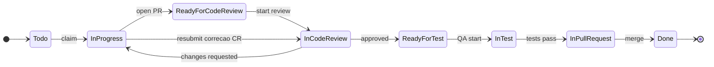
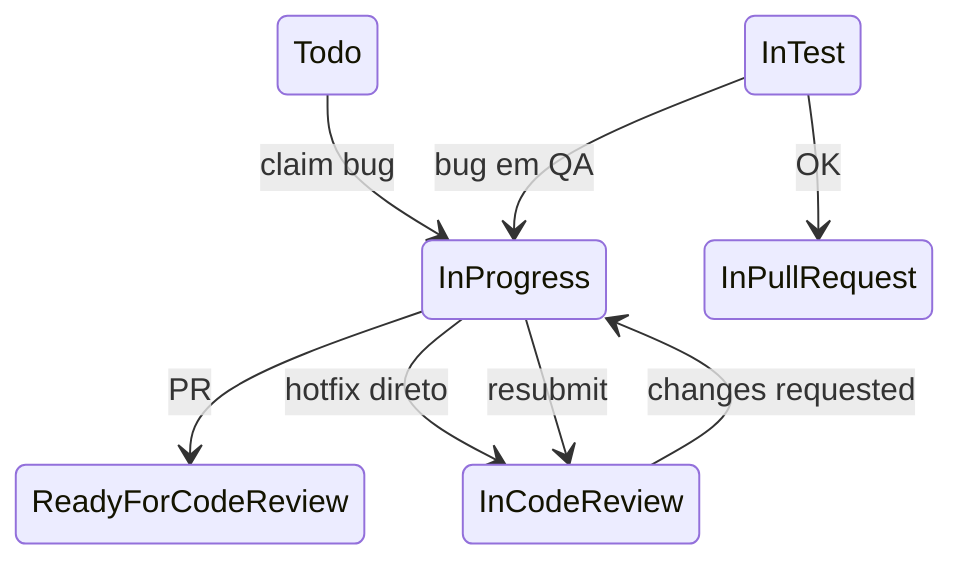

# Workflow de status de task — Project #2

Pipeline de entrega alinhado aos agentes autônomos ([`10-agents/`](../10-agents/README.md)).

## Status (ordem no board)

| # | Status | Quem move | Descrição |
|---|--------|-----------|-----------|
| 1 | **Todo** | — | Backlog priorizado, elegível para claim |
| 2 | **In Progress** | Criador | Implementação ativa na branch |
| 3 | **Ready for Code Review** | Criador | PR aberto, aguardando revisor |
| 4 | **In Code Review** | Revisor | Review ativo no PR |
| 5 | **Ready for Test** | Revisor | Review aprovado, fila QA |
| 6 | **In Test** | QA | Testes manuais / E2E / regressão |
| 7 | **In Pull Request** | QA / DevOps | Merge aprovado, aguardando merge/deploy |
| 8 | **Done** | Orquestrador | Entregue em `main` / produção |

## Fluxo principal (feature)



### Correção de code review

1. Revisor → `changes_requested` → **In Progress** (criador corrige)
2. Criador reaplica → evento `resubmit_review` → **In Code Review** (re-review no mesmo PR)

Não pular direto para Done após approve: próximo passo é **Ready for Test**.

## Fluxo alternativo (bug)

Use label `type:bug` na issue. Transições extras permitidas:

| De | Para | Motivo |
|----|------|--------|
| **In Test** | **In Progress** | Bug/regressão encontrado em QA |
| **In Test** | **In Code Review** | Hotfix pequeno, re-review direto |
| **In Progress** | **In Code Review** | Hotfix sem fila Ready for CR |
| **In Code Review** | **In Test** | Aprovação com teste imediato (bug crítico) |



## Eventos de automação

| Evento | Status destino | Uso |
|--------|----------------|-----|
| `claim` | In Progress | Orquestrador / agente |
| `open_pr` | Ready for Code Review | Após abrir PR |
| `start_review` | In Code Review | Revisor inicia |
| `request_changes` | In Progress | Review reprovado |
| `resubmit_review` | In Code Review | Correção CR enviada |
| `approve_review` | Ready for Test | Review aprovado |
| `start_test` | In Test | QA inicia |
| `test_failed_bug` | In Progress | Bug em teste |
| `test_passed` | In Pull Request | Pronto para merge |
| `merge_pr` | Done | PR merged |

Implementação: [`10-agents/lib/task_status_workflow.py`](../10-agents/lib/task_status_workflow.py)

## Labels sugeridas (complemento ao Status)

```
agent:ready
agent:in-progress
agent:ready-for-review
agent:in-review
agent:ready-for-test
agent:in-test
agent:in-pr
agent:done
type:bug
review:approved
review:changes-requested
```

## Sincronizar opções no GitHub Project

```powershell
cd docs/criacao-board/scripts
$env:CURSOR_GITHUB_TOKEN = "<token>"
python sync_status_workflow.py
python populate_project_v2.py --force-fields
```

## CLI (transição manual)

```powershell
cd docs/criacao-board/10-agents/scripts
python task_status_cli.py --task T-P04-005 --event resubmit_review --kind feature --dry-run
python task_status_cli.py --task T-P04-005 --status "In Code Review" --current "In Progress"
```
