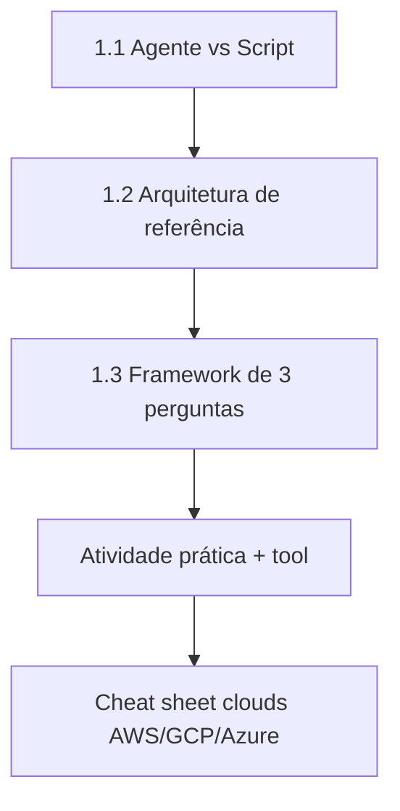
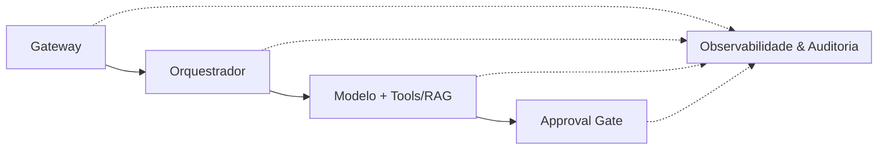

# Relatório Didático — Módulo 8 Exemplo 1: Fundamentos AI-First

> **Roteiro da aula** · principais tópicos · exemplos práticos · melhores práticas  
> Pasta: [`modulo-8-exemplo-1-fundamentos-ai-first`](../) · Caso **TrialForge / Vitalis Pharma**  
> Material UNIPDS: [modulo-01-fundamentos-ai-first](https://github.com/unipds-engenharia-de-ia-aplicada/engenharia-de-software-com-ia-aplicada/tree/main/modulo08-arquitetura-de-sistemas-com-ia/modulo-01-fundamentos-ai-first)  
> Toolkit: Ahirton Lopes · AI Architecture Toolkit

---

## 1. Resumo executivo

Esta aula abre o arco **Arquitetura de Sistemas com IA**. O objetivo não é treinar um modelo nem escrever um agente completo — é **decidir com método** o que deve ser agente, o que deve ser regra determinística e como encaixar isso em uma arquitetura de referência (Gateway → Orquestrador → Modelo+RAG → Approval Gate + Observabilidade).

Tese central:

> Evitar a maior parte das decisões ruins: colocar um agente onde bastava uma função, ou tentar resolver com regras fixas um problema ambíguo por natureza.

**Caso didático:** TrialForge (Vitalis Pharma) — geração e revisão de documentos regulatórios de estudos clínicos (ICF, emendas de protocolo, comparação multilíngue).

---

## 2. Roteiro da aula (fluxo sugerido)



| Bloco | Duração sugerida | Artefato | Entrega do aluno |
|-------|------------------|----------|------------------|
| **1.1** Sinais agente vs script | 20–25 min | [`ai-first-architecture-canvas.md`](../ai-first-architecture-canvas.md) | Tabela “Seu caso” com 3–5 tarefas classificadas |
| **1.2** Diagrama AI-First | 20–25 min | [`reference-architecture-canvas.md`](../reference-architecture-canvas.md) + cheat sheet clouds | Preencher Gateway / Orquestrador / Modelo / Gate / Obs |
| **1.3** Três perguntas | 25–30 min | [`decision-framework-checklist.md`](../decision-framework-checklist.md) | Decompor 1 tarefa híbrida em subtarefas |
| **Lab** Tool determinística | 15–20 min | [`decision_framework_tool.py`](../decision_framework_tool.py) / `.js` | Rodar testes + classificar 2–3 casos |
| **Fechamento** | 10 min | Canvas TrialForge preenchido (PDF) | Checklist de melhores práticas |

**Pré-leitura:** PDFs `Atividade 1` e `Exemplo - Módulo 1`; canvas TrialForge preenchido.

---

## 3. Principais tópicos

### 3.1 Agente vs script determinístico (Módulo 1.1)

| Sinais de **agente** | Sinais de **script** |
|----------------------|----------------------|
| Decisão complexa com etapas dependentes | Fluxo fixo e repetitivo |
| Contexto muda sem reprogramação | Erro caro + sem tempo de revisão |
| Muitas variações de entrada | Julgamento ético/humano não delegável |
| Precisa *julgar* e escalar para humano (não só limiar fixo) | Falta dado estruturado para o modelo |

**Erro comum:** classificar pela complexidade *aparente*. Uma árvore grande ainda pode ser **regra**.

### 3.2 Arquitetura de referência AI-First (Módulo 1.2)

Cinco blocos canônicos:



| Componente | Papel | No TrialForge |
|------------|-------|---------------|
| **Gateway** | Entrada única: auth, rate limit, formato | Submissão de protocolo |
| **Orquestrador** | Cérebro *determinístico*: sequência e contexto | Decide “gerar ICF” e o que enviar ao modelo |
| **Modelo + Tools/RAG** | Único bloco não-determinístico | Cláusulas regulatórias + rascunho |
| **Approval Gate** | HITL quando risco ultrapassa limiar | Especialista regulatório aprova |
| **Observabilidade** | Transversal (não é 5º passo) | Prompt version, latência, edição humana |

### 3.3 Framework de três perguntas (Módulo 1.3)

1. **P1** — Existe regra finita que cobre >90% dos casos *reais*? → **SIM** = regra (fim).
2. **P2** — Erro caro **e** ação irreversível? → **SIM** = agente só propõe + **Approval Gate**.
3. **P3** — Comportamento muda com o contexto? → **SIM** = agente autônomo + observabilidade; **NÃO** = regra (mesmo se “parece complexa”).

**Casos-limite:** tarefa híbrida (decompor); reversibilidade muda o tipo de gate; classificação não é permanente (revisar com logs).

### 3.4 Mapeamento nas clouds

AWS (Agentic AI Lens), Google Cloud (multi-agent + RAG hub) e Azure (Foundry + orchestration patterns) cobrem os mesmos 5 blocos com nomes diferentes — ver `cheat-sheet-arquiteturas-referencia-clouds.pdf`.

---

## 4. Exemplos práticos (TrialForge)

### 4.1 Classificação rápida (1.1)

| Tarefa | Classificação | Por quê |
|--------|---------------|---------|
| Gerar rascunho de Termo de Consentimento | **Agente** | Linguagem + enquadramento regulatório |
| Validar campos obrigatórios do formulário | **Script** | Schema fixo, lista conhecida |
| Propor próxima versão de protocolo | **Agente + Approval Gate** | Julgamento complexo + erro caro |
| Comparar PT vs EN e sinalizar divergência | **Agente** | Raciocínio semântico bilíngue |

### 4.2 Emenda de protocolo — tarefa híbrida (1.3)

| Subtarefa | P1 / P2 / P3 | Componente |
|-----------|--------------|------------|
| Extrair o que mudou entre versões | Não / Não / Sim | Agente (Modelo + RAG) |
| Classificar tipo de emenda | Sim / — / — | Regra (Orquestrador) |
| Rotear por criticidade | Mistura | Regra + Gate condicional |
| Regenerar documentos afetados | Mistura | Agente atrás do Gate |

### 4.3 Lab: tool determinística

```powershell
cd modulo-8-exemplo-1-fundamentos-ai-first
python decision_framework_tool.py
# ou: node decision-framework-tool.js
```

A tool **não chama LLM** — é a árvore de 3 perguntas em código (contraste pedagógico com o ReAct do Exemplo 2).

```python
from decision_framework_tool import classificar_tarefa

classificar_tarefa(p1=True,  p2=False, p3=False)  # Regra determinística
classificar_tarefa(p1=False, p2=True,  p3=False)  # Agente + Approval Gate
classificar_tarefa(p1=False, p2=False, p3=True)   # Agente autônomo + obs
```

---

## 5. Melhores práticas

1. **Classifique pela variabilidade real**, não pela “aparência de complexidade”.
2. **Separe subtarefas** (extração vs decisão de negócio) antes de escolher agente ou regra.
3. **Orquestrador é determinístico**; o modelo é o único bloco não-determinístico no canvas.
4. **Approval Gate obrigatório** quando erro é caro e irreversível — agente propõe, humano decide.
5. **Observabilidade transversal** desde o dia 1 (prompt version, latência, edição humana).
6. **Limiar de risco é decisão de negócio**, não só de engenharia.
7. **Revisite a classificação** com logs: agente pode virar regra (padrão estável) e regra pode virar agente (exceções crescem).
8. **Não use LLM para o que é árvore booleana** — o `decision_framework_tool` é o exemplo vivo.
9. **Mapeie os 5 blocos na cloud** do cliente (AWS/GCP/Azure) sem forçar nomes genéricos.
10. **Guarde os canvas** — voltam no Exemplo 2 (single agent), 3 (multi-agent), 4 (HITL) e 5 (enterprise).

---

## 6. Checklist de sucesso da aula

- [ ] Li `ai-first-architecture-canvas.md` e classifiquei 3–5 tarefas do meu domínio
- [ ] Preenchi Gateway / Orquestrador / Modelo / Gate / Observabilidade no canvas 1.2
- [ ] Apliquei as 3 perguntas em pelo menos uma tarefa híbrida
- [ ] Rodei `python decision_framework_tool.py` (testes verdes)
- [ ] Consultei o cheat sheet cloud e anotei 1 mapeamento (ex.: Approval Gate ↔ serviço X)
- [ ] Entendi o contraste: tool determinística (Ex. 1) vs agente ReAct (Ex. 2)

---

## 7. Artefatos da pasta

| Arquivo | Uso |
|---------|-----|
| `ai-first-architecture-canvas.md` | Demo 1.1 — agente vs script |
| `reference-architecture-canvas.md` | Demo 1.2 — 5 blocos + Mermaid |
| `decision-framework-checklist.md` | Demo 1.3 — 3 perguntas |
| `decision_framework_tool.py` / `.js` | Lab — árvore em código |
| `cheat-sheet-arquiteturas-referencia-clouds.*` | Clouds vs canvas |
| `AI-Architecture-Decision-Canvas*.pdf` | Canvas em branco + TrialForge preenchido |
| `Atividade 1` / `Exemplo - Módulo 1.pdf` | Enunciado e exemplo oficial |

---

## 8. Próximo exemplo

**Exemplo 2 — Single Agent:** anatomia do agente, loop ReAct, tool schemas e `react_agent_prototype.py` — o contraste com a árvore determinística desta aula.

---

*Relatório didático do roteiro da aula · Módulo 8 Exemplo 1 · pos-unipds-IA*
