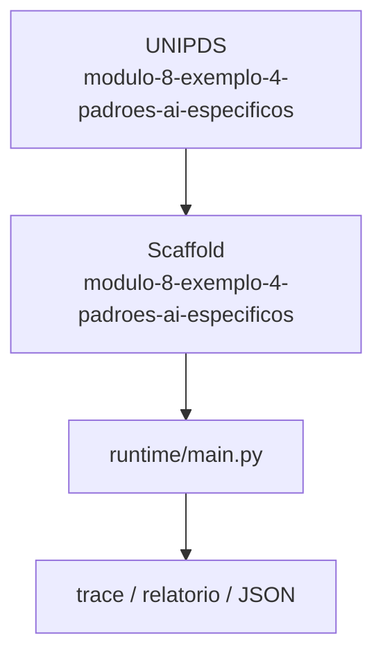
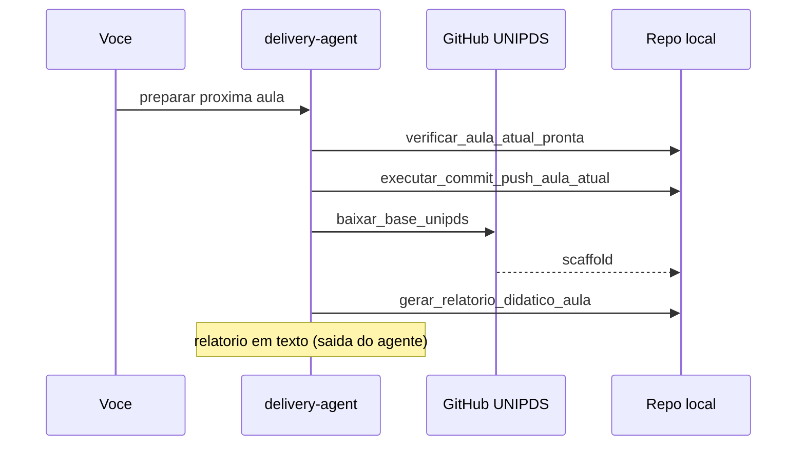

# Relatorio Didatico — 4 Padroes Ai Especificos

> Gerado pelo **delivery-agent** apos o scaffold da proxima aula.
> Pasta: `modulo-8-exemplo-4-padroes-ai-especificos` | Modulo 8 Exemplo 4 | [modulo-8-exemplo-4-padroes-ai-especificos](https://github.com/unipds-engenharia-de-ia-aplicada/engenharia-de-software-com-ia-aplicada/tree/main/modulo08-arquitetura-de-sistemas-com-ia/4-padroes-ai-especificos)

---

## Resumo visual

### Arquitetura do exemplo



### Fluxo de preparacao



### Mapa do scaffold

```
modulo-8-exemplo-4-padroes-ai-especificos/
├── README.md
└── ... (14 arquivos)
```

---

## Principais topicos abordados

### 1. Gateway e roteamento

API gateway como fronteira unica: auth, rate limit, roteamento de modelos.

**Exemplo de uso:**
```bash
node trialforge-gateway-prototype.js
```

### 2. RAG pattern selector

Escolha de padrao RAG (naive, hybrid, agentic) conforme caso de uso.

**Exemplo de uso:**
```bash
python trialforge_gateway_prototype.py
```

### 3. HITL formalizado

Human-in-the-loop com canvas de aprovacao e audit trail JSONL.

**Exemplo de uso:**
```bash
cat hitl-formalization-canvas.md audit-trail.jsonl
```


---

## Secoes do README local

- Objetivo
- Pré-requisitos
- Configuração
- Como executar
- Critérios de sucesso

---

## Comandos CLI detectados

| Comando | Uso |
|---------|-----|
| `rodar` | `python main.py rodar --agente ../monitor-agent` |
| `validar` | `python main.py validar --agente ../monitor-agent` |


---

## Arquivos-chave

- (estrutura em construcao)

---

## Proximos passos

1. Leia `README.md` e o material UNIPDS
2. Configure `.env` (nunca commite segredos)
3. `python main.py validar --agente ../monitor-agent`
4. Execute a atividade e valide criterios de sucesso

---

*Gerado por `gerar_relatorio_didatico_aula` (delivery-agent).*
