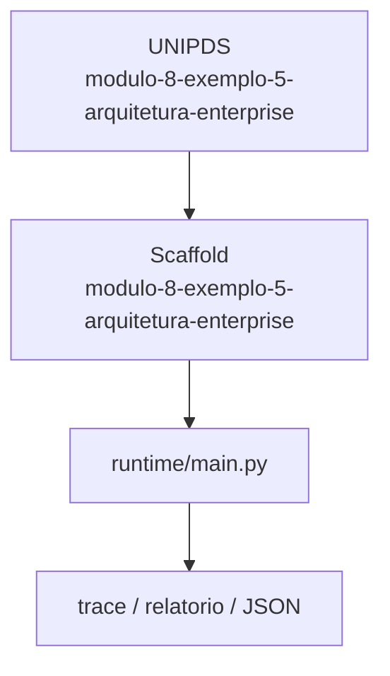
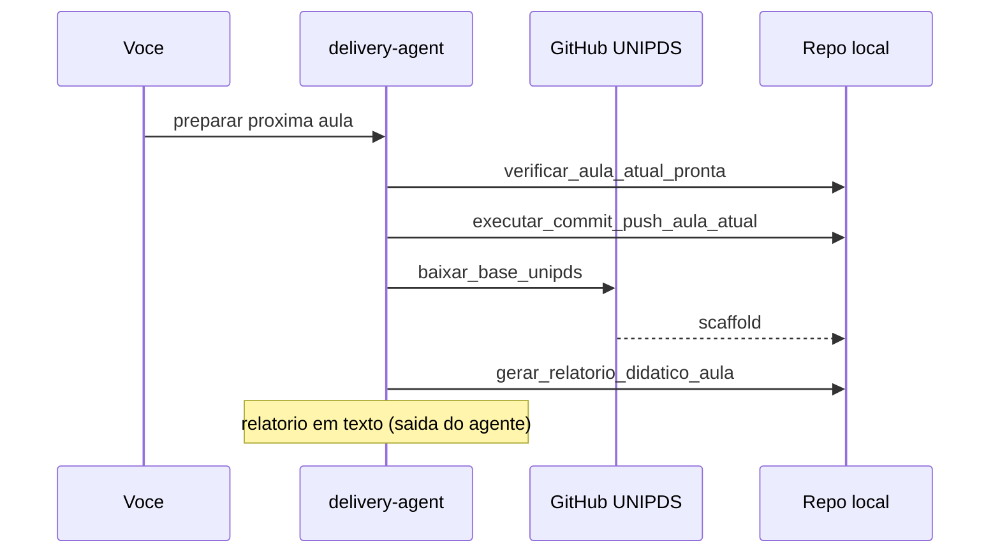

# Relatorio Didatico — 5 Arquitetura Enterprise

> Gerado pelo **delivery-agent** apos o scaffold da proxima aula.
> Pasta: `modulo-8-exemplo-5-arquitetura-enterprise` | Modulo 8 Exemplo 5 | [modulo-8-exemplo-5-arquitetura-enterprise](https://github.com/unipds-engenharia-de-ia-aplicada/engenharia-de-software-com-ia-aplicada/tree/main/modulo08-arquitetura-de-sistemas-com-ia/5-arquitetura-enterprise)

---

## Resumo visual

### Arquitetura do exemplo



### Fluxo de preparacao



### Mapa do scaffold

```
modulo-8-exemplo-5-arquitetura-enterprise/
├── README.md
└── ... (17 arquivos)
```

---

## Principais topicos abordados

### 1. Model tiering e cascade

Roteamento por custo/latencia entre modelos pequenos e grandes com fallback.

**Exemplo de uso:**
```bash
python trialforge_model_tiering_prototype.py
```

### 2. Eval gate e guardrails

Porta de qualidade antes do deploy + deteccao de manipulacao/jailbreak.

**Exemplo de uso:**
```bash
python model_eval_gate_prototype.py && python manipulation_guardrail_prototype.py
```

### 3. Observabilidade enterprise

Sinais, audit trail tiering e canvas de deployment para producao.

**Exemplo de uso:**
```bash
cat observability-signals-canvas.md deployment-decision-canvas.md
```


---

## Secoes do README local

- Objetivo
- Pré-requisitos
- Configuração
- Como executar
- Critérios de sucesso

---

## Comandos CLI detectados

| Comando | Uso |
|---------|-----|
| `rodar` | `python main.py rodar --agente ../monitor-agent` |
| `validar` | `python main.py validar --agente ../monitor-agent` |


---

## Arquivos-chave

- (estrutura em construcao)

---

## Proximos passos

1. Leia `README.md` e o material UNIPDS
2. Configure `.env` (nunca commite segredos)
3. `python main.py validar --agente ../monitor-agent`
4. Execute a atividade e valide criterios de sucesso

---

*Gerado por `gerar_relatorio_didatico_aula` (delivery-agent).*
