# Loop de nós — diagrama de sequência (encadeamento de arquivos)

Um ciclo completo do grafo v2: `sync_board` → `orchestrator_decide` → `evt_*` → `sync_board` … até **Done**, erro, HITL ou `max_steps`.

Entry: `scripts/langgraph/langgraph_run.py` → `langgraph_app/graph.py::run_once()`

## Diagrama (1 iteração — fase creator típica)

```mermaid
sequenceDiagram
    autonumber

    box rgb(240,248,255) Entry
        participant CLI as scripts/langgraph/langgraph_run.py
        participant Graph as langgraph_app/graph.py
        participant State as langgraph_app/state.py
        participant Trace as langgraph_app/tracing.py
        participant Persist as langgraph_app/persist.py
    end

    box rgb(255,250,240) Nós de controle
        participant Control as langgraph_app/nodes/control.py
        participant Helpers as langgraph_app/nodes/_helpers.py
    end

    box rgb(240,255,240) Registry / roteamento
        participant Registry as langgraph_app/registry/
        participant Catalog as registry/catalog.py
        participant Pipelines as registry/pipelines.py
        participant Resolve as registry/resolve.py
        participant Route as lib/orchestrator/langgraph_mcp_route.py
    end

    box rgb(255,240,245) Nó de evento (factory)
        participant Factory as langgraph_app/nodes/factory.py
    end

    box rgb(245,245,255) MCP in-process
        participant Invoke as lib/mcp_invoke.py
        participant Server as guardiao_mcp/server.py
        participant Tools as guardiao_mcp/tools/*.py
    end

    box rgb(255,255,240) Domínio / board
        participant Ctx as lib/orchestrator/event_actuation_context.py
        participant Phase as lib/orchestrator/phase_*.py
        participant Runner as lib/orchestrator/event_actuation_runner.py
        participant GW as lib/gateway/gateway.py
        participant V2 as lib/gateway/v2_events.py
        participant Orch as lib/orchestrator/event_orchestrator.py
        participant Board as board_automation/board/
    end

    CLI->>Graph: run_once(task_id, mode)
    Graph->>State: PipelineState inicial
    Graph->>Trace: build_invoke_config + pipeline_span
    Graph->>Graph: build_graph().invoke(state)

    rect rgb(230,230,250)
        Note over Graph,Board: LOOP — repetido até _should_end()
        Graph->>Control: sync_board_node(state)
        Control->>Board: board_task_loader.get_board_task()
        Control->>Helpers: step(state, patch)
        Control-->>Graph: board_status atualizado

        Graph->>Graph: _after_sync() → orchestrator_decide

        Graph->>Control: orchestrator_decide_node(state)
        Control->>Route: should_run_mcp_actuation()
        Control->>Resolve: resolve_event_for_board(task, status)
        Resolve->>Route: actuation_params_for_status()
        Resolve->>Board: task_status_workflow.build_event()
        Control->>Catalog: EVENT_REGISTRY[event]
        Control-->>Graph: selected_node_id = evt_*

        Graph->>Graph: _after_decide() → evt_*

        Graph->>Factory: ALL_EVENT_NODES[evt_*](state)
        Factory->>Catalog: EVENT_REGISTRY spec
        Factory->>Pipelines: effective_pipeline(spec, board_status)

        loop pipeline MCP (ordem em registry/pipelines.py)
            Factory->>Invoke: mcp.on_status_event(...)
            Invoke->>Server: on_status_event()
            Server->>Tools: tools/on_status_event.py
            Tools->>Ctx: prepare_actuation_for_event()
            Ctx->>Board: board_task_loader + ticket

            Factory->>Invoke: mcp.hitl_guard_actuation(ctx)
            Invoke->>Tools: tools/hitl_guard_actuation.py
            Tools->>GW: actuation_guardrail.evaluate_actuation_guard()

            Factory->>Invoke: mcp.developer_implement(ctx)
            Invoke->>Tools: tools/developer_implement.py
            Tools->>Phase: phase_developer_implement.run_*()

            Factory->>Invoke: mcp.execute_agent_actuation_tool(ctx, guard_pass_id)
            Invoke->>Tools: tools/execute_agent_actuation_tool.py
            Tools->>Runner: execute_agent_actuation()
            Runner->>GW: emit_status_event (próximo evento v2)
            GW->>V2: legacy_event_error + validate
            GW->>Orch: emit_board_event()
            Orch->>Board: board_client.update_project_status()
        end

        Factory->>Helpers: step(state, patch)
        Factory-->>Graph: board_status_out / error / hitl_pending

        Graph->>Graph: _after_event() → sync_board (ou END)
    end

    Graph->>Persist: save_run(task_id, final)
    Persist->>Board: ticket_output.langgraph_run_path()
    Graph-->>CLI: final state + persist_path
```

## Mapa rápido por etapa

| Etapa | Arquivo principal | Chama |
|-------|-------------------|-------|
| Bootstrap | `bootstrap.py` / `lib/env_load.py` | `PYTHONPATH`, `.env` |
| Entry | `scripts/langgraph/langgraph_run.py` | `langgraph_app.run_once` |
| Grafo | `graph.py` | `build_graph`, conditional edges |
| Sync | `nodes/control.py` | `board_task_loader.get_board_task` |
| Decide | `nodes/control.py` + `registry/resolve.py` | `langgraph_mcp_route`, `EVENT_REGISTRY` |
| Pipeline | `nodes/factory.py` + `registry/pipelines.py` | lista ordenada de MCP tools |
| Ponte MCP | `lib/mcp_invoke.py` | `guardiao_mcp/server.py` |
| Tool | `guardiao_mcp/tools/<nome>.py` | `lib/orchestrator/*`, `lib/gateway/*` |
| Status board | `lib/gateway/gateway.py` | `event_orchestrator.emit_board_event` |
| Catálogo eventos | `registry/catalog.py` | `board_automation/.../task_status_workflow.role_event_catalog()` |
| Persistência | `persist.py` | `agents/00-runtime/output/{task_id}/.../langgraph-run.json` |

## Pipelines por classificação

Definidos em `registry/pipelines.py` — cada `evt_*` executa um subconjunto:

| Classificação | Tools (ordem) |
|---------------|---------------|
| orchestrator | `orchestrator_enter_in_progress` |
| creator (implement) | `on_status_event` → `hitl_guard_actuation` → `developer_implement` → `execute_agent_actuation_tool` |
| reviewer | `on_status_event` → `hitl_guard_actuation` → `developer_review` → `execute_agent_actuation_tool` |
| qa-gate | `on_status_event` → `hitl_guard_actuation` → `qa_validate` → `execute_agent_actuation_tool` |
| ops / leve | `on_status_event` → `hitl_guard_actuation` → `execute_agent_actuation_tool` |

## Condições de saída do loop

Avaliadas em `graph.py::_should_end()`:

- `state.error` — falha em qualquer tool do pipeline
- `state.hitl_pending` — bloqueio em `hitl_guard_actuation`
- `state.done` — `execute` sinalizou conclusão
- `board_status == Done`
- `steps >= max_steps` (default 120)

Ver também: [`STATEGRAPH_FLOW.md`](STATEGRAPH_FLOW.md)
