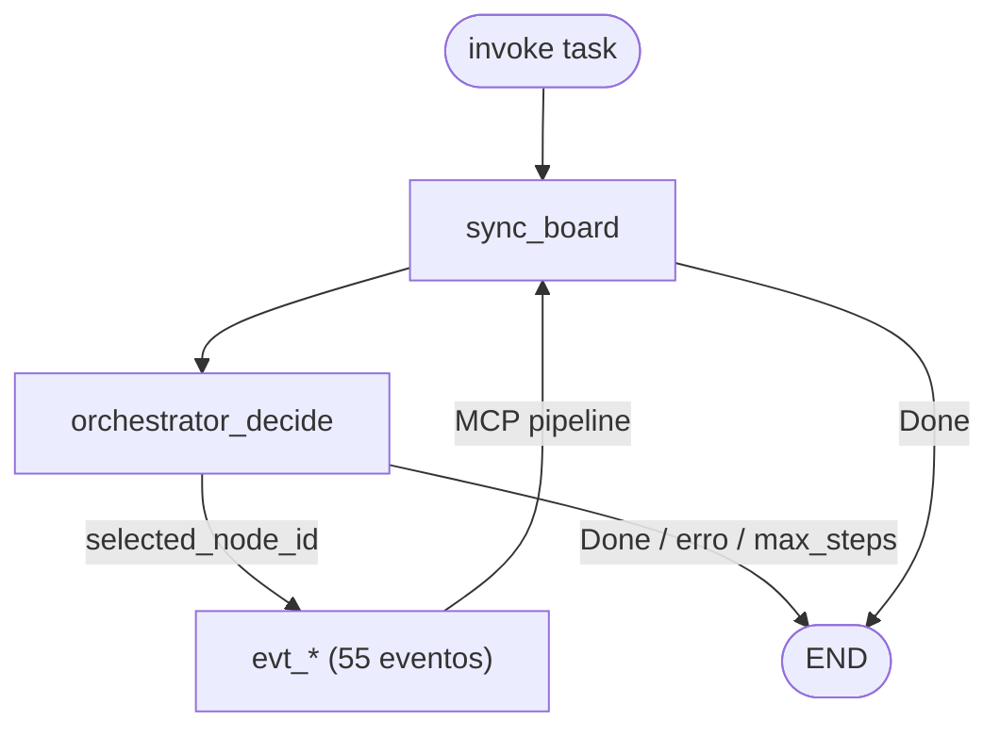

# StateGraph v2 — fluxo LangGraph

Código: `agents/00-orchestration/langgraph_app/` · eventos: `board_automation/board/task_status_workflow.py`

## Diagrama

## orchestrator_decide → evento

| Board status | Evento (ex. frontend-mobile) |
|--------------|------------------------------|
| Todo | `orchestrator_enter_in_progress` |
| In Progress | `{creator}_in_progress` |
| Ready for Code Review | `{creator}_ready_for_code_review` |
| In Code Review | `{reviewer}_in_code_review` |
| Ready for Test | `{reviewer}_ready_for_test` |
| In Test | `qa-gate_in_test` |
| In Pull Request | `{ops}_done` |

## Pipeline MCP por classificação

| Classificação | Tools |
|---------------|-------|
| orchestrator (claim) | `orchestrator_enter_in_progress` |
| creator (implement) | `on_status_event` → `hitl_guard_actuation` → `developer_implement` → `execute_agent_actuation_tool` |
| reviewer (review) | `on_status` → `guard` → `developer_review` → `execute` |
| qa-gate | `on_status` → `guard` → `qa_validate` → `execute` |
| leve / ops | `on_status` → `guard` → `execute` |

Entry: `langgraph_app.graph.run_once(task_id, mode=...)`

## Arquivos

| Arquivo | Conteúdo |
|---------|----------|
| `event_registry.py` | 55 eventos + `build_pipeline` |
| `event_nodes.py` | Factory `make_event_node` |
| `graph.py` | Grafo v2 |
| `state.py` | `PipelineState` |
