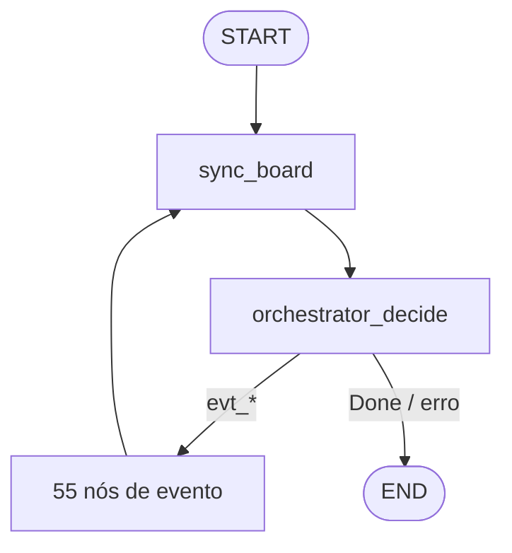

# LangGraph v2 — motor de eventos · MCP centralizado

57 nós no grafo: **2 de controle** + **55 `evt_*`** (factory única, índice por classificação).

## Estrutura

```
langgraph_app/
├── graph.py              # StateGraph + run_once()
├── state.py              # PipelineState
├── registry/             # catálogo de eventos + pipelines MCP
│   ├── catalog.py        # EVENT_REGISTRY, event_node_id
│   ├── pipelines.py      # build_pipeline, effective_pipeline
│   └── resolve.py        # resolve_event_for_board
├── nodes/
│   ├── control.py        # sync_board, orchestrator_decide
│   ├── factory.py        # make_event_node, ALL_EVENT_NODES
│   └── evt/              # índice visual por classificação
│       ├── orchestrator.py
│       ├── creator.py
│       ├── reviewer.py
│       ├── qa_gate.py
│       └── ops.py
├── policy.py             # suggested_event (evals)
├── llm.py / schemas.py   # fases LLM
└── persist.py / tracing.py / task_reset.py
```

## Onde estão os nós?

| Tipo | Onde | Quantidade |
|------|------|------------|
| Controle | `nodes/control.py` | 2 (`sync_board`, `orchestrator_decide`) |
| Eventos | gerados por `nodes/factory.py` a partir de `registry/catalog.py` | 55 (`evt_*`) |
| Índice por papel | `nodes/evt/*.py` | 5 grupos (orchestrator, creator, reviewer, qa-gate, ops) |

Cada nó `evt_*` **não** tem arquivo Python próprio — a lógica é compartilhada na factory. O pipeline MCP de cada evento vem de `registry/pipelines.py`.

Listar todos no terminal:

```bash
python scripts/langgraph/list_nodes.py
python scripts/langgraph/list_nodes.py --classification creator
python scripts/langgraph/list_nodes.py --json
```

## Fluxo



Loop até **Done** ou `max_steps`.

## Executar

```bash
python scripts/langgraph/langgraph_run.py --task T-P3-009 --from-zero --mode dry_run
```

Docs detalhadas: [`docs/STATEGRAPH_FLOW.md`](../docs/STATEGRAPH_FLOW.md) · [`docs/NODE_LOOP_SEQUENCE.md`](../docs/NODE_LOOP_SEQUENCE.md)
