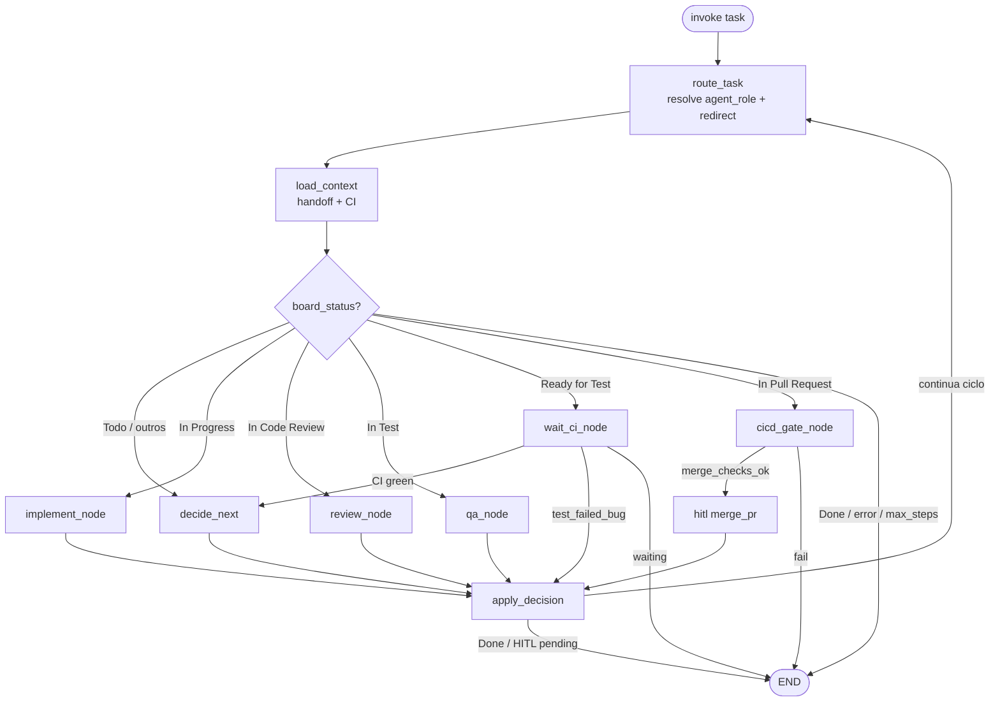

# StateGraph Fase C — fluxo LangGraph

Código: `langgraph_app/graph.py` · transições board: `lib/task_status_workflow.py` · agente por status: `lib/event_orchestrator.py`

## Diagrama do grafo

Loop principal: **`route → load_context → (nó por status) → apply → route`** até `Done`, `hitl_pending` ou `max_steps`.

## Board status → nó LangGraph

| Board status | Nó | Owner primário (`agent_role`) |
|--------------|-----|-------------------------------|
| Todo | `decide` | `orchestrator` (claim) |
| In Progress | `implement` | **creator** da task (CSV) |
| Ready for Code Review | `decide` / fila | **{creator}-reviewer** |
| In Code Review | `review` | **{creator}-reviewer** |
| Ready for Test | `wait_ci` | `qa-gate` |
| In Test | `qa` | `qa-gate` |
| In Pull Request | `cicd_gate` → `hitl` | `devops-cicd` (prod/infra) ou `stores-release` (track stores) |
| Done | END | `orchestrator` |

## Eventos → próximo status

| Evento | Status alvo | Quem emite (`acting_agent`) |
|--------|-------------|----------------------------|
| `claim` | In Progress | creator |
| `open_pr` | Ready for Code Review | creator |
| `start_review` | In Code Review | {creator}-reviewer |
| `approve_review` | Ready for Test | {creator}-reviewer |
| `request_changes` | In Progress | {creator}-reviewer |
| `resubmit_review` | In Code Review | creator |
| `start_test` | In Test | qa-gate |
| `test_passed` | In Pull Request | qa-gate |
| `test_failed_bug` | In Progress | qa-gate |
| `merge_pr` | Done | devops-cicd / stores-release |
| `scope_redirect` | (sem mudança) | orquestrador — task reclassificada |

Fonte: `lib/task_status_workflow.EVENT_TARGET`

## Roteamento de escopo (início de cada ciclo)

1. **`route_task`** chama `lib/agent_registry.resolve_agent_for_task`
2. Se `agent_role` do CSV não cobre repo/track → **redireciona** e comenta na issue
3. **`implement_node`** bloqueia se ainda fora de escopo (`scope_redirect`)

## Papéis especiais

| Papel | Função no grafo |
|-------|-----------------|
| **creator** (`backend`, `frontend-mobile`, …) | `implement` em In Progress |
| **{creator}-reviewer** | `review` em In Code Review |
| **qa** (CSV) / **qa-author** (normalizado) | Escreve specs — creator em tasks de teste |
| **qa-gate** | `wait_ci` + `qa` — evidências E2E, não claim de feature |
| **devops-cicd** | `cicd_gate`, `hitl`, merge prod/infra |
| **stores-release** | merge quando `track == stores` |
| **orchestrator** | claim, dispatch, métricas |

## Modos de execução

| Modo | Comportamento |
|------|----------------|
| `dry_run` | Simula board/PR sem side effects externos |
| `live` | Board GitHub real; `hitl` exige humano no merge |
| `demo` | Apresentação — ver `agents/00-orchestration/scripts/demo/demo_apresentacao.py` |

Entry: `langgraph_app.graph.run_once(task_id, agent_role=..., mode=...)`

## Arquivos relacionados

| Arquivo | Conteúdo |
|---------|----------|
| `langgraph_app/state.py` | `AgentState` (task_id, board_status, agent_role, ci_*, scope_redirect) |
| `langgraph_app/nodes.py` | implement, review, qa, decide, apply |
| `langgraph_app/ci_nodes.py` | wait_ci, cicd_gate |
| `TASK_AGENT_MAP.csv` | agent_role primário por task |
| `agents/_shared/REPOS_AND_ROUTING.md` | repos + redirecionamento |
