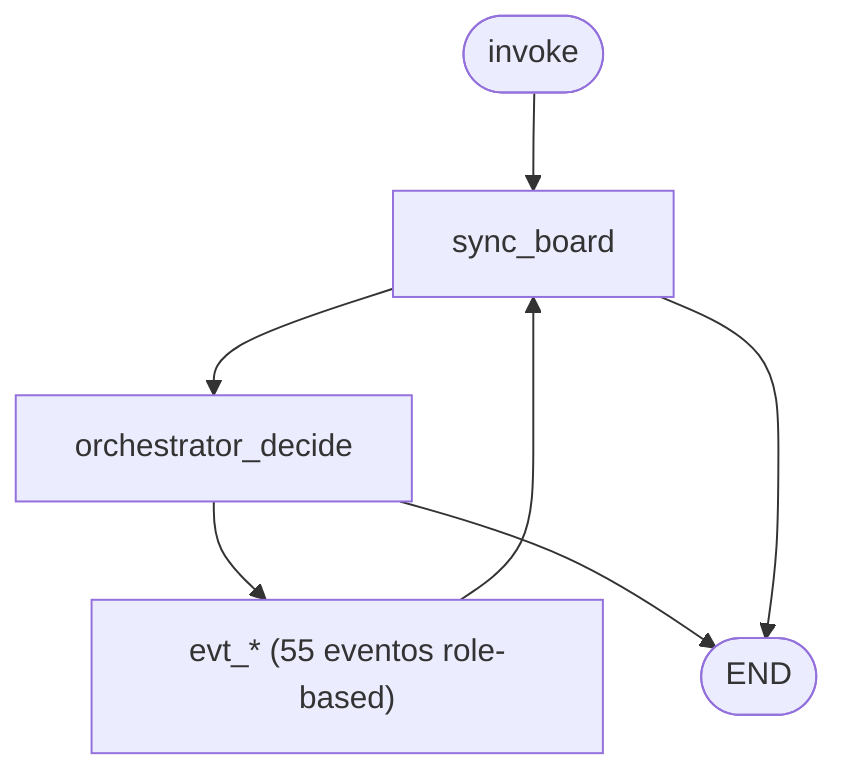

# StateGraph v2 — fluxo LangGraph

Código: `agents/00-orchestration/langgraph_app/` · catálogo: `list_status_events` / `event_registry.py`

## Diagrama

## Arquivos

| Arquivo | Conteúdo |
|---------|----------|
| `event_registry.py` | Pipeline MCP por evento |
| `event_nodes.py` | Factory de nós |
| `graph.py` | Grafo v2 |
| `state.py` | `PipelineState` |

Detalhes: `agents/00-orchestration/docs/STATEGRAPH_FLOW.md`
