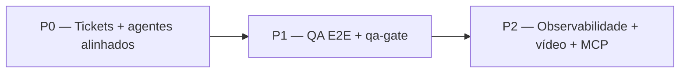

# Plano de ação — Auditoria Guardião Família Agents

**Objetivo:** fechar gaps de qualidade, observabilidade, E2E mobile, tickets e roteamento LangGraph.  
**Pré-requisito:** usar [`ISSUE_AGENT_TASK.md`](../templates/ISSUE_AGENT_TASK.md) + [`.github/ISSUE_TEMPLATE/agent-task.yml`](../templates/.github/ISSUE_TEMPLATE/agent-task.yml) em **toda** nova task (copiar o YAML para cada repo produto).

---

## Visão geral (fases)

| Fase | Prazo sugerido | Resultado |
|------|----------------|-----------|
| **P0** | 1–2 dias | Issues ricas; CSV/board sync; agents apontam modulo-8 |
| **P1** | 3–5 dias | Pairing dual com screenshot; qa_node strict; E2E Python paridade |
| **P2** | 1 semana | Vídeo Appium; LangSmith; MCP get_task_context |

---

## P0 — Fundação (bloqueia alucinação e roteamento errado)

### P0.1 — Adotar template de issue em todos os repos

| Item | Ação | Entregável |
|------|------|------------|
| Template YAML | Copiar `agent-task.yml` para `.github/ISSUE_TEMPLATE/` de cada repo produto | 5 repos |
| Issues existentes | Backfill: comentário com bloco `agent-task` JSON nas tasks **In Progress / Todo** prioritárias | ≥10 issues |
| Board fields | Garantir Project #2: Status, Agent, Track, Epic, SP | checklist PO |

**Aceite:** nova issue criada via form preenche `task_id`, `agent_role`, `acceptance_criteria`, `test_suite`, `how_to_run`.

---

### P0.2 — Enriquecer TASK_AGENT_MAP.csv e load_tasks()

| Gap atual | Ação | Arquivo |
|-----------|------|---------|
| Sem `acceptance_hints`, `test_suite`, `suggested_files` | Adicionar colunas ou JSON em `refinement` por linha | `TASK_AGENT_MAP.csv` |
| `refinement` só em seeds | Parser: ler bloco `agent-task` da issue via API **ou** coluna `refinement_json` no CSV | `lib/task_router.py`, `lib/board_client.py` |
| Tasks genéricas passam QA | Propagar `test_suite` até `qa_node` state | `langgraph_app/nodes.py`, `langgraph_app/state.py` |

**Tarefas concretas:**

1. Estender schema CSV (documentar header em `board_automation/docs/CLASSIFICACAO_TASKS.md`).
2. `load_tasks()`: merge `refinement` + `qa` do issue body quando issue_number conhecido.
3. Script `board_automation/scripts/cli/sync_issue_refinement_to_csv.py` (dry-run default; se existir).

**Aceite:** `pick_task_tool` / `load_tasks_tool` retorna `acceptance_hints` e `test_suite` para T-P13-008 (ou equivalente).

---

### P0.3 — Corrigir agents/*.agent.md → skills modulo-8

| Agente | Gap | Ação |
|--------|-----|------|
| mobile, web, infra, db, devops, stores | Apontam skills **modulo-7** | Atualizar paths para `modulo-8-exemplo-pratico-guardiao-familia-agents/skills/...` |
| qa-gate | Sem skill dedicada | Criar `agents/skills/qa-gate/SKILL.md` (escopo: In Test, evidências, eventos) |
| Todos | Falta link issue template | Secção "Abrir task" → `ISSUE_AGENT_TASK.md` |

**Arquivos:** `agents/*.agent.md`, `agents/skills/qa-gate/SKILL.md`, `agents/skills/qa-gate-reviewer/SKILL.md` _(opcional)_.

**Aceite:** cada `agent_role` do CSV tem `.agent.md` + `SKILL.md` modulo-8 com tabela StateGraph.

---

### P0.4 — Certificado corporativo (bloqueio local atual)

| Problema | Ação |
|----------|------|
| `npm ci` / Docker Alpine — `UNABLE_TO_VERIFY_LEAF_SIGNATURE` | Documentar `NODE_EXTRA_CA_CERTS` + `cacert.pem` em `docs/operacao/LOCAL_E2E_MOBILE.md` |
| | Opção: `npm config set cafile certs/cacert.pem` no repo API |

**Aceite:** `npm ci` passa na máquina do dev com cert corporativo.

---

## P1 — QA E2E e gate rigoroso

### P1.1 — Screenshots no pairing Appium + upload na issue

| Item | Ação | Arquivo |
|------|------|---------|
| `pairing-android.e2e.mjs` sem mídia | Copiar padrão de `issue54-child-v2.e2e.mjs`: screenshot após cada AC | `guardiao-familia-api/test/appium/` |
| qa_node mobile | Passar paths PNG para `comment_issue_with_image` | `langgraph_app/nodes.py`, `lib/qa_mobile.py` |
| Evidência dual | Screenshot parent **e** child no passo pareamento | suite Appium |

**Aceite:** qa-gate em task pairing anexa ≥2 PNGs na issue; AC mapeados nos nomes dos ficheiros.

---

### P1.2 — qa_node strict (sem auto PASS)

| Gap | Ação |
|-----|------|
| Task sem `test_suite` → "Suite tipada OK" | Se `test_suite` vazio: `test_failed_bug` + comentário pedindo backfill issue |
| Live vs dry | Flag `QA_STRICT=1` no `.env` (secção Project #3) |

**Arquivos:** `langgraph_app/nodes.py`, `lib/qa_mobile.py`, `lib/qa_playwright.py`, `tests/test_langgraph_ci.py`.

**Aceite:** teste unitário prova falha quando `test_suite` ausente e `QA_STRICT=1`.

---

### P1.3 — Paridade E2E Python / PowerShell

| Gap | Ação |
|-----|------|
| Python não sobe Metro/emuladores | `lib/local_e2e.py`: modo `full` delega a `local_e2e_stack.ps1 -Mode Full` ou replica steps |
| Preflight | `preflight()` valida ANDROID_HOME, AVD, portas 8082/9090 antes de Appium |

**Aceite:** `python agents/qa-gate/scripts/local_e2e_smoke.py --mode full` (com env OK) executa mesmo fluxo que PS1.

---

### P1.4 — Skill qa-gate + validação roteiro QA

| Item | Conteúdo skill |
|------|----------------|
| Entrada | Board **In Test**; ler `acceptance_hints` + `test_suite` da issue |
| Execução | Matriz suite → comando; dual emulator quando `qa-mobile-pairing-appium-dual` |
| Saída | Evidências + `test_passed` / `test_failed_bug`; nunca merge |
| Validação AC | Checklist 1:1 com AC-NN da issue |

**Aceite:** eval `evals/runner.py` inclui caso qa-gate com mock suite.

---

## P2 — Observabilidade, vídeo, MCP

### P2.1 — Vídeo Appium (dual emulator)

| Item | Ação |
|------|------|
| Nenhum teste usa `startRecordingScreen` | Wrapper em `lib/mobile_work.py` ou helper MJS |
| Upload | MP4 anexo issue (GitHub asset) ou link artefacto CI |
| Template issue | Marcar checkbox "Vídeo MP4" quando AC exige fluxo longo |

**Referência:** Appium 2 `driver.startRecordingScreen()` / `stopRecordingScreen()`.

**Aceite:** 1 cenário pairing gera MP4 &lt;30MB anexado ou linkado na issue.

---

### P2.2 — Observabilidade LangGraph

| Gap | Ação |
|-----|------|
| LangSmith off sem key | `.env.example`: `LANGCHAIN_API_KEY`, `LANGCHAIN_TRACING_V2` |
| Histórico incompleto nos nós | Cada nó: `append_task_action` com resumo structured (status, agent, event) |

**Arquivos:** `langgraph_app/nodes.py`, `docs/operacao/OBSERVABILIDADE.md` _(novo, curto)_.

---

### P2.3 — MCP get_task_context

| Item | Ação |
|------|------|
| Agente sem contexto issue | Tool MCP: `get_task_context(task_id)` → parse `agent-task` + últimos comentários |
| | Registrar em namespace Guardião Família |

**Aceite:** agente invoca tool e recebe `acceptance_hints` + `test_suite` sem reler repo inteiro.

---

## Backlog de tickets sugeridos (criar no board)

Use o template. IDs ilustrativos — ajustar numeração ao CSV.

| ID sugerido | Título | Agent | test_suite | Prioridade |
|-------------|--------|-------|------------|------------|
| T-OPS-001 | Backfill refinement CSV + sync script | backend | qa-api-jest-unit | P0 |
| T-OPS-002 | Atualizar agents/*.agent.md modulo-8 | qa | — | P0 |
| T-OPS-003 | Criar agents/skills/qa-gate/SKILL.md | qa | — | P0 |
| T-QA-001 | Screenshots pairing-android.e2e.mjs | qa | qa-mobile-pairing-appium-dual | P1 |
| T-QA-002 | qa_node strict + QA_STRICT | backend | qa-api-jest-unit | P1 |
| T-QA-003 | Paridade local_e2e Python Full | devops-cicd | qa-mobile-pairing-api | P1 |
| T-QA-004 | Appium screen recording + upload | frontend-mobile | qa-mobile-pairing-appium-dual | P2 |
| T-OPS-004 | MCP get_task_context | backend | qa-api-jest-unit | P2 |
| T-OPS-005 | Doc cert corporativo npm/docker | devops-cicd | — | P0 |

---

## Ordem de execução recomendada

1. **P0.1** Template nos repos + criar T-OPS-001…003 no board com template completo.
2. **P0.2** CSV + `load_tasks()` — desbloqueia qa-gate com dados reais.
3. **P0.3** Agents/skills alinhados — reduz redirect errado.
4. **P0.4** Cert local — desbloqueia API Docker/npm.
5. **P1.1 → P1.2 → P1.3** E2E evidências + gate strict.
6. **P1.4** Skill qa-gate documentada.
7. **P2.x** Vídeo, LangSmith, MCP.

---

## Definition of Done (programa completo)

- [ ] 100% tasks **P0/P1** no board com bloco `agent-task` válido
- [ ] `TASK_AGENT_MAP.csv` com refinement/qa para tasks ativas
- [ ] Pairing dual: API smoke + Appium com PNG (e MP4 em ≥1 task P2)
- [ ] qa-gate falha se `test_suite` ou AC em falta (modo strict)
- [ ] Todos `agents/*.agent.md` → skills modulo-8 + STATEGRAPH_FLOW
- [ ] `pytest tests/` verde incl. `test_langgraph_ci`, `test_agent_registry`, `test_local_e2e`
- [ ] Documentação: LOCAL_E2E_MOBILE + este plano marcado com status por item

---

## Rastreio de status

Atualizar coluna **Status** abaixo conforme conclusão:

| ID plano | Status |
|----------|--------|
| P0.1 Template issue | ✅ Criado (modulo-8) — copiar repos pendente |
| P0.2 CSV/load_tasks | ⬜ |
| P0.3 Agents/skills | ⬜ |
| P0.4 Cert corporativo | ⬜ |
| P1.1 Screenshots pairing | ⬜ |
| P1.2 qa_node strict | ⬜ |
| P1.3 E2E Python paridade | ⬜ |
| P1.4 Skill qa-gate | ⬜ |
| P2.1 Vídeo Appium | ⬜ |
| P2.2 Observabilidade | ⬜ |
| P2.3 MCP get_task_context | ⬜ |
