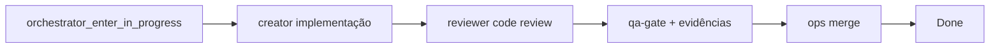

# Project 3 — Sandbox fluxo agentes

Board de treino isolado do **Project #2**. Cada issue T-P3-* tem corpo **auto-suficiente** (sec. 0–10): papéis, antes/depois, passos, AC+comando, stop rules.

**Checklist mínimo por ticket:** `board_automation/templates/ISSUE_AGENT_TASK.md` · gerador `board_automation/board/issue_task_body.py` · **DB fluxos** `data/mobile_user_flows.db`

### Seed fluxos mobile (agente QA — uma vez / após release)

```powershell
python agents/01-role-based/qa-gate/scripts/qa_discover_mobile_flows.py --app both
python agents/01-role-based/qa-gate/scripts/qa_discover_mobile_flows.py --app parent --appium   # emulador ligado
```

646+ fluxos (parent+child): telas, labels, passos 0→N. Tickets mobile puxam sec. 2.1 automaticamente.

## Setup

```powershell
cd modulo-8-exemplo-pratico-guardiao-familia-agents

# 1. Criar project + 8 issues (requer gh auth org admin)
python board_automation/scripts/seeds/seed_project3_sandbox.py --create-project

# 2. Atualizar .env com PROJECT_ID (secção Project #3)
# GUARDAO_GITHUB_PROJECT_NUMBER=3
# GUARDAO_GITHUB_PROJECT_ID=PVT_...

# 3. Sincronizar campo Status (mesmas opções do P2)
$env:GUARDAO_GITHUB_PROJECT_NUMBER=3
python board_automation/scripts/cli/sync_project_status_field.py
```

## Tasks (8 agentes creator)

**Board:** [Project #3 — Sandbox Agentes](https://github.com/orgs/guardiaofamilia/projects/3)

| ID | Agente | Issue | Mudança simples |
|----|--------|-------|-----------------|
| T-P3-001 | backend | [#313](https://github.com/guardiaofamilia/guardiao-familia-api/issues/313) | `sandboxMarker` em GET /health |
| T-P3-002 | frontend-mobile | [#131](https://github.com/guardiaofamilia/guardiao-familia-parent/issues/131) | Tagline splash P3 |
| T-P3-003 | frontend-web | [#79](https://github.com/guardiaofamilia/guardiao-familia-site/issues/79) | Badge footer |
| T-P3-004 | cloud-infra | [#314](https://github.com/guardiaofamilia/guardiao-familia-api/issues/314) | Variable TF sandbox |
| T-P3-005 | database | [#315](https://github.com/guardiaofamilia/guardiao-familia-api/issues/315) | Migration COMMENT |
| T-P3-006 | devops-cicd | [#316](https://github.com/guardiaofamilia/guardiao-familia-api/issues/316) | Env CI PROJECT3_SANDBOX |
| T-P3-007 | qa-author | [#317](https://github.com/guardiaofamilia/guardiao-familia-api/issues/317) | Spec project3-sandbox |
| T-P3-008 | stores-release | [#132](https://github.com/guardiaofamilia/guardiao-familia-parent/issues/132) | RELEASE_SANDBOX.md |

CSV: `data/maps/TASK_AGENT_MAP_P3.csv` · Backlog: `data/imports/BACKLOG_PROJECT3.json`

## Fluxo por issue (eventos v2)



1. **Implementação** — creator cola template da issue; `{creator}_in_progress` → `{creator}_ready_for_code_review`.
2. **Code Review** — `{creator}-reviewer`: `{reviewer}_in_code_review` → `{reviewer}_ready_for_test` ou `{reviewer}_return_in_progress`.
3. **QA** — `qa-gate`: `qa-gate_in_test` → `qa-gate_in_pull_request` ou `qa-gate_return_in_progress`.
4. **Merge** — `devops-cicd_done` ou `stores-release_done` (track stores) → Done.

Porta única: `python agents/00-orchestration/scripts/cli/gateway_cli.py emit --task T-P3-001 --event backend_ready_for_code_review`

Templates estão no corpo de cada issue e em `BACKLOG_PROJECT3.json` → `comment_conventions`.

## Ordem sugerida de execução

1. T-P3-001 (backend) — base para T-P3-007  
2. T-P3-003 (web) — Playwright rápido  
3. T-P3-005, T-P3-004, T-P3-006 — infra/API  
4. T-P3-002 (mobile) — requer emulador + vídeo  
5. T-P3-007 (qa-author spec) — após merge T-P3-001  
6. T-P3-008 (stores doc)

## Após validar o fluxo

Migrar aprendizados para **Project #2**: template `ISSUE_AGENT_TASK.md`, campos refinement no CSV, pipeline LangGraph v2 strict.
