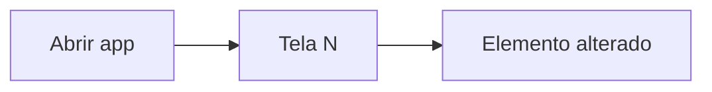

# Template de issue — Agent Task (Guardião Família)

Use ao criar issues no GitHub Project #2 ou via `gh issue create`.  
Formulário interativo: [`.github/ISSUE_TEMPLATE/agent-task.yml`](.github/ISSUE_TEMPLATE/agent-task.yml) (copiar pasta `.github` para cada repo de produto).

Título da issue: **`[T-XXX-NNN] Título curto`** (obrigatório para `board_client.find_issue_number`).

**Gerador automático:** `lib/issue_task_body.py` · enrichment P3: `docs/operacao/PROJECT3_REFINEMENT_EXTRA.json`

---

## 0. Quem faz o quê (obrigatório no topo da issue)

Tabela com: Fase · Board Status · Agente · Skill · **Proibido nesta fase**.

Cada agente só age na sua coluna — creator não faz review; reviewer não implementa; qa-gate não merge.

---

## 1. Identificação

| Campo | Valor |
|-------|-------|
| **Task ID** | `T-XXX-NNN` |
| **Agent role (creator)** | `backend` \| `frontend-mobile` \| `frontend-web` \| `cloud-infra` \| `database` \| `devops-cicd` \| `qa` \| `stores-release` |
| **Agent role secondary** | _(opcional)_ |
| **Trilha** | `produto` \| `infraestrutura` \| `stores` |
| **Repo alvo** | `guardiao-familia-api` |
| **Path local** | `C:\Users\pedro\Documents\guardiao-familia\guardiao-familia-api` |
| **Épico** | `E-PXX` — nome |
| **Sprint / SP / RICE / WSJF** | _(Project fields)_ |
| **Release blocker** | sim / não |
| **Depends on** | `T-YYY-NNN` ou nenhuma |
| **Branch** | `feat/T-XXX-NNN-slug` (base: main/master) |

**Labels:** `agent:{agent_role}` · trilha/epic conforme board

---

## 2. Estado atual → estado desejado (factos)

### Antes

Comportamento/código **hoje** — path + linha ou snippet. O agente valida no repo; não inventa.

### Depois

Comportamento após merge — Definition of Done do **creator**.

### Contexto / user story / notas técnicas

---

## 2.1 Fluxo do usuário *(obrigatório se `agent_role = frontend-mobile`)*

Regra: [`MOBILE_USER_FLOW_TEMPLATE.md`](MOBILE_USER_FLOW_TEMPLATE.md) — mapa **desde abrir o app** até o elemento/tela alterado.

| # | Tela | Ação usuário | Comportamento | Arquivo |
|---|------|--------------|---------------|---------|
| 1 | | | | |

**Alvo:** `{target_screen}` → `{target_element}` · Emulador · Metro port



Creator e **qa-gate** reproduzem os mesmos passos para screenshot/vídeo.

---

## 3. Escopo rígido

### Dentro do escopo

- [ ] Item 1
- [ ] Item 2

### Fora do escopo (redirecionar — não implementar)

| Se a task exigir… | Redirecionar para |
|-------------------|-------------------|
| Terraform / AWS | `cloud-infra` |
| GitHub Actions / deploy | `devops-cicd` |
| Migration PostgreSQL | `database` |
| Endpoint NestJS | `backend` |
| App parent/child | `frontend-mobile` |
| Site / backoffice | `frontend-web` |
| Escrever specs | `qa` |
| Submit stores | `stores-release` |

Ref.: [`agents/_shared/REPOS_AND_ROUTING.md`](../../agents/_shared/REPOS_AND_ROUTING.md)

### Arquivos permitidos (suggested_files)

```
path/to/file1.ts
```

### Não editar (do_not_touch)

Paths explícitos fora do escopo técnico.

---

## 4. Passo a passo — creator

1. `git checkout -b feat/T-XXX-NNN-slug`
2. _(passos numerados até open_pr)_
3. Checklist pré-PR: AC local · PR template · comentário implementação · board Ready for Code Review

---

## 5. Critérios de aceite + verificação (1:1)

| AC | Como verificar | Output esperado |
|----|----------------|-----------------|
| AC-01 | `comando` | resultado exato |

Checklist binário para qa-gate.

---

## 6. Parar e redirecionar (anti-alucinação)

- Dependência não Done → não codar
- Arquivo fora de suggested_files → comentar + redirecionar
- apply/deploy prod → proibido salvo task explícita

---

## 7. QA — suite, cenários, evidências

| Campo | Valor |
|-------|-------|
| **test_suite** | `qa-site-hero-playwright` \| `qa-mobile-pairing-api` \| `qa-mobile-pairing-appium-dual` \| `qa-api-jest-unit` \| `qa-api-jest-integration` \| `qa-custom` |
| **Cenários** | IDs Appium (0, 0.1, 1…) ou passos numerados |
| **Evidências obrigatórias** | PNG screenshot · MP4 vídeo · JSON report · link CI |
| **Dual emulator** | parent `emulator-5554` + child `emulator-5556` _(se mobile E2E)_ |

### DB seed (evidências Appium — opcional)

Quando `qa.db_seed.enabled=true`, o qa-gate **não** refaz cadastro/config/família do zero:

| Campo | Descrição |
|-------|-----------|
| `enabled` | Ativa seed antes do Appium |
| `profile` | `pairing_warm` \| `child_home` \| `permissions_resume` |
| `family_name` / `child_name` | Nomes criados via API |
| `resume_after_step` | `lastStep` no `stage-handoff.json` (ex.: `paste_code_parent`) |
| `cleanup` | `true` → purge Postgres + reset handoff após evidências |

**Dependências:** Docker API/Postgres · `guardiao-familia-mobile-setup` · emuladores · `psycopg`

```powershell
python agents/qa-gate/scripts/mobile_e2e_seed.py --task T-P3-009 --profile child_home
python agents/qa-gate/scripts/qa_mobile_evidence.py --task T-P3-009 --feature pairing --mode cycle --record-video
```

### Como rodar localmente

```powershell
# Exemplo API + mobile
cd guardiao-familia-api
docker compose -f docker-compose.dev.yml up -d postgres redis
npm run migration:run && npm run seed
cd ..\modulo-8-exemplo-pratico-guardiao-familia-agents
powershell -File agents/qa-gate/scripts/local_e2e_stack.ps1 -Mode Full
```

### Resultado esperado qa-gate

- Todos os AC → **PASS**
- Evidências anexadas na issue (comentário + imagens)
- Evento `test_passed` → In Pull Request **somente** se evidências OK

---

## 6. Handoff entre agentes (StateGraph)

| Status Project #2 | Agente (`agent_role`) | O que fazer | Evento / próximo |
|-------------------|------------------------|-------------|------------------|
| **Todo** | `orchestrator` | Priorizar, `claim` | → In Progress → **creator** |
| **In Progress** | **creator** _(sec. 1)_ | Implementar, commit, PR | `open_pr` → reviewer |
| **Ready for Code Review** | `{creator}-reviewer` | Assumir PR | `start_review` |
| **In Code Review** | `{creator}-reviewer` | Checklist skill revisor | `approve_review` → qa-gate **ou** `request_changes` → creator |
| **Ready for Test** | `qa-gate` | Preparar ambiente / CI | `start_test` |
| **In Test** | `qa-gate` | Executar suite + evidências | `test_passed` **ou** `test_failed_bug` → creator |
| **In Pull Request** | `devops-cicd` _(ou `stores-release` se track=stores)_ | Merge + deploy | `merge_pr` → Done |

Ref.: [`agents/_shared/STATEGRAPH_FLOW.md`](../../agents/_shared/STATEGRAPH_FLOW.md)

**Regra:** se `lib/agent_registry.resolve_agent_for_task` redirecionar o creator, **não implementar** — comentar issue com agente sugerido.

### 6.1 Responsabilidades por agente (opcional — recomendado)

Quando a task exige papéis distintos com entregas claras, preencher `agent_responsibilities` no payload:

```json
"agent_responsibilities": {
  "frontend-mobile": ["criar branch", "implementar", "testes unitários"],
  "frontend-mobile-reviewer": ["validar qualidade", "cobertura de testes", "gaps"],
  "qa-gate": ["seed DB", "Appium", "evidências PNG/MP4"]
}
```

Renderizado na issue como **sec. 0.1** (antes da identificação).

---

## 7. Payload estruturado (parsers / LangGraph / MCP)

Colar no **final** da issue (não editar chaves):

```agent-task
{
  "task_id": "T-XXX-NNN",
  "title": "",
  "agent_role": "backend",
  "agent_role_secondary": "",
  "track": "produto",
  "repo": "guardiao-familia-api",
  "repo_path": "C:\\Users\\pedro\\Documents\\guardiao-familia\\guardiao-familia-api",
  "epic_id": "E-PXX",
  "release_blocker": false,
  "depends_on": [],
  "refinement": {
    "context_summary": "",
    "user_story": "",
    "suggested_files": [],
    "in_scope": [],
    "out_of_scope": [],
    "acceptance_hints": [],
    "technical_notes": ""
  },
  "qa": {
    "test_suite": "qa-mobile-pairing-appium-dual",
    "scenarios": ["S0", "S0.1", "1"],
    "evidence": {
      "screenshot_png": true,
      "video_mp4": false,
      "json_report": true,
      "ci_link": true
    },
    "how_to_run": "powershell -File agents/qa-gate/scripts/local_e2e_stack.ps1 -Mode Full"
  },
  "local_env": {
    "docker": true,
    "android_sdk": true,
    "dual_emulator": true,
    "metro_ports": {"parent": 8082, "child": 9090}
  },
  "handoff_expectations": {
    "creator_exit_event": "open_pr",
    "reviewer_exit_event": "approve_review",
    "qa_exit_event": "test_passed",
    "merge_owner": "devops-cicd"
  }
}
```

---

## 8. Sincronização com TASK_AGENT_MAP.csv

Ao criar issue manualmente, garantir linha no CSV:

```csv
id,title,agent_role,agent_role_secondary,track,repo,epic_id,...,match_reason,depends_on
T-XXX-NNN,Título,backend,,produto,guardiao-familia-api,E-PXX,...,track=...,T-YYY-NNN
```

Campos `refinement` e `qa` devem ser mergeados em `lib/task_router.load_tasks()` (fase 2 do plano de ação).

---

## Copiar template para repos de produto

```powershell
$repos = @("guardiao-familia-api","guardiao-familia-parent","guardiao-familia-child","guardiao-familia-site","guardiao-familia-backoffice")
$src = "modulo-8-exemplo-pratico-guardiao-familia-agents\board_automation\templates\.github\ISSUE_TEMPLATE\agent-task.yml"
foreach ($r in $repos) {
  $dest = "C:\Users\pedro\Documents\guardiao-familia\$r\.github\ISSUE_TEMPLATE"
  New-Item -ItemType Directory -Force -Path $dest | Out-Null
  Copy-Item $src "$dest\agent-task.yml"
}
```
